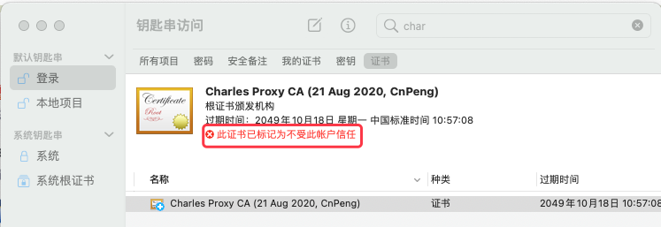
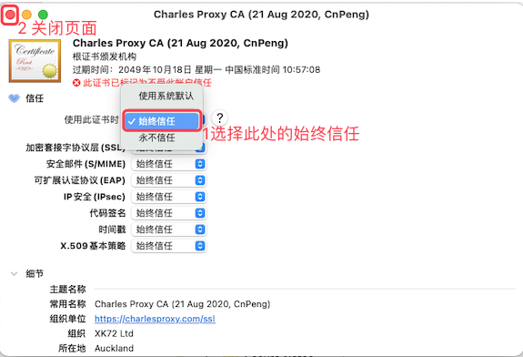
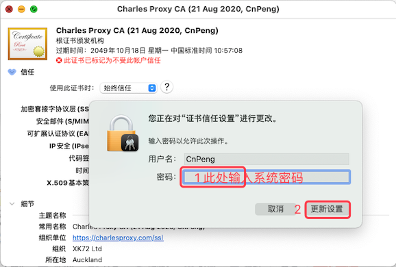
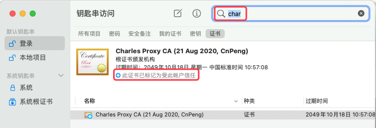

# 1. 20-解决证书不受信任问题

## 1.1. 问题现象

## 1.2. 解决方案

从系统的 `启动台` 中找到 `钥匙串` 应用：

然后双击打开，找到对应的证书，然后按照下图操作：

在上图中，选择 `始终信任` 之后，点击左上角的关闭按钮关闭页面，然后就会出现下图中的密码输入框：

点击上图中的 `更新设置` 之后，可能界面上还是会看到 `此证书已标记为不受此账户信任` 的提示，此时，我们退出 `钥匙串` 应用（退出快捷键 `cmd+q`），重新打开之后即可正常，如下图：

