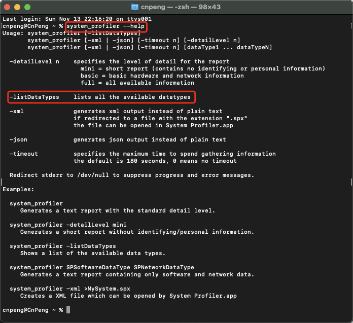

# 1. 22-终端中查看硬件信息

## 1.1. 问题

在 mac 电脑中，通过 `系统设置` 能够看到的硬件信息相对较少，比如：我们无法清晰的获知 CPU 的核心和线程等信息。

如下图：


因此，我们可以通过命令/脚本的形式来获取，具体如下。

## 1.2. 解决

### 1.2.1. 问题解决

编写脚本信息的步骤如下：


参照上图完成编辑之后，直接 `command+S` 保存，然后点击左上角的关闭按钮将文件关闭。

然后按照下图在终端中执行 `sh hardinfo.sh` 以查看硬件信息：


完整的脚本内容如下：

```shell
echo "CPU型号:    " 

sysctl -n machdep.cpu.brand_string

echo "CPU核心数:  " 

sysctl -n machdep.cpu.core_count

echo "CPU线程数:  "

sysctl -n machdep.cpu.thread_count

echo "其它信息："

system_profiler SPDisplaysDataType SPMemoryDataType SPStorageDataType | grep 'Graphics/Displays:\|Chipset Model:\|VRAM (Total):\|Resolution:\|Memory Slots:\|Size:\|Speed:\|Storage:\|Media Name:\|Medium Type:'
```

### 1.2.2. 补充-sysctl

`sysctl` 是 linux 中的命令，该命令的具体使用可以自行查询。此处不再赘述。

### 1.2.3. 补充-system_profiler

在上一小节的命令中，查看“其他信息”时主要使用了 `system_profiler` 命令。

我们在终端中输入 `system_profiler --help` 可以查看其使用方式：



我们继续在终端输入 `system_profiler -listDataTypes` 即可查看完整的 `xxDataType` 列表：


以 `SPNVMeDataType` 为例，我们在终端中输入 `system_profiler SPNVMeDataType` 即可查看对应的信息：


## 1.3. 参考：

* [【技巧】在macOS终端查看硬件信息](https://sspai.com/post/38577)