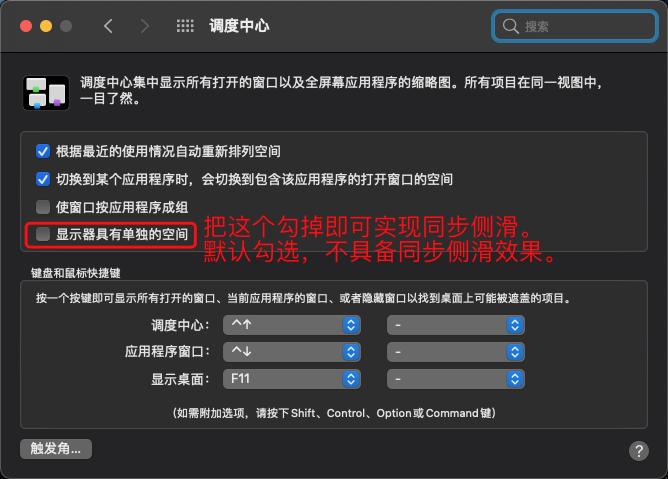

# 023-主显示器和外接显示器同步侧滑

Mac 笔记本的屏幕称为主显示器，我们在日常使用时可以通过 HDMI 接口连接外接显示器。

在 Mac 笔记本中，我们在触摸板上通过**三指上滑**可以添加多个桌面。

在触摸板上通过**三指左右侧滑**可以实现多个桌面之间的切换。

如果想实现主显示器和外接显示器的同步侧滑切换，需要在 `系统偏好设置`-`调度中心` 中将 `显示器具有单独的空间` 勾掉（默认是勾选状态）：

将上图中的选项勾掉之后，重启电脑后即可生效。