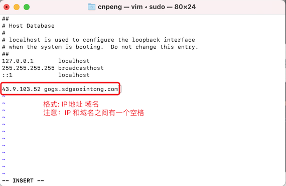

# 1. 024-配置webhosts

## 1.1. 现象：

网站使用 ip 地址可以访问，但使用域名无法访问，此时需要配置 webhosts。

## 1.2. 打开 /etc/hosts 文件

具体步骤如下：

* 查看现有的 hosts 配置信息：`cat /etc/hosts`
* 使用超管身份打开 hosts 配置文件：`sudo vim /etc/hosts`，需要输入电脑的密码
* 编辑 hosts 信息，如下图：



## 1.3. 编辑 hosts 内容

编辑信息的步骤如下：

* 切换到英文输入法，然后按下键盘上的字母 `i` 进入编辑模式
* 通过上下左右键将光标放到文本最后
* 输入 IP 地址和域名信息。格式：`IP地址 域名`。（注意二者之间有空格）
* 按下键盘上的 `ESC` 键，退出编辑模式
* 按下 `Shift+:` 组合键，然后输入 `wq` 保存并退出

