# 1. Mac 系统的恢复

参考链接：[官方-如何重新安装 macOS](https://support.apple.com/zh-cn/HT204904)

在执行操作前，确保有网络环境，且 Mac 电脑已经连接到网络。

## 1.1. 确定CPU架构

即确定 CPU 是 Intel 的还是 Apple 自家的。两者在触发恢复时的热键不一致。

点击下图中的 `关于本机` 即可查看：

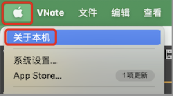

下图中的 `芯片` 就是 CPU 信息，我当前的电脑是 Apple M1 芯片：

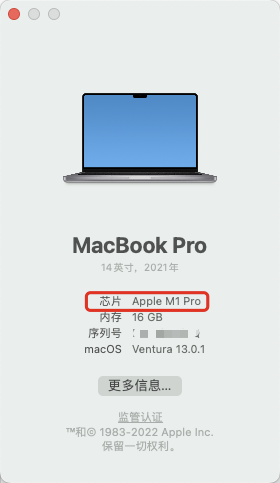

## 1.2. 触发热键

### 1.2.1. Apple 芯片

> 以 Ventura 13.0.1 系统为例

将 Mac 关机，按住电源按钮不松开，

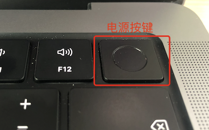

然后会看到提示 `继续按住以显示启动选项`，

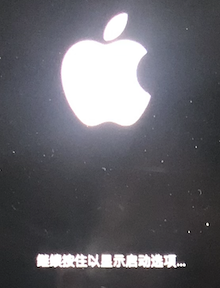

然后会提示 `正在载入启动选项`，此时即可松开按键：

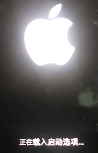

载入完成会看到下图：

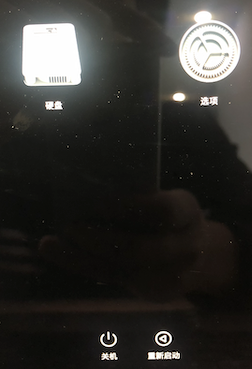

上图中，如果点击左侧的 `硬盘` ，不会触发恢复，而是直接进入系统。点击右侧的 `选项` 才会进入恢复界面。

### 1.2.2. Intel 芯片

> 以 BigSur 11.7 为例

将 Mac 开机并立即按住 `Command (⌘)-R` 不松手，直至看到 Apple 标志或其他图像。

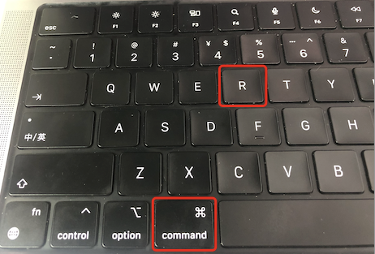

## 1.3. 进入选项页面

> 图示截取自 BigSur 11.7 。Ventura 13.0.1 与此一致。

通过前一小节的热键操作，此时我们会看到如下界面，

点击下图中的用户，然后点击下一步：

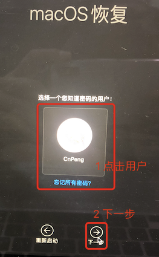

输入用户对应的系统登录密码：

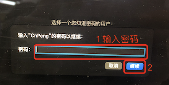

然后即可看到如下的选项界面：

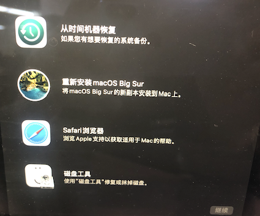

## 1.4. 清理数据

📢  注意：**如果只想恢复系统而不清除数据，不需要执行此操作。如果既想恢复系统也想清空电脑中的原有数据，则需要执行此操作。** 数据无价，请谨慎选择。

在选项界面中，选择 `磁盘工具` ，然后点击 `继续` ：

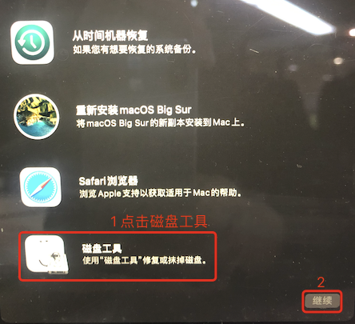

在左侧选择 `硬盘`，然后点击右上角的 `抹掉` ，如下图：

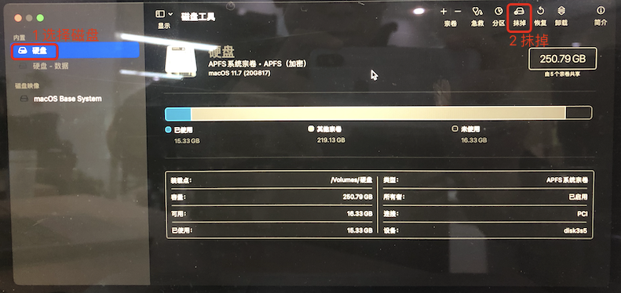

在抹掉磁盘内容时，磁盘格式选择 `APFS` (默认即时此项)。

后续内容按照提示操作即可，基本都是下一步，此处不再赘述。

## 1.5. 重新安装

📢  注意：**整个重装/恢复过程较长，大致需要 3 个小时。因此，在开始执行操作前，需要连接好充电器。执行操作过程中，不要将 Mac 置于睡眠状态或合上上盖。**

在选项界面中，选择 `重新安装` ，然后点击 `继续` ， 如下图：

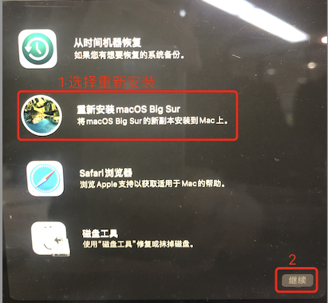

然后点击下图中的 `继续`：

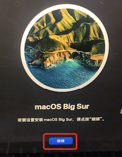

`同意` 条款：

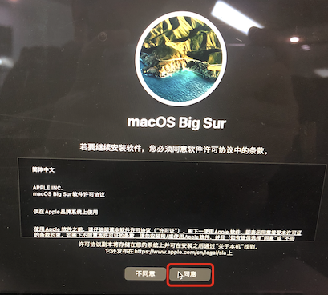

解锁硬盘：

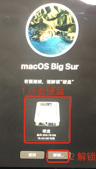

后续步骤按照提示操作即可，不再赘述。

## 1.6. 补充

### 1.6.1. 恢复系统时系统版本的说明

在恢复系统时，按照官方说明有如下因素会影响所恢复的系统版本，具体如下：

当您从恢复功能安装 macOS 时，会获得最近所安装 macOS 的最新版本，但也有一些例外：

* 在基于 Intel 的 Mac 上，您可以在启动时使用 `Shift-Option-Command-R` 来获得 Mac 自带的 macOS，或与它最接近且仍在提供的版本。或者，您也可以在启动时使用 `Option-Command-R` 来获得与 Mac 兼容的最新版 macOS；在某些情况下，也可获得 Mac 自带的 macOS 或与它最接近且仍在提供的版本。
* 如果刚刚更换过 Mac 主板，您可能只会获得与 Mac 兼容的最新版 macOS。
* 如果刚刚抹掉了整个启动磁盘，您可能只会获得 Mac 自带的 macOS，或与它最接近且仍在提供的版本。 

### 1.6.2. 其他系统安装方式

官方说明如下：

如果 macOS 与您的 Mac 兼容，您也可以使用以下方法来安装 macOS：

* 使用 App Store 下载并安装最新版 macOS 或[较早版本的 macOS](https://support.apple.com/zh-cn/HT211683)。
* 使用 USB 闪存驱动器或其他备用宗卷来[创建可引导安装器](https://support.apple.com/zh-cn/HT201372)。

### 1.6.3. 参考项

* [Apple支持-如何重新安装 macOS](https://support.apple.com/zh-cn/HT204904)
* [Apple支持-抹掉并重新安装 macOS](https://support.apple.com/zh-cn/guide/mac-help/mh27903/mac)

