## 一、图像编程入门

### 1、OpenCv 简介

所有计算机视觉应用程序都涉及对图像的处理，因此 OpenCV 提供了一个操作图像和矩阵 的数据结构，它还包含先进的内存 管理模型。

### 2、安装 OpenCv 库

#### (1)、OpenCv 包介绍

从 第三版开始，OpenCv 已经分成了两个主要部分：一部分是主源码库——`sources`, 包含 OpenCv 的核心函数；一部分是 `contrib` , 包含一些新加入的计算机视觉算法（包括一些基于特定许可协议并付费才能使用的算法）。

>注意：因 contrib 中的内容尚处于开发中，其中的算法可能会经常修改。

OpenCV 库分为多个模块，如：

模块 | 功能
---|---
 `opencv_core` 模块 | 包含库的核心功能，
 `opencv_imgproc` 模块 | 包含主要的图像处理函数，
 `opencv_highgui` 模块 | 提供了读写图像和视频的函数以及一些用户交互函数。

在使用某个模块之前，需要包含该模块对应的头文件。很多使用 OpenCV 的应用 程序会在文件的开头处声明:

```c
  #include <opencv2/core.hpp> 
  #include <opencv2/imgproc.hpp> 
  #include <opencv2/highgui.hpp>
```

#### (2)、使用 Homebrew 安装

Mac 系统可以使用 Homebrew 管理工具。安装这个工具后，只需要输入 `brew install opencv3 --with-contrib` 即可完成整个 OpenCV 安装过程。(输入 `brew info opencv3` 可查看选项)。

>在命令行中实际操作时，可能提示错误：找不到 ` --with-contrib`。不知道咋解决，所以，最终使用了 `brew install opencv3`。下载和安装过程比较慢，因为会安装 OpenCv 所需要的其他内容，比如 cmake 等。

#### (3)、手动下载并安装

[手动安装的参考文章：OpenCV installation on Mac OS X](https://stackoverflow.com/questions/19671827/opencv-installation-on-mac-os-x)

* [点击下载 cmake 3.17.0-rc3](https://cmake.org/download/)
* [点击下载 opencv-sources 4.2.0](https://github.com/opencv/opencv)
* [点击下载 opencv_contrib](https://github.com/opencv/opencv_contrib)

先下载并安装 Cmake，然后下载 OpenCv 包。

下载完 `opencv-sources` 包之后，解压缩。然后在命令行中通过 `cd` 命令进入到解压后的目录中。然后依次执行下面的命令：

```
# 在解压后的目录中新建一个 build 目录
mkdir build

# 切换到新建的 build 目录
cd build

# 
cmake -G "Unix Makefiles" ..

# 并行运行 8 个作业
make -j8

# 开始安装
sudo make install
```

上述命令执行完毕之后，OpenCv 就安装成功了。此时我们就可以在 `/usr/local/lib`  目录下看到如下内容：

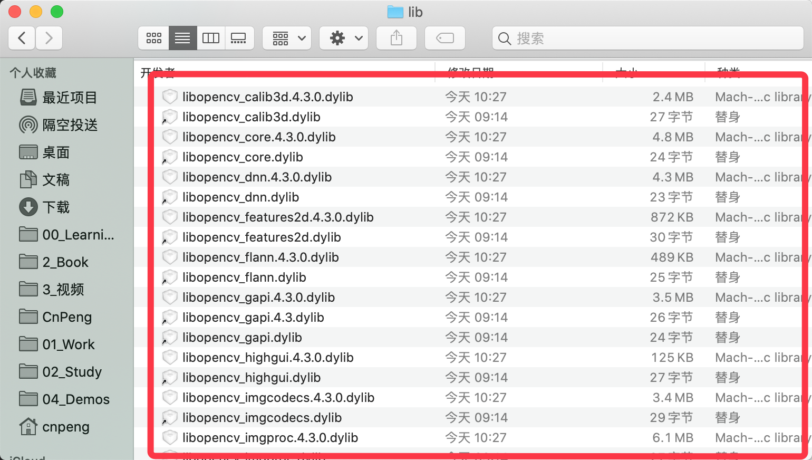

这些以 `.dlib` 为后缀的文件中，有小箭头标识的是快捷方式，没有小箭头的才是原始文件。

### 3、装载、显示和存储图像

####（1）、构建控制台应用程序

参考链接：

* [OpenCV：mac上安装和配置](https://www.jianshu.com/p/564c8b352c7f)
* [mac+Xcode+opencv+ c++环境配置](https://blog.csdn.net/OTime77/article/details/89441700)
* [签名参考链接](https://blog.csdn.net/ReadyShowShow/article/details/102547633)

> 以下构建基于 MAC 10.15 ，OpenCv 4.2.0 ，Xcode 11.3.1，cmake 3.17.0-rc3

新建 xcode 项目：

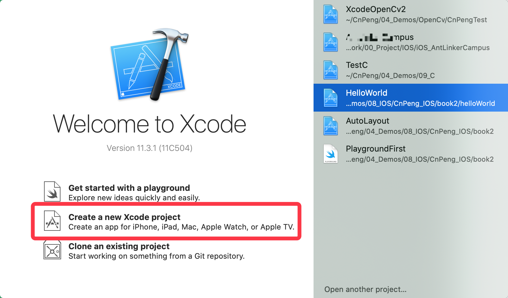
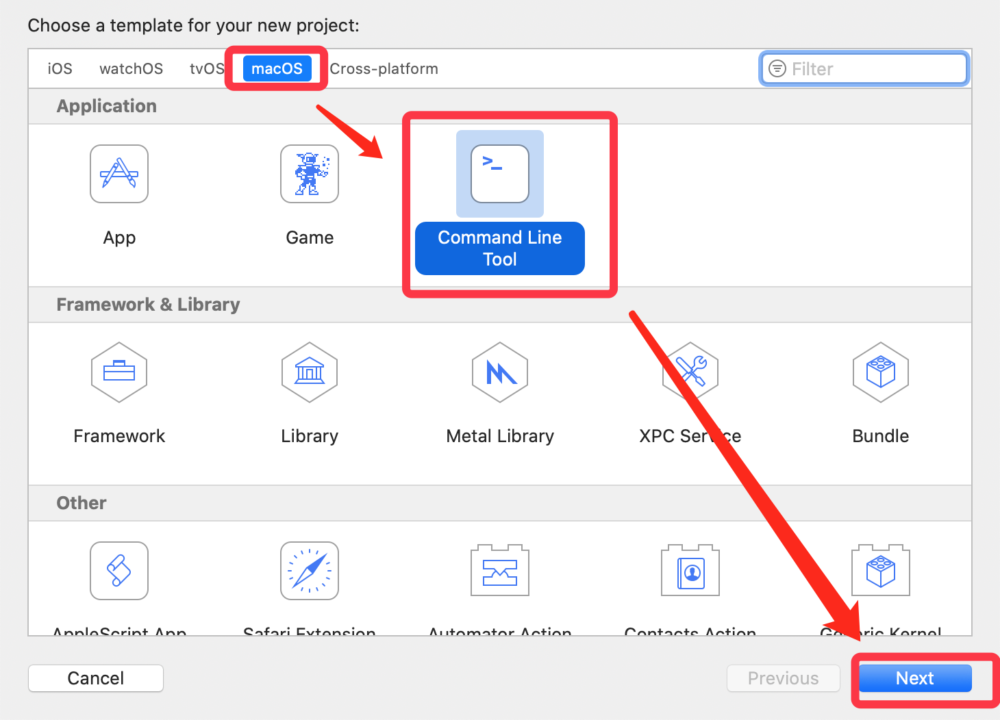

设置项目名称，并设置语言类型：

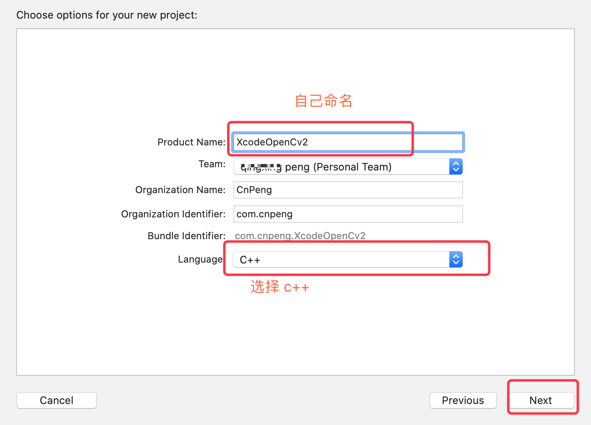

配置 header 路径和库路径：

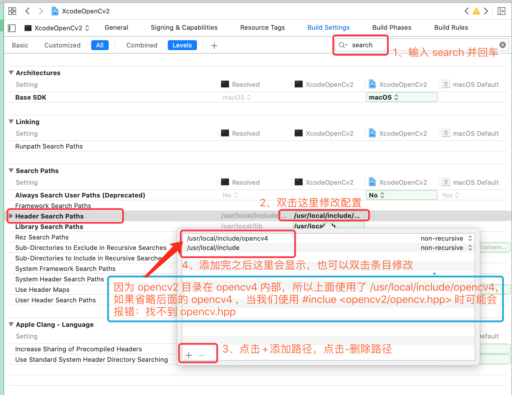
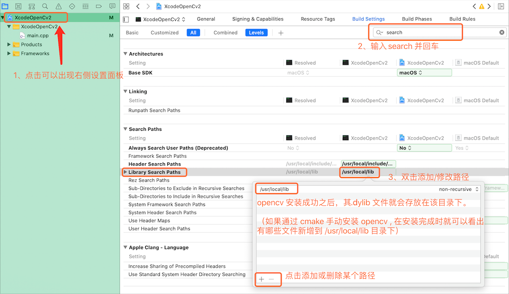

添加引用的动态库文件：

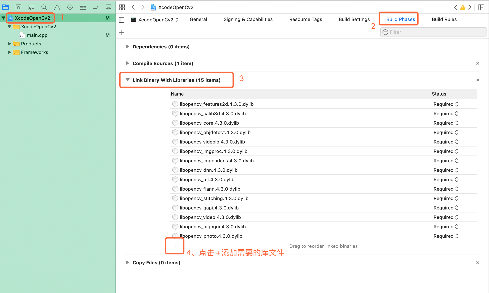
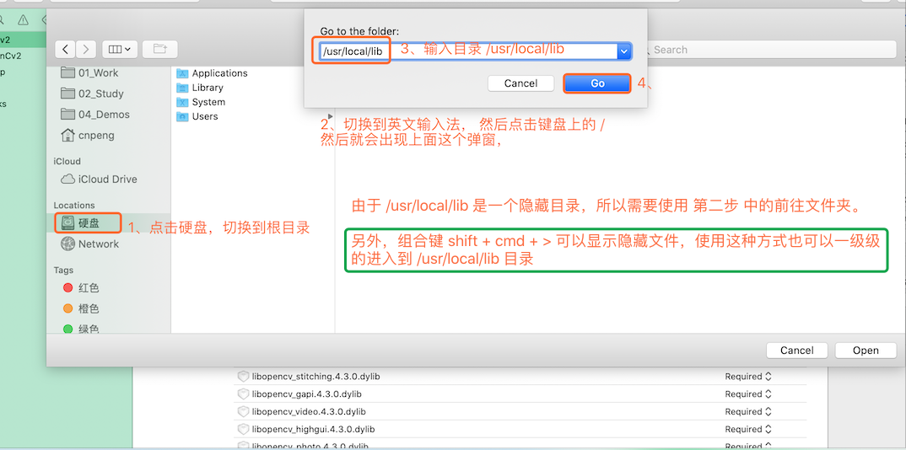
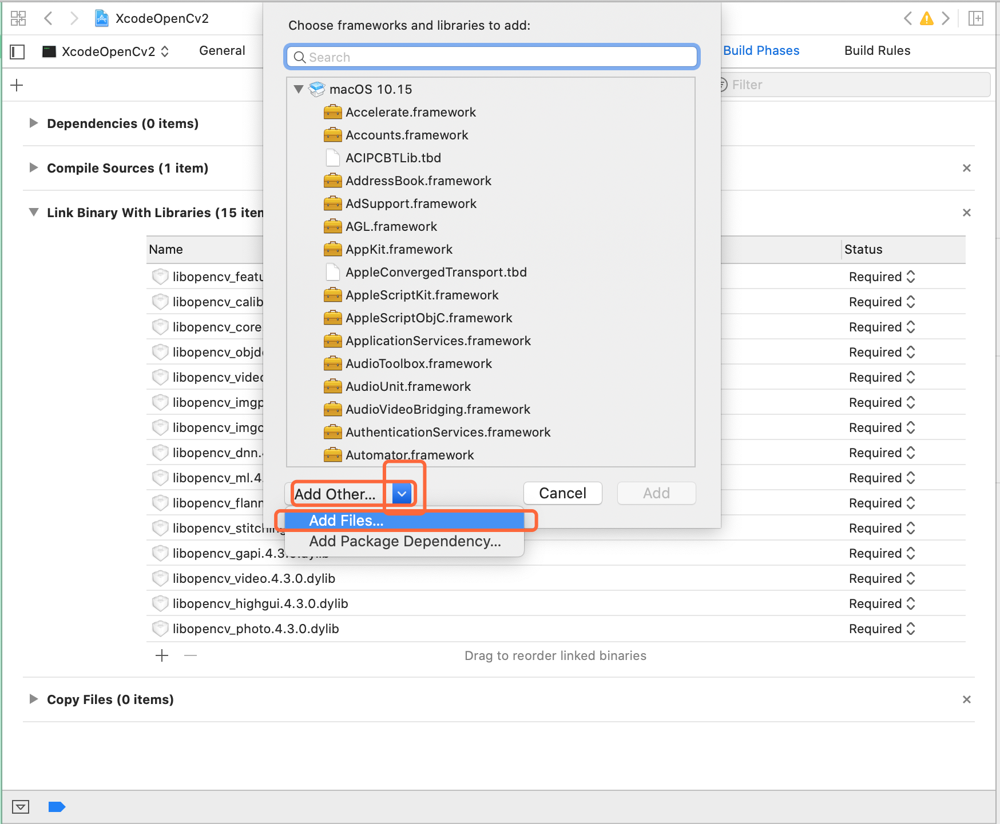
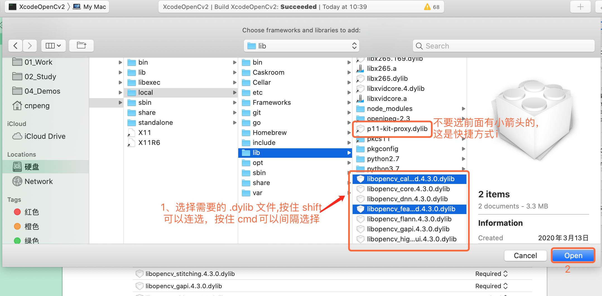

上一步添加库文件完成之后，接着需要对 `.dylib` 库文件签名，如果不签名就会报如下错误：

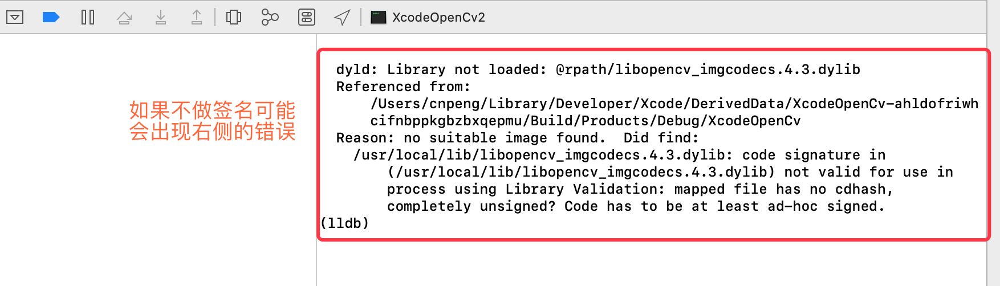

签名时命令如下：

```
codesign -f -s "893612134@qq.com" /usr/local/lib/*.dylib
```

上面的命令中，

* `-f` 表示强制签名，会把已有的签名覆盖。 
* `893612134@qq.com` 是登录[苹果开发者账户](https://developer.apple.com/account/#/welcome)时使用的邮箱，需要改成你自己的。
* `/usr/local/lib/*.dylib` 表示要签名的 `dylib` 文件。（由于 dylib 文件的存储目录不一样，这个路径也需要根据实际情况修改。）

> 苹果开发中，现在强制要求对引入的动态库进行签名。 [签名参考链接](https://blog.csdn.net/ReadyShowShow/article/details/102547633)
  
运行测试程序：

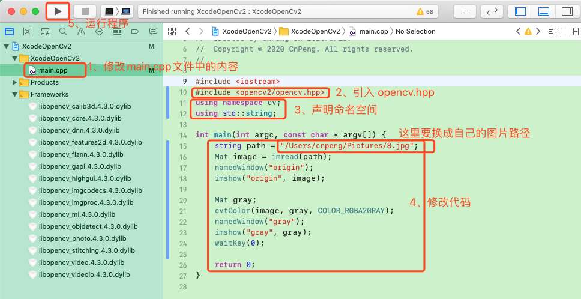  

代码内容如下：

```c++
#include <iostream>
#include <opencv2/opencv.hpp>
using namespace cv;
using std::string;

int main(int argc, const char * argv[]) {
    string path = "/Users/cnpeng/Pictures/8.jpg";
    Mat image = imread(path);
    namedWindow("origin");
    imshow("origin", image);
    
    Mat gray;
    cvtColor(image, gray, COLOR_RGBA2GRAY);
    namedWindow("gray");
    imshow("gray", gray);
    waitKey(0);

    return 0;
}
```
  


####（2）、装载、显示和存储图像

待补充

这个程序同时使用了输入图像和输出图像，我们也可以直接修改原图:

```c
 cv::flip(image,image,1); 
```

####（3）、实现原理

##### 1)、cv 命名空间

在 OpenCV 的 C++ API 中，所有类和函数都在命名空间 `cv` 内定义。访问它们的方法共有两
种:

* 第一种是在定义 main 函数前使用如下声明: `using namespace cv;`
* 第二种方法是根据命名空间规范给所有 OpenCV 的类和函数加上前缀 `cv::`

本书采用的就 是这种方法。添加前缀后，代码中 OpenCV 的类和函数将更容易识别。

##### 2)、`highgui` 模块中的 `imread` 函数

在使用 `highgui` 模块中的 `imread` 函数装载图像时，可以通过设置选项在读入图像的同时进行色彩转换，这样可以提高运行速度并减少内存使用，做法如下所示:

```c
// 读入一个图像文件并将其转换为灰度图像,
image= cv::imread("puppy.bmp", CV::IMREAD_GRAYSCALE);
```

上述代码中生成的图像由无符号字节(unsigned byte，C++中为 unsigned char)构成，在 OpenCV 中用常量 `CV_8U` 表示

另外，即使图像是作为灰度图像保存的，有时仍需要在读入时把它转换成三通道彩色图像。要实现这个功能，可把 `imread` 函数的第二个参数设置为**正数**:

```c
 // 读取图像，并将其转换为三通道彩色图像
image= cv::imread("puppy.bmp", CV::IMREAD_COLOR);
```
 上述代码创建的图像中，每个像素有 3 字节，OpenCV 中用 `CV_8UC3` 表示。当然了，如果输 入的图像文件是灰度图像，这三个通道的值就是相同的。
 
 如果要在读入图像时采用文件本身的格式，只需把第二个参数设置为**负数**。可用 `channels` 方法检查图像的通道数:
 
```c
 std::cout << "This image has "
<< image.channels() << " channel(s)";
```

>注意，用 `imread` 打开路径指定不完整的图像时(前面例子的做法)，imread 会自动采用默认目录。如果从控制台运行程序，默认目录显然就是当前控制台的目录; 但是如果直接在 IDE 中运行程序，默认目录通常就是项目文件所在的目录。因此，要确保图像文件在正确的目录下。
 
用 `imshow` 显示由整数 (`CV_16U` 表示 16 位无符号整数，`CV_32S` 表示 32 位有符号整 数) 构成的图像时，图像每个像素的值会被除以 256，以便能够在 256 级灰度中显示。

在 显示由浮点数构成的图像时，值的范围会被假设为 0.0(显示黑色)~1.0(显示白色)。超出这个范围的值会显示为白色(大于 1.0 的值)或黑色(小于 0.0 的值)。

####（4）、扩展阅读

待补充

###（4）、深入理解 `cv::Mat`

`cv::Mat` 类是用来存放图像(以及其他矩阵数据)的数据结构。在所有 OpenCV 类和函数中，这个数据结构占据着核心地位

待补充


###（5）、定义感兴趣区域

## 二、操作像素


## 三、处理图像的颜色