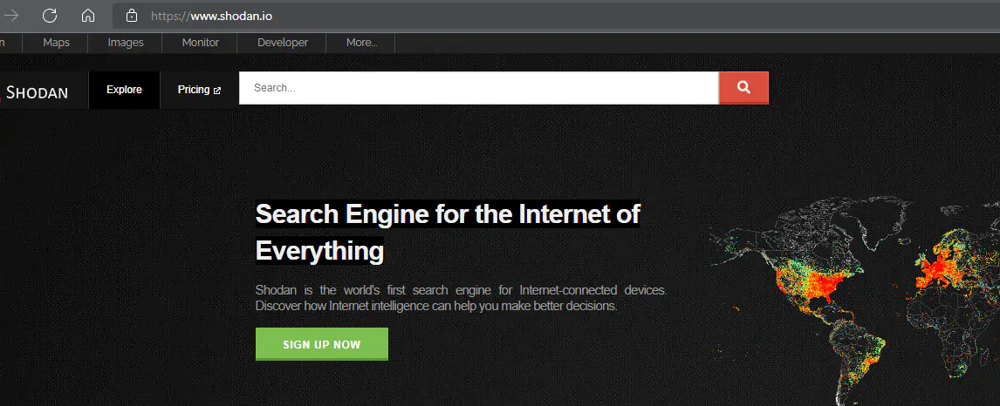
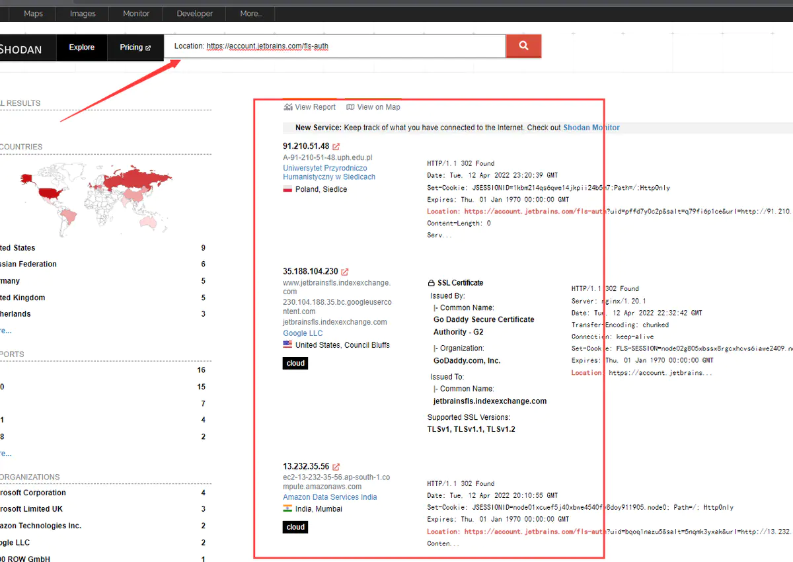
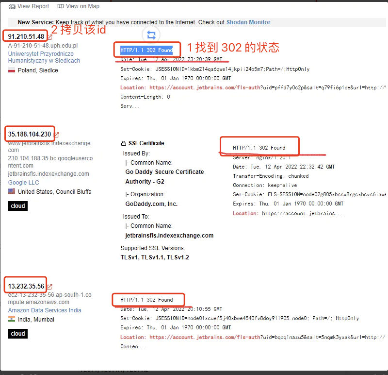
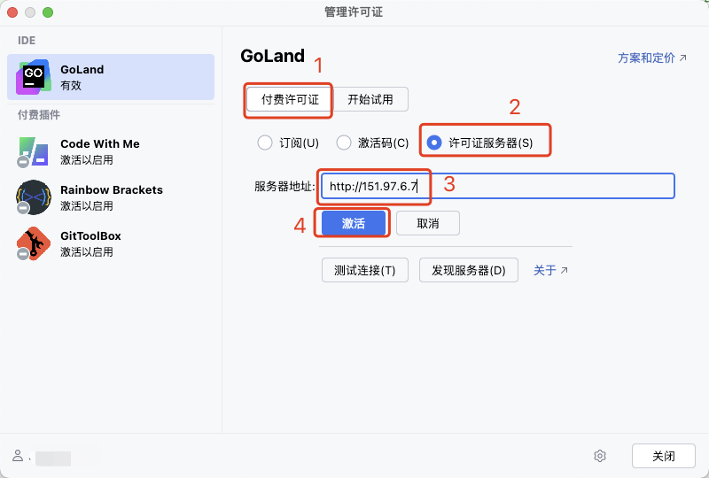
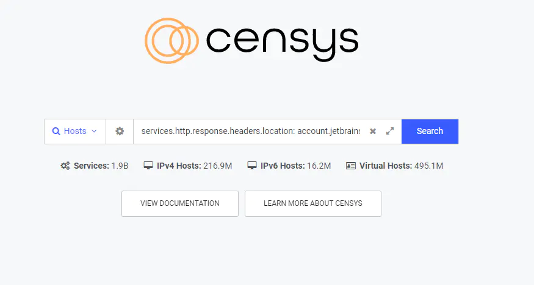
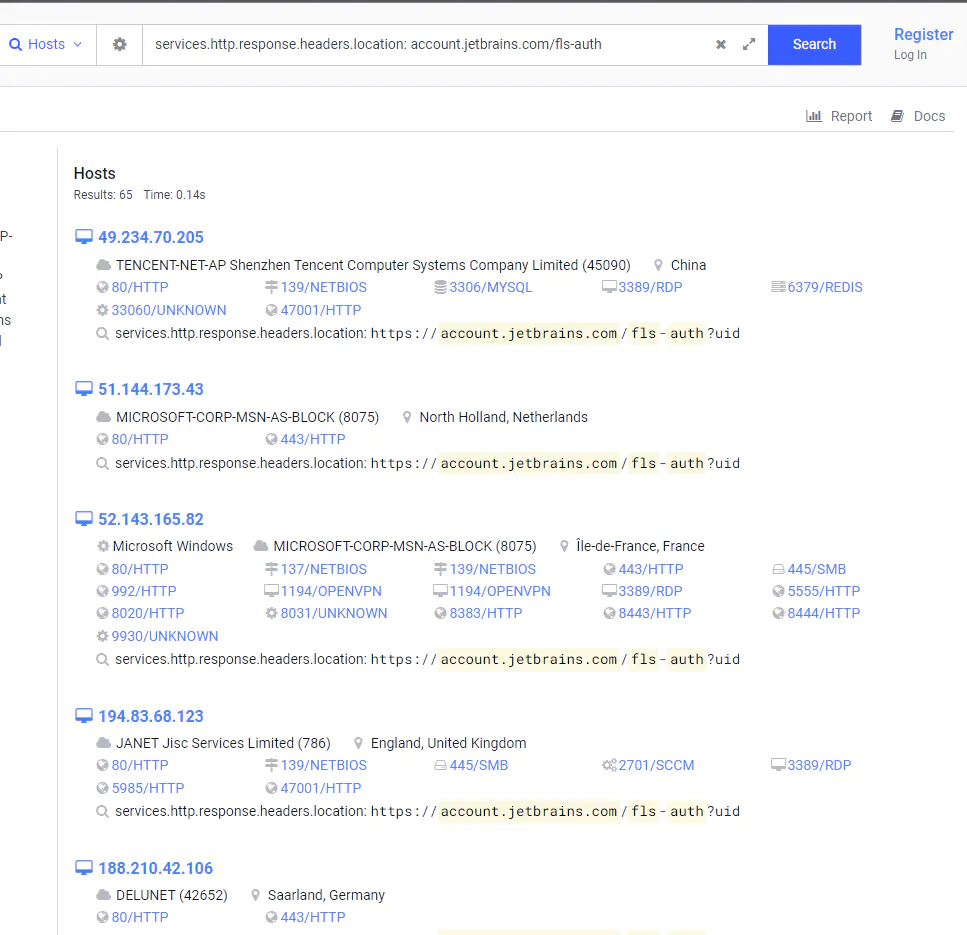
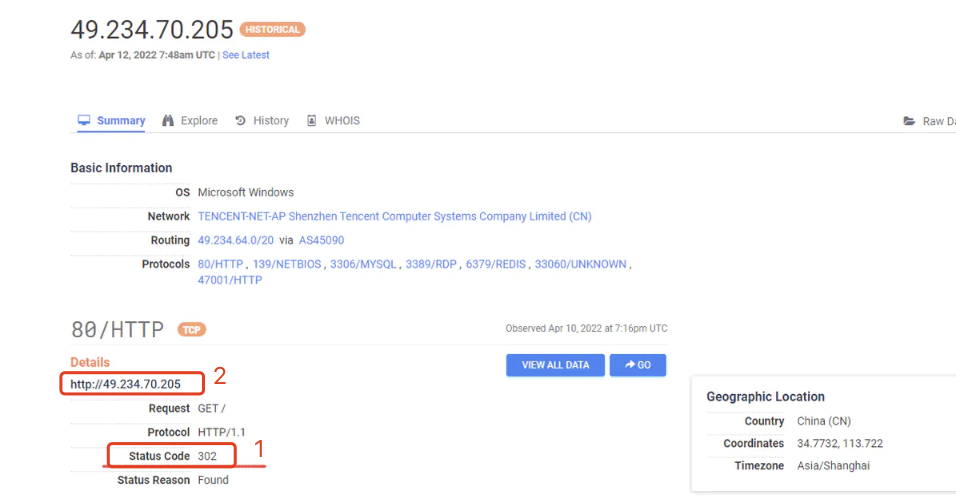

# 1. 000-JetBrains激活服务

[原文地址](https://www.cnblogs.com/HGNET/p/18531891)

Jetbrains全家桶激活方法，亲测有效。

原理是我们通过代码搜索其他授权服务器进行永久激活。

## 1.1. 方式：通过shodan或fofa

网站：[https://fofa.info/](https://fofa.info/) 或 [https://www.shodan.io](https://www.shodan.io)

用到的代码：`Location: https://account.jetbrains.com/fls-auth`

### 1.1.1. 搜索可用server

打开网站，

然后在搜索框中输入代码：`Location: https://account.jetbrains.com/fls-auth`

找到状态为 `HTTP/1.1 302` 的地址，将前面的 ip 地址拷贝下来备用。

### 1.1.2. 激活

打开 JetBrains 软件，然后在 `许可证服务器` 中输入前一步粘贴的 ip 地址（ip 地址前记得加上 `http://`）, 然后点击 `激活` 即可。

## 1.2. 方式：通过censys

网站：[https://search.censys.io/](https://search.censys.io/)

用到的代码：`services.http.response.headers.location: account.jetbrains.com/fls-auth`

### 1.2.1. 搜索可用Server

打开网站，并在搜索框中输入代码：

点击搜索后，会看到如下内容：

任意点击一个 ip 进入详情，然后查看状态是否为 302 ，只有  302 的才能正常使用 ，拷贝 ip 地址备用：

### 1.2.2. 激活

参考方式 1 中的激活方式，将上一步拷贝的 ip 地址粘贴进去即可。

## 1.3. jetbrains激活原理

通过以上方式激活 jetbrains 全家桶，主要是用到了爬取网站服务这一类的搜索引擎实现的。通过搜索引擎我们找到全世界的 jetbrains授权服务器进行激活。

## 1.4. 注意事项

每个服务器IP承载激活的数量优先, 如果激活时候提示失败,可以多换几个.

