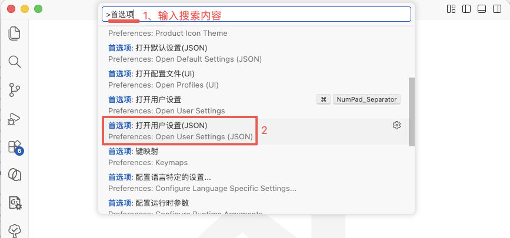
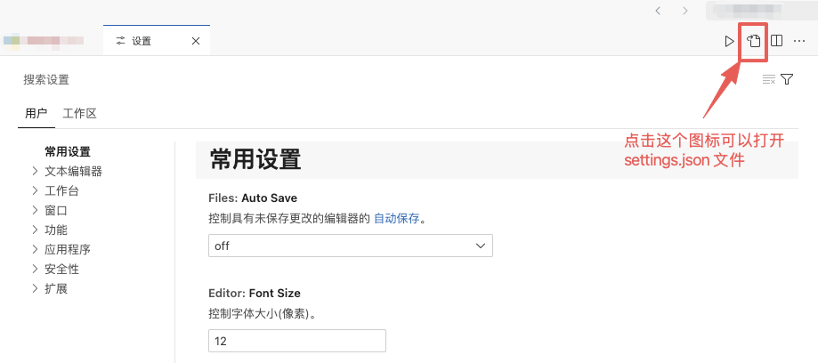
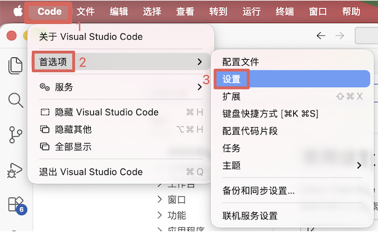
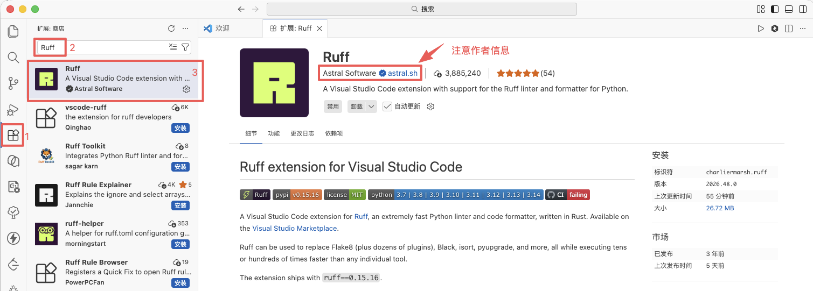
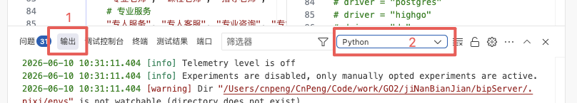

# 1. 003-VSCode使用手册

## 1.1. 进入VSCode配置界面

在 VSCode 中安装插件之后，通常需要添加一下配置到配置文件中，以使插件生效。

进入配置文件（`setting.json`）的方式有如下三种，进入之后，就可以 **在 json 文件的根节点内插入配置内容** 了。

### 1.1.1. 方式1

在 VS Code 中，按下快捷键 `Ctrl + Shift + P`（ macOS 快捷键为 `Cmd + Shift + P`）打开命令面板。

在弹出的输入框中输入 `Preferences: Open Settings (JSON)`（或中文的“`首选项：打开用户设置(JSON)`”），然后按回车键。

然后再搜索结果列表中点击下图中选中的内容：



此时，VS Code 会自动打开 `settings.json` 文件。

### 1.1.2. 方式2

在 VS Code 中通过快捷键 `Ctrl + ,`  （ macOS 中使用 `Cmd + ,`）打开设置界面，然后点击下图中的图标也可以打开 `settings.json` 文件。



### 1.1.3. 方式3



然后点击右上角的这个图标：


## 1.2. 创建代码模板（用户代码片段）

在 VSCode 中，你可以通过创建用户代码片段（User Snippets）来实现类似于 Android Studio 中的代码模板功能。以下是具体步骤：

### 1.2.1. 打开用户代码片段设置

1. 打开 VSCode。
2. 点击左侧活动栏中的齿轮图标，然后选择 `用户代码片段`。
3. 选择你正在使用的编程语言（例如 JavaScript、TypeScript、Python 等）。

### 1.2.2. 创建代码片段

在打开的代码片段文件中，添加你的代码片段模板。例如，创建一个 `toast` 代码片段：

```json
{
  "Toast Message": {
    "prefix": "toast",
    "body": [
      "Taro.showToast({",
      "  title: '$1',",
      "  icon: 'none',",
      "  duration: 2000",
      "});"
    ],
    "description": "Show a toast message"
  }
}
```

### 1.2.3. 使用代码片段

1. 在代码编辑器中，输入 `toast`。
2. 按下 `Tab` 键或 `Enter` 键，代码片段会自动展开为你定义的模板。

### 1.2.4. 示例代码片段文件

以下是一个完整的示例代码片段文件，假设你正在为 JavaScript 创建代码片段：

```json
{
  // 代码片段名称
  "Toast Message": {
    // 触发代码片段的前缀
    "prefix": "toast",
    // 代码片段的内容
    "body": [
      "Taro.showToast({",
      "  title: '$1',",
      "  icon: 'none',",
      "  duration: 2000",
      "});"
    ],
    // 代码片段的描述
    "description": "Show a toast message"
  }
}
```

### 1.2.5. 代码片段占位符

在代码片段中，你可以使用占位符来定义可编辑的区域：

- `$1`, `$2`, ...：定义光标的跳转位置。
- `${1:defaultText}`：定义带有默认文本的占位符。
- `$0`：定义光标的最终位置。

### 1.2.6. 示例：创建多个代码片段

你可以在同一个代码片段文件中创建多个代码片段。例如：

```json
{
  "Toast Message": {
    "prefix": "toast",
    "body": [
      "Taro.showToast({",
      "  title: '$1',",
      "  icon: 'none',",
      "  duration: 2000",
      "});"
    ],
    "description": "Show a toast message"
  },
  "Console Log": {
    "prefix": "log",
    "body": [
      "console.log('$1');"
    ],
    "description": "Log output to console"
  }
}
```

通过以上步骤，你可以在 VSCode 中创建和使用代码片段模板，类似于在 Android Studio 中使用代码模板的方式。这将大大提高你的编码效率。

## 1.3. Markdown 编辑

### 1.3.1. 安装

先安装 `Markdown All in one` 插件：


### 1.3.2. 使用命令执行相关任务

先打开一个 markdown 文档：


然后打开命令面板：

> 如下图所示，也可以通过快捷键 `Shift + CMD + A` 打开命令面板。注意，该快捷键根据个人设置会有不同。


然后在命令窗口中输入 ：`Markdown All in One`（或者直接输入 `markdown`），即可查询所有可用的命令：


如上图，自动添加序号配置的快捷键为 `CTRL + CMD + S`


## 1.4. 覆盖默认快捷键

### 1.4.1. 修改快捷键

使用这种方式只可以修改，无法清空。

#### 1.4.1.1. 方式1


#### 1.4.1.2. 方式2

先打开命令面板（也可以直接通过 `Shift + Cmd + A` 或 `Shift + Cmd + P` 打开）：


然后打开系统的快捷键配置界面（）：


### 1.4.2. 修改或清空快捷键

先打开用户自定义配置页面：


再打开系统快捷键配置页面：


上图中的 6 就是上面需要的 command 命令，打开该窗口的目的就是确认功能对应的命令。

接下来直接在用户配置的 json 文件中编辑即可，通过这种方式，既可以更改快捷键，也可以清空快捷键。


## 1.5. 快捷执行脚本

加入项目目录下有 xx.sh 文件，我们执行时通常是打开终端，然后手动输入 `./xx.sh` 来执行，如果该脚本文件的名称比较长，输入就会比较麻烦。所以需要配置快捷执行脚本的方式。

在 GoLand 中，可以通过下图的方式配置快捷执行方式：


那么 VsCode 中该如何配置呢？我们可以通过 tasks.json 配置终端任务来运行的脚本。

### 1.5.1. 步骤：

#### 1.5.1.1. 基础步骤

* 打开命令面板 (`Cmd + Shift + P` 或 `Ctrl + Shift + P`)
* 输入并选择：Tasks: Configure Task


* 点击 "Create tasks.json file from template"（如果不存在）
* 选择模板为 Others
* 替换生成的 tasks.json 内容如下：

```json
{
    "version": "2.0.0",
    "tasks": [
        {
            "label": "Run modelGenWithInput4Manual.sh",
            "type": "shell",
            "command": "./modelGenWithInput4Manual.sh",
            "options": {
                "cwd": "${workspaceFolder}"
            },
            "problemMatcher": ["$eslint-stylish"],
            "group": "build"
        }
    ]
}
```

#### 1.5.1.2. 快捷步骤

直接在当前项目根目录下的 `.vscode` 中新建 `tasks.json` 文件，并编辑内容即可。（如果 json 文件不存在则新建，存在则直接编辑即可。）


### 1.5.2. 使用方法：

按 `Cmd + Shift + B` 或 `Ctrl + Shift + B` 打开任务面板，然后选择你定义的任务运行即可。

注意：`group` 的名称需要设置为 `build` 或者 `test` ，否则在任务面板中找不到该任务。


### 1.5.3. 确保脚本具有执行权限

在终端中执行以下命令，确保脚本有执行权限（如果不执行该命令，可能会出现 `permission denied` 提示）：

```bash
chmod +x ./modelGenWithInput4Manual.sh
```

## 1.6. Ruff的安装

Ruff 是一个高效的 python 格式化和 lint 工具，它还能支持对 import 内容的排序（导入排序）。

Ruff 的使用大致需要三步：1、在 VS Code 中安装 Ruff 扩展 ，2、在 VS Code 的 `settings.json` 中添加配置，3、在电脑系统中安装 Ruff 软件。

### 1.6.1. 安装扩展



### 1.6.2. 修改配置文件

通过文档前面介绍的进入 `settings.json` 的方式打开配置文件，然后在 json 根节点内添加如下内容：

```json
  "[python]": {
    "editor.formatOnType": true,
    "editor.formatOnSave": true,
    "editor.defaultFormatter": "charliermarsh.ruff",
    "editor.codeActionsOnSave": {
      "source.fixAll": "explicit",
      "source.organizeImports": "explicit"
    }
  }
```


### 1.6.3. 安装 Ruff 命令行工具

安装完 Ruff 扩展并完成配置后，还是不能直接使用的。因为 VS Code 中的 Ruff 插件本身不包含格式化引擎，它只是一个前端界面，必须依赖电脑本地安装的 Ruff 命令行工具。

我们可以先在终端中执行 `which ruff` 或 `ruff --version`  确认是否已经安装 Ruff 。如果能输出正确的路径或版本信息，表示安装成功了，则不需要重新安装；如果输出 `command not found` 则表示未安装。

可以通过 `pip install ruff` 、`pipx install ruff` 、`conda install -c conda-forge ruff` 或 `brew install ruff`  进行安装。

也可以使用官方的独立脚本进行安装：`curl -LsSf https://astral.sh/ruff/install.sh | sh`。

安装完成后，再通过  `which ruff` 或 `ruff --version`  确认是否已经安装成功。

### 1.6.4. 注意

如果上述安装和配置都完成之后，还是无法正常格式化。可以在调试界面中切换一下，以查看是否有报错，然后根据报错信息做对应的处理。

牵涉的内容包括：Python、Ruff、VS IntelliCode 三项。



需要注意，在基于 VS Code 衍生的产品中，无法直接安装 `Pylance` 扩展，因为 `Pylance` 有微软签名校验，无法在非 VS Code 的编辑器上运行。

> Pylance 是 Microsoft 官方的 Python 语言服务器（Language Server），为 Python 提供智能代码分析。它是基于 Pyright（Microsoft 开源的 Python 类型检查器）构建的。

 `Pylance` 的缺失也会导致格式化等功能失效。在 VS Code 的衍生产品中，可以使用 `BasedPyright` 替代，安装之后就可以了。

