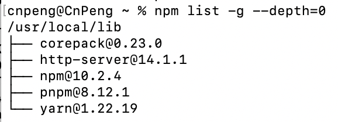
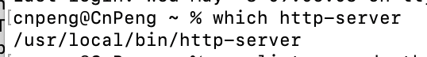

# 1. 002-http-server

## 1.1. 如何理解和使用 http-server

`http-server` 是一个基于 Node.js 的轻量级、零配置的 **HTTP 服务器**。它非常适合快速搭建本地开发环境、测试前端项目、分享静态文件等场景。以下是理解和使用 `http-server` 的几个关键点：

### 1.1.1. 安装


#### 1.1.1.1. 安装

首先，确保你的系统中已安装了 Node.js。然后，通过 npm（Node.js 的包管理器）全局安装 `http-server`：

```bash
npm install -g http-server
```

> 如果使用上述命令安装时提示没有权限，则需要添加 `sudo`—— 以超管身份执行。


#### 1.1.1.2. 查看版本

安装完成后，可以使用如下命令查看已安装的 `http-server` 版本（通过该命令也可以来判断本机是否安装了 `http-server`）：

```bash
http-server -v
```

#### 1.1.1.3. 查看安装目录

1. **通过npm list命令**：在命令行中，你可以使用 `npm list -g --depth=0` 命令查看全局安装的包及其位置。`http-server` 如果是全局安装的，应该会出现在列表中，并且旁边会显示其安装路径。例如：

```bash
npm list -g --depth=0
```




2. **直接查找命令**：在某些操作系统中，你也可以尝试使用 `which`（Unix/Linux/macOS）或 `where`（Windows PowerShell）命令来找到 `http-server` 的可执行文件位置。例如：

- 对于 Unix/Linux/macOS：

```bash
which http-server
```



- 对于 Windows PowerShell：

```bash
Get-Command http-server | Select-Object -ExpandProperty Definition
```


### 1.1.2. 使用

安装完成后，你可以在任意目录下启动 `http-server` 来创建一个 HTTP 服务器，它会自动将该目录下的文件作为根目录提供服务。

#### 1.1.2.1. 基本使用

打开命令行，进入你想要作为服务器根目录的文件夹，然后运行：

```bash
http-server
```

默认情况下，服务器将在本地的 `http://localhost:8080` 上启动。打开浏览器访问这个地址，就能看到目录中的内容。

#### 1.1.2.2. 自定义端口和IP

你也可以指定端口号和IP地址：

```bash
http-server -p 3000 -a 127.0.0.1
```

这会将服务器设置在 `http://127.0.0.1:3000` 上。

#### 1.1.2.3. 其他常用选项

- `-c-1`：禁用缓存，每次请求都从服务器重新加载资源。
- `-o` 或 `--open`：自动在浏览器中打开服务的网址。
- `-d` 或 `--directoryListing`：启用或禁用目录列表显示。
- `-g` 或 `--gzip`：启用Gzip压缩。


### 1.1.3. 数据交互与跨域

虽然 `http-server` 主要用于静态资源服务，但通过适当的配置（如使用 `--cors` 参数开启跨域资源共享），可以使得前端项目在开发阶段方便地与后端API进行数据交互，或者测试跨域请求。

### 1.1.4. 结合H5项目

在H5项目中，如果你需要在本地测试页面与本地服务器的交互，可以使用 `http-server` 来启动一个本地服务器，并在H5页面的请求中指向该服务器地址，从而实现页面与服务器数据的交互测试。

### 1.1.5. 总结

`http-server` 是一个非常便捷的工具，特别适合前端开发者快速搭建临时服务器来测试网页、API、或是分享静态内容。由于其简单易用和零配置特性，成为了许多开发者首选的本地开发服务器解决方案。

## 1.2. 补充：Stencil 项目通过 build 命令构建之后，如何找到构建后的内容并运行起来？

Stencil 项目在通过 `npm run build` 或 `stencil build` 命令构建之后，生成的静态资源通常位于项目的 `dist` 目录下（或者在 `stencil.config.ts` 配置文件指定的目录中）。构建过程会根据你的配置生成 Web Components 作为静态资源，包括 JavaScript、CSS 和其它可能的资源文件，如图标或图片。

要运行构建后的内容，你可以选择以下几种方法：

### 1.2.1. **本地服务器**

使用任何 **静态文件服务器** 来托管 `dist` 目录下的文件。有许多简单的命令行工具可以快速启动一个本地服务器，如 `http-server` 或 `live-server`。

- 首先，确保你已经安装了其中一个工具。如果没有，可以通过 npm 安装，例如安装 http-server：

```bash
npm install -g http-server
```

- 然后，导航到你的 `dist` 目录并启动服务器：

```bash
cd dist
http-server
```

- 服务器启动后，它会告诉你访问应用的地址，通常是 `http://localhost:8080`。

### 1.2.2. **部署到静态托管服务**

   如果你想在线上环境查看，可以将 `dist` 目录的内容部署到任何支持静态网站托管的服务上，如 GitHub Pages、Netlify、Firebase Hosting 或 Vercel。这些服务通常有专门的命令或集成来简化部署流程。

### 1.2.3. **集成到现有项目**

   如果你的 Stencil 组件是作为库的一部分构建的，目的是供其他项目使用，那么你不需要直接“运行”构建后的输出。相反，你需要将构建输出（通常是 `dist` 目录下的 `.js` 和 `.css` 文件）集成到使用这些组件的项目中，通过 `<script>` 标签引入或使用模块打包工具如 webpack 或 rollup 进行打包。

记住，构建过程可能还会生成一些额外的配置文件，如 `index.html`，它是用来演示你的组件的。这个文件通常包含了引用所有必要脚本和样式的标签，直接在浏览器中打开它可以预览组件。


## 1.3. 补充:可以在本地运行的静态文件服务器有哪些？

可以在本地运行的静态文件服务器有多种选择，以下是一些常用的工具和方法：

### 1.3.1. **http-server**（Node.js）

   - **简介**: 一个非常简单、易用的Node.js模块，可以快速启动一个HTTP服务器来服务当前目录下的文件。
   - **安装**: 通过npm安装 (`npm install -g http-server`)。
   - **使用**: 在命令行中，进入你希望作为服务器根目录的文件夹，然后运行 `http-server`。

### 1.3.2. **live-server**（Node.js）

   - **简介**: 提供实时重载功能的本地开发服务器，适合前端开发调试。
   - **安装**: 通过npm安装 (`npm install -g live-server`)。
   - **使用**: 在项目目录下运行 `live-server` 即可启动服务器，支持自动刷新浏览器。

### 1.3.3. **Python SimpleHTTPServer**（Python 2）/ **http.server**（Python 3）

   - **简介**: Python标准库自带的简单HTTP服务器，适用于快速查看静态文件。
   - **使用**: 在命令行中，进入目标目录，运行 `python -m SimpleHTTPServer 8000`（Python 2）或 `python -m http.server 8000`（Python 3），其中8000是端口号。

### 1.3.4. **Nginx**

   - **简介**: 强大的Web服务器和反向代理服务器，也可用于静态文件服务。
   - **安装**: 根据操作系统不同，安装方式各异，通常通过包管理器如apt（Ubuntu）或brew（macOS）。
   - **配置**: 需要编写配置文件来指定静态文件目录。

### 1.3.5. **Apache HTTP Server**

   - **简介**: 另一个广泛使用的Web服务器软件，支持静态文件服务。
   - **安装**: 类似Nginx，通过操作系统包管理器安装。
   - **配置**: 编辑配置文件，如`httpd.conf`，配置DocumentRoot指向静态文件目录。

### 1.3.6. **anywhere**（Node.js）

   - **简介**: 一个轻量级的命令行工具，用于快速启动本地静态文件服务器，适合移动端调试。
   - **安装**: 通过npm安装 (`npm install -g anywhere`)。
   - **使用**: 在项目目录下运行 `anywhere`。

### 1.3.7. **VSCode Live Server插件**

   - **简介**: Visual Studio Code的一个插件，提供了即时预览功能，启动一个本地开发服务器。
   - **安装**: 在VSCode中搜索并安装Live Server插件。
   - **使用**: 在编辑器内右键选择"Open with Live Server"。

以上工具各有特点，根据个人偏好和项目需求选择适合的本地静态文件服务器。