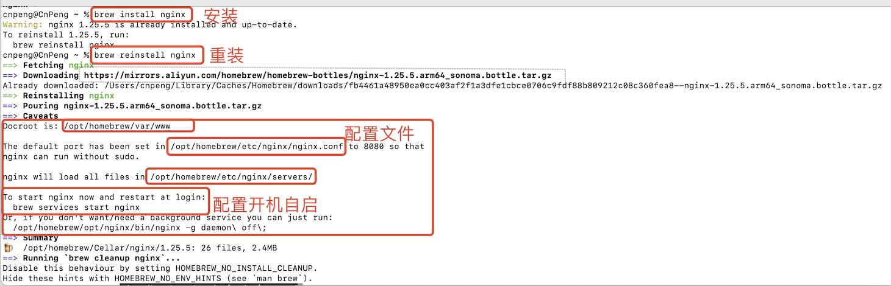
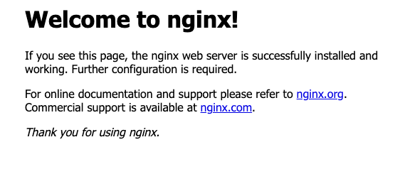
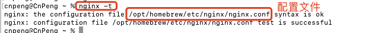
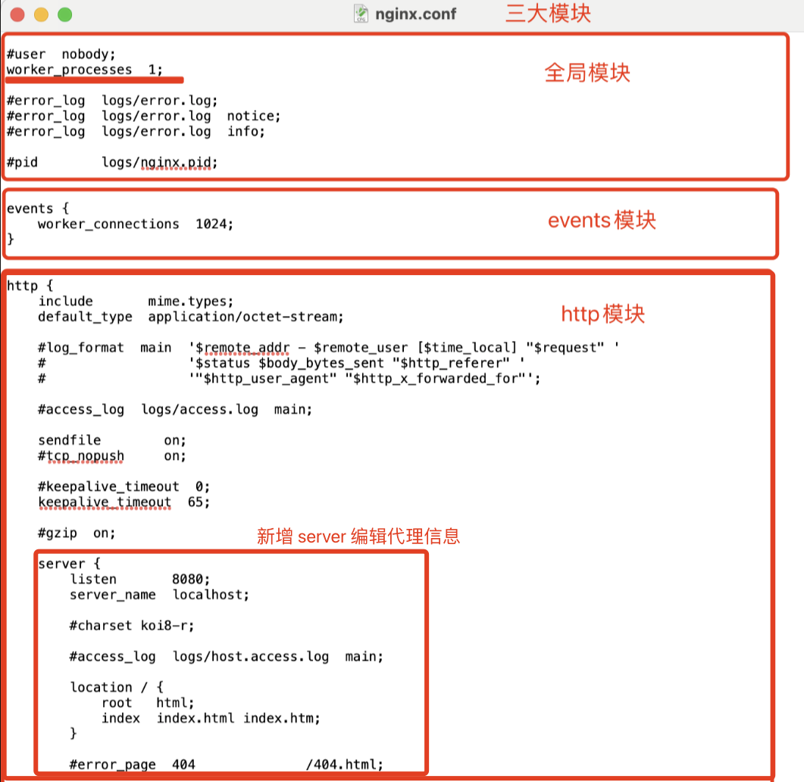
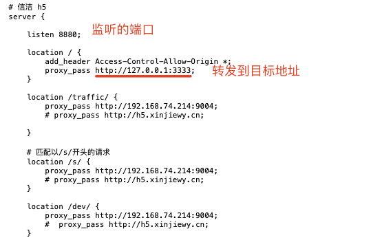

# 1. 004-nginx的安装和使用

## 1.1. nginx 安装

在Mac电脑上安装Nginx，最常用的方法是通过Homebrew包管理器。以下是安装步骤：

### 1.1.1. 安装Homebrew（如果尚未安装）

首先确保你的Mac上安装了Homebrew。如果还没有安装，可以在终端中运行以下命令来安装Homebrew：

```bash
/bin/bash -c "$(curl -fsSL https://raw.githubusercontent.com/Homebrew/install/main/install.sh)"
```

### 1.1.2. 使用Homebrew安装Nginx

安装Homebrew后，你可以通过以下命令安装Nginx：

```bash
brew install nginx
```

这个过程可能需要几分钟时间，Homebrew会自动下载并安装Nginx及其依赖。



### 1.1.3. 启动Nginx

安装完成后，直接在终端中执行 `nginx` 将启动 nginx 服务。

也可以通过如下命令将 nginx 设置为开机自启：

```bash
brew services start nginx
```


### 1.1.4. 验证Nginx安装

启动 nginx 后，在浏览器中输入`http://localhost:8080`或`http://127.0.0.1:8080`，如果Nginx安装并配置正确，则能看到默认的欢迎页面。如下图：



## 1.2. 配置Nginx

### 1.2.1. 打开配置文件

在终端执行 `nginx -t` 命令，该命令会列出配置文件地址，并测试配置文件内容是否正确。



在终端中输入如下命令打开 `nginx.conf` 所在目录：

```bash
open /opt/homebrew/etc/nginx/
```

然后右键 `nginx.conf` 文件使用文本工具打开。


### 1.2.2. 编辑配置文件

#### 1.2.2.1. 配置文件模块划分



在 Http 模块中增加 `server` 对象即可，每个 server 都代表一组代理信息。

#### 1.2.2.2. 配置示例

本地 H5 项目运行之后访问地址为 ：`http://localhost:3333/`，我们为该 H5 项目配置代理，以解决跨域问题正常访问服务器数据。



在配置文件中：

* `listen` 后面跟的是要监听的端口（即访问哪个端口时会触发该 server 对象中的代理配置）
* `location` 后面紧跟的是路由的开头标识，匹配的路由会转发到该对象内部 `proxy_pass` 所指定的地址中。

在上述配置文件中：

* 我们监听了 `8880` 端口，我们在浏览器中访问 `http://localhost:8880/` 时就会触发这里的代理配置。
* 在第一个 location 配置中，当路由以 `/` 开头时，会被转发到 `http://127.0.0.1:3333` 中，所以我们访问 `http://localhost:8880/` 会跳转到 `http://localhost:3333/`。
* 同理，在后续的 location 配置中，当路由以特定字符开头时，会被转发到我们期望的服务器地址。


### 1.2.3. 重启Nginx

配置更改后，需要重启Nginx使更改生效。

先通过 `nginx -s stop` 关闭当前的 nginx 服务，然后再通过 `nginx` 启动。

**注意**：如果当前没有正在运行的 nginx 服务，调用 `nginx -s stop` 时会提示：`nginx: [error] open() "/opt/homebrew/var/run/nginx.pid" failed (2: No such file or directory)`。

也可以直接使用以下命令重启Nginx服务：

```bash
brew services restart nginx
```

## 1.3. 常用命令

命令 | 含义
---|---
`nginx` | 启动 Nginx
`nginx -s stop` | 立刻停止 Nginx 服务
`nginx -s reload` | 重新加载配置文件（重启 nginx）
`nginx -s quit` | 平滑停止 Nginx 服务
`nginx -t` | 测试配置文件是否正确（会列出配置文件地址及配置内容是否正确）
`nginx -v` | 显示 Nginx 版本信息
`nginx -V` | 显示 Nginx 版本信息、编译器和配置参数的信息

## 1.4. 注意事项

- 默认情况下，Nginx可能监听8080端口，而不是常见的80端口，这是因为没有root权限时，非root用户无法直接绑定到1024以下的端口。
- 如果你需要Nginx监听80端口，你需要以管理员权限启动Nginx，或者通过其他方式（如使用launchd配置文件）配置Nginx以root权限启动并监听80端口。
- 确保防火墙设置允许外部访问Nginx监听的端口。

## 1.5. 补充

其他更多内容可参考 golang 笔记中的 [《用Nginx部署Go应用》](用Nginx部署Go应用)