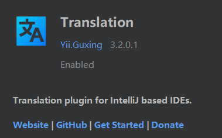
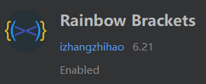

# 1. IDEA系列软件的插件

插件名|说明 | 图片
---|---|---
 [Translation](https://github.com/YiiGuxing/TranslationPlugin)  | 选中 IDEA 代码中的英文文本后，在右击菜单中可以直接选择翻译（Windows 中的快捷键：`Ctrl+Shift+Y`）。| 
[彩虹括号](https://izhangzhihao.github.io/rainbow-brackets-document/) | 把代码中不同层级的大括号使用不同的颜色区分，方便查看代码层级信息 | 
 [codota](https://www.codota.com/?utm_source=jbmarket&utm_campaign=jbrainbowbrackets&utm_medium=banner) | 代码补充工具 | 
[GitToolBox](https://plugins.jetbrains.com/plugin/7499-gittoolbox/) | Git 辅助工具，单击某行代码可以在该行末尾显示Git信息，支持自动拉取等更多功能 | 
[Alibaba Java Coding Guidelines](https://plugins.jetbrains.com/plugin/10046-alibaba-java-coding-guidelines) | 阿里的java编码指导 | 