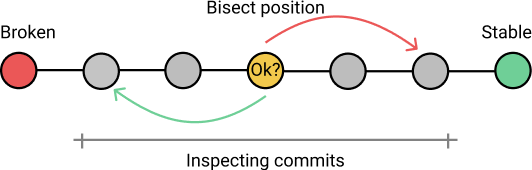

# 1. bisect二分

[原文：阮一峰《git bisect 命令教程》](https://www.ruanyifeng.com/blog/2018/12/git-bisect.html)

## 1.1. 原理介绍

`git bisect` 是一个很有用的命令，用来**查找哪一次代码提交引入了错误**。



它的原理很简单，就是**将代码提交的历史，按照两分法不断缩小定位**。

所谓"两分法"，就是将代码历史一分为二，确定问题出在前半部分，还是后半部分，不断执行这个过程，直到范围缩小到某一次代码提交。

## 1.2. 准备

本文通过一个实例，解释如何使用这个命令。下面是一个代码库，请将它克隆到本地。

```git
$ git clone git@github.com:bradleyboy/bisectercise.git
$ cd bisectercise
```

这个库是一个网页 index.html，在浏览器打开这个网页。

```git
$ open index.html
```


网页上是一个计数器，有两个按钮。点击 `+` 号按钮，可以看到计数器没有递增，反而递减，这说明代码有问题。

现在，就要来查找，到底哪一次代码提交，引入了错误。

首先，检查一下代码提交历史。

```git
$ git log --pretty=oneline
```

可以看到，这个库一共有 101 次提交。最早的第一次提交的哈希是 `4d83cf`。

## 1.3. 启动检查

使用 `git bisect start` 命令启动查错，它的完整格式如下。

```git
$ git bisect start [终点] [起点]
```

上面代码中，

* "终点"是最近的提交，
* "起点"是更久以前的提交。

“起点”和“终点”之间的这段历史，就是差错的范围。

这个例子中，我们选择全部的代码历史。起点是第一次提交 `4d83cf`，终点是最近一次的 `HEAD`。当然，指定其他范围也可以。

```git
$ git bisect start HEAD 4d83cf
```

执行上面的命令以后，**代码库就会切换到这段范围正当中的那一次提交**，本例是第 51 次提交。

现在刷新浏览器，点击页面中的 + 按钮，发现可以正常递增。

## 1.4. 标记无问题

使用 `git bisect good` 命令，标识本次提交（第51次）没有问题。

```git
$ git bisect good
```

既然第 51 次提交没有问题，就意味着错误是在代码历史的后半段引入的。

**执行上面的命令，Git 就自动切换到后半段的中点（第76次提交）。**

## 1.5. 标记有问题

现在刷新浏览器，点击 + 按钮，发现不能正常递增。

使用 `git bisect bad` 命令，标识本次提交（第76）有问题。

```git
$ git bisect bad
```

执行上面的命令以后，Git 就自动切换到第 51 次到第 76 次的中点（第63次提交）。

接下来，不断重复这个过程，直到成功找到出问题的那一次提交为止。这时，Git 会给出如下的提示。


```git
b47892 is the first bad commit
```

既然找到那个有问题的提交，就可以检查代码，确定具体是什么错误。

## 1.6. 退出检查

然后，使用 `git bisect reset` 命令，退出查错，回到最近一次的代码提交。

```git
# 退出查错
$ git bisect reset
```

现在就可以开始修复错误了。