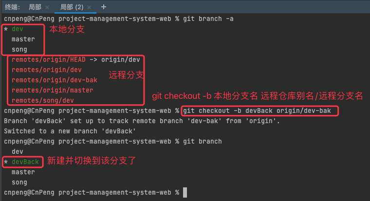
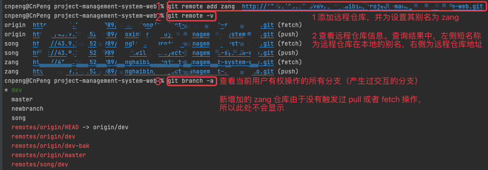
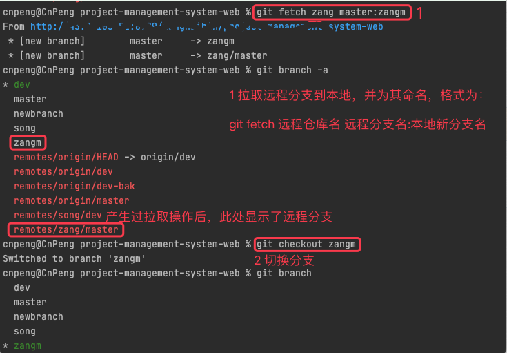

# 1. 3-基于远程分支新建本地分支

## 1.1. 使用场景

远程分支与本地现有分支差异较大，需要基于远程分支进行新的开发。

将远程分支拉取到本地时不能对本地现有分支进行污染或被本地分支污染。


## 1.2. 方案1

**注意：该方式使用前提是，之前已经添加过远程仓库，并且执行过对该仓库的 pull 或者 fetch 操作**

直接执行 checkout 命令，检出远程分支

命令格式：

```
git checkout -b 新的分支名 远程仓库别名/远程仓库分支名
```



## 1.3. 方案2

**注意：该方案不区分远程仓库是新增还是已有，也不区分本地是否执行过对远程仓库的 pull 或者 fetch 操作**

核心命令：

```
git fetch 远程仓库别名 远程分支名:本地新分支名
git checkout 本地新分支名
```



上图中，我们新增了一个远程仓库，并将其别名设置为 zang 。我们点击该仓库的地址，可以查看其中含有 master 等分支，接下来，我们拉取其 master 分支到本地。




## 1.4. 方案3

**注意：该方案不区分远程仓库是新增还是已有，也不区分本地是否执行过对远程仓库的 pull 或者 fetch 操作**

核心命令：

```
git fetch 远程仓库别名 远程分支名
git checkout -b 本地新分支名 远程仓库别名/远程分支名
```


