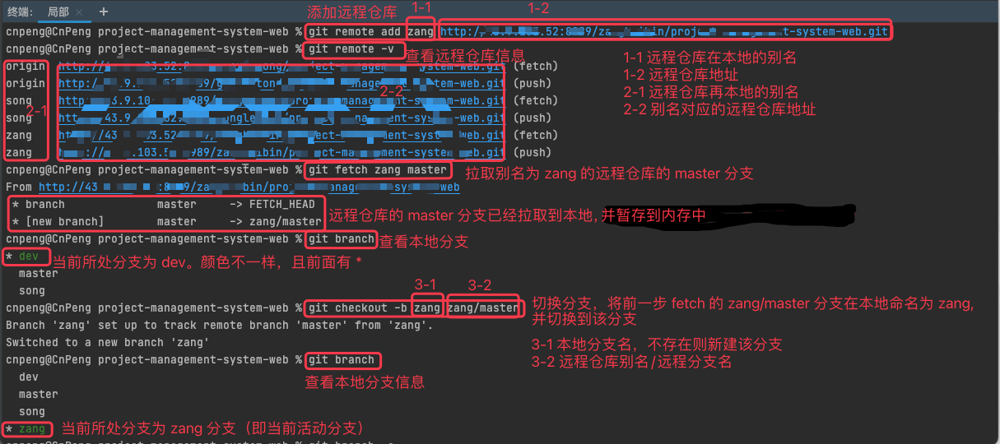
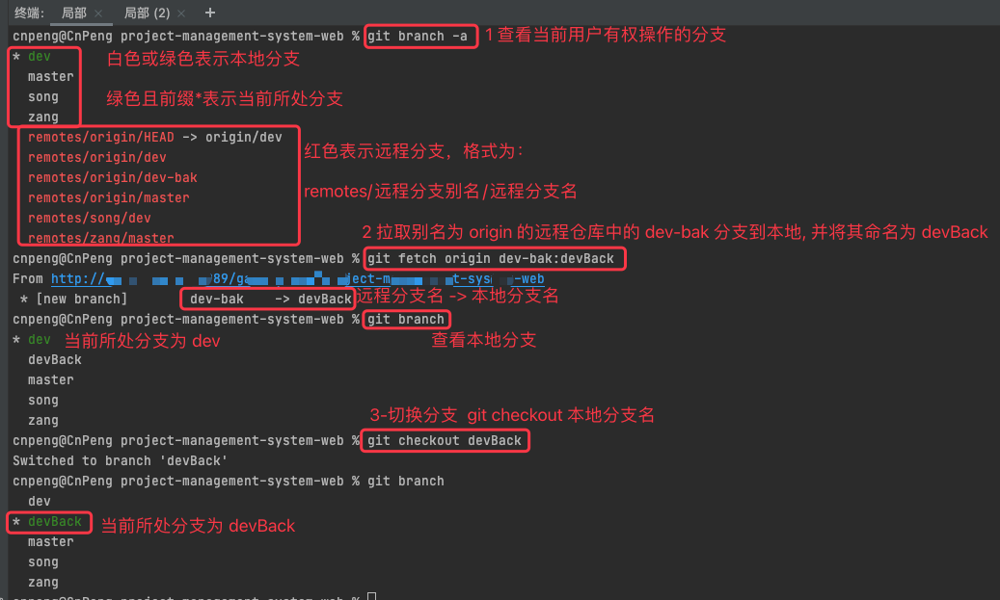

# 1. 3-基于远程分支新建本地分支

## 1.1. 使用场景

远程分支与本地现有分支差异较大，需要基于远程分支进行新的开发。

将远程分支拉取到本地时不能对本地现有分支进行污染或被本地分支污染。

## 1.2. 方案1

先 fetch 到本地，此时 git 会将其暂存到内存中，

然后使用 checkout 对 fetch 到本地的分支命名，并切换到该分支

## 1.3. 方案2

