# 1. log-提交日志

注意：以下截图中，

* `Author`    表示对代码做出修改的人
* `Date` 表示对代码做出修改的时间
* `Commit` 表示提交代码的人，
* `CommitDate` 表示提交代码的时间

>实际工作中，Author 并不一定就是 Commit

>另外：在查看提交摘要或者详情等情况下可能会出现 `: `，这个冒号表示还有没展示完的内容，如果你想继续查看内容，就敲击键盘上的回车键；如果你想退出 `: `，可以敲击键盘上的 `q` 。如下图：

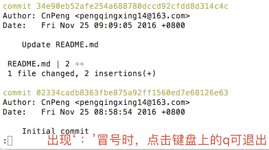

git中查看提交历史的话，使用的是 `git log`命令，具体命令及含义如下：

## 1.1. `git log`

查看全部提交历史 。 由于命令窗口的限制，如果提交历史过多，可能无法完全显示在屏幕上，这时候，可以敲击回车键继续查看。如下图：

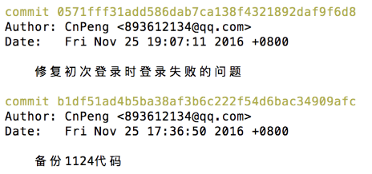

## 1.2. `git log -p`

查看全部提交历史并展示每次修改的内容

## 1.3. `git log -2`

查看最近2次提交历史(注意：后面的数字是可以自定义的，也就是说，这种写法是 git log -n 的体现)

## 1.4. `git log -p -2`

查看最近2次提交历史并展示修改的内容

## 1.5. `git log --stat`

查看提交历史，并展示摘要内容（摘要会列出修改的文件以及每个文件中修改了多少行）,如下图：

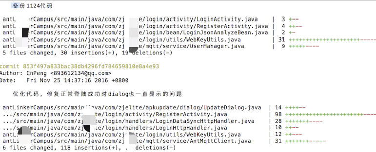

## 1.6. `git log --shortstat`

 查看提交历史，并显示摘要内容（只是统计并展示修改了多少内容儿不显示具体哪些文件做出了修改），如下图：
 
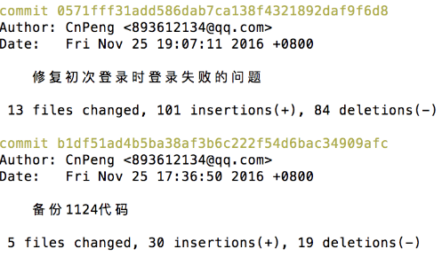

## 1.7. `git log --pretty xxx`

该命令可以用来指定使用不同于默认格式的方式展示提交历史，后面的 xxx表示具体的取值，取值有：oneline , short , full , fuller 等

### 1.7.1. `git log --pretty=oneline`

 执行该命令后会把提交历史的 commit 描述以及校验和 显示在同一行，并且省略默认格式下的其他内容，具体如下图： 
 
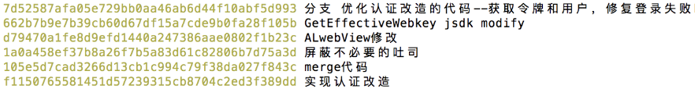

### 1.7.2. `git log --pretty=short`

执行该命令后，只是比默认的格式少了Data日期的描述，具体如下图：

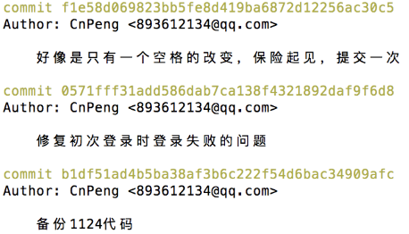

### 1.7.3. `git log -- pretty=full`

执行该命令后，与默认的格式相比少了Data日期的描述，但是增加了commit 提交人信息，如下图：

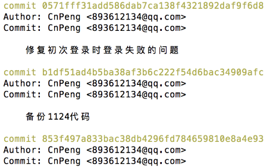

### 1.7.4. `git log --pretty=fuller`

执行该命令之后，效果如下：

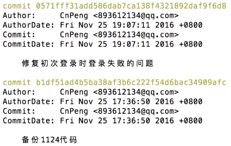

## 1.8. 其他用法：

### 1.8.1. `git log --abbrev-commit`
 
 仅显示 `SHA-1` 的前几个字符，而非全部字符（这个 `SHA-1` 字符就是指的校验和，我习惯称为commit id），如下图：

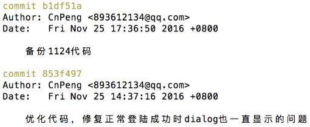

### 1.8.2. `git log --relative-date`
 
 以相对当前的时间展示提交历史，如下图：

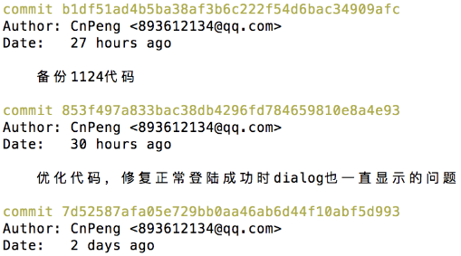
 
### 1.8.3. `git log --graph`
 
 在展示提交历史前面加入简单的ASCII图形，区分每次提交历史，如图：

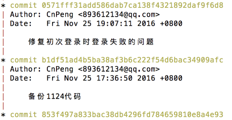

### 1.8.4. `git log --oneline`

log后面直接跟 `--oneline` 时，显示短的 校验和，并与提交描述显示在同一行，效果如下

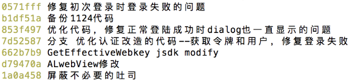

### 1.8.5. `git log --oneline --graph` 

以树形结构查看短描述和校验值

### 1.8.6. `git log -- author=用户名`

如：`git log --author=CnPeng`  就会展示出CnPeng这个用户的修改历史 。注意：这里的用户名，是初始化git 时传入的name . 运行效果如下图：

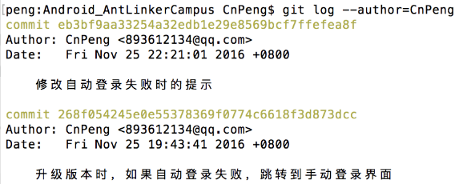

### 1.8.7. `git log -- commitor=用户名`

如：`git log --commitor=CnPeng`  就会展示出CnPeng这个用户的提交历史。注意：这里的用户名，是初始化git 时传入的name . 效果图参考上面的author图

### 1.8.8. `git log --since=时间`

如：`git log --since=1days`  , 表示，展示1天前的提交历史，具体的时间取值，可以有如下格式： xxxdays , xxxweeks ,  2016-11-25 ， 或 2 years 1 day 3 minutes ago ，效果图如下：

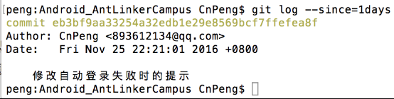

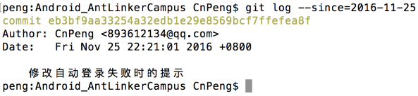

**另外，除了可以使用 `--since` , 也可以使用 `-- after` , `--until` , `--before` ， 取值方式相同** 

- 也可以使用如下这种组合模式：

`git log --pretty="%h - %s" --author=gitster --since="2008-10-01" \ --before="2008-11-01" --no-merges -- t/`

上面的组合模式中，%h , %s 是占位符， 详细的占位符以及含义如下：

* `%H`	提交对象（commit）的完整哈希字串
* `%h`	提交对象的简短哈希字串
* `%T`	树对象（tree）的完整哈希字串
* `%t`	树对象的简短哈希字串
* `%P`	父对象（parent）的完整哈希字串
* `%p`	父对象的简短哈希字串
* `%an`	作者（author）的名字
* `%ae`	作者的电子邮件地址
* `%ad`	作者修订日期（可以用 -date= 选项定制格式）
* `%ar`	作者修订日期，按多久以前的方式显示
* `%cn`	提交者(committer)的名字
* `%ce`	提交者的电子邮件地址
* `%cd`	提交日期
* `%cr`	提交日期，按多久以前的方式显示
* `%s`	提交说明


[参考链接：https://git-scm.com/book/zh/v1/Git-%E5%9F%BA%E7%A1%80-%E6%9F%A5%E7%9C%8B%E6%8F%90%E4%BA%A4%E5%8E%86%E5%8F%B2](https://git-scm.com/book/zh/v1/Git-%E5%9F%BA%E7%A1%80-%E6%9F%A5%E7%9C%8B%E6%8F%90%E4%BA%A4%E5%8E%86%E5%8F%B2)

### 1.8.9. 修改最后一次提交的描述

使用 `git commit --amend` 进入 vim 编辑器，然后修改并保存即可。


## 1.9. 查看修改内容

### 1.9.1. 查看修改了哪些文件

#### 1.9.1.1. 查看每个提交记录中修改了哪些文件

```bash
git log --name-only
```

 仅在默认格式后面展示已经修改的文件，如下图：

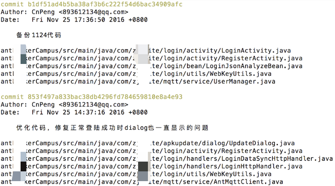
 

#### 1.9.1.2. 查看某次提交中修改了哪些文件

```bash
git log --name-only <commit-hash>
```

将 `<commit-hash>` 替换为您要查看的提交记录的哈希值即可，如：


### 1.9.2. 查看已提交的文件中修改了哪些内容

命令 | 含义
---|---
`git log <file>` | 查某个文件的提交记录
`git log -p <file>` | 查某个文件的提交记录及每次提交的变更内容
`git show <commit-hash> <file>` | 查某次提交中某个文件的变更内容


### 1.9.3. 查看未提交的文件中修改了哪些内容

如果修改了文件，但还没有提交，可以通过 `git diff` 查看文件中修改了哪些内容。

命令 | 含义
---|---
`git diff`  | 查看全部未提交的变更
`git diff <file>` | 查看某个文件未提交的变更内容
`git diff HEAD <file>` | 显示指定文件中暂未提交的变更内容与最近一次提交的差异
`git diff --cached <file>` | 显示指定文件中暂未提交的变更内容与最近一次提交的差异，同时忽略未跟踪的文件

