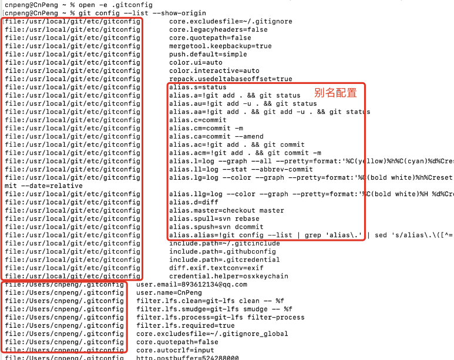
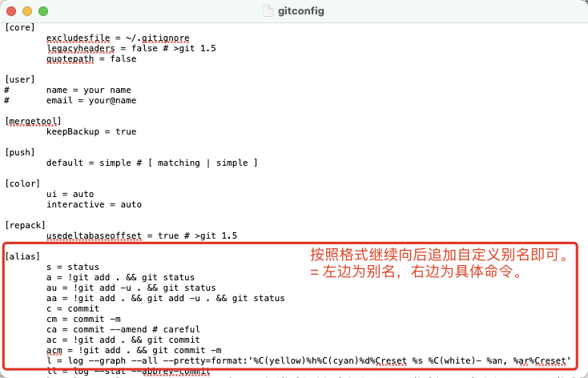
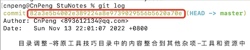

# 1. 为git命令创建别名

## 1.1. 别名及其用途

别名，就是给原有的名字再起一个名字。

为 git 命令配置别名，可以减少我们在终端中使用 git 命令时的字符输入量。

比如，我们想查看当前 git 的全局配置信息，就需要在终端中输入 ：`git config --global -l` 。如果我们为命令 `config --global -l` 起一个别名为 `cgl` ，则仅需要在终端中输入 `git cgl`。两个命令执行的效果是一致的。


## 1.2. 如何创建

> 后续操作均以 mac 系统为例。

### 1.2.1. 查找配置文件

在不同的操作系统中，git 的配置信息的存放目录也不一致。

通常情况下，

* mac 系统会存放在 `~/.gitconfig` （对当前用户生效）或 `/usr/local/git/ect/gitconfig` （对系统中所有用户生效）文件中 ；
* Windows 系统则在  `$HOME` 目录下（一般情况下是 `C:\Users\$USER` ）的 `.gitconfig` 文件中（对当前用户生效），或者 `C:\ProgramData\Git\config` 文件中（对系统中所有用户生效）。

> * 还有仅对当前代码项目生效的配置，存放在项目中的 `.git` 目录中。
> * 按照 [《起步 - 初次运行 Git 前的配置》](https://git-scm.com/book/zh/v2/%E8%B5%B7%E6%AD%A5-%E5%88%9D%E6%AC%A1%E8%BF%90%E8%A1%8C-Git-%E5%89%8D%E7%9A%84%E9%85%8D%E7%BD%AE) 中的说明，作用范围低的会覆盖作用范围高的，也就是说，项目中 `.git` 目录下的配置会覆盖用户级别的配置，用户级别的配置会覆盖系统级别的配置。

我们可以使用 `git config --list --show-origin` 命令查看现有的配置及其所在文件（即 gitconfig 文件）的位置：



在上图中，我们会发现，git 的配置信息同时存在于 `/Users/cnpeng/.gitconfig` （即 `~/.gitconfig`）和 `/usr/local/git/etc/gitconfig` 文件中。以 `alias.` 开头的内容就是为 `=` 后面的 git 命令定义的别名。

### 1.2.2. 打开并编辑配置文件

接下来，我们在终端中输入 `open -e /usr/local/git/etc/gitconfig` 直接打开包含别名信息的配置文件，然后参照现有格式继续追加自定义的别名即可。



编辑完成之后，直接保存-退出即可。

> * `open -e` 命令打开的文件，允许我们像编辑普通的 word 文件一样快速编辑、保存、退出。
> * 我们也可以使用 `vim /usr/local/git/etc/gitconfig` 来打开文件，但这种方式要求我们必须先熟悉 vim 命令的操作。

## 1.3. 别名示例

### 1.3.1. 示例1

```sh
[alias]
	s = status
	a = !git add . && git status
	au = !git add -u . && git status
	aa = !git add . && git add -u . && git status
	c = commit
	cm = commit -m
	ca = commit --amend # careful
	ac = !git add . && git commit
	acm = !git add . && git commit -m
	l = log --graph --all --pretty=format:'%C(yellow)%h%C(cyan)%d%Creset %s %C(white)- %an, %ar%Creset'
	ll = log --stat --abbrev-commit
	lg = log --color --graph --pretty=format:'%C(bold white)%h%Creset -%C(bold green)%d%Creset %s %C(bold green)(%cr)%Creset %C(bold blue)<%an>%Creset' --abbrev-commit --date=relative
	llg = log --color --graph --pretty=format:'%C(bold white)%H %d%Creset%n%s%n%+b%C(bold blue)%an <%ae>%Creset %C(bold green)%cr (%ci)' --abbrev-commit
	d = diff
	master = checkout master
	spull = svn rebase
	spush = svn dcommit
	alias = !git config --list | grep 'alias\\.' | sed 's/alias\\.\\([^=]*\\)=\\(.*\\)/\\1\\\t => \\2/' | sort
```

### 1.3.2. 示例2

```sh
[alias]
	s = status
	ck = checkout
	ckb = checkout -b
	br = branch
	ps = push
	psom = push origin master
	pl = pull
	plom = pull origin master
	mg = merge
	a = add .
	cm = commit -m
	acm = !git add . && git commit -m
	df = diff
	rmt = remote
	rmtv = remote -v
	cmamne = commit --amend --no-edit
	cmam = commit --amend
	lg = log
	lg1 = log -1
	lg2 = log --color --graph --pretty=format:'%Cred%h%Creset -%C(yellow)%d%Creset %s %Cgreen(%cr) %C(bold blue)<%an>%Creset' --abbrev-commit
	cgl = config --global -l
	rmch = rm --cached
	rsth = reset --hard
```

### 1.3.3. 命令解析

上述两个示例中，部分命令的含义如下：

命令 | 说明
---|---
`checkout -b` | 创建并切换到分支。<br>后面跟要创建的分支名。
`!git add . && git commit -m` | 把所有变更的文件添加到暂存处并提交 ，<br>等价于 `git add .` 和 `git commit -m`。<br> 也等价于 `git commit -a -m` ( 第一次要先执行 `git add .` , 以后就不需要了。)
`commit --amend` | 修改最后一次的提交描述。<br> 后面跟上新的描述信息。
`commit --amend --no-edit` | 将更改的内容追加到最后一次提交中，且不修改提交描述。
`log -l` | 查看最后一次提交记录。
`config --global -l` | 查看配置信息
`rm --cached` | 将文件从暂存区移除，不再追踪其变更。<br> 如果移除单个文件，命令后需要跟上完整的文件路径；<br> 如果移除目录，命令后的内容格式为 `完整的目录路径/*` 。<br>更多 rm 命令可参考：[git-rm](https://git-scm.com/docs/git-rm) <br>`git ls-files` 可以查看暂存区中的内容。
`reset --hard` | 重置内容到某次提交。<br> 后面跟提交记录的 hash 值，如果后面没有 hash 值则表示恢复到最后一次提交。

下图中，`commit` 后面圈出来的内容就是提交记录的 hash 值。



我们在 `reset --hard` 命令后面只需要跟上前半部分（不少于 7 位）的 hash 值即可，不需要全部复制。其他需要 hash 值的命令同理。

## 1.4. 附录

### 1.4.1. 参考

* [《起步 - 初次运行 Git 前的配置》](https://git-scm.com/book/zh/v2/%E8%B5%B7%E6%AD%A5-%E5%88%9D%E6%AC%A1%E8%BF%90%E8%A1%8C-Git-%E5%89%8D%E7%9A%84%E9%85%8D%E7%BD%AE)

### 1.4.2. 其他添加方式

除上述添加别名方式之外，我们还可以参考 [《Git 基础 - Git 别名》](https://git-scm.com/book/zh/v2/Git-%E5%9F%BA%E7%A1%80-Git-%E5%88%AB%E5%90%8D) 通过终端直接执行添加别名的命令。如：

`git config --global alias.br branch`

上述命令中，

* 指定了 `branch` 的别名为 `br`。
* `--global` 指定了将配置信息添加到用户级别的 `~/.gitconfig` （Windows 为 `C:\Users\$USER\.gitconfig`）中。如果想要存放到系统级别的配置文件中，可以将其替换为 `--system`

这种方式虽然省去了查找配置文件所在位置的步骤，但需要逐条添加，效率不高，不建议使用。


