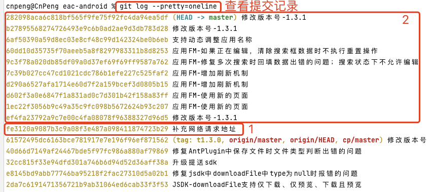
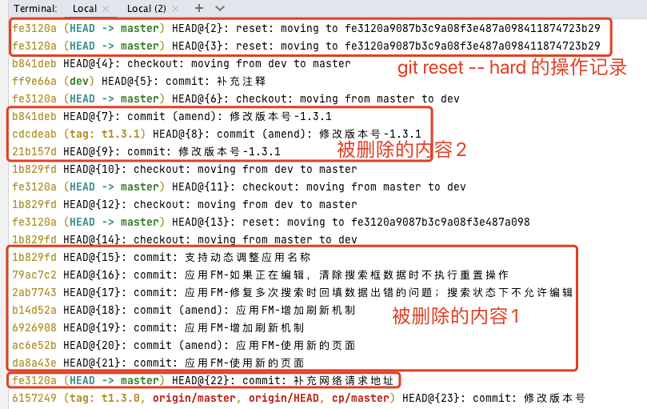
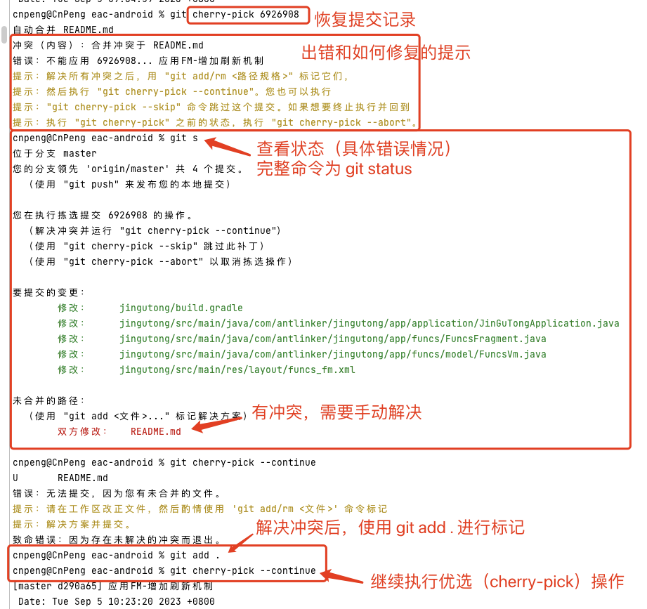
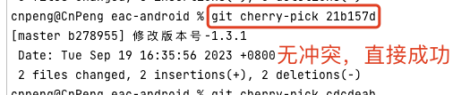
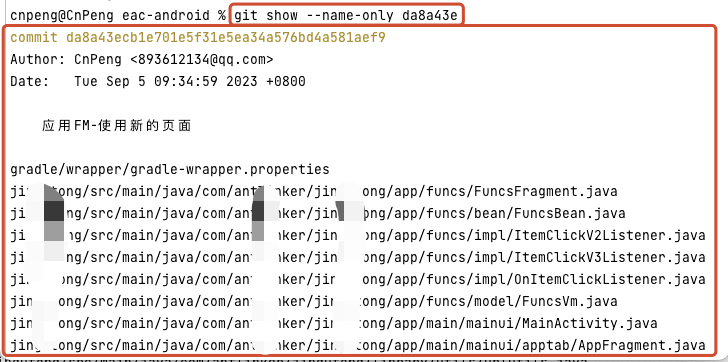

# 1. 恢复rest---hard删除的内容

## 1.1. 问题现象

在操作 git 时发生误操作，使用 `git reset --hard xxx` 就代码回退到了之前的某次提交（ xxx 为提交记录的  SHA-1 哈希值）。

以下图为例，我们不小心误操作将代码回退到了 `fe3120a9087b3c9a08f3e487a098411874723b29 补充网络请求地址` 处，那么 2 处的代码就都被删除了，我们希望将被删除的内容恢复回来。

> 在提交记录 `fe3120a9087b3c9a08f3e487a098411874723b29 补充网络请求地址` 中 `fe3120a...23被9` 这一串字符串就是  SHA-1 哈希值，使用时通常仅取前 7 位。





## 1.2. 解决步骤

### 1.2.1. 查看引用日志

在终端执行 `git reflog`，该命令可以展示所有 HEAD 和分支引用的日志。我们可以查看该日志以找到您所需的提交的 SHA-1 哈希值。

如下图：我们能够明确的看到 git 的整个操作日志，从中就可以分析中哪些内容被删除了：




### 1.2.2. 恢复丢失的提交

执行 `git cherry-pick SHA-1哈希值` 即可恢复丢失的提交记录。

比如，我们要恢复前一幅图中 SHA-1 哈希值为 `6926908` 的提交记录，我们就需要执行如下面命令：  

```bash
git cherry-pick 6926908
```



上图是一个有冲突的情况，步骤略微复杂一些。

如果没有冲突，仅需要执行 `` 即可，如下：



### 1.2.3. 恢复被删除的文件

如果我们不想恢复整个提交记录，而只是想恢复提交记录中的某些文件，那么，我们首先找到该提交记录对应的 SHA-1 哈希值，

然后基于该 SHA-1 哈希值 查看其中修改的文件：

`git show --name-only SHA-1哈希值`



然后再通过 `git checkout 文件1 文件2` 检出文件，多个文件之间使用空格进行分割：

如 ：

```bash
git checkout file1.txt file2.txt
```
