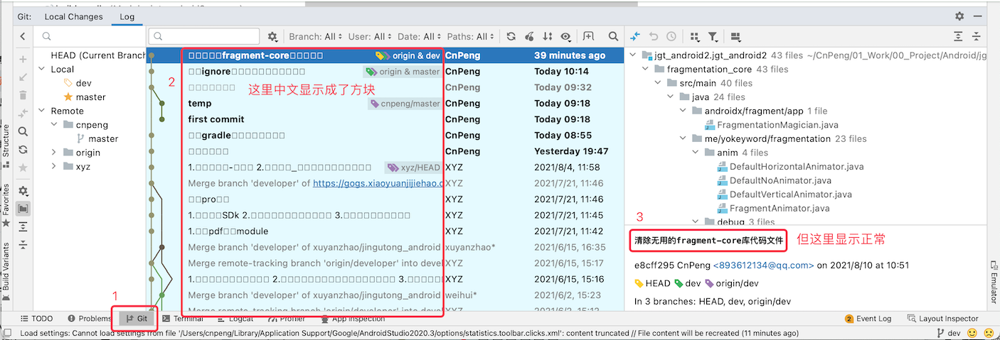
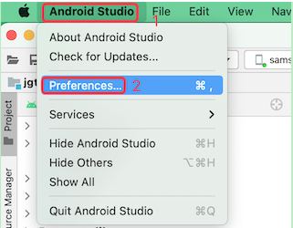
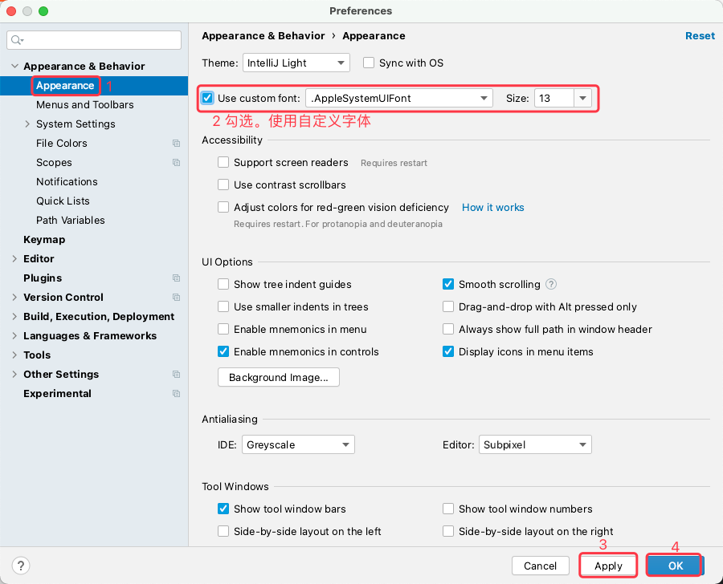

# 1. 39-AS的ArcticFox2020.3.1版本中git面板提交日志中的中文显示方块

AS 版本：Artic Fox | 2020.3.1  

## 1.1. 问题现象

MAC 电脑更新 AndroidStudio 到 ArticFox 2020.3.1 之后，git 面板中的中文显示成了方块，如下：

## 1.2. 解决方案

在 Preferences 中勾选 `Use custom font` ，然后点击 `Apply` 应用即可。

