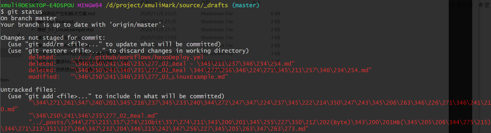

# 1. git提交记录中显示数字

## 1.1. 背景

将 Mac 系统中的项目拷贝到 Windows 中运行时，使用 `git log` 查看提交记录时，提交描述中的中文文本都变成了字节码中对应的数字。如下：



## 1.2. 问题原因

在 Mac 电脑中添加 git 提交描述时使用的是 `UTF-8` 编码集，但是在 windows 解码显示时系统使用的却是 `gbk` 编码，所以会显示数字。

[参考文章：《乱码原因产生和解决方案》](https://xmuli.blog.csdn.net/article/details/109567352)

## 1.3. 解决方案

在命令行中执行：

```git
 git config --global core.quotepath false
```

执行完成之后，重启命令行工具，再次 查看即可正常。

## 1.4. 参考

* [《Git Bash 在win10 显示中文为数字的解决方案》](https://blog.csdn.net/qq_33154343/article/details/109567337)
* [《乱码原因产生和解决方案》](https://xmuli.blog.csdn.net/article/details/109567352)