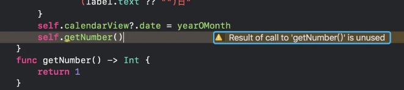
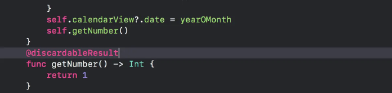
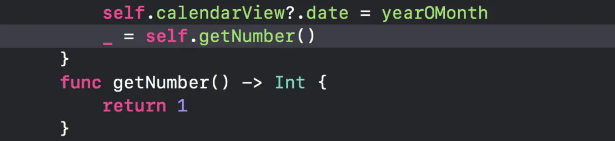

[原文链接：《iOS-Swift-@discardableResult的作用》](https://www.jianshu.com/p/af2f062b3d89)

当有返回值的方法未得到接收和使用时通常会出现图片中的提示：

在正式编译中不会影响编译结果，但是也妨碍代码的美观整洁，在方法上加上 `@discardableResult` 就可以取消这个警告

还有一种取消警告的方法，不加 `@discardableResult` 直接加通配符接收方法返回值

