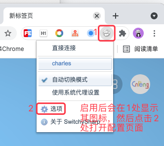
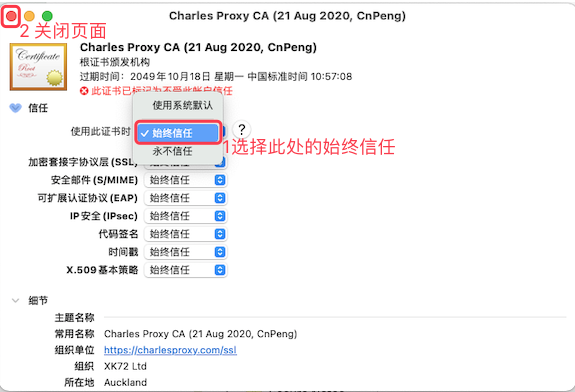

# 1. 9-Charles对Chrome浏览器抓包

Charles 和 switchy sharp 配合，可以对 Chrome 进行抓包。

本文以 Mac 电脑中的配置为例，介绍如何实现抓包。（Windows 中操作基本一致）

## 1.1. 安装 Charles

可根据自己的电脑下载对应的版本：[点击下载 Charles](https://www.charlesproxy.com/download/)

## 1.2. 安装 switchy sharp

如果可以访问 Chrome 应用商店，直接在商店中搜索并下载即可。

如果无法访问 Chrome 应用商店，可以在 [https://www.crx4chrome.com](https://www.crx4chrome.com/crx/543/) 网站中下载，如下图：

下载完成后，打开 Chrome 浏览器的扩展程序管理页面，如下图：

将本地下载的扩展插件托拽到已经打开的扩展程序管理页面即可完成安装，如下图：

## 1.3. 配置 Charles

## 1.4. 配置 switch sharp

在 Chrome 浏览器的 `扩展程序管理` 页面中找到 switch sharp ，然后开启并进行配置，步骤如下：

点击上图的 2 处之后，会打开下图中的页面，然后按照下图配置即可，配置完成之后 `保存`

如上图，选中我们新增的代理配置之后，所有的页面访问都会先经过 `switch sharp`

## 1.5. charles 中增加抓包站点

在 charles 中增加需要抓包的站点，步骤如下：

此时，访问 csdn 博客中的页面时，即可从 charles 中看到相关信息，如下图：

## 1.6. https 站点抓包乱码问题

### 1.6.1. 问题现象

在对 https 页面进行抓包时，可能会出现下图中的 `unknown` 或者乱码情况:

### 1.6.2. 原因和解决方案

原因：没有将 Charles 的根证书添加到信任列表中。

解决方案：安装 Charles 根证书，并将其添加到信任列表中，具体步骤如下： 

从系统的 `启动台` 中找到 `钥匙串` 应用：

然后双击打开，找到对应的证书，然后按照下图操作：

在上图中，选择 `始终信任` 之后，点击左上角的关闭按钮关闭页面，然后就会出现下图中的密码输入框：

点击上图中的 `更新设置` 之后，可能界面上还是会看到 `此证书已标记为不受此账户信任` 的提示，此时，我们退出 `钥匙串` 应用（退出快捷键 `cmd+q`），重新打开之后即可正常，如下图：

## 1.7. 相关参考

[charles浏览器抓包https_抓包工具Charles的使用教程](https://blog.csdn.net/weixin_35949064/article/details/112238722)
