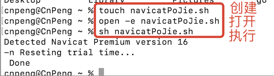

# 1. 015-Mac版Navicat无限试用方案

原文：[Mac版本 Navicat16无限试用方案](https://www.52pojie.cn/thread-1669993-1-1.html)

```bash
#!/bin/bash
 
set -e
 
file=$(defaults read /Applications/Navicat\ Premium.app/Contents/Info.plist)
 
regex="CFBundleShortVersionString = \"([^\.]+)"
[[ $file =~ $regex ]]
 
version=${BASH_REMATCH[1]}
 
echo "Detected Navicat Premium version $version"
 
case $version in
    "16")
        file=~/Library/Preferences/com.navicat.NavicatPremium.plist
        ;;
    "15")
        file=~/Library/Preferences/com.prect.NavicatPremium15.plist
        ;;
    *)
        echo "Version '$version' not handled"
        exit 1
       ;;
esac
 
echo -n "Reseting trial time..."
 
regex="([0-9A-Z]{32}) = "
[[ $(defaults read $file) =~ $regex ]]
 
hash=${BASH_REMATCH[1]}
 
if [ ! -z $hash ]; then
    defaults delete $file $hash
fi
 
regex="\.([0-9A-Z]{32})"
[[ $(ls -a ~/Library/Application\ Support/PremiumSoft\ CyberTech/Navicat\ CC/Navicat\ Premium/ | grep '^\.') =~ $regex ]]
 
hash2=${BASH_REMATCH[1]}
 
if [ ! -z $hash2 ]; then
    rm ~/Library/Application\ Support/PremiumSoft\ CyberTech/Navicat\ CC/Navicat\ Premium/.$hash2
fi
 
echo " Done"
```

切换到某个目录中，然后在该目录下创建一个后缀名为 `.sh` 的文件。打开文件，将上述内容复制到文件中，保存并关闭文件。在终端中切换到文件所在目录，通过 `sh 文件名.sh` 执行该文件。

