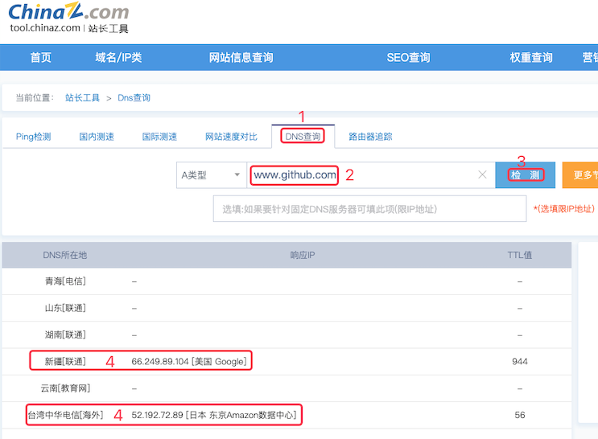

# 1. 11-github无法打开的解决

原文链接：[Github无法访问解决办法](https://blog.csdn.net/ccllcaochong1/article/details/114176713)

## 1.1. 获取 github 可用的 dns 域名


打开 [http://tool.chinaz.com/](http://tool.chinaz.com/dns?type=1&host=www.github.com&ip=) 中的 DNS 查询页面，在输入框中输入 www.github.com，然后检测：



## 1.2. 修改 hosts

### 1.2.1. Windows 修改

在 `C:\Windows\System32\drivers\etc\hosts` 文件中加入

```
66.249.89.104  www.github.com
```

注意，上述内容中，前面一段是我们在第一步中检测到的可用的 ip ， 后面是 github 网站的地址。

### 1.2.2. Mac 修改

参考 [12-Mac修改host](12-Mac修改host.md)

## 1.3. 访问

经过前两步操作之后，即可正常的访问 www.github.com 网站了

