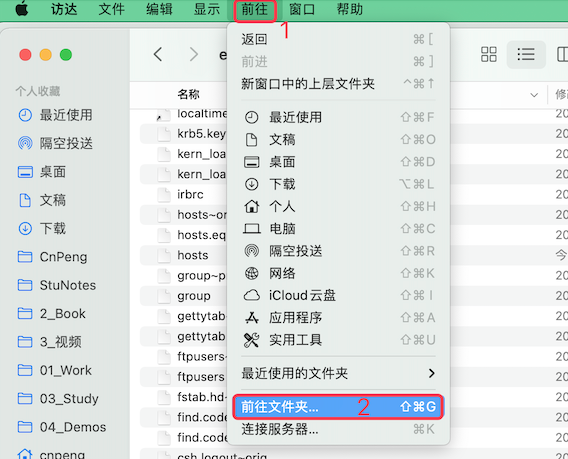
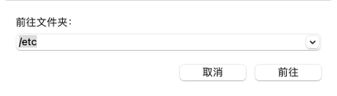
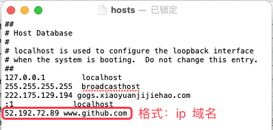

# 1. 12-Mac修改host

## 1.1. 查找 hosts 文件

通过 访达 打开任意文件夹，然后按照下图操作：

如下图输入 `/ect`，然后点击 前往

## 1.2. 修改 hosts 

在打开的 etc 目录中，找到 hosts 文件，然后将其拖拽（复制）到桌面或其他任意目录。

用 `文本编辑器` 或其他软件打开刚才复制出来的 hosts 副本，然后在其中输入我们需要添加的 ip 和 对应的域名，如下图：

编辑完成后，将副本拖拽（复制）到 etc 目录中，替换原有的 hosts 文件。

替换过程中会要求输入系统登录密码，输入密码并确认之后，hosts 修改完成。

