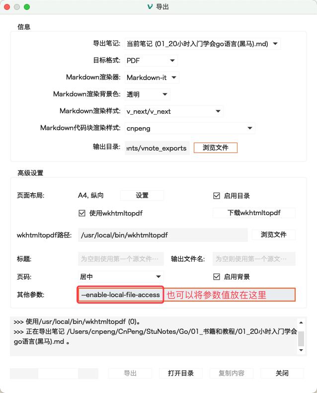

# 1. VNote 问题整理

## 1.1. 1.导出时启用 wkhtmltopdf

[点击下载 wkhtmltopdf](https://wkhtmltopdf.org/downloads.html)

作用是将 md 文件导出为 pdf ，本质上是先转为 html , 然后转为 pdf。启用之后可以生成 pdf 目录。


如上图，第一次使用时，需要先点击 1 处的按钮去下载并安装。

安装完成后，将  `wkhtmltopdf路径` 指向 `wkhtmltopdf` 可执行程序的存储路径，Mac 上查看该路径的方法是：在命令行中执行 `which wkhtmltopdf` 。（参看：[where is wkhtmltopdf](https://github.com/tamlok/vnote/issues/1043)）


## 1.2. 使用 wkhtmltopdf 导出时报错

### 1.2.1. 报错信息和原因

报错信息为包含如下关键字：

```
Failed to load about:blank, with network status code 301 and http status code 0

Exit with code 1 due to network error: ProtocolUnknownError
```

原因是：没有访问本地文件的权限

### 1.2.2. Mac 端解决方案1


然后重启 vnote , 此时，再执行导出，即可正常

参数内容为： `--enable-local-file-access`

### 1.2.3. 解决方案2

导出时，直接将参数填写到：`其他参数` 的框中




## 1.3. 2.自定义代码块的样式

参考：[能否自定义代码块的字体大小](https://github.com/tamlok/vnote/issues/1323)

下载 [highlighjs](https://github.com/highlightjs/highlight.js)并解压

点击下图菜单栏中`添加样式`：


然后将 `src/styles` 目录中的 `.css` 文件拷贝到打开的 `codeblock_styles` 目录下，然后重启 VNote。

重启之后，再次点击上图中的 `添加样式`, 此时即可以选择我们想要的样式了。