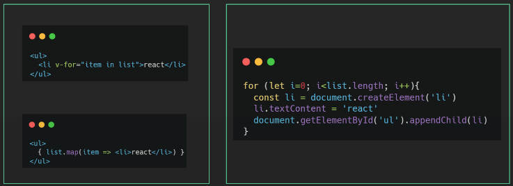
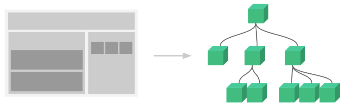
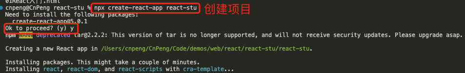
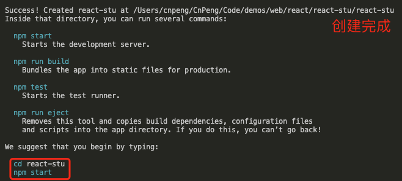
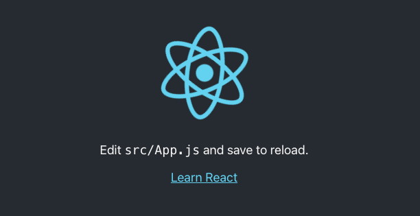
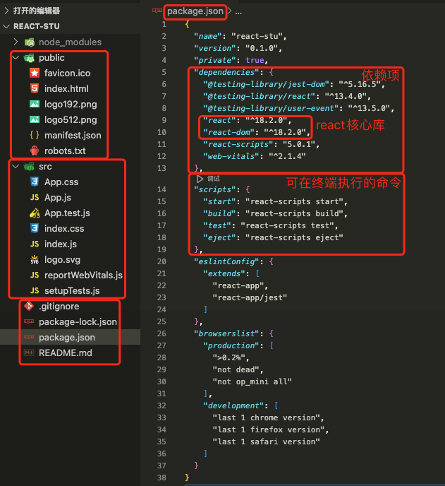
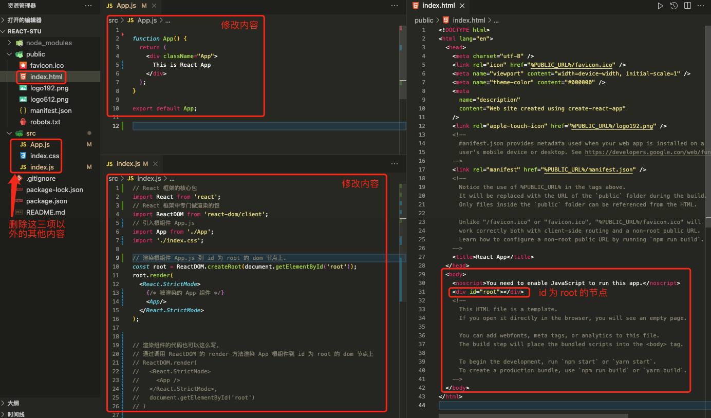
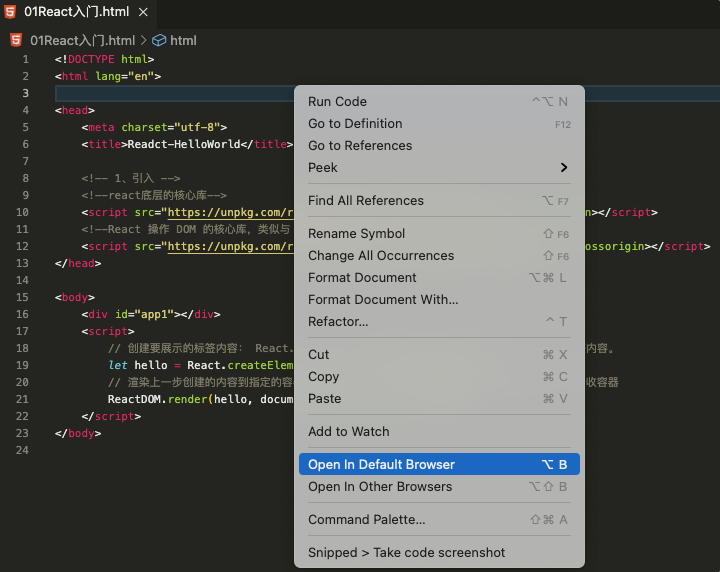
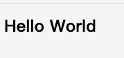

# 1. 001-React介绍

>2022-02-06 周一
>
>本系列内容基于 B 站 [React入门到实战(2022全网最新）](https://www.bilibili.com/video/BV1Z44y1K7Fj/?spm_id_from=333.788.recommend_more_video.0&vd_source=52532367532c4237b88b472159331d19) 、 [React中文文档](https://zh-hans.reactjs.org/docs/getting-started.html#learn-react) 、[React Beta文档](https://beta.reactjs.org/learn)整理。
> 
> 视频内容技术栈基于：React + Hook + React-router-v6 + Mobx + AntD，视频配套资源如下：
> * 源码地址：[https://gitee.com/react-cp/react-pc-code](https://gitee.com/react-cp/react-pc-code)
> * React基础讲义: [https://www.yuque.com/fechaichai/qeamqf/xbai87](https://www.yuque.com/fechaichai/qeamqf/xbai87)
> * React和Mobx讲义: [https://www.yuque.com/fechaichai/qeamqf/apomum](https://www.yuque.com/fechaichai/qeamqf/apomum)
> * ReactPc项目讲义: [https://www.yuque.com/fechaichai/tzzlh1](https://www.yuque.com/fechaichai/tzzlh1)
>     * 运行该项目时：先拉取到本地，然后通过命令 `yarn` 安装依赖，再然后通过 `yarn start` 运行项目。
>
>可以通过 [JavaScript 教程](https://developer.mozilla.org/zh-CN/docs/Web/JavaScript/Language_Overview) 查看 JavaScript 相关知识。
> 前端三大框架：React、Vue、Angular

React 是一个用于构建用户界面的  JavaScript 库。

React 的核心是封装可复用性高的组件，各个组件维护自己的状态和UI，当状态变更，自动重新渲染整个组件。


## 1.1. React 的特点

### 1.1.1. 声明式UI（JSX）

写 UI 就和写普通的 HTML 一样，抛弃命令式的繁琐实现




### 1.1.2. 组件化

组件是 react 中最重要的内容，组件可以通过搭积木的方式拼成一个完整的页面，通过组件的抽象可以增加复用能力和提高可维护性 



### 1.1.3. 跨平台

react 既可以开发 web 应用也可以使用同样的语法开发原生应用（react-native），比如安卓和 ios 应用，甚至可以使用 react 开发 VR 应用，想象力空间十足，react 更像是一个 `元框架`  为各种领域赋能。


## 1.2. 环境搭建

### 1.2.1. 创建项目

官方文档：[《创建新的 React 应用》](https://zh-hans.reactjs.org/docs/create-a-new-react-app.html)

在创建 React 项目之前需要先安装 [Node 和 npm](https://nodejs.org/en/)，然后在命令行中执行如下命令：

```bash
npx create-react-app my-app
cd my-app
npm start
```

上述命令中，

* 第一行的 `npx` 不是拼写错误 —— 它是 [npm 5.2+ 附带的 package 运行工具](https://medium.com/@maybekatz/introducing-npx-an-npm-package-runner-55f7d4bd282b)。`create-react-app` 是 React 脚手架的名称，末尾的 `my-app` 为项目名称。该命令表示创建一个名为 `my-app` 的项目。
* 第二行 `cd my-app` 表示切换到项目的根目录
* 第三行 `npm start` 表示基于开发模式运行。如需构建生产版本，需执行 `npm run build` 命令。（也可以使用 yarn 命令）





在命令行中执行 `npm start` 或 `yarn start` 之后，将会自动在浏览器中打开新页签，并看到如下界面内容：



### 1.2.2. 目录结构

#### 1.2.2.1. 目录说明

通过前一小节的 `npx create-react-app 项目名` 命令创建项目之后，其目录结构如下：



其中：

* `src` 目录是我们写代码进行项目开发的目录
* `package.json`  中俩个核心库：`react`、`react-dom`

#### 1.2.2.2. 目录调整 

为了便于后续开发，我们需要调整目录内容

* 删除 `src` 目录下自带的所有文件，只保留 `app.js` 、 `index.js` 和 `index.css`
* `index.js` 文件为项目的入口文件，在这个文件中书写 react 代码即可



* `src/index.js`

```vue
// React 框架的核心包
import React from 'react';
// React 框架中专门做渲染的包
import ReactDOM from 'react-dom/client';
// 引入根组件 App.js
import App from './App';
import './index.css';

// 渲染根组件 App.js 到 id 为 root 的 dom 节点上.
const root = ReactDOM.createRoot(document.getElementById('root'));
root.render(
  <React.StrictMode>
    {/* 被渲染的 App 组件 */}
    <App/>
  </React.StrictMode>
);


// 渲染组件的代码也可以这么写。
// 通过调用 ReactDOM 的 render 方法渲染 App 根组件到 id 为 root 的 dom 节点上
// ReactDOM.render(
//   <React.StrictMode>
//     <App />
//   </React.StrictMode>,
//   document.getElementById('root')
// )
```

* `src/App.js`

```vue

function App() {
  return (
    <div className="App">
      This is React App
    </div>
  );
}

export default App;
```

## 1.3. 补充：其他使用方式

### 1.3.1. 使用基础

在使用 React 前需要先引入 react 的依赖：

```js
<!-- 加载 React。-->
<!-- 注意: 部署时，将 "development.js" 替换为 "production.min.js"。-->

<!--react底层的核心库-->
<script src="https://unpkg.com/react@18/umd/react.development.js" crossorigin></script>
<!--React 操作 DOM 的核心库，类似与 jquery-->
<script src="https://unpkg.com/react-dom@18/umd/react-dom.development.js" crossorigin></script>
<!--用于解析ES6语法.如果仅使用 ES5 语法，可不添加这一句-->
<script src="https://unpkg.com/babel-standalone@6/babel.min.js"></script>
```

基础语法：

```react
React.createElement() // 创建元素
React.Component // 创建组件，使用 extends 继承
ReactDOM.render() // 渲染元素
```

### 1.3.2. 示例

> 基于 Visual Studio Code , 在开始前需要先安装 `open in browser` 插件，安装之后，在 html 文件的右键菜单中才会有 `open in default browser` 选项。

```html
<!DOCTYPE html>
<html lang="en">

<head>
    <meta charset="utf-8">
    <title>Readct-HelloWorld</title>

    <!-- 1、引入 -->
    <!--react底层的核心库-->
    <script src="https://unpkg.com/react@18/umd/react.development.js" crossorigin></script>
    <!--React 操作 DOM 的核心库，类似与 jquery-->
    <script src="https://unpkg.com/react-dom@18/umd/react-dom.development.js" crossorigin></script>
</head>

<body>
    <div id="app1"></div>
    <script>
        // 创建要展示的标签内容： React.createElement 接收三个参数：标签名，标签属性，标签内容。
        let hello = React.createElement('h1', {}, 'Hello World')
        // 渲染上一步创建的内容到指定的容器。ReactDOM.render 接收两个参数：要渲染的内容，接收容器
        ReactDOM.render(hello, document.getElementById('app1'))
    </script>
</body>
```

在文件内部右击，然后选择 `Open In Default Browser`:



运行效果：




