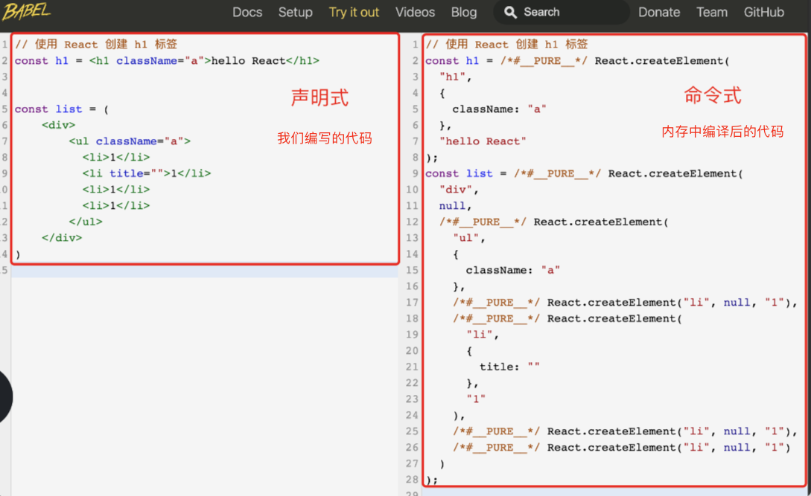
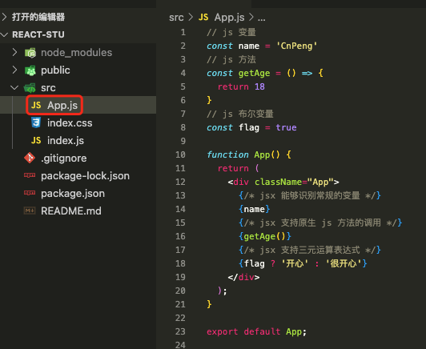
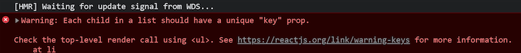
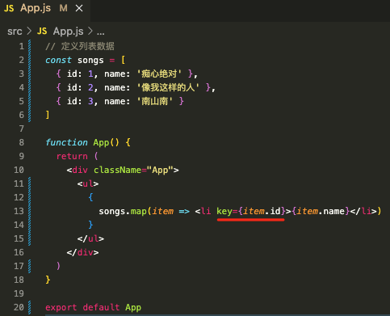
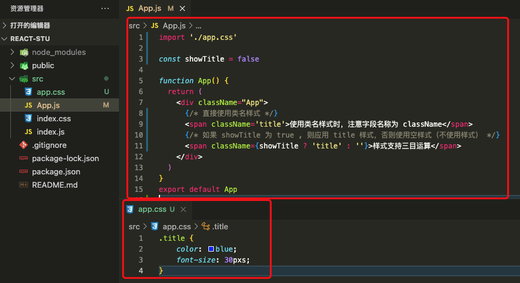
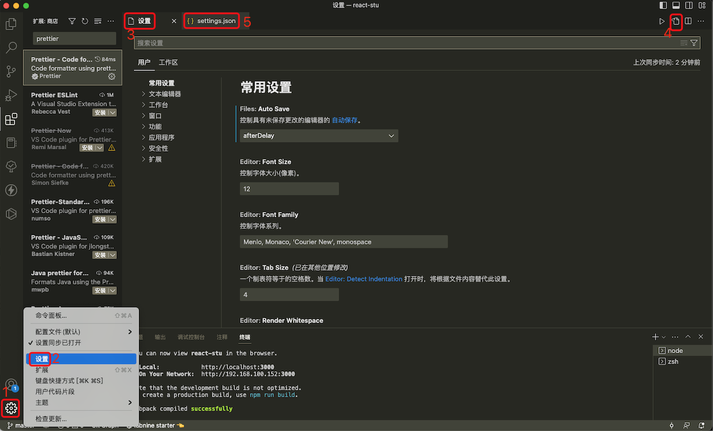
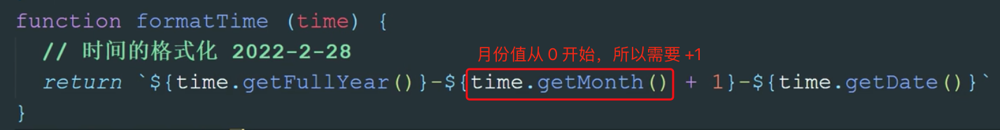
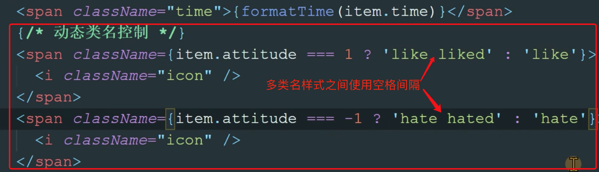
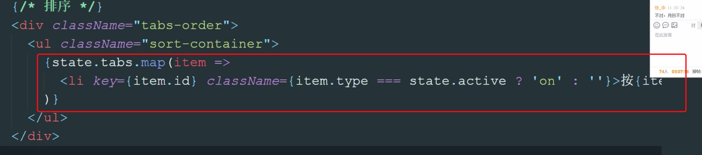

# 1. 002-JSX

> 2022-02-07 周二

[《文档-JSX简介》](https://zh-hans.reactjs.org/docs/introducing-jsx.html)


## 1.1. JSX介绍

目标任务:   能够理解什么是 JSX，JSX 的底层是什么

* 概念：JSX 是 `JavaScript XML`（HTML）的缩写，表示在 JS 代码中书写 HTML 结构
* 作用：在 React 中创建 HTML 结构（页面 UI 结构）
* 优势：
    * 采用类似于 HTML 的语法，降低学习成本，会 HTML 就会 JSX
    * 充分利用 JS 自身的可编程能力创建 HTML 结构

注意：JSX 并不是标准的 JS 语法，是 JS 的语法扩展，浏览器默认是不识别的，脚手架中内置的 [@babel/plugin-transform-react-jsx](https://www.yuque.com/fechaichai/qeamqf/@babel/plugin-transform-react-jsx) 包就是用来解析该语法的。



## 1.2. JSX中使用 js 表达式

目标任务:   能够在 JSX 中使用表达式

### 1.2.1. 语法

`{ JS 表达式 }`

```jsx
const name = 'CnPeng'

<h1>你好，我叫{name}</h1>   //    <h1>你好,我叫CnPeng</h1>
```

### 1.2.2. 可以使用的表达式

* 字符串、数值、布尔值、null、undefined、object（ `[]` / `{}` ）
* `1+2`、`'abc'.split('')`、`['a', 'b'].join('-')`
* `fn()`

### 1.2.3. 特别注意

if 语句、 switch-case 语句、 变量声明语句，这些叫做语句，不是表达式，不能出现在 `{}` 中！！

### 1.2.4. 补充示例



```jsx
const name = 'CnPeng'
const getAge = () => {
  return 18
}
const flag = true

function App() {
  return (
    <div className="App">
      {/* jsx 能够识别常规的变量 */}
      {name}
      {/* jsx 支持原生 js 方法的调用 */}
      {getAge()}
      {/* jsx 支持三元运算表达式 */}
      {flag ? '开心' : '很开心'}
    </div>
  );
}

export default App;
```

## 1.3. JSX 列表渲染

目标任务:   能够在 JSX 中实现列表渲染

页面的构建离不开重复的列表结构，比如歌曲列表，商品列表等，我们知道 vue 中用的是 `v-for` ，react 这边如何实现呢？

### 1.3.1. 渲染列表

使用数组的 `map` 方法。（注意，此处示例中没有为遍历项 `<li>` 条目添加 `key`，为了提升渲染效率需要添加，具体参考下一节的内容。）

```jsx
// 定义列表数据
const songs = [
  { id: 1, name: '痴心绝对' },
  { id: 2, name: '像我这样的人' },
  { id: 3, name: '南山南' }
]

function App() {
  return (
    <div className="App">
      <ul>
        {
          songs.map(item => <li>{item.name}</li>)
        }
      </ul>
    </div>
  )
}

export default App
```

上述代码虽然能渲染出来列表，但在浏览器控制台中会报错，提示我们需要添加 `key` 属性，具体参考下一小节。


### 1.3.2. 注意事项

注意：为了提高列表的渲染效率，需要为遍历项添加 `key` 属性。



* `key` 在 HTML 结构中是看不到的，是 React 内部用来进行性能优化时使用
* `key` 在当前列表中必须是唯一的字符串或者数值（String/Number）
* 如果列表中有像 id 这种的唯一值，就用 id 来作为 `key` 值
* 如果列表中没有像 id 这种的唯一值，就可以使用 `index`（下标）来作为 `key` 值



```jsx
// 定义列表数据
const songs = [
  { id: 1, name: '痴心绝对' },
  { id: 2, name: '像我这样的人' },
  { id: 3, name: '南山南' }
]

function App() {
  return (
    <div className="App">
      <ul>
        {
          songs.map(item => <li key={item.id}>{item.name}</li>)
        }
      </ul>
    </div>
  )
}

export default App
```

## 1.4. JSX条件渲染

目标任务:   能够在 JSX 中实现条件渲染

作用：根据是否满足条件生成 HTML 结构，比如 Loading 效果
实现：可以使用 `三元运算符` 或   `逻辑与(&&)运算符`

```jsx
const flag = true

function App() {
  return (

    <div className="App">
      <div>
        {/* 条件渲染字符串 */}
        {flag ? 'react真有趣' : 'vue真有趣'}
      </div>

      <div>
        {/* 条件渲染标签/组件 */}
        {flag ? <span>this is span</span> : null}
      </div>

      <div>
        {/* 逻辑与运算 && ，当 && 前面为 true 时才会渲染后面的内容 */}
        {flag && <span>逻辑与运算-&&前面为true时会渲染后面的内容</span>}
      </div>

      <div>
        {!flag && <span>逻辑与运算-&&前面为false时不渲染后面的内容</span>}
      </div>
    </div>
  )
}
export default App
```

复杂的多分支逻辑可以抽取为一个函数，然后在模板中调用该函数即可。

```jsx
// app.js

// 将复杂的逻辑抽取为函数，模板中直接调用该函数即可。
const getHTag = (type) => {
  if (type === 1) {
    return <h1>这是 H1 </h1>
  }
  if (type === 2) {
    return <h2>这是 H2 </h2>
  }
  if (type === 3) {
    return <h3>这是 H3 </h3>
  }
}

function App() {
  return (
    <div className="App">
      {getHTag(1)}
      {getHTag(2)}
      {getHTag(3)}
    </div>
  )
}
export default App
```


## 1.5. JSX 样式处理

目标任务:   能够在 JSX 中实现 css 样式处理

### 1.5.1. 行内样式 - style

```jsx
function App() {
  return (
    <div className="App">
      <div style={{ color: 'red',fontSize:'30px' }}>this is a div</div>
    </div>
  )
}

export default App
```

### 1.5.2. 行内样式 - style - 更优写法

```jsx
const styleObj = {
    color:'red',
    fontSize:'30px'
}

function App() {
  return (
    <div className="App">
      <div style={ styleObj }>this is a div</div>
    </div>
  )
}

export default App
```

### 1.5.3. 类名样式-推荐使用



在 `app.css` 文件中定义类名样式： 

```css
.title {
  font-size: 30px;
  color: blue;
}
```

使用类名样式：

```vue
import './app.css'

const showTitle = false

function App() {
  return (
    <div className="App">
      {/* 直接使用类名样式 */}
      <span className='title'>使用类名样式时，注意字段名称为 className</span>
      {/* 如果 showTitle 为 true , 则应用 title 样式，否则使用空样式（不使用样式） */}
      <span className={showTitle ? 'title' : ''}>样式支持三目运算</span>
    </div>
  )
}
export default App
```

## 1.6. JSX 注意事项

目标任务:   掌握 JSX 在实际应用时的注意事项

* JSX 必须有且只有一个根节点，如果没有根节点，可以使用 `<></>`（幽灵节点）替代
* **所有标签必须形成闭合**，成对闭合或者自闭合都可以
* JSX 中的语法更加贴近 JS 语法，**属性名采用驼峰命名法**。 标签的 `class` 属性在 jsx 中要写成 `className` , `for` 要写成 `htmlFor`
* JSX 支持多行（换行），如果需要换行，需使用 `()` 包裹，防止 bug 出现

## 1.7. 完善编辑工具


### 1.7.1. 格式化配置

目标任务:   基于 vscode 配置格式化工具，提高开发效率

* 先安装 vsCode `prettier` 插件
* 打开 `setting.json` 配置文件，如下图：



* 然后修改配置文件 `setting.json` 为如下内容：

```json
{
  "git.enableSmartCommit": true,
  // 修改注释颜色
  "editor.tokenColorCustomizations": {
    "comments": {
      "fontStyle": "bold",
      "foreground": "#82e0aa"
    }
  },
  // 配置文件类型识别
  "files.associations": {
    "*.js": "javascript",
    "*.json": "jsonc",
    "*.cjson": "jsonc",
    "*.wxss": "css",
    "*.wxs": "javascript"
  },
  "extensions.ignoreRecommendations": false,
  "files.exclude": {
    "**/.DS_Store": true,
    "**/.git": true,
    "**/.hg": true,
    "**/.svn": true,
    "**/CVS": true,
    "**/node_modules": false,
    "**/tmp": true
  },
  // "javascript.implicitProjectConfig.experimentalDecorators": true,
  "explorer.confirmDragAndDrop": false,
  "typescript.updateImportsOnFileMove.enabled": "prompt",
  "git.confirmSync": false,
  "editor.tabSize": 2,
  "editor.fontWeight": "500",
  "[json]": {},
  "editor.tabCompletion": "on",
  "vsicons.projectDetection.autoReload": true,
  "editor.fontFamily": "Monaco, 'Courier New', monospace, Meslo LG M for Powerline",
  "[html]": {
    "editor.defaultFormatter": "vscode.html-language-features"
  },
  "editor.fontSize": 16,
  "debug.console.fontSize": 14,
  "vsicons.dontShowNewVersionMessage": true,
  "editor.minimap.enabled": true,
  "emmet.extensionsPath": [
    ""
  ],
  // vue eslint start 保存时自动格式化代码
  "editor.formatOnSave": true,
  // eslint配置项，保存时自动修复错误
  "editor.codeActionsOnSave": {
    "source.fixAll": true
  },
  "vetur.ignoreProjectWarning": true,
  // 让vetur使用vs自带的js格式化工具
  // uni-app和vue 项目使用
  "vetur.format.defaultFormatter.js": "vscode-typescript",
  "javascript.format.semicolons": "remove",
  // // 指定 *.vue 文件的格式化工具为vetur
  "[vue]": {
    "editor.defaultFormatter": "octref.vetur"
  },
  // // 指定 *.js 文件的格式化工具为vscode自带
  "[javascript]": {
    "editor.defaultFormatter": "vscode.typescript-language-features"
  },
  // // 默认使用prettier格式化支持的文件
  "editor.defaultFormatter": "esbenp.prettier-vscode",
  "prettier.jsxBracketSameLine": true,
  // 函数前面加个空格
  "javascript.format.insertSpaceBeforeFunctionParenthesis": true,
  "prettier.singleQuote": true,
  "prettier.semi": false,
  // eslint end
  // react
  // 当按tab键的时候，会自动提示
  "emmet.triggerExpansionOnTab": true,
  "emmet.showAbbreviationSuggestions": true,
  "emmet.includeLanguages": {
    // jsx的提示
    "javascript": "javascriptreact",
    "vue-html": "html",
    "vue": "html",
    "wxml": "html"
  },
  // end
  "[jsonc]": {
    "editor.defaultFormatter": "vscode.json-language-features"
  },
  // @路径提示
  "path-intellisense.mappings": {
    "@": "${workspaceRoot}/src"
  },
  "security.workspace.trust.untrustedFiles": "open",
  "git.ignoreMissingGitWarning": true,
  "window.zoomLevel": 1
}
```

### 1.7.2. 错误检查工具

安装 `Error Lens` 插件，可以实时检查编码中的错误。

## 1.8. 阶段小练习

效果：


练习说明：

* 拉取准备好的项目模块到本地 ，[https://gitee.com/react-course-series/react-jsx-demo](https://gitee.com/react-course-series/react-jsx-demo) 
* 通过 `yarn` 命令安装依赖，
* 依赖安装完成后，通过 `yarn start` 起来项目。(具体命令可在 `package.json` 中查看)
* 按照图示，基于现有代码完成 `评论数据渲染`  `tab内容渲染`  `评论列表点赞和点踩`  三个视图渲染。


具体参考 [视频 P16](https://www.bilibili.com/video/BV1Z44y1K7Fj/?p=16&spm_id_from=pageDriver&vd_source=52532367532c4237b88b472159331d19)






