# 1. 003-React组件基础


## 1.1. 组件概念

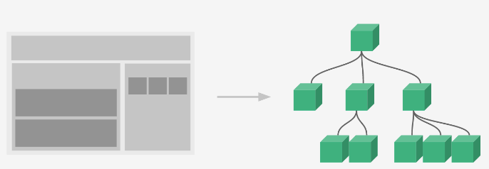

## 1.2. 函数组件

目标任务:   能够独立使用函数完成 react 组件的创建和渲染

概念：**使用 JS 的函数（或箭头函数）创建的组件，就叫做`函数组件`**

### 1.2.1. 组件定义与渲染

```jsx
// 定义函数组件
function HelloFn () {
  return <div>这是我的第一个函数组件!</div>
}

// 渲染函数组件。函数组件的标签可以成对出现，也可以自闭合。
function App () {
  return (
    <div className="App">
      {/* 渲染函数组件 */}
      <HelloFn />
      <HelloFn></HelloFn>
    </div>
  )
}
export default App
```

### 1.2.2. 约定说明

* 关键字 `funcaiton`，以函数的形式声明组件。
* 组件的名称**必须首字母大写**，react 内部会根据这个来判断是组件还是普通的 HTML 标签
* 函数组件**必须有返回值**，表示该组件的 UI 结构；如果**不需要渲染任何内容，则返回 null**
* 组件就像 HTML 标签一样可以被渲染到页面中。组件表示的是一段结构内容，对于函数组件来说，渲染的内容就是是函数的返回值
* 使用函数名称作为组件标签名称，**可以成对出现也可以自闭合**

## 1.3. 类组件

目标任务:   能够独立完成类组件的创建和渲染

概念：使用 ES6 的 `class` 创建的组件，叫做类（class）组件

### 1.3.1. 组件定义与渲染

```jsx
// 引入React
import React from 'react'

// 定义类组件
class HelloC extends React.Component {
  render () {
    return <div>这是我的第一个类组件!</div>
  }
}

function App () {
  return (
    <div className="App">
      {/* 渲染类组件 */}
      <HelloC />
      <HelloC></HelloC>
    </div>
  )
}
export default App
```

### 1.3.2. 约定说明

* 关键字 `class`，以类的形式声明组件。
* 类名称也必须**以大写字母开头**
* 类组件应该继承 `React.Component` 父类，从而使用父类中提供的方法或属性
3. 类组件必须提供 `render()` 方法，且该**方法必须有返回值**，返回值表示该组件的 UI 结构

## 1.4. 函数组件的事件绑定

目标任务:   能够独立绑定任何事件并能获取到事件对象 `e`

### 1.4.1. 如何绑定事件

* 格式：`on事件名称 = { 事件处理程序 } `，比如：`<div onClick={ onClick }></div>`
* 注意：**react 事件采用驼峰命名法**，如：`onMouseEnter`、`onFocus`

示例：

```jsx
// 函数组件
function HelloFn () {
  // 定义事件回调函数
  const clickHandler = () => {
    console.log('事件被触发了')
  }

  return (
    // 绑定事件
    <button onClick={clickHandler}>click me!</button>
  )
}
```

### 1.4.2. 获取事件对象

在事件的回调函数中补充一个形参 `e` 即可获取事件对象（该形参名称可以自定义）：

```jsx
// 函数组件
function HelloFn () {
  // 定义事件回调函数
  const clickHandler = (e) => {
    console.log('事件被触发了', e)
  }

  return (
    // 绑定事件
    <button onClick={clickHandler}>click me!</button>
  )
}
```

### 1.4.3. 传递额外参数

思路: 改造事件绑定为箭头函数，在箭头函数中完成参数的传递

```jsx
import React from "react"

const TestComponent = () => {
  // 定义列表数据
  const list = [
    {
      id: 1001,
      name: 'react'
    },
    {
      id: 1002,
      name: 'vue'
    }
  ]

  // 定义箭头函数形式的回调事件
  const onDel = (e, id) => {
    console.log(e, id)
  }

  return (
      <ul>
        {list.map(item =>（
           <li key={item.id}>
                {item.name}
                <button onClick={(e) => onDel(e, item.id)}>x</button>
           </li>
        ))}
      </ul>
  )
}

function App () {
  return (
    <div>
      <TestComponent />
    </div>
  )
}

export default App
```

总结：

* 无额外参数：`onClick={ onDel }`。默认会填充事件对象作为唯一参数，`onDel` 可接收也可不接收。
* 单一额外参数：`onClick={ () => onDel(id) }`。`onDel` 的方法声明中仅接收一个参数。
* 同时接收事件对象和额外参数：`onClick={ (e) => onDel(e,id) }`。`onDel` 的方法声明中接收两个参数，一个是事件对象 e , 一个是 id。

注意: 在模板中必须使用箭头函数的形式调用回调函数，不能以普通函数的形式调用。错误示例：❌  `onClick = { onDel(id) }`，正确示例：✅  `onClick = { ()=>onDel(id) }`

### 1.4.4. 通过事件对象组织默认行为

```jsx
import React from "react";

function Hello() {
  const preventClick = (e) => {
    // 阻止默认事件
    e.preventDefault();
    console.log("函数组件中的回调被触发了：", e);
  }

  return (
    <>
      <div>
        <a onClick={preventClick} href="https://baidu.com">被阻断的百度链接</a>
      </div>
      <div>
        <a href="https://baidu.com">可跳转的百度链接</a>
      </div>
    </>
  )
}

function App() {
  return (
    <div>
      <Hello />
      {/* 上下两种使用方式都可以。 */}
      {/* <Hello></Hello> */}
    </div>
  )
}

export default App;
```

## 1.5. 类组件的事件绑定

类组件中的事件绑定，整体的方式和函数组件差别不大。唯一需要注意的因为处于 `class` 类语境下，所以事件回调函数的定义方式和调用方式会有不同

* 定义的时候：class Fields语法，即 `变量名=xxx`。
* 使用的时候：需要借助 `this` 关键词获取

```vue
import React from "react"

class CComponent extends React.Component {
  // class Fields——具参箭头函数
  clickHandler = (e, num) => {
    // 这里的 this 指向的是正确的当前的组件实例对象
    // 可以非常方便的通过 this 关键词拿到组件实例身上的其他属性或者方法
    console.log(this)
  }
  // class Fields——空参箭头函数
  clickHandler1 = () => {
    // 这里的 this 指向的是正确的当前的组件实例对象
    // 可以非常方便的通过 this 关键词拿到组件实例身上的其他属性或者方法
    console.log(this)
  }

  // 普通函数
  clickHandler2() {
    // 这里的 this 不指向当前的组件实例对象而指向 undefined。存在this丢失问题
    console.log(this)
  }

  render() {
    return (
      <div>
        <button onClick={(e) => this.clickHandler(e, '123')}>click</button>
        <button onClick={this.clickHandler1}>click1</button>
        <button onClick={this.clickHandler2}>click2</button>
      </div>
    )
  }
}

function App() {
  return (
    <div>
      <CComponent />
    </div>
  )
}

export default App
```

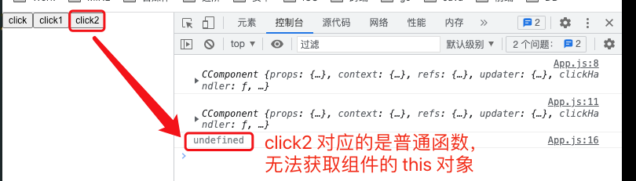


## 1.6. 组件状态

> 函数组件中依赖的数据是通过外部传递进来的，无法在函数组件内声明供交互使用的数据，这种就叫做无状态组件。
> 类组件中，可以声明供交互使用的数据，这些数据就称为状态。因此，类组件是有状态组件。

目标任务:   能够为组件添加状态并修改状态的值

一个前提：**在 React hook 出来之前，函数式组件是没有自己的状态的**。所以在学习 Hook 前，我们基于类组件来学习组件状态。

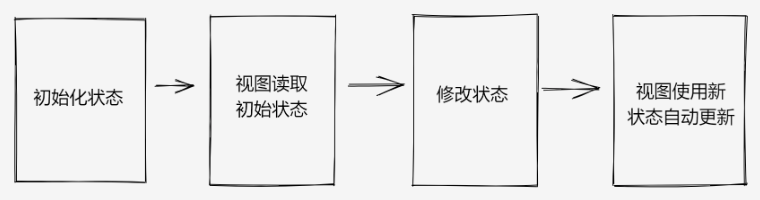

### 1.6.1. 初始化状态

* 通过 `class` 的实例属性 `state` 来初始化 
* `state` 的**值是一个对象**结构，表示一个组件可以有多个数据状态 

```jsx
class Counter extends React.Component {
  // 定义类组件的状态
  state = {
    count: 0
  }

  render() {
    return <button>计数器</button>
  }
}
```

### 1.6.2. 读取状态

* 通过 `this.state` 来获取状态

```jsx
class Counter extends React.Component {
  // 初始化状态
  state = {
    count: 0
  }

  render() {
    // 读取状态
    return <button>计数器{this.state.count}</button>
  }
}
```

### 1.6.3. 修改状态

* 语法：`this.setState({ 要修改的部分数据 })`
* `setState` 方法的作用：修改 `state` 中的数据状态并给予新数据自动更新 UI
* 思想：数据驱动视图，也就是只要修改数据状态，那么页面就会自动刷新，无需手动操作 dom
* 注意事项：不要直接修改 `state` 中的值，**必须通过 `setState` 方法进行修改**

```jsx
class Counter extends React.Component {
  // 1、定义类组件的状态数据
  state = {
    count: 0
  }

  // 2、定义修改数据的方法
  setCount = () => {
    this.setState({
      count: this.state.count + 1
    })
  }

  // 3、使用数据，并绑定事件
  render () {
    return <button onClick={this.setCount}>{this.state.count}</button>
  }
}
```

## 1.7. this 问题说明

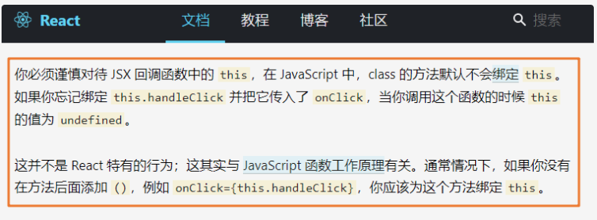

这里我们作为了解内容，随着 js 标准的发展，**主流的写法已经变成了class fields，无需考虑太多 this 问题**

### 1.7.1. 问题

❌ 错误示例：

```jsx
// 注意：这是错误示例 ❌

import React from "react";

class Test extends React.Component {

  // 普通 js 函数。// 注意：这是错误示例 ❌
  clickHandler() {
    // 浏览器控制条打印信息为：undefined
    console.log(this);
  }
  render() {
    return <button onClick={this.clickHandler}>Click Me</button>
  }
}

function App() {
  return (
    <div>
      <Test />
    </div>
  )
}

export default App
```

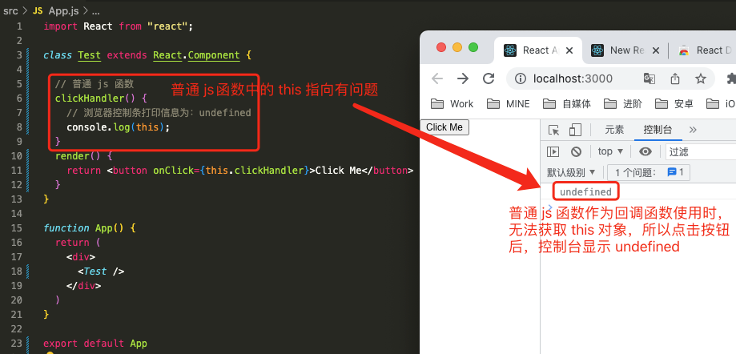

### 1.7.2. 解决方案1

在类组件的构造函数中修正 `this` 的指向：

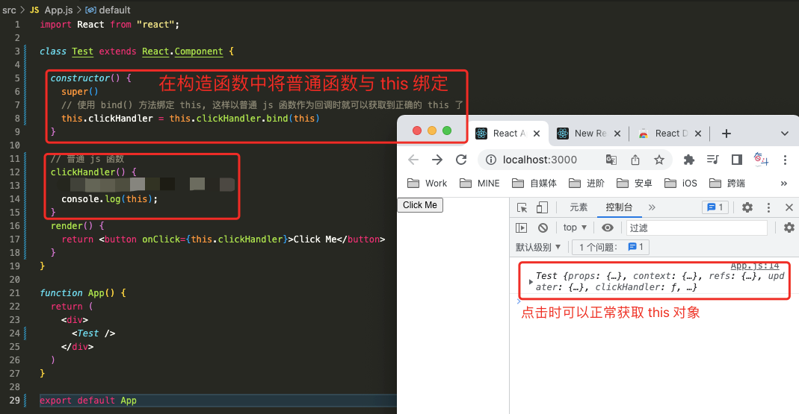

```jsx
import React from "react";

class Test extends React.Component {

  constructor() {
    super()
    // 使用 bind() 方法绑定 this, 这样以普通 js 函数作为回调时就可以获取到正确的 this 了
    this.clickHandler = this.clickHandler.bind(this)
  }

  // 普通 js 函数
  clickHandler() {
    console.log(this);
  }
  render() {
    return <button onClick={this.clickHandler}>Click Me</button>
  }
}

function App() {
  return (
    <div>
      <Test />
    </div>
  )
}

export default App
```

虽然上述绑定的方式解决了 `this` 的指向问题，但较为繁琐。所以，还是推荐优先使用箭头函数来定义回调函数。

### 1.7.3. 解决方案2

将普通 js 函数作为回调函数时，还可以在事件中以箭头函数的形式进行包裹和调用，这样也可以获取到正确的 `this` 对象。

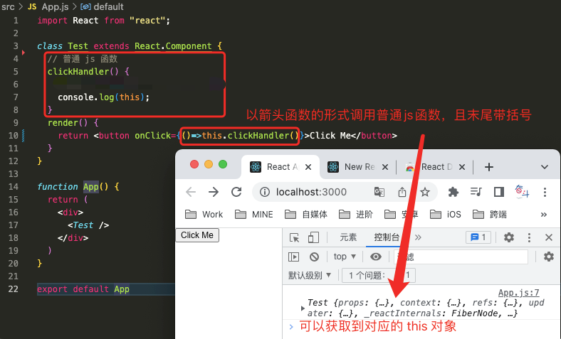

```jsx
import React from "react";

class Test extends React.Component {
  // 普通 js 函数
  clickHandler() {
    console.log(this);
  }
  render() {
    return <button onClick={()=>this.clickHandler()}>Click Me</button>
  }
}

function App() {
  return (
    <div>
      <Test />
    </div>
  )
}

export default App
```

### 1.7.4. 总结

```jsx
import React from "react";

class Test extends React.Component {
  // 箭头函数
  clickHandler1 = (e) => {
    console.log(this)
    console.log(e);
  }

  // 普通函数
  clickHandler2(e) {
    console.log(this)
    console.log(e);
  }

  render() {
    return (
      <>
        {/* 可以获取到 this 和事件对象 e */}
        <button onClick={this.clickHandler1}>Click1</button>
        {/* 可以获取到 this 和事件对象 e */}
        <button onClick={(e) => this.clickHandler1(e)}>Click2</button>

        {/* 无法获取到 this, 但可以获取到事件对象 */}
        <button onClick={this.clickHandler2}>Click3</button>
        {/* 可以获取到 this 和事件对象 e */}
        <button onClick={(e) => this.clickHandler2(e)}>Click4</button>
      </>
    )
  }
}

function App() {
  return (
    <div>
      <Test />
    </div>
  )
}

export default App
```

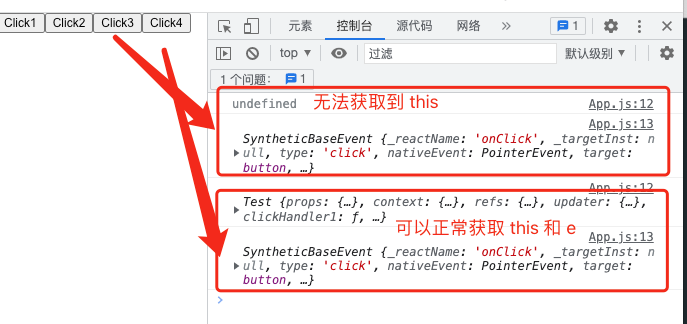 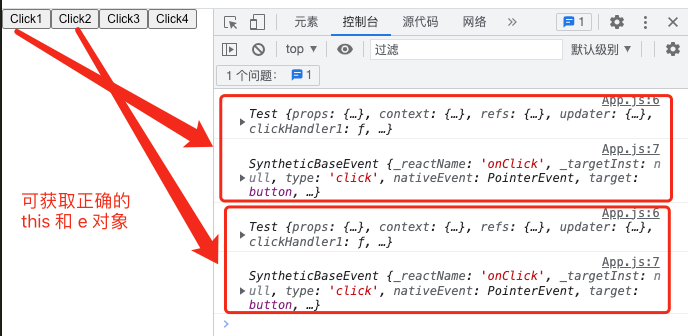

基于上述示例，在定义回调函数时有如下总结：

* 如果是普通函数，那么作为回调事件被调用时，必须以箭头函数的形式进行调用，且末尾必须加 `()`。
* 如果是箭头函数，
    * 函数无参，可以用属性的形式进行调用——`onClick={this.clickHandler}`，也可以用箭头函数的形式进行调用，末尾必须加 `()`——`onClick={() => this.clickHandler1()}`。
    * 函数有参，
        * 如果参数为事件对象 e，可以用属性的形式进行调用——`onClick={this.clickHandler}`，也可以用箭头函数的形式进行调用——`onClick={(e) => this.clickHandler1(e)}`。
        * 如果包含其他参数，必须以箭头函数的形式进行调用——`onClick={(e) => this.clickHandler1(e,item.msg)}`。

综上，**最好是以箭头函数的形式进行定义，并且以箭头函数的形式进行调用**。

通过箭头函数进行调用时，沿用的是父级函数中的 `this` 对象，也就是当前组件的实例对象。

> CnPeng : 暂不确定上述情况在内存消耗和执行效率上有何差异。


## 1.8. React的状态不可变

目标任务:  能够理解不可变的意义并且知道在实际开发中如何修改状态

概念：**不要直接修改状态的值，而是基于当前状态创建新的状态值**

> CnPeng : 所谓不可变，就是不能直接修改状态中的属性值，必须通过方法对状态中的属性进行重新赋值。

### 1.8.1. 错误示例

```jsx
state = {
  count : 0,
  list: [1,2,3],
  person: {
     name:'jack',
     age:18
  }
}

// 这是 ❌  错误示例：不能直接修改简单类型Number
this.state.count++
++this.state.count
this.state.count += 1
this.state.count = 1

// 这是 ❌  错误示例：不能直接修改数组
this.state.list.push(123)
this.state.list.spice(1,1)

// 这是 ❌  错误示例：不能直接修改对象
this.state.person.name = 'rose'
```

### 1.8.2. 正确示例

基于当前状态创建新值

```jsx
this.setState({
    count: this.state.count + 1,
    list: [...this.state.list, 4],
    person: {
       ...this.state.person,
       // 覆盖原来的属性 就可以达到修改对象中属性的目的
       name: 'rose'
    },
    // 使用 filter 对数组内容进行筛选，实现删除功能。
    // 下面的代码表示仅保留 !=2 的元素。
    list: this.state.filter(item=>item!=2)
})
```

## 1.9. 表单处理

目标任务:  能够使用受控组件的方式获取文本框的值

使用 React 处理表单元素，一般有俩种方式：

* 受控组件 （推荐使用）
* 非受控组件 （了解）

### 1.9.1. 受控表单组件

什么是受控组件？  `input` 输入框的状态被 React 组件状态控制，则 `input` 输入框就被称为受控组件。（简言之，input 输入框展示的内容和 React 组件 state 中的数据实现了双向绑定。——元素中的 value 中与组件 state 中的值绑定了。）

React 组件的状态存储在 `state` 中，`input` 表单元素也有自己的状态是在 `value` 中，React 将 `state` 与表单元素的值（`value`）绑定到一起，由`state` 的值来控制表单元素的值，从而保证**单一数据源**的特性。

#### 1.9.1.1. 实现步骤

以获取文本框的值为例，受控组件的使用步骤如下：

* 在组件的 `state` 中声明一个组件的状态数据
* 将状态数据设置为 `input` 标签 `value` 属性的值
* 为 `input` 添加 `change` 事件，在事件处理程序中，通过事件对象 `e` 获取到当前文本框的值（即用户当前输入的值）
* 调用 `setState` 方法，将文本框的值作为 `state` 状态的最新值

#### 1.9.1.2. 代码实现

```jsx
import React from 'react'

class InputComponent extends React.Component {
  // 1、声明组件状态
  state = {
    message: 'this is message',
  }

  // 2、声明事件回调函数。通过事件对象获取组件的 value , 并更新到 state 中
  // 这里的 e 是事件对象，e.target 表示触发事件的组件对象
  changeHandler = (e) => {
    this.setState({ message: e.target.value })
  }

  render () {
    return (
      <div>
        {/* 3、绑定value，绑定事件*/}
        <input value={this.state.message} onChange={this.changeHandler} />
      </div>
    )
  }
}

function App () {
  return (
    <div className="App">
      <InputComponent />
    </div>
  )
}

export default App
```

### 1.9.2. 非受控表单组件

什么是非受控组件？

非受控组件就是通过手动操作 dom 的方式获取文本框的值，**文本框的状态不受 react 组件 `state` 中的状态控制**，直接通过原生 dom 获取输入框的值

#### 1.9.2.1. 实现步骤

* 导入 `createRef` 函数
* 调用 `createRef` 函数，创建一个 `ref` 对象，存储到名为 `msgRef` 的实例属性中
* 为 `input` 添加 `ref` 属性，值为 `msgRef`
* 在按钮的事件处理程序中，通过 `msgRef.current` 即可拿到 `input` 对应的 dom 元素，而其中 `msgRef.current.value` 拿到的就是文本框的值

#### 1.9.2.2. 代码实现

```jsx
import React, { createRef } from 'react'

class InputComponent extends React.Component {
  // 1、使用createRef产生一个存放dom的对象容器
  msgRef = createRef()

  // 3、通过 ref 实例获取被绑定组件的 value
  changeHandler = () => {
    console.log(this.msgRef.current.value)
  }

  render() {
    return (
      <div>
        {/* 2、ref绑定，获取真实dom */}
        <input ref={this.msgRef} />
        <button onClick={this.changeHandler}>click</button>
      </div>
    )
  }
}

function App () {
  return (
    <div className="App">
      <InputComponent />
    </div>
  )
}
export default App
```

## 1.10. 阶段小练习

[视频 P32-P36](https://www.bilibili.com/video/BV1Z44y1K7Fj/?p=32&spm_id_from=pageDriver&vd_source=52532367532c4237b88b472159331d19)

效果图：

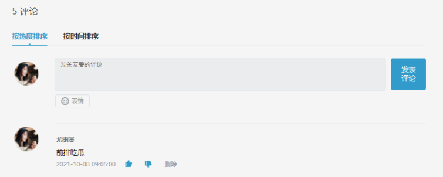

练习说明：

* 拉取项目模板到本地， [https://gitee.com/react-course-series/react-component-demo](https://gitee.com/react-course-series/react-component-demo)
* 通过 `yarn` 命令安装依赖，安装完成后通过 `yarn start` 命令运行项目
* 完成 tab 点击切换激活状态交互
* 完成发表评论功能
* 完成删除评论功能

注意：生成独立无二的 id 可以使用 `uuid` 包。通过 `yarn add uuid` 可以安装该包的依赖。使用方式如下：

```jsxt
import { v4 as uuid } from 'uuid'
uuid() // 得到一个独一无二的id
```

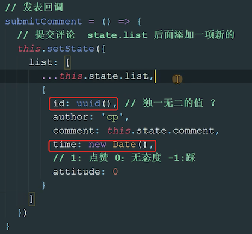

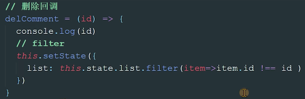

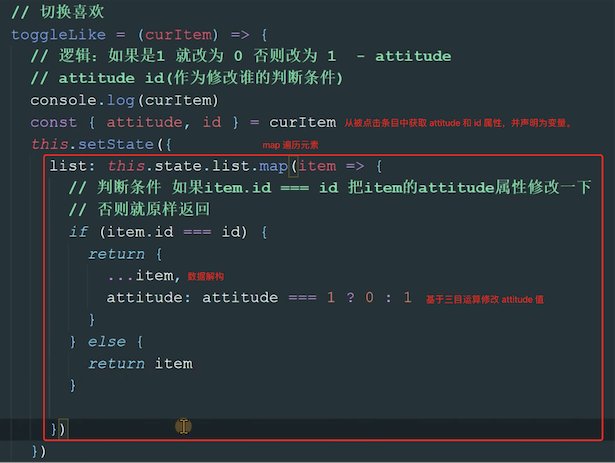