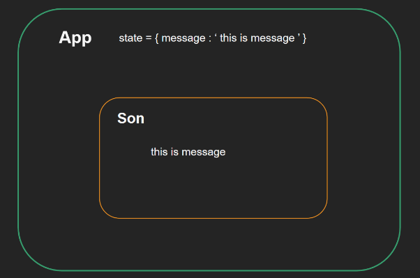
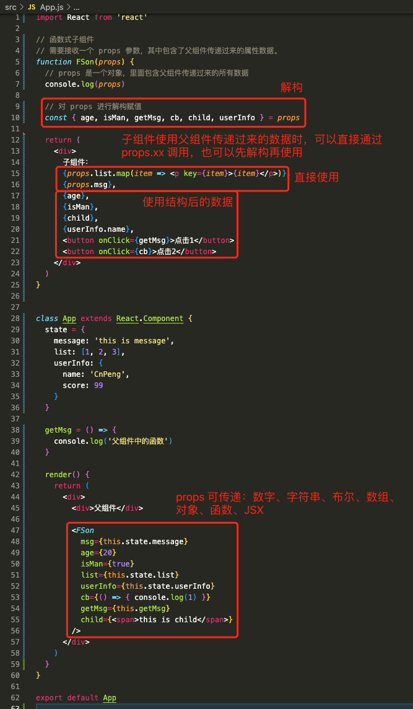
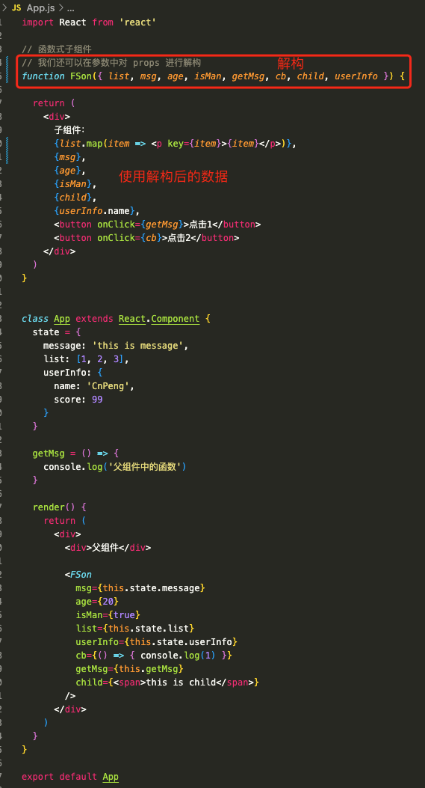
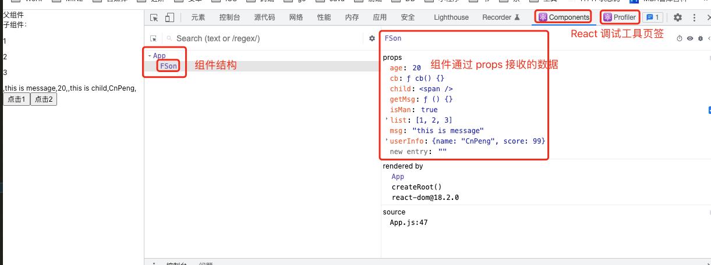
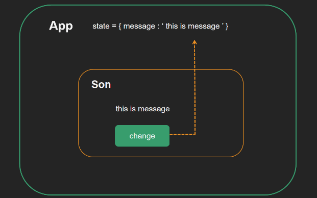
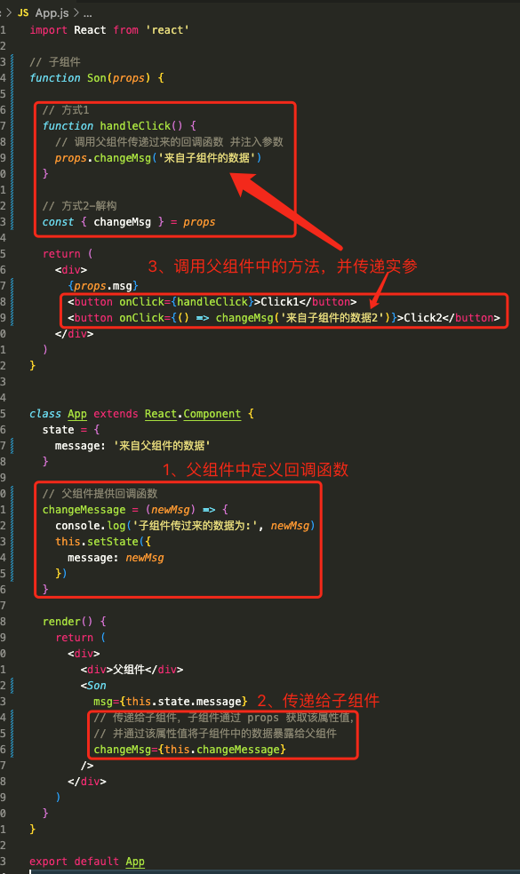
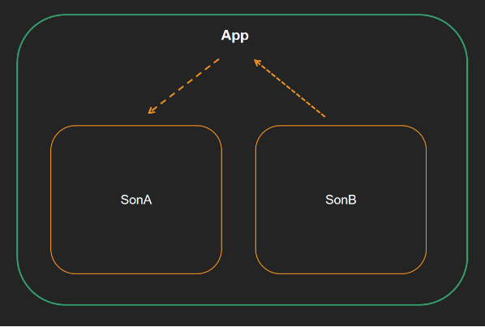
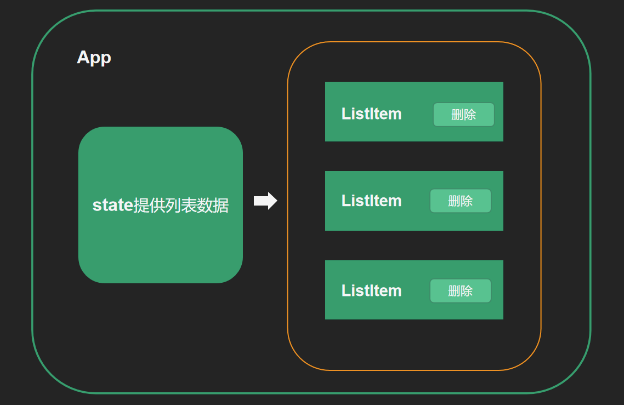
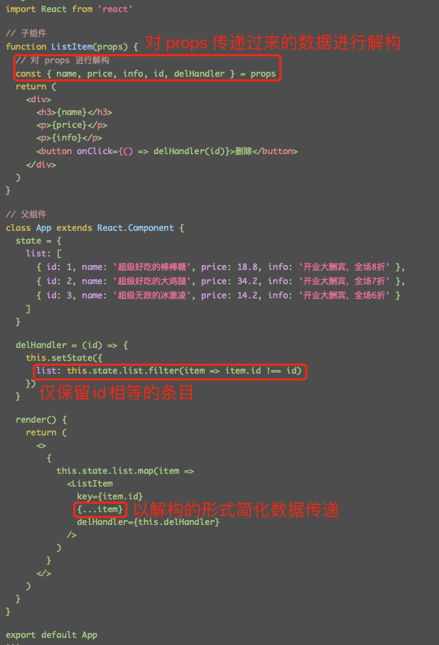

# 1. 004-React组件通信

>2022-02-07 周二

## 1.1. 组件通信的意义

目标任务:   了解为什么需要组件通信

组件是独立且封闭的单元，**默认情况下组件只能使用自己的数据（state）**。

组件化开发的过程中，完整的功能会拆分多个组件，在这个过程中不可避免的需要互相传递一些数据。

为了能让各组件之间可以进行互相沟通，数据传递，这个过程就是**组件通信**。

* 父子关系 -  最重要的
* 兄弟关系 -  自定义事件模式产生技术方法 eventBus  /  通过共同的父组件通信
* 其它关系 -  mobx / redux / zustand


## 1.2. 父传子实现

目标任务:   实现父子通信中的父传子，把父组件中的数据传给子组件

### 1.2.1. 实现步骤

* 父组件通过 `state` 提供要传递给子组件的数据
* 在子组件标签中自定义属性，并将 `state` 中的数据赋值给该属性
* 子组件中通过 `props` 接收父组件中传过来的数据
    * 类组件使用 `this.props` 获取 `props` 对象，通过 `this.props.属性名` 获取传递的属性值。
    * 函数式组件直接通过参数获取 `props` 对象，通过 `props.属性名` 获取传递的属性值。



### 1.2.2. 代码实现

```jsx
import React from 'react'

// 函数式子组件
// 需要接收一个 props 参数，其中包含了父组件传递过来的属性数据。
function FSon(props) {
  console.log(props)
  return (
    <div>
      子组件1
      {props.msg}
    </div>
  )
}

// 类子组件
// 直接使用 this.props 获取父组件传递的属性数据
class CSon extends React.Component {
  render() {
    return (
      <div>
        子组件2
        {this.props.msg}
      </div>
    )
  }
}

// 父组件
class App extends React.Component {
  state = {
    message: 'this is message'
  }
  render() {
    return (
      <div>
        <div>父组件</div>

        {/*这里为子组件绑定的属性名可以自定义，此处为 msg*/}
        <FSon msg={this.state.message} />
        <CSon msg={this.state.message} />
      </div>
    )
  }
}

export default App
```


## 1.3. props说明

目标任务:   知道 props 传递时的一些注意事项

### 1.3.1. props是只读对象（readonly）

`props` 是只读对象（readonly）

根据单向数据流的要求，**子组件只能读取 `props` 中的数据，不能进行修改**。

### 1.3.2. props可以传递任意数据

`props` 可以传递任意数据：数字、字符串、布尔值、数组、对象、函数、JSX



```jsx
import React from 'react'

// 函数式子组件
// 需要接收一个 props 参数，其中包含了父组件传递过来的属性数据。
function FSon(props) {
  // props 是一个对象，里面包含父组件传递过来的所有数据
  console.log(props)

  // 对 props 进行解构赋值
  const { age, isMan, getMsg, cb, child, userInfo } = props

  return (
    <div>
      子组件：
      {props.list.map(item => <p key={item}>{item}</p>)},
      {props.msg},
      {age},
      {isMan},
      {child},
      {userInfo.name},
      <button onClick={getMsg}>点击1</button>
      <button onClick={cb}>点击2</button>
    </div>
  )
}


class App extends React.Component {
  state = {
    message: 'this is message',
    list: [1, 2, 3],
    userInfo: {
      name: 'CnPeng',
      score: 99
    }
  }

  getMsg = () => {
    console.log('父组件中的函数')
  }

  render() {
    return (
      <div>
        <div>父组件</div>

        <FSon
          msg={this.state.message}
          age={20}
          isMan={true}
          list={this.state.list}
          userInfo={this.state.userInfo}
          cb={() => { console.log(1) }}
          getMsg={this.getMsg}
          child={<span>this is child</span>}
        />
      </div>
    )
  }
}

export default App
```

我们还可以通过如下方式进行解构：



核心代码：

```jsx
// 函数式子组件
// 我们还可以在参数中对 props 进行解构
function FSon({ list, msg, age, isMan, getMsg, cb, child, userInfo }) {

  return (
    <div>
      子组件：
      {list.map(item => <p key={item}>{item}</p>)},
      {msg},
      {age},
      {isMan},
      {child},
      {userInfo.name},
      <button onClick={getMsg}>点击1</button>
      <button onClick={cb}>点击2</button>
    </div>
  )
}
```

### 1.3.3. Chrome 插件-React Developer tools

要调试 React 页面或查看 React 编译后的数据结构，就需要在 Chrome 浏览器中安装 `React Developer tools` 插件。

安装完插件之后，通过 `yarn build` 命令构建项目，然后在用 `yarn start` 运行项目。此时，在 Chrome 开发者工具页面就可以看到 `Components` 和 `Profile` 页签：



## 1.4. 子传父实现

目标任务:   实现父子通信中的子传父

实现思路：** 父组件给子组件传递回调函数，子组件调用**

### 1.4.1. 实现步骤

* 父组件提供一个回调函数 - 用于接收数据
* 将函数作为子组件自定义属性的值，传给子组件
* 子组件通过 `props` 调用父组件传递过来的函数
* 将子组件中的数据作为实参传递给父组件传递过来的函数



### 1.4.2. 代码实现



```jsx
import React from 'react'

// 子组件
function Son(props) {

  // 方式1
  function handleClick() {
    // 调用父组件传递过来的回调函数 并注入参数
    props.changeMsg('来自子组件的数据')
  }

  // 方式2-解构
  const { changeMsg } = props

  return (
    <div>
      {props.msg}
      <button onClick={handleClick}>Click1</button>
      <button onClick={() => changeMsg('来自子组件的数据2')}>Click2</button>
    </div>
  )
}


class App extends React.Component {
  state = {
    message: '来自父组件的数据'
  }

  // 父组件提供回调函数
  changeMessage = (newMsg) => {
    console.log('子组件传过来的数据为:', newMsg)
    this.setState({
      message: newMsg
    })
  }

  render() {
    return (
      <div>
        <div>父组件</div>
        <Son
          msg={this.state.message}
          // 传递给子组件，子组件通过 props 获取该属性值，
          // 并通过该属性值将子组件中的数据暴露给父组件
          changeMsg={this.changeMessage}
        />
      </div>
    )
  }
}

export default App
```

## 1.5. 兄弟组件通信

目标任务:   实现兄弟组件之间的通信

核心思路： **通过状态提升机制，利用共同的父组件实现兄弟通信**

### 1.5.1. 实现步骤

* **将共享状态提升到最近的公共父组件中**，由公共父组件管理这个状态
    * 提供共享状态
    * 提供操作共享状态的方法
* 要接收数据状态的子组件通过 `props` 接收数据
* 要传递数据状态的子组件通过 `props` 接收方法，调用方法传递数据



### 1.5.2. 代码实现

```jsx
import React from 'react'

// 子组件A--使用数据
function SonA(props) {
  return (
    <div>
      SonA
      {props.msg}
    </div>
  )
}

// 子组件B--暴露数据
function SonB(props) {
  return (
    <div>
      SonB
      <button onClick={() => props.changeMsg('new message')}>changeMsg</button>
    </div>
  )
}

// 父组件--管理数据
class App extends React.Component {
  // 父组件提供状态数据
  state = {
    message: 'this is message'
  }

  // 父组件提供修改数据的方法
  changeMsg = (newMsg) => {
    this.setState({
      message: newMsg
    })
  }

  render() {
    return (
      {/* <> </> 为幽灵节点*/}
      <>
        {/* 接收数据的组件 */}
        <SonA msg={this.state.message} />
        {/* 修改数据的组件 */}
        <SonB changeMsg={this.changeMsg} />
      </>
    )
  }
}

export default App
```

## 1.6. 跨组件通信Context

目标任务:   了解 `Context` 机制解决的问题和使用步骤


上图是一个 react 形成的嵌套组件树，如果我们想从 App 组件向任意一个下层组件传递数据，该怎么办呢？目前我们能采取的方式就是一层一层的 props 往下传，显然很繁琐。

`Context` 提供了一个无需为每层组件手动添加 `props` 就能在组件树间进行数据传递的方法。

### 1.6.1. 实现步骤

* 创建 `Context` 对象，导出 `Provider` 和 `Consumer` 对象：

```jsx
const { Provider, Consumer } = createContext()
```

* 使用 `Provider` 包裹上层组件提供数据：

```jsx
<Provider value={this.state.message}>
    {/* 根组件 */}
</Provider>
```

* 在使用数据的组件（下层组件）中，用 `Consumer` 包裹一个回调函数，然后在回调函数中编写组件渲染逻辑：

```jsx
<Consumer >
    {value => /* 基于 context 值进行组件渲染*/}
</Consumer>
```

> 上面所说的上层组件和下层组件是相对的，只要存在这种嵌套关系即可。通常我们都会用 App 作为数据提供方。

### 1.6.2. 代码实现

下面示例的嵌套和数据传递关系：

* App 使用了组件 A ，组件 A 中使用了组件 C。即 App -> A -> C 。
* 将 App 中的数据传递给 C，并在 C 中进行使用。

```jsx
import React, { createContext }  from 'react'

// 1. 创建Context对象，并解构出提供者和消费者
const { Provider, Consumer } = createContext()


// 3. 消费数据
function ComC() {
  return (
    <Consumer >
      {value => <div>{value}</div>}
    </Consumer>
  )
}

function ComA() {
  return (
    <ComC/>
  )
}

// 2. 提供数据
class App extends React.Component {
  state = {
    message: 'this is message'
  }
  render() {
    return (
      <Provider value={this.state.message}>
        <div className="app">
          <ComA />
        </div>
      </Provider>
    )
  }
}

export default App
```

## 1.7. 阶段小练习

要求：App 为父组件，用来提供列表数据 ；ListItem为子组件，用来渲染列表数据；渲染列表，并支持条目删除。



```jsx
// 列表数据
[
  { id: 1, name: '超级好吃的棒棒糖', price: 18.8, info: '开业大酬宾，全场8折' },
  { id: 2, name: '超级好吃的大鸡腿', price: 34.2, info: '开业大酬宾，全场8折' },
  { id: 3, name: '超级无敌的冰激凌', price: 14.2, info: '开业大酬宾，全场8折' }
]
```

完整代码:

```jsx
import React from 'react'

// 子组件
function ListItem(props) {
  // 对 props 进行解构
  const { name, price, info, id, delHandler } = props
  return (
    <div>
      <h3>{name}</h3>
      <p>{price}</p>
      <p>{info}</p>
      <button onClick={() => delHandler(id)}>删除</button>
    </div>
  )
}

// 父组件
class App extends React.Component {
  state = {
    list: [
      { id: 1, name: '超级好吃的棒棒糖', price: 18.8, info: '开业大酬宾，全场8折' },
      { id: 2, name: '超级好吃的大鸡腿', price: 34.2, info: '开业大酬宾，全场7折' },
      { id: 3, name: '超级无敌的冰激凌', price: 14.2, info: '开业大酬宾，全场6折' }
    ]
  }

  delHandler = (id) => {
    this.setState({
      list: this.state.list.filter(item => item.id !== id)
    })
  }

  render() {
    return (
      <>
        {
          this.state.list.map(item =>
            <ListItem
              key={item.id}
              {...item}
              delHandler={this.delHandler}
            />
          )
        }
      </>
    )
  }
}

export default App
```

