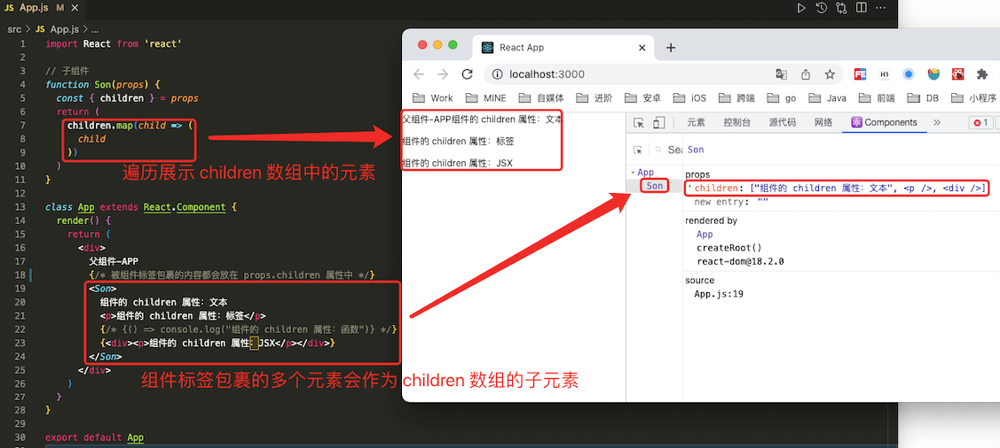

# 1. 005-React组件进阶

## 1.1. children属性

目标任务:  掌握 `props` 中 `children` 属性的用法

`children`属性是什么？表示组件标签的子元素，只要组件标签内部有子元素，`props` 中就有该属性。

**`children`可以是：普通文本、普通标签元素、函数 / 对象、JSX**。组件标签内的所有内容都会被 `children` 包裹。

### 1.1.1. 示例1-文本


```jsx
import React from 'react'

// 子组件
function Son(props) {
  return (
    <div>{props.children}</div>
  )
}

class App extends React.Component {
  render() {
    return (
      <div>
        父组件-APP
        {/* 被组件标签包裹的内容都会放在 props.children 属性中 */}
        <Son>
          组件的 children 属性：普通文本
        </Son>
      </div>
    )
  }
}

export default App
```

### 1.1.2. 示例2-标签


```jsx
import React from 'react'

// 子组件
function Son({children}) {
  return (
    <div>{children}</div>
  )
}

class App extends React.Component {
  render() {
    return (
      <div>
        父组件-APP
        {/* 被组件包裹的内容都会放在 props.children 属性中 */}
        <Son>
          <p>组件的 props.children 属性：标签</p>
        </Son>
      </div>
    )
  }
}

export default App
```

### 1.1.3. 示例3-函数


```jsx
import React from 'react'

// 子组件
function Son(props) {
  const { children } = props
  return (
    // children 是函数，可以被直接调用 
    <button onClick={children}>Son组件-BTN</button>
  )
}

class App extends React.Component {
  render() {
    return (
      <div>
        父组件-APP
        {/* 被组件包裹的内容都会放在 props.children 属性中 */}
        <Son>
          {() => console.log("组件的 children 属性：函数")}
        </Son>
      </div>
    )
  }
}

export default App
```

### 1.1.4. 示例4-JSX


```jsx
import React from 'react'

// 子组件
function Son(props) {
  const { children } = props
  return (
    <>
      children
    </>
  )
}

class App extends React.Component {
  render() {
    return (
      <div>
        父组件-APP
        {/* 被组件包裹的内容都会放在 props.children 属性中 */}
        <Son>
          {<div><p>组件的 children 属性：JSX</p></div>}
        </Son>
      </div>
    )
  }
}

export default App
```

### 1.1.5. 示例5-多元素



```jsx
import React from 'react'

// 子组件
function Son(props) {
  const { children } = props
  return (
    children.map(child => (
      child
    ))
  )
}

class App extends React.Component {
  render() {
    return (
      <div>
        父组件-APP
        {/* 被组件标签包裹的内容都会放在 props.children 属性中 */}
        <Son>
          组件的 children 属性：文本
          <p>组件的 children 属性：标签</p>
          {/* {() => console.log("组件的 children 属性：函数")} */}
          {<div><p>组件的 children 属性：JSX</p></div>}
        </Son>
      </div>
    )
  }
}

export default App
```

## 1.2. props校验

### 1.2.1. 场景和使用

目标任务:  掌握组件 `props` 的校验写法，增加组件的健壮性

对于组件来说，`props` 是由外部传入的，我们其实无法保证组件使用者传入了什么格式的数据，如果传入的数据格式不对，就有可能会导致组件内部错误，有一个点很关键 - 组件的使用者可能报错了也不知道为什么，看下面的例子:


上面的示例中，需要传入 item 对象数组，但实际传入的却是 int 值。面对这样的问题，如何解决？ ——**`props` 校验**

#### 1.2.1.1. 实现步骤

* 安装属性校验包：`yarn add prop-types`
* 导入 `prop-types` 包
* 使用 `组件名.propTypes = {}` 给组件添加校验规则

#### 1.2.1.2. 核心代码

```jsx
import PropTypes from 'prop-types'

const List = props => {
  const arr = props.colors
  const lis = arr.map((item, index) => <li key={index}>{item.name}</li>)
  return <ul>{lis}</ul>
}

List.propTypes = {
  colors: PropTypes.array
}
```

#### 1.2.1.3. 完整示例


```jsx
import React from 'react'
// 1、引入校验包。内置各种 props 校验规则
import PropTypes from 'prop-types'

// 子组件
function Son(props) {
  const { list } = props
  return (
    <div>
      {list.map((item, index) => <p key={index}> {item}</p>)}
    </div>
  )
}

// 2、添加校验规则
Son.propTypes = {
  list: PropTypes.array // 限定 list 的类型为数组
}

class App extends React.Component {
  render() {
    return (
      <div>
        <Son list={[1, 2, 3, 4]} />
      </div>
    )
  }
}

export default App
```


### 1.2.2. 规则说明

> [B站视频 P48](https://www.bilibili.com/video/BV1Z44y1K7Fj/?p=48)

目标任务:  掌握 `props` 常见的规则

#### 1.2.2.1. 四种常见结构

* 常见类型：array、bool、func、number、object、string
* React 元素类型：`element`
* 必填项：`isRequired`
* 特定的结构对象：`shape({})`

#### 1.2.2.2. 核心代码

```jsx
// 常见类型
optionalFunc: PropTypes.func,

// 必填 只需要在类型后面串联一个isRequired
requiredFunc: PropTypes.func.isRequired,

// 特定结构的对象
optionalObjectWithShape: PropTypes.shape({
	color: PropTypes.string,
	fontSize: PropTypes.number
})
```

官网文档更多阅读：[https://reactjs.org/docs/typechecking-with-proptypes.html](https://reactjs.org/docs/typechecking-with-proptypes.html)

### 1.2.3. 默认值

目标任务:  掌握如何给组件的 `props` 提供默认值

通过 `defaultProps` 可以给组件的 `props` 设置默认值，在未传入 `props` 的时候生效

#### 1.2.3.1. 函数组件

直接使用**函数参数默认值**（推荐使用）：

```jsx
// 带有默认参数值的函数
function List({pageSize = 10}) {
  return (
    <div>
      此处展示props的默认值：{ pageSize }
    </div>
  )
}

// ... 其他内容省略

// 不传入pageSize属性
<List />
```

在之前版本的 react 中还可以使用如下方式（不推荐使用）：

```jsx

// 函数组件
function List(props) {
  return (
    <div>
      此处展示props的默认值：{ props.pageSize }
    </div>
  )
}

// 定义默认值
List.defaultProps = {
    pageSize:10
}

// ... 其他内容省略

// 不传入pageSize属性
<List />
```

#### 1.2.3.2. 类组件

**使用类静态属性声明默认值**，`static defaultProps = {}`：

```jsx
class List extends Component {
  // 通过静态属性声明默认值
  static defaultProps = {
    pageSize: 10
  }
 
  render() {
    return (
      <div>
        此处展示props的默认值：{this.props.pageSize}
      </div>
    )
  }
}

// ... 其他内容省略

<List />
```

在之前版本的 react 中还可以使用如下方式（不推荐使用）：

```jsx
class List extends Component {
  render() {
    return (
      <div>
        此处展示props的默认值：{this.props.pageSize}
      </div>
    )
  }
}

// 定义默认值
List.defaultProps = {
    pageSize:10
}

// ... 其他内容省略

// 不传入pageSize属性 
<List />
```

## 1.3. 生命周期 - 概述

[B站视频-P51](https://www.bilibili.com/video/BV1Z44y1K7Fj/?p=51)

目标任务:  能够说出组件生命周期一共几个阶段

组件的生命周期是指**组件从被创建到挂载到页面中运行起来，再到组件不用时卸载的过程**。

注意：**只有类组件才有生命周期（类组件需要实例化，函数组件不需要实例化）**

以下声明周期图例来自：[http://projects.wojtekmaj.pl/react-lifecycle-methods-diagram/](http://projects.wojtekmaj.pl/react-lifecycle-methods-diagram/)

* 常用生命周期


* 完整生命周期（含不常用的声明周期）


上面的两幅图中都强调在 Render 阶段，需要“纯净且不包含副作用”，就是说，在 Render 阶段不要执行附加操作，比如网络请求等。否则，这些附加操作可能会被暂停、终止、重启，从而导致一些不可预知的问题。

### 1.3.1. 挂载阶段

目标任务:  能够说出在组件挂载阶段执行的钩子函数和执行时机


钩子函数	| 触发时机 | 作用
---|---|---
`constructor` | 创建组件时，最先执行，<br>初始化的时候只执行一次 | 1. 初始化 `state` ，<br>2. 创建 `Ref` ，<br>3. 使用 `bind` 解决 `this` 指向问题等
`render` | 每次组件渲染都会触发 | 渲染 UI（注意： **不能在里面调用 `setState()`** ）
`componentDidMount` | 组件挂载（完成 DOM 渲染）后执行，<br>初始化的时候执行一次	 | 1. 发送网络请求，<br>2. DOM操作

#### 1.3.1.1. 示例-基本生命周期

> CnPeng：`componentDidMount()` 方法应该仅执行一次，但这里却执行了两次。


```jsx
import React from 'react'

// 只有类组件才有生命周期。类组件需要实例化，函数组件不需要实例化。
class App extends React.Component {
  constructor() {
    // 构造函数必须调用 super() 
    super()
    console.log("1、生命周期-constructor");
  }

  render() {
    console.log("2、生命周期-render");
    return (
      <div>
        渲染
      </div>
    )
  }

  componentDidMount() {
    console.log("3、生命周期-componentDidMount");
  }
}

export default App
```


### 1.3.2. 更新阶段

目标任务:  能够说出组件的更新阶段的钩子函数以及执行时机


钩子函数 | 触发时机 | 作用
---|---|---
render | 每次组件渲染都会触发 | 渲染UI（与**挂载阶段**是同一个 render）
componentDidUpdate | 组件更新后（DOM渲染完毕）| DOM 操作，可以获取到更新后的 DOM 内容，<br>不要直接调用 `setState`


#### 1.3.2.1. 示例-更新视图


```jsx
import React from 'react'

// 只有类组件才有生命周期。类组件需要实例化，函数组件不需要实例化。
class App extends React.Component {
  state = {
    count: 0
  }

  handlerClick = () => {
    this.setState({
      count: this.state.count + 1
    })
  }

  constructor() {
    // 构造函数必须调用 super() 
    super()
    console.log("1、生命周期-constructor");
  }

  render() {
    console.log("2、生命周期-render");
    return (
      <div>
        渲染
        <button onClick={this.handlerClick}>{this.state.count}</button>
      </div>
    )
  }

  componentDidMount() {
    console.log("3、生命周期-componentDidMount");
  }

  componentDidUpdate(){
    console.log("4、生命周期-componentDidUpdate");
  }
}

export default App
```


### 1.3.3. 卸载阶段

目标任务:  能够说出组件的销毁阶段的钩子函数以及执行时机

钩子函数 | 触发时机 | 作用
---|---|---
componentWillUnmount | 组件卸载（从页面中消失）| 执行清理工作（比如：清理定时器等）


#### 1.3.3.1. 示例 1


```jsx
import React from 'react'

class Test extends React.Component {
  componentWillUnmount() {
    console.log('5-生命周期-componentWillUnmount')
  }

  render() {
    return <div>TEST</div>
  }
}

// 只有类组件才有生命周期。类组件需要实例化，函数组件不需要实例化。
class App extends React.Component {
  state = {
    count: 0,
    flag: true
  }

  handlerClick = () => {
    this.setState({
      count: this.state.count + 1,
      flag: !this.state.flag
    })
  }

  constructor() {
    // 构造函数必须调用 super() 
    super()
    console.log("1、生命周期-constructor");
  }

  render() {
    console.log("2、生命周期-render");
    return (
      <div>
        渲染
        {/* 通过数据状态的切换，让 Test 组件进行销毁重建，此过程会触发组件卸载动作 */}
        {this.state.flag ? <Test /> : null}
        <button onClick={this.handlerClick}>{this.state.count}</button>
      </div>
    )
  }

  componentDidMount() {
    console.log("3、生命周期-componentDidMount");
  }

  componentDidUpdate() {
    console.log("4、生命周期-componentDidUpdate");
  }
}

export default App
```

#### 1.3.3.2. 示例2


```jsx
import React from 'react'

class Test extends React.Component {
  // 实例属性。不需要和视图绑定的数据可以定义为实例属性；被视图渲染所引用的属性需要定义在 state 中
  timer = null
  componentDidMount(){
    // 组件挂载时启动定时器
    this.timer = setInterval(() => {
        console.log("定时器开启")
    },1000)
  }

  componentWillUnmount() {
    console.log('5-生命周期-componentWillUnmount')
    // 组件卸载时，销毁定时器
    clearInterval(this.timer)
  }

  render() {
    return <div>TEST</div>
  }
}

// 只有类组件才有生命周期。类组件需要实例化，函数组件不需要实例化。
class App extends React.Component {
  state = {
    count: 0,
    flag: true
  }

  handlerClick = () => {
    this.setState({
      count: this.state.count + 1,
      flag: !this.state.flag
    })
  }

  constructor() {
    // 构造函数必须调用 super() 
    super()
    console.log("1、生命周期-constructor");
  }

  render() {
    console.log("2、生命周期-render");
    return (
      <div>
        渲染
        {/* 通过数据状态的切换，让 Test 组件进行销毁重建，此过程会触发组件卸载动作 */}
        {this.state.flag ? <Test /> : null}
        <button onClick={this.handlerClick}>{this.state.count}</button>
      </div>
    )
  }

  componentDidMount() {
    console.log("3、生命周期-componentDidMount");
  }

  componentDidUpdate() {
    console.log("4、生命周期-componentDidUpdate");
  }
}

export default App
```

## 1.4. 阶段练习 - todoMVC

[视频地址-P54](https://www.bilibili.com/video/BV1Z44y1K7Fj/?p=54)

[使用到了 AntDesign 组件库](https://ant.design/components/overview-cn)

案例仓库地址：[https://gitee.com/react-course-series/react-todo-mvc](https://gitee.com/react-course-series/react-todo-mvc)

* 克隆项目到本地

```bash
$ git clone  https://gitee.com/react-course-series/react-todo-mvc.git
```

* 安装必要依赖

```bash
$ yarn
```

* 开启 mock 接口服务，保持窗口不关闭  ！

```bash
# 启动mock服务,开启后不要关闭终端界面。
$ yarn mock-serve
```

* 另起一个bash窗口开启前端服务

```bash
$ yarn start
```

* 切换到 todo-test 分支。（master 分支是已经编辑好的内容，todo-test 分支仅是一个空模板）

```bash
$ git checkout todo-test
```

接口文档：

接口作用 | 接口地址	| 接口方法 | 接口参数
---|---|---|---
获取列表 | http://localhost:3001/data	| GET | 	无
删除	| http://localhost:3001/data/:id	| DELETE | id
搜索	| http://localhost:3001/data/?q=keyword	| GET | name（以name字段搜索）

实现功能：

功能	| 核心思路
---|---
表格数据渲染	| 组件使用
删除功能	| 获取当前id  调用接口
搜索功能	| 用的依旧是列表接口，多传一个name参数
清除搜索功能	| 清空搜索参数  重新获取列表


### 1.4.1. 核心代码片段

#### 1.4.1.1. 加载列表

请求数据时使用了 axios , 需要提前导入：`import axios from 'axios'`


#### 1.4.1.2. 删除数据

> CnPeng：实际情况下，我们在删除数据时会请求接口删除服务端数据，然后通过 filter 过滤掉本地数据。


#### 1.4.1.3. 搜索功能


### 1.4.2. 完整代码

* App.js

```jsx
import { Input, Table, Space, Popconfirm } from 'antd'
import React from 'react'
import './App.css'
import axios from 'axios'

const { Search } = Input

class App extends React.Component {
  state = {
    // 表格数据
    list: [],

    // 表头
    columns: [
      {
        title: '任务编号',
        dataIndex: 'id',
        key: 'id',
      },
      {
        title: '任务名称',
        dataIndex: 'name',
        key: 'name',
      },
      {
        title: '任务描述',
        dataIndex: 'des',
        key: 'des',
      },
      {
        title: '操作',
        dataIndex: 'do',
        key: 'do',
        render: (_, record) => (
          // 按照 https://ant.design/components/table-cn 中描述，
          // render 可以有三个参数，分别表示：当前行的值，当前行数据，行索引
          <Space size="middle">
            <Popconfirm title="确定要删除吗?"
              onConfirm={() => this.handleDelete(record)}>
              <a href="#">删除</a>
            </Popconfirm>
          </Space>
        ),
      },
    ]
  }

  // 删除
  handleDelete = async (record) => {
    // record 对应的是当前条目的实例对象
    console.log(record);
    // 异步请求删除数据
    await axios.delete(`http://localhost:3001/data/${record.id}`)
    // 删除之后重新请求数据（）
    this.loadList()
  }

  // 搜索
  onSearch = async (value, event) => {
    // 方法的参数内容参考 antDeisgn 文档 input.search 一节：https://ant.design/components/input-cn 
    console.log("search 的关键字：", value)
    console.log("search 的事件：", event)

    const res = await axios.get(`http://localhost:3001/data/?q=${value}`)
    this.setState({
      list: res.data,
    })
  }

  // 加载列表（注意此处 async 的异步请求标记）
  loadList = async () => {
    const res = await axios.get('http://localhost:3001/data')
    console.log("请求回来的数据：", res)
    this.setState({
      list: res.data,
    })
  }

  componentDidMount() {
    //  在生命周期-组件挂载完成 中执行异步请求
    this.loadList()
  }

  render() {
    return (
      <div className="container">
        <div className="search-box">
          <Search
            placeholder="请输入关键词"
            allowClear
            enterButton="搜索"
            size="large"
            onChange={this.inputChange}
            value={this.state.keyword}
            onSearch={this.onSearch}
          />
        </div>
        {/* dataSource 定义具体列表数据 ；columns 定义表头信息*/}
        <Table bordered dataSource={this.state.list} columns={this.state.columns} pagination={false} />
      </div>
    )
  }
}

export default App
```

* index.js

```jsx
import React from 'react'
import ReactDOM from 'react-dom'
import App from './App'


ReactDOM.render(
  <React.StrictMode>
    <App />
  </React.StrictMode>,
  document.getElementById('root')
)
```

* App.css

```jsx
/* 必须导入这个 ant 样式，否则，引用的 ant 组件将会出现样式异常的问题 */
@import '~antd/dist/antd.css';

.container {
  width: 600px;
  margin: 0 auto;
}
.search-box {
  display: flex;
  margin-bottom: 10px;
}
.input-box {
  margin-right: 20px;
}

```

* package.json

依赖了 antd (即 antDesign 组件库) 和 axios （网络请求库）。

```json
{
  "name": "react-todos",
  "version": "0.1.0",
  "private": true,
  "dependencies": {
    "@testing-library/jest-dom": "^5.16.2",
    "@testing-library/react": "^12.1.3",
    "@testing-library/user-event": "^13.5.0",
    "antd": "^4.18.9",
    "axios": "^0.26.0",
    "react": "^17.0.2",
    "react-dom": "^17.0.2",
    "react-scripts": "5.0.0",
    "web-vitals": "^2.1.4"
  },
  "scripts": {
    "start": "react-scripts start",
    "build": "react-scripts build",
    "test": "react-scripts test",
    "eject": "react-scripts eject",
    "mock-serve": "json-server __mock__/db.json --watch --port 3001"
  },
  "eslintConfig": {
    "extends": [
      "react-app",
      "react-app/jest"
    ]
  },
  "browserslist": {
    "production": [
      ">0.2%",
      "not dead",
      "not op_mini all"
    ],
    "development": [
      "last 1 chrome version",
      "last 1 firefox version",
      "last 1 safari version"
    ]
  },
  "devDependencies": {
    "json-server": "^0.17.0"
  }
}
```


