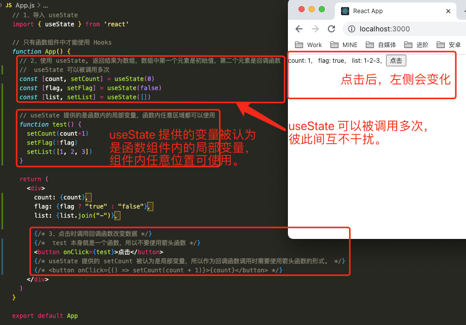

# 1. 006-Hooks

> 从 [P60 开始](https://www.bilibili.com/video/BV1Z44y1K7Fj/?p=60)

## 1.1. Hooks概念理解

本节任务: 能够理解 hooks 的概念及解决的问题

### 1.1.1. 什么是hooks

Hooks 的本质：一套能**够使函数组件更强大，更灵活的“钩子”**。（钩子就是指触发某个事件的时机。）

React 体系里组件分为**类组件**和**函数组件**

经过多年的实战，**函数组件**是一个更加匹配 React 的设计理念 `UI = f(data)`、更有利于逻辑拆分与重用的组件表达形式，而先前的函数组件是不可以有自己的状态的，**为了能让函数组件可以拥有自己的状态，所以从 react v16.8 开始，Hooks 应运而生**

注意：

* 有了 hooks之后，为了兼容老版本，class 类组件并没有被移除，两者都可以使用
* 有了 hooks 之后，不能在把函数称为无状态组件了，因为 hooks 为函数组件提供了状态
* **hooks 只能在函数组件中使用**

### 1.1.2. Hooks解决了什么问题

Hooks 的出现解决了两个问题 ：**组件的状态逻辑复用**  、**class 组件自身的问题**

* 组件的逻辑复用：在 hooks 出现之前，react 先后尝试了 mixins混入，HOC高阶组件，render-props等模式。但是都有各自的问题，比如 mixin 的数据来源不清晰，高阶组件的嵌套问题等等

* class组件自身的问题：class 组件就像一个厚重的‘战舰’ 一样，大而全，提供了很多东西，有不可忽视的学习成本，比如各种生命周期，this 指向问题等等，而我们更多时候需要的是一个轻快灵活的'快艇' 

## 1.2. useState

### 1.2.1. 基础使用

本节任务: 能够学会 `useState` 的基础用法

作用：**`useState` 为函数组件提供状态（state）**

#### 1.2.1.1. 使用步骤

* 导入 `useState` 函数
* 在函数组件中调用 `useState` 函数，并传入状态的初始值
* 从 `useState` 函数的返回值中，拿到状态和修改状态的方法
* 在 JSX 中展示状态
* 调用修改状态的方法更新状态

#### 1.2.1.2. 代码实现


```jsx
import { useState } from 'react'

function App() {
  // 参数：状态初始值。比如,传入 0 表示该状态的初始值为 0
  // 返回值：数组,包含两个值：1 状态值（state） 2 修改该状态的函数（setState）
  // [count, setCount] 是对返回值的解构写法，[ ] 内的成员名称可以自定义，但需要保持语义化。
  const [count, setCount] = useState(0)
  return (
    <button onClick={() => { setCount(count + 1) }}>{count}</button>
  )
}
export default App
```

### 1.2.2. 状态的读取和修改

本节任务: 能够理解 `useState` 下状态的读取和修改

#### 1.2.2.1. 读取状态

该方式提供的状态，**是函数内部的局部变量，可以在函数内的任意位置使用**

#### 1.2.2.2. 修改状态

* `setCount` 是一个函数，参数表示最新的状态值
* 调用该函数后，将使用新值替换旧值
* 修改状态后，由于状态发生变化，会引起视图变化

#### 1.2.2.3. 注意事项

修改状态的时候，**一定要使用新的状态替换旧的状态，不能直接修改旧的状态，尤其是引用类型**

### 1.2.3. 组件的更新过程

本节任务:  能够理解使用 hook 之后组件的更新情况

函数组件使用 `useState` hook 后的执行过程，以及状态值的变化

* 组件第一次渲染
  a. 从头开始执行该组件中的代码逻辑
  b. 调用 `useState(0)` 将传入的参数作为状态初始值，即：0
  c. 渲染组件，此时，获取到的状态 count 值为： 0
* 组件第二次渲染
  a. 点击按钮，调用 `setCount(count + 1)` 修改状态，因为状态发生改变，所以，该**组件会重新渲染**
  b. 组件重新渲染时，会再次执行该组件中的代码逻辑
  c. 再次调用 `useState(0)`，此时 React 内部会拿到最新的状态值而非初始值，比如，该案例中最新的状态值为 1
  d. 再次渲染组件，此时，获取到的状态 count 值为：1

注意：`useState` 的初始值(参数)只会在组件第一次渲染时生效。也就是说，以后的每次渲染，`useState` 获取到都是最新的状态值，React 组件会记住每次最新的状态值

```jsx
import { useState } from 'react'

function App() {
  const [count, setCount] = useState(0)
  // useState(0) 提供的状态，是函数内部的局部变量，可以在函数内的任意位置使用
  // 在这里可以进行打印测试，每次触发下方的点击事件 count 的值都是新的。
  console.log(count)
  return (
    <button onClick={() => { setCount(count + 1) }}>{count}</button>
  )
}
export default App
```


### 1.2.4. 使用规则

本节任务:  能够记住 `useState` 的使用规则

#### 1.2.4.1. 可多次执行

`useState` 函数**可以执行多次，每次执行互相独立，每调用一次为函数组件提供一个状态**

```jsx
function List(){
  // 以字符串为初始值
  const [name, setName] = useState('cp')
  // 以数组为初始值
  const [list,setList] = useState([])
}
```

补充示例：



```jsx
// 1、导入 useState
import { useState } from 'react'

// 只有函数组件中才能使用 Hooks 
function App() {
  // 2、使用 useState, 返回结果为数组，数组中第一个元素是初始值，第二个元素是回调函数
  //  useState 可以被调用多次
  const [count, setCount] = useState(0)
  const [flag, setFlag] = useState(false)
  const [list, setList] = useState([])

  // useState 提供的是函数内的局部变量，函数内任意区域都可以使用
  function test() {
    setCount(count+1)
    setFlag(!flag)
    setList([1, 2, 3])
  }

  return (
    <div>
      count: {count}，
      flag: {flag ? "true" : "false"}，
      list: {list.join("-")}，

      {/* 3、点击时调用回调函数改变数据 */}
      {/*  test 本身就是一个函数，所以不要使用箭头函数 */}
      <button onClick={test}>点击</button>
      {/* useState 提供的 setCount 被认为是局部变量，所以作为回调函数调用时需要使用箭头函数的形式。 */}
      {/* <button onClick={() => setCount(count + 1)}>{count}</button> */}
    </div>
  )
}

export default App
```

#### 1.2.4.2. 注意事项

`useState` 注意事项：

* **只能出现在函数组件或者其他 hook 函数中**

* 只能**直接定义在函数组件中**，**不能嵌套在 if/for/其它函数中**（ react 按照 hooks 的调用顺序识别每一个hook）。

```jsx
let num = 1
function List(){
  num++
  if(num / 2 === 0){
     const [name, setName] = useState('cp') 
  }
  const [list,setList] = useState([])
}
// 俩个 hook 的顺序不是固定的，这是不可以的！！！
```

#### 1.2.4.3. 调试工具中查看 hooks

> 要调试 React 页面或查看 React 编译后的数据结构，就需要在 Chrome 浏览器中安装 `React Developer tools` 插件。
>
> 安装完插件之后，通过 `yarn build` 命令构建项目，然后在用 `yarn start` 运行项目。此时，在 Chrome 开发者工具页面就可以看到 `Components` 和 `Profile` 页签：

可以通过开发者工具查看 hooks 状态


## 1.3. useEffect

### 1.3.1. 理解函数副作用

本节任务: 能够理解副作用的概念

副作用：是相对于主作用来说的，一个函数除了主作用，其他的作用就是副作用。**对于 React 组件来说，主作用就是根据数据（state/props）渲染 UI，除此之外都是副作用（比如，手动修改 DOM）**

常见的副作用：数据请求 ajax 发送、手动修改 dom、localstorage 操作

`useEffect` 函数的作用就是**为 react 函数组件提供副作用处理**的！

### 1.3.2. 基础使用

本节任务: 能够学会 `useEffect` 的基础用法并且掌握默认的**执行时机**

作用：**为 react 函数组件提供副作用处理（提供 Dom 处理）**

#### 1.3.2.1. 使用步骤

* 导入 `useEffect` 函数
* 调用 `useEffect` 函数，**并传入回调函数**
* 在回调函数中编写副作用处理（dom 操作）
* 修改数据状态
* 检测副作用是否生效

#### 1.3.2.2. 代码实现


```jsx
// 1、导入 useState、useEffect
import { useEffect, useState } from 'react'

// 只有函数组件中才能使用 Hooks 
function App() {
  // 2、使用 useState, 返回结果为数组，数组中第一个元素是初始值，第二个元素是回调函数
  //  useState 可以被调用多次
  const [count, setCount] = useState(0)

  // 3、使用 useEffect 定义副作用
  useEffect(() => {
    // dom 操作-改变页面的标题
    document.title = count
  })

  return (
    <div>
      count: {count}，
      {/* 4、触发改变 count 的操作--主作用 */}
      {/* useState 提供的 setCount 被认为是局部变量，所以作为回调函数调用时需要使用箭头函数的形式。 */}
      <button onClick={() => setCount(count + 1)}>点击改变 count </button>
    </div>
  )
}

export default App
```

### 1.3.3. 通过依赖项控制执行时机

本节任务: 能够学会**使用依赖项控制副作用的执行时机**

这里所说的 **依赖项**，就是 `useEffect()` 函数的第二个参数。第二个参数不同，`useEffect()` 函数的执行时机和执行次数也会不同。

#### 1.3.3.1. 不添加依赖项

组件首次渲染执行一次，以及不管是哪个**状态更改引起组件更新时都会重新执行**

* 组件初始渲染
* 组件更新 （不管是哪个状态引起的更新）

```jsx
useEffect(()=>{
    console.log('副作用执行了')
})
```


#### 1.3.3.2. 添加空数组

组件只在**首次渲染时执行一次**

```jsx
useEffect(()=>{
	 console.log('副作用执行了')
},[])
```


#### 1.3.3.3. 添加特定依赖项

副作用函数在首次渲染时执行一次，在**依赖项发生变化时再次执行**。

如果在依赖项数组中指定了多个特定依赖项，只要其中一个发生变化就会触发 `useEffect` 中的副作用。


```jsx
// 1、导入 useState、useEffect
import { useEffect, useState } from 'react'

// 只有函数组件中才能使用 Hooks 
function App() {
  // 2、使用 useState, 返回结果为数组，数组中第一个元素是初始值，第二个元素是回调函数
  //  useState 可以被调用多次
  const [count, setCount] = useState(0)
  const [name, setName] = useState('CnPeng')

  // 3、使用 useEffect 定义副作用， 第二个参数为 useEffect 的依赖项数组，
  // 当数组中元素的值发生变化时，才会执行该副作用
  useEffect(() => {
    console.log("【副作用执行了】", count);
    // dom 操作-改变页面的标题
    document.title = count
  }, [count])

  return (
    <div>
      count: {count} ,
      name: {name} ,
      {/* 4、触发改变 count 的操作--主作用 */}
      {/* useState 提供的 setCount 被认为是局部变量，所以作为回调函数调用时需要使用箭头函数的形式。 */}
      <button onClick={() => setCount(count + 1)}>点击改变 count </button>
      <button onClick={() => setName("CNPENG")}>点击改变 name </button>
    </div>
  )
}

export default App
```

注意事项：

* `useEffect` 回调函数中用到的数据（比如，count）就是依赖数据，就应该出现在依赖项数组中**，如果不添加依赖项可能会有 bug 出现


### 1.3.4. 清理副作用

如果想要清理副作用，可以**在副作用函数中的末尾 return 一个新的函数，在新的函数中编写清理副作用的逻辑**。

注意执行时机为：

* 组件卸载时自动执行
* 组件更新时，下一个 `useEffect` 副作用函数执行之前自动执行

```jsx
import { useEffect, useState } from "react"

const App = () => {
  const [count, setCount] = useState(0)

  useEffect(() => {
    const timerId = setInterval(() => {
      setCount(count + 1)
    }, 1000)

    return () => {
      // 用来清理副作用的事情
      clearInterval(timerId)
    }
  }, [count])

  return (
    <div>
      {count}
    </div>
  )
}

export default App
```

## 1.4. 阶段练习 - 自定义hook

### 1.4.1. 练习1-获取垂直滚动距离

自定义一个 hook 函数，实现获取滚动距离 Y


* App.js

```jsx
import { useWindowScroll } from './hooks/useWindowScroll'

// 只有函数组件中才能使用 Hooks 
function App() {
  const [scrollY] = useWindowScroll()

  return (
    // 定义一个高于当前窗口的高度，让内容能够滚动。
    <div style={{ height: '1200px' }}>
      {scrollY}
    </div>
  )
}

export default App
```

* useWindowScroll.jsx

```jsx
// 1、导入要使用的内容
import { useState, useEffect } from "react"

export function useWindowScroll() {
    // 2、定义函数内局部变量
    const [y, setY] = useState(0);

    // 3、定义副作用
    useEffect(() => {
        const scrollHandler = () => {
            // 3-1、获取距离视窗顶部的距离，并设置给 y 
            const h = document.documentElement.scrollTop
            setY(h)
        }

        // 3-2、添加监听
        window.addEventListener('scroll', scrollHandler)

        // 4、清理副作用，下一次调用 useEffect 前会执行该清理逻辑
        return () => window.removeEventListener('scroll', scrollHandler)
    })

    return [y]
}
```


### 1.4.2. 练习2-存储数据到本地

自定义 hook 函数，实现将数据存储到到本地 `LocalStorage` 的操作


* App.js

```jsx
import { useLocalStorage } from './hooks/useLocalStorage'

// 只有函数组件中才能使用 Hooks 
function App() {
  const [msg, setMsg] = useLocalStorage('msg-key', 'Hello World')

  // 启用定时器，3s 后改变 msg 内容。
  setTimeout(() => {
    setMsg('你好，CnPeng!')
  }, 3000)

  return (
    <div>
      {msg}
    </div>
  )
}

export default App
```

* useLocalStorage.js

```jsx
import { useEffect, useState } from "react"

// 1、定义函数。调用该函数时需传入 key 和 初始值
export function useLocalStorage(key, initialValue) {
    // 2、定义要接收值的变量和改变其值的方法，及其默认值
    const [message, setMessage] = useState(initialValue)

    // 3、定义副作用函数，当 key/message 发生变化时，调用该函数
    useEffect(() => {
        // 存储数据到本地存储中
        window.localStorage.setItem(key, message)
    }, [key, message])

    // 4、将变量和方法作为返回值暴露出去
    return [message, setMessage]
}
```

## 1.5. useState - 以回调函数作为 参数

本节任务:  能够理解 useState 回调函数作为参数的使用场景

### 1.5.1. 使用场景

**参数只会在组件的初始渲染中起作用**，后续渲染时会被忽略。

如果初始 state 需要通过计算才能获得，则可以传入一个函数，在函数中计算并返回初始的 state，此函数只在初始渲染时被调用。

### 1.5.2. 语法

```jsx
const [name, setName] = useState(()=>{
  // 编写计算逻辑
  return '计算之后的初始值'
})
```

* 将回调函数作为 `useState()` 的参数时， `return` 出去的值将作为 name 的初始值
* **回调函数中的逻辑只会在组件初始化的时候执行一次**

### 1.5.3. 语法选择

* 如果就是初始化一个普通的数据，直接使用 `useState(普通数据)` 即可
* 如果要初始化的数据需要通过计算才能获取到，使用 `useState(()=>{})`

### 1.5.4. 示例

效果：实现一个自增按钮，自增按钮的初始值由外部传入。


```jsx
import { useState } from 'react'

// 1、自定义函数组件。只有函数组件中才能使用 hooks
function Counter(props) {
  // 2、以回调函数作为 useState 的参数
  // 以回调函数的返回值作为初始值。
  const [count, setCount] = useState(() => {
    return props.initial
  })

  return (
    <div>
      {/* 展示 count 值 , 点击按钮时改变 count 值*/}
      <button onClick={() => { setCount(count + 1) }}>{count}</button>
    </div>
  )
}

function App() {
  return (
    <>
      {/* 使用 Counter 组件，并传入初始值 */}
      <Counter initial={10} />
      <Counter initial={20} />
    </>
  )
}

export default App
```


## 1.6. useEffect - 发送网络请求 

本节任务:  能够掌握使用 `useEffect` hook 发送网络请求

### 1.6.1. 使用场景

如何在 `useEffect` 中发送网络请求，并且封装同步 `async` `await` 操作

### 1.6.2. 语法要求

不可以将 `useEffect` 的回调函数直接用 `async` 包裹成异步的 ，因为**异步会导致清理函数无法立即返回**。

```jsx
// ❌ 错误示例 ❌ 不能直接用 async 修饰回调函数，必须在回调函数内部单独再定义异步函数，并调用。 
useEffect(async ()=>{
    const res = await axios.get('http://geek.itheima.net/v1_0/channels')
    console.log(res)
},[])
```

### 1.6.3. 正确写法

**在回调函数内部单独定义一个函数，然后把这个函数包装成异步**：

```jsx
useEffect(()=>{
    async function fetchData(){
       const res = await axios.get('http://geek.itheima.net/v1_0/channels')
       console.log(res)
    }
    fetchData()
},[])
```

完整示例：

```jsx
import { useEffect } from 'react'

// useEffect 的依赖项（即方法中的第二个参数）和执行时机
// 1、不加依赖项，仅有回调函数时——初始化和任意数据状态发生变化时都会执行
// 2、以 [] 作为依赖项，仅在初始化时执行一次
// 3、包含 xx 元素的非空数组 [xx]， 初始化时和数据状态发生变化时会执行


function App() {
  useEffect(() => {
    async function loadData() {
      // 使用自带的网络请求方式
      const res = await fetch("http://geek.itheima.net/v1_0/channels")
      console.log(res)
    }
    // 调用定义的异步函数
    loadData()
  }, [])

  return (
    <div></div>
  )
}

export default App
```

>上面的代码中使用了原生的 `fetch` 进行网络请求，[点击可以查看 fetch 的完整信息](https://developer.mozilla.org/zh-CN/docs/Web/API/Fetch_API/Using_Fetch)。


## 1.7. useRef

[对应 B 站视频](https://www.bilibili.com/video/BV1Z44y1K7Fj?p=72)

本节任务:  能够掌握使用 `useRef` 获取真实 dom 或组件实例的方法

### 1.7.1. 使用场景

**在函数组件中获取真实的 dom 元素对象或者是组件对象**

### 1.7.2. 使用步骤

* 导入 `useRef` 函数
* 执行 `useRef` 函数并传入 null，返回值为一个对象，内部有一个 `current` 属性存放拿到的 dom 对象（组件实例）
* 在标签中通过 `ref` 属性将前一步获取的对象绑定到元素或者组件上

### 1.7.3. 获取 dom

```jsx
// 1、导入 useRef 函数
import { useEffect, useRef } from 'react'

function App() {
    // 2、调用 useRef 函数，返回实例对象
    const h1Ref = useRef(null)
    useEffect(() => {
        console.log(h1Ref)
    },[])
    return (
        <div>
            <!-- 3、使用 ref 属性绑定组件和实例对象 -->
            <h1 ref={ h1Ref }>this is h1</h1>
        </div>
    )
}

export default App
```

### 1.7.4. 获取类组件实例

函数组件由于没有实例，不能使用 `ref` 获取；如果**想获取组件实例，必须是类组件**。

#### 1.7.4.1. 示例1

```jsx
// 定义类组件
class Foo extends React.Component {
    sayHi = () => {
        console.log('say hi')
    }
    render(){
        return <div>Foo</div>
    }
}

export default Foo
```


```jsx
// 获取类组件实例
// 1、导入 useEffetc
import { useEffect, useRef } from 'react'
import Foo from './Foo'

function App() {
    // 2、调用 useRef 获取实例
    const h1Foo = useRef(null)
    useEffect(() => {
        console.log(h1Foo)
    }, [])
    return (
        // 3、使用 ref 属性将组件和实例绑定
        <div> <Foo ref={ h1Foo } /></div>
    )
}
export default App
```

### 1.7.5. 示例2

```jsx
// 1、导入 useRef
import React, { useEffect, useRef } from 'react'

// 定义一个类组件
class TestC extends React.Component {
  render() {
    return (
      <div>这是自定义的类组件</div>
    )
  }
}

function App() {
  // 2、调用方法获取组件/元素实例
  const testCRef = useRef(null)
  const h1Ref = useRef(null)

  useEffect(() => {
    console.log("【testCRef】", testCRef)
    console.log("【h1Ref】", h1Ref)
  }, [])

  return (
    <>
      <TestC ref={testCRef}></TestC>
      <h1 ref={h1Ref}>H1标题</h1>
    </>
  )
}

export default App
```


## 1.8. useContext

[对应 B 站视频 p73](https://www.bilibili.com/video/BV1Z44y1K7Fj?p=73)

本节任务:  能够掌握 hooks 下的 `context` 使用方式

### 1.8.1. 实现步骤

* 使用 `createContext` 创建 Context 对象
* 在顶层组件通过 `Provider` 提供数据
* 在底层组件通过 `useContext` 函数获取数据

### 1.8.2. 代码实现

```jsx
import { createContext, useContext } from 'react'
// 1、创建 Context 对象
const Context = createContext()

function Bar() {
    // 3、底层组件通过 useContext 函数获取数据
    const name = useContext(Context)
    return <div>Bar {name}</div>
}

function Foo() {
    return <div>Foo <Bar/></div>
}

function App() {
    return (
        // 2、顶层组件通过 Provider 提供数据
        <Context.Provider value={'this is name'}>
            <div><Foo/></div>
        </Context.Provider>
    )
}

export default App
```

## 1.9. 阶段练习-todoMvc-hook版

### 1.9.1. 运行案例仓库

案例仓库地址：[https://gitee.com/react-course-series/react-tomvc-hook](https://gitee.com/react-course-series/react-tomvc-hook)

* 克隆项目到本地

```bash
$ git clone  https://gitee.com/react-course-series/react-tomvc-hook.git
```

* 安装必要依赖

```bash
$ yarn
```

* 开启 mock 接口服务，保持窗口不关闭  ！！！！！

```bash
# 2. 启动mock服务
$ yarn mock-serve
```

* 另起一个 bash 窗口开启前端服务

```bash
$ yarn start
```

* 浏览器输入 localhost:3000 演示效果。

### 1.9.2. 项目开发步骤

* 切换到 todo-test 分支

```bash
$ git checkout todo-test
```

* 打开 app.js

已有基础样板代码，在这个基础上编写业务逻辑即可

* 接口文档

接口作用 | 接口地址 | 接口方法 | 接口参数
---|---|---|---
获取列表 | http://localhost:3001/data | GET | 无
删除 | http://localhost:3001/data/:id | DELETE | id
搜索 | http://localhost:3001/data/?name=keyword | GET | name（以 name 字段搜索）

### 1.9.3. 实现功能

功能	| 核心思路
---|---
表格数据渲染 | `elementPlus`、`el-table`组件使用
删除功能 | 获取当前 id ，调用接口
搜索功能 | 用的依旧是列表接口，多传一个 name 参数
清除搜索功能 | 清空搜索参数，重新获取列表