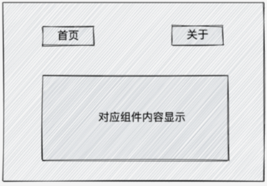
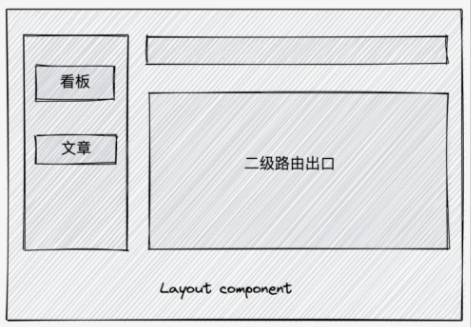
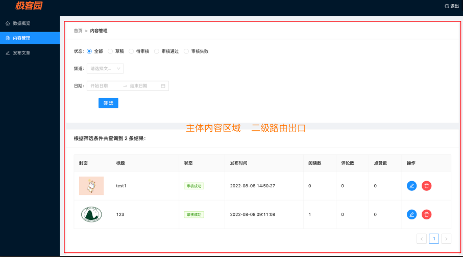

# 1. 008-ReactRouter

## 1.1. 前置知识和环境搭建

### 1.1.1. 单页应用

只有一个 html 文件  主流的开发模式变成了通过路由进行页面切换 

优势: 避免整体页面刷新  用户体验变好

弊端：前端负责事情变多了  开发的难度变大

### 1.1.2. 路由的本质

概念来源于后端 : 一个路径表示匹配一个服务器资源。如：`/a.html` 表示 a 对应的文件资源，`/b.html` 表示 b 对应的文件资源

共同的思想: 一对一的关系

前端的路由:  一个路径 path 对应唯一的一个组件（comonent），当我们访问一个 path  时自动渲染 path 对应的组件

```jsx
const routes = [
  {
    path:'/home',
    component: Home
  },
   {
    path:'/about',
    component: About
  },
   {
    path:'/article',
    component: Article
  }
]
```

### 1.1.3. 准备项目环境

`create-react-app`  -> `cra`  -> `webpack`

`vite`: 可以实现 `cra` 同等能力，但速度更快的打包工具  [尤大]

使用 `vite` 新增一个 React 项目，然后安装一个 v6 版本的 `react-router-dom`

```bash
# 创建 react 项目.
# 语法格式：yarn create vite <项目名> --template h5框架名
$ yarn create vite react-router --template react

# 安装所有依赖包
$ yarn

# 启动项目
$ yarn dev

# 安装 react-router 包
$ yarn add react-router-dom@6
```

## 1.2. 基础使用

需求:  准备俩个按钮，点击不同按钮切换不同组件内容的显示

### 1.2.1. 实现步骤

* 导入必要的路由 router 内置组件
* 准备俩个 React 组件
* 按照路由的规则进行路由配置



```jsx
// app.jsx
// 1、引入必要的内置组件
import { BrowserRouter, Routes, Route, Link } from 'react-router-dom'

// 2、准备两个路由组件
const Home = () => <div>this is home</div>
const About = () => <div>this is about</div>

function App() {
  return (
    <div className="App">
      {/* 按照规则配置路由 */}
      <BrowserRouter>
        {/*定义跳转关系*/}
        <Link to="/">首页</Link>
        <Link to="/about">关于</Link>

        {/*将路由和组件进行关联，路由匹配时对应的组件将被自动渲染*/}
        <Routes>
          <Route path="/" element={<Home />}></Route>
          <Route path="/about" element={<About />}></Route>
        </Routes>
      </BrowserRouter>
    </div>
  )
}

export default App
```


### 1.2.2. 核心内置组件说明

#### 1.2.2.1. BrowerRouter

作用：包裹整个应用，**一个 React 应用只需要使用一次**

模式 | 实现方式 | 路由 url 表现
---|---|---
HashRouter | 监听 url hash 值实现 | http://localhost:3000/#/about
BrowerRouter | h5 的 `history.pushState` API实现 | http://localhost:3000/about

#### 1.2.2.2. Link

作用:：用于**指定导航链接**，完成声明式的路由跳转。类似于 `<router-link/>`

这里 `to` 属性用于指定路由地址，表示要跳转到哪里去。 `Link` 组件最终会被渲染为原生的 `a` 链接：

```html
<Link to ="/path">页面1 </Link>
```

#### 1.2.2.3. Routes

作用：提供一个路由出口，组件内部会存在多个内置的 `Route` 组件，满足条件的路由会被渲染到组件内部。

类比 `router-view`

```html
{/*将路由和组件进行关联，路由匹配时对应的组件将被自动渲染*/}
<Routes>
    <Route path="/" element={<Home />}></Route>
    <Route path="/about" element={<About />}></Route>
</Routes>
```

#### 1.2.2.4. Route

作用：用于定义路由和组件的对应关系

其中 `path` 属性用来指定匹配的路径地址，`element` 属性指定要渲染的组件：

```html
{/*将路由和组件进行关联，路由匹配时对应的组件将被自动渲染*/}
<Route path="/about" element={<About />}></Route>
```

上述代码中，路由 `/about` 对应的组件是 `About`。但切换到 `/about` 路由时，对应的 About 组件将会被自动渲染。

## 1.3. 编程式导航

声明式 ：使用 Link to 关联并跳转
编程式 ：调用**路由方法**进行路由跳转

概念:  通过 js 编程的方式进行路由页面跳转。

### 1.3.1. 实现步骤

* 导入一个 `useNavigate` 钩子函数
* 执行 `useNavigate` 函数，得到跳转函数
* 在事件中执行跳转函数完成路由跳转

### 1.3.2. 代码示例

```jsx
// pages/Home.js

// 1、导入useNavigate函数
import { useNavigate } from 'react-router-dom'

const Home = () => {
  // 执行函数
  const navigate = useNavigate()
  return (
    <div>
      Home
      <button onClick={ ()=> navigate('/about') }> 跳转关于页 </button>
    </div>
  )
}

export default Home
```

如果在跳转时**不想添加历史记录**，可以添加额外参数 `replace` 为 `true`

```jsx
navigate('/about', { replace: true } )
```

## 1.4. 路由传参

场景：跳转路由的同时需要传递参数  

### 1.4.1. searchParams传参

通过查询参数传递。

* 路由传参：

```js
navigate('/about?id=1001')
```

* 从路由取参：

```js
let [params] = useSearchParams()
let id = params.get('id')
```

### 1.4.2. params传参

在路径中传递参数。

* 路由传参

```js
navigate('/about/1001')
```

* 从路由取参

```js
let params = useParams()
// CnPeng : 下面这个 id 是基于什么确定的？如何知道传递进来的是 id 还是 name ?
let id = params.id
```


## 1.5. 嵌套路由

场景：在我们做的很多的管理后台系统中，通常我们都会设计一个 Layout 组件，在它内部实现嵌套路由



### 1.5.1. 实现步骤：

* `App.js`组件中定义路由嵌套关系：
* `Layout.js` 组件中使用 `<Outlet/>` 组件添加二级路由出口：

### 1.5.2. 代码示例

* `App.js`组件中定义路由嵌套关系：

```jsx
// App.js
<Routes>
  <Route path="/"  element={<Layout/>}>
    <Route path="board" element={ <Board/> } />
    <Route path="article" element={ <Article/> } />
  </Route>
   { /* 省略部分  */ }
</Routes>
```

* `Layout.js` 组件中使用 `<Outlet/>` 组件添加二级路由出口：

```jsx
// Layout.js
import { Outlet } from 'react-router-dom'

const Layout = () => {
  return (
    <div>
      layout

      { /* 二级路由的path等于 一级path + 二级path  */ }
      <Link to="/board">board</Link>
      <Link to="/article">article</Link>

      { /* 二级路由出口 */ }
      <Outlet/>
    </div>
  )
}
export default Layout
```

## 1.6. 默认二级路由

场景: 应用首次渲染完毕就需要显示的二级路由

### 1.6.1. 实现步骤:

* 给默认二级路由标记 `index` 属性
* 把原本的路径 `path` 属性去掉

### 1.6.2. 代码示例

* 在需要进行默认展示的路由上添加 `index` 属性，并去除 `path` 属性：

```jsx
// App.js
<Routes>
  <Route path="/"  element={<Layout/>}>
    <Route index element={ <Board/> } />
    <Route path="article" element={ <Article/> } />
  </Route>
</Routes>
```

* 使用路由：

```jsx
//pages/Layout.jsx

import { Outlet } from 'react-router-dom'

const Layout = () => {
  return (
    <div>
      layout

      { /* 默认二级不再具有自己的路径  */ }
      <Link to="/">board</Link>
      <Link to="/article">article</Link>

      { /* 二级路由出口 */ }
      <Outlet/>
    </div>
  )
}
```

## 1.7. 404路由配置

场景：路由配置中找不到对应的 path 时使用 404 兜底组件进行渲染

* 准备一个 NotFound 组件

```jsx
// pages/NotFound.jsx

const NotFound = () => {
  return <div>this is NotFound</div>
}

export default NotFound
```

* 在路由组中声明 404 组件和路由：

```jsx
// App.js
<BrowserRouter>
  <Routes>
    <Route path="/" element={<Layout />}>
      <Route index element={<Board />} />
      <Route path="article" element={<Article />} />
    </Route>
    <Route path="*" element={<NotFound />}></Route>
  </Routes>
</BrowserRouter>
```

尝试访问一个不存在的路径，查看效果~

## 1.8. 集中式路由配置

场景: 当我们需要路由权限控制点时, 对路由数组做一些权限的筛选过滤。

**集中式路由配置**：用一个数组来定义所有路由和组件的对应关系，然后用该数组来替换 `Roues` 组件。

```jsx
import { BrowserRouter, Routes, Route, useRoutes } from 'react-router-dom'

import Layout from './pages/Layout'
import Board from './pages/Board'
import Article from './pages/Article'
import NotFound from './pages/NotFound'

// 1. 准备一个路由数组，数组中定义所有的路由对应关系
const routesList = [
  {
    path: '/',
    element: <Layout />,

    children: [
      {
        element: <Board />,
        index: true, // index设置为true 变成默认的二级路由
      },
      {
        path: 'article',
        element: <Article />,
      },
    ],
  },

  // 增加n个路由对应关系
  {
    path: '*',
    element: <NotFound />,
  },
]

// 2. 使用 useRoutes 方法传入 routesList 生成 Routes 组件
function WrapperRoutes() {
  let element = useRoutes(routesList)
  return element
}

function App() {
  return (
    <div className="App">
      <BrowserRouter>
        {/* 3. 替换之前的Routes组件 */}
        <WrapperRoutes />
      </BrowserRouter>
    </div>
  )
}

export default App
```

## 1.9. 路由练习

需求如下：

* 使用 vite 创建一个新的项目
* 在项目中全局安装组件库 antDesign   文档地址:  [https://ant.design/](https://ant.design/)
* 准备一个一级路由，使用 antDesign 中的布局组件实现如下图 Layout 页面的布局方式
    * [查看 Layout 组件](https://ant.design/components/layout-cn/)
    *[查看 Menu 组件](https://ant.design/components/menu-cn/)并使用 <4.2.0 的写法
* 准备三个二级路由，分别是数据概览、内容管理、发布文章，在 Layout 组件内部的主体部分实现点击左侧菜单切换二级路由内容显示
* 将数据概览路由作为默认渲染的二级路由
* 设置 404 一级路由页，在无法匹配的时候做兜底显示  [404页面 UI 不做要求]
* 在内容管理组件中增加一个按钮，点击可以跳转到发布文章路由，并且传递一个参数 id = 100



参考链接：[https://gitee.com/react-cp/react-pc-code/blob/master/src/pages/Layout/index.js](https://gitee.com/react-cp/react-pc-code/blob/master/src/pages/Layout/index.js)

