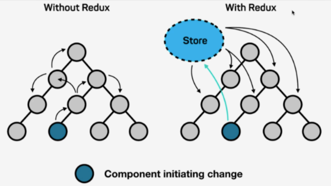
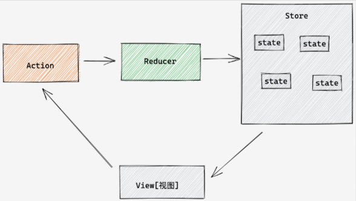
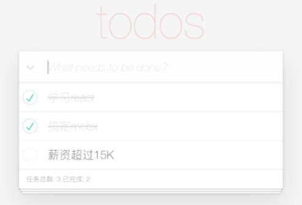

# 1. 010-Redux

原文：[https://www.yuque.com/fechaichai/qeamqf/omg1xi](https://www.yuque.com/fechaichai/qeamqf/omg1xi)


## 1.1. Redux介绍

Redux 是 React 中使用广泛的**集中状态管理工具**，类比 vuex 之于 vue，同类的工具还有 mobx 等。



为什么要使用 Redux：

* **独立于组件，无视组件之间的层级关系，简化通信问题**
* 单项数据流清晰，易于定位 bug
* 调试工具配套良好，方便调试

## 1.2. Redux快速体验

### 1.2.1. Redux数据流架构

Redux 的难点是理解它对于数据修改的规则, 下图动态展示了在整个数据的修改中，数据的流向：



为了职责清晰，Redux 代码被分为三个核心的概念。我们学 redux，其实就是学这三个核心概念之间的配合，三个概念分别是:

* `state`:  一个对象，**存放**着我们管理的数据
* `action`:  一个对象，用来描述你想怎么**改数据**
* `reducer`:  一个函数，根据 action 的描述 **更新** state

### 1.2.2. 纯Redux实现计数器

核心步骤：

* 创建 reducer 函数，在内部定义好 action 和 state 的**定义关系**
* 调用 Redux 的 `createStore` 方法传入定义好的 reducer 函数生成 store 实例
* 通过 store 实例身上的 subscribe 方法**监控数据**是否变化
* 点击按钮，通过专门的 `dispatch` 函数提交 action 对象，实现**数据更新**

```jsx
<button id="decrement">-</button>
<span id="count">0</span>
<button id="increment">+</button>

<script src="https://unpkg.com/redux@latest/dist/redux.min.js"></script>

<script>
  // 1、定义reducer函数
  // 内部主要的工作是根据不同的 action 返回不同的 state
  function counterReducer (state = { count: 0 }, action) {
    switch (action.type) {
      case 'INCREMENT':
        return { count: state.count + 1 }
      case 'DECREMENT':
        return { count: state.count - 1 }
      default:
        return state
    }
  }

  // 2、使用 reducer 函数生成 store 实例
  const store = Redux.createStore(counterReducer)

  // 3、订阅数据变化
  store.subscribe(() => {
    console.log(store.getState())
    document.getElementById('count').innerText = store.getState().count
  })

  // 增
  const inBtn = document.getElementById('increment')
  inBtn.addEventListener('click', () => {
    store.dispatch({
      type: 'INCREMENT'
    })
  })
  // 减
  const dBtn = document.getElementById('decrement')
  dBtn.addEventListener('click', () => {
    store.dispatch({
      type: 'DECREMENT'
    })
  })
</script>
```


## 1.3. Redux与React

Redux 虽然是一个框架无关可以独立运行的插件，但是社区通常还是把它与 React 绑定在一起使用，以一个计数器案例体验一下 Redux + React 的基础使用

### 1.3.1. 开发环境准备

使用 `create-react-app` 创建 react 基础项目，并安装 Redux 相关工具

```bash
# 创建项目
# yarn create vite 项目名 --template 前端框架名
$ yarn create vite react-redux --template react


# 安装redux配套工具
$ yarn add  @reduxjs/toolkit react-redux

# 启动项目
$ yarn dev
```

目录核心结构：

```
src
  - store
    - modules  // 模块store
    - index.js // 组合模块的入口文件
  - App.js
```

### 1.3.2. 创建counterStore

创建 store 的的核心步骤分为两步：

* 使用 toolkit 的 `createSlice` 方法创建一个独立的子模块
* 使用 `configureStore` 语法组合子模块

1- 创建子模块：

```jsx
// store/modules/counterStore.js

import { createSlice } from '@reduxjs/toolkit'

const counter = createSlice({
  // 模块名称独一无二
  name: 'counter',
  // 初始数据
  initialState: {
    count: 1
  },
  // 修改数据的同步方法
  reducers: {
    add (state) {
      state.count++
    }
  }
})

const { add } = counter.actions
const reducer = counter.reducer

// 导出修改数据的函数
export { add }
// 导出reducer
export default reducer
```

2- 组合子模块：

```jsx
// store/index.js

import { configureStore } from '@reduxjs/toolkit'

import counterStore from './counterStore'

export default configureStore({
  reducer: {
    // 注册子模块
    counterStore
  }
})
```

### 1.3.3. 为React提供Redux store

要想让所有的组件都有资格访问 store 中的数据，需要我们**在入口文件中，渲染根组件的位置通过 Provider 提供 store 数据**。

```jsx
// main.jsx

import React from 'react'
import ReactDOM from 'react-dom/client'
import App from './App'
// 导入store
import store from './store'
// 导入store提供组件Provider
import { Provider } from 'react-redux'

ReactDOM.createRoot(document.getElementById('root')).render(
  // 提供store数据
  <Provider store={store}>
    <App />
  </Provider>
)
```

### 1.3.4. 组件使用store中的数据

组件使用 store 中的数据需要借助一个 hook 方法，叫做 `useSelector`。

`useSelector(state => state.模块名)` 方法的**返回值为一个对象，对象中包含 store 子模块中的所有数据**。

```jsx
import { useSelector } from 'react-redux'

function App () {
  // 使用数据
  const { count } = useSelector(state => state.counterStore)

  return (
    <div className="App">
      {count}
      <button onClick={clickHandler}>+</button>
    </div>
  )
}

export default App
```

### 1.3.5. 组件修改store中的数据

修改 store 中的数据有俩个核心步骤：

* 使用 counterStore 模块中导出的 add 方法创建 action 对象
* 通过 `dispatch` 函数以 action 作为参数传入完成数据更新

```jsx
import { useSelector, useDispatch } from 'react-redux'
import { add } from './store/counterStore'

function App () {
  // 1-1 使用数据
  const { count } = useSelector(state => state.counterStore)
  // 2-1、修改数据-声明 dispatch
  const dispatch = useDispatch()
  const clickHandler = () => {
    // 2-2、修改数据-生成action对象
    const action = add()
    // 2-3、修改数据-提交action进行数据更新
    dispatch(action)
  }
  return (
    <div className="App">
      {/* 1-2 使用数据 */}
      {count}
      <button onClick={clickHandler}>+</button>
    </div>
  )
}

export default App
```

### 1.3.6. 组件修改数据并传参

上一小节通过 `dispatch` 函数提交 action 修改了数据，如果在提交的时候需要传参怎么做呢？

* 修改数据的方法中补充第二个参数 action：

```jsx
import { createSlice } from "@reduxjs/toolkit"

const counterStore = createSlice({
  name: 'counter', // 独一无二不重复的名字语义化
  // 定义初始化的数据
  initialState: {
    taskList: ['react']
  },
  reducers: {
    // action 为一个对象，对象中有一个固定的属性叫做 payload 为传递过来的参数
    addTaskList (state, action) {
      state.taskList.push(action.payload)
    }
  }
})

// 生成修改数据的方法并导出
const { addTaskList } = counterStore.actions
export { addTaskList }

// 生成reducer，导出供 index.js 做组合模块
const reducer = counterStore.reducer
export default reducer
```

* dispatch 的时候传入实参：

```jsx
<button onClick={() => dispatch(addTaskList('vue'))}>addList</button>
```

### 1.3.7. Redux异步处理

测试接口地址：  [http://geek.itheima.net/v1_0/channels'](http://geek.itheima.net/v1_0/channels)

```jsx
import { createSlice } from '@reduxjs/toolkit'
import axios from 'axios'

const channelStore = createSlice({
  name: 'task',
  initialState: {
    channels: []
  },
  reducers: {
    setChannels (state, action) {
      state.channels = action.payload
    }
  }
})


// 创建异步
const { setChannels } = channelStore.actions
const url = 'http://geek.itheima.net/v1_0/channels'
// 封装一个函数，在函数中 return 一个新函数，在新函数中封装异步
// 得到数据之后通过 dispatch 函数，触发修改
const fetchChannelList = () => {
  return async (dispatch) => {
    const res = await axios.get(url)
    dispatch(setChannels(res.data.data.channels))
  }
}

export { fetchChannelList }

const reducer = channelStore.reducer
export default reducer
```

```jsx
import { useEffect } from 'react'
import { useSelector, useDispatch } from 'react-redux'
import { fetchChannelList } from './store/channelStore'

function App () {
  // 使用数据
  const { channels } = useSelector(state => state.channelStore)

  useEffect(() => {
    const action = fetchTaskList()
    dispatch(action)
  }, [dispatch])

  return (
    <div className="App">
      <ul>
        {channels.map(task => <li key={task.id}>{task.name}</li>)}
      </ul>
    </div>
  )
}

export default App
```

## 1.4. Todos综合案例



### 1.4.1. 准备开发环境

```bash
# 克隆项目到本地
$ git clone https://gitee.com/react-course-series/react-redux.git

# 安装所有依赖

$ yarn
# or
$ npm i
```

### 1.4.2. 渲染列表

* 在组件中通过核心方法 `useSelector` 方法使用数据
* 使用 map 方法进行列表遍历

```jsx
// app.js

// 导入useSelector方法
import { useSelector } from 'react-redux'

// 从store中获取list数据
const { list } = useSelector(state => state.taskStore)

// 渲染列表
<ul className="todo-list">
  {list.map((task) => (
    <li key={task.id} className={task.done ? 'completed todo' : 'todo'}>
      <div className="view">
        <input
          className="toggle"
          type="checkbox"
          checked={task.done}
          onChange={(e) => singleCheck(task.id, e)}
        />
        <label> {task.title} </label>
        <button
          className="destroy"
          onClick={() => delTask(task.id)}></button>
      </div>
    </li>
  ))}
</ul>
```

### 1.4.3. 实现删除

实现步骤：

* 在 store 的 `reducers` 选项中定义**修改数据**的方法，然后导出
* 在组件中通过 **`dispatch` 函数触发**方法的执行并传入 id 参数

```jsx
reducers:{
  // 删除的方法
   delTask (state, action) {
      state.list = state.list.filter(task => task.id !== action.payload)
   }
}

// 导出删除action函数
const { delTask } = taskStore.actions
export { delTask }
```

```jsx
// 1、导入生成dispatch方法的hook
import { useDispatch } from 'react-redux'

// 2、得到dispatch方法
const dispatch = useDispatch()

// 3、通过dispatch函数调用action并传入id
<button
  className="destroy"
  onClick={() => dispatch(delTask(task.id))}>
</button>
```

### 1.4.4. 切换单选状态

实现步骤：

* 在 `reducers` 选项中创建切换状态的函数，内部通过传入的 id 找到要修改的项，进行取反
* 组件中通过 `dispatch` 函数触发并传入 id

```js
// store/taskStore.js

reducers:{
  toggleTask (state, action) {
    const item = state.list.find(task => task.id === action.payload)
    item.done = !item.done
  }
}

// 解构导出
const { toggleTask } = taskStore.actions

// 导出action函数
export { toggleTask }
```

```jsx
// app.js

<input
  className="toggle"
  type="checkbox"
  checked={task.done}
  onChange={() => dispatch(toggleTask(task.id))}
/>
```

### 1.4.5. 切换全选状态

实现思路：

* 全选其实就是遍历数组中的所有项把每一项的 done 字段都改成 true
* 反选其实就是遍历数组中的所有项把每一项的 done 字段都改成 false
* 总之，done 字段的值始终和当前全选框的状态决定


实现步骤：

* 在 store 中的 `reducers` 函数中定义修改数据的 action 函数控制 done 字段的变化
* 导出相应的 action 函数供组件使用
* 组件中通过 `checked` 属性控制是否全选的 UI 显示，在 change 事件中触发 action

```jsx
reducers:{
  // 全选
  allCheck(state, action){
    state.list.forEach(item=>item.done = action.payload)
  }
}

// 导出action函数
const { allCheck } = taskStore.actions
export { allCheck }
```

```jsx
<input
  id="toggle-all"
  className="toggle-all"
  type="checkbox"
  checked={list.every((task) => task.done)}
  onChange={(e) => dispatch(allCheck(e.target.checked))}
/>
```

### 1.4.6. 新增实现

要求：输入框中输入内容，用户在回车时可以实现添加功能

实现思路和步骤：

* 在 redux 中定义新增的方法 addTask
* 在组件中通过受控的方式记录输入框中的数据
* keyUp 事件中判断当前点击的是否为 `enter` [keyCode为13] ，如果是通过 `dispatch` 执行修改

```jsx
// taskStore.js

// 新增: 按照 list 中 item 的对象结构传入一个新的对象 push 到数组中
reducer:{
   addTask (state, action) {
      state.taskList.push(action.payload)
   }
}
```

```jsx
// 1. 受控的方式存入用户输入数据
// 2.keyUp 判断点击的是enter dispatch触发修改数据的函数
const [keyword, setKeyword] = useState('')
const onChange = (e) => {
  setKeyword(e.target.value)
}
const onKeyUp = (e) => {
  if (e.keyCode === 13) {
    dispatch(
      addTask({
        id: 3,
        name: keyword,
        isDone: false,
      })
    )
    setKeyword('')
  }
}

<input
  className="new-todo"
  autoFocus
  autoComplete="off"
  placeholder="What needs to be done?"
  value={keyword}
  onChange={onChange}
  onKeyUp={onKeyUp}
/>
```