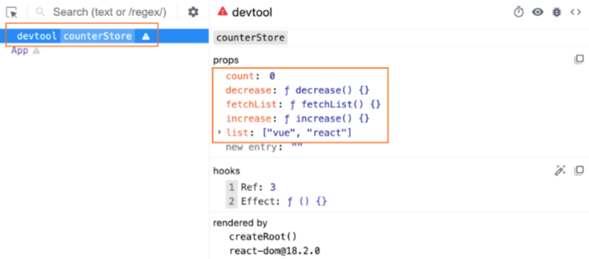

# 1. 011-Zustand

[原文：https://www.yuque.com/fechaichai/qeamqf/ngfwmf](https://www.yuque.com/fechaichai/qeamqf/ngfwmf)

一个简单的，快速的**状态管理解决方案**，api 设计基于函数式和 hooks。

## 1.1. 基础使用

让我们实现一个非常简单的计数器案例完成我们的第一个 store。

1- 创建一个 counterStore：

```jsx
// counterStore.js

import create from 'zustand'

const useCounterStore = create((set) => ({
  // 数据
  count: 0,
  // 修改数据的方法
  increase: () => set(state => ({ count: state.count + 1 })),
  decrease: () => set(state => ({ count: state.count - 1 }))
}))


export default useCounterStore
```

2- 绑定到组件：

```jsx
import useCounterStore from './store'

const App = () => {
  const count = useCounterStore((state) => state.count)
  const decrease = useCounterStore((state) => state.increase)
  const increase = useCounterStore((state) => state.decrease)
  return (
    <div>
      <button onClick={decrease}>+</button>
      <span>{count}</span>
      <button onClick={increase}>-</button>
    </div>
  )
}

export default App
```

## 1.2. 异步支持

1- 创建异步 action：

```jsx
import create from 'zustand'

const fetchApi = () => {
  return new Promise((resolve) => {
    setTimeout(() => {
      resolve(['vue', 'react'])
    }, 2000)
  })
}

const useListStore = create((set) => ({
  // 数据
  list: [],
  // 修改数据的方法
  fetchList: async () => {
    const res = await fetchApi()
    set({ list: res })
  }
}))


export default useListStore
```

2- 绑定组件：

```jsx
import { useEffect } from 'react'
import useListStore from './store'

const App = () => {
  const list = useListStore((state) => state.list)
  const fetchList = useListStore((state) => state.fetchList)
  useEffect(() => {
    fetchList()
  }, [])
  return (
    <div>
      {JSON.stringify(list)}
    </div>
  )
}

export default App
```

## 1.3. 增加调试

简单的调试我们可以安装一个名称为 `simple-zustand-devtools` 的调试工具。

1- 安装调试包：

```bash
$ yarn add simple-zustand-devtools
```

2- 配置调试工具：

```jsx
import create from 'zustand'

// 导入核心方法
import { mountStoreDevtool } from 'simple-zustand-devtools'

const useStore = create((set) => ({}))

// 开发环境开启调试
if (process.env.NODE_ENV === 'development') {
  // 第一个参数为调试的store标识
  mountStoreDevtool('counterStore', useStore)
}


export default useStore
```

3- 打开 React调试工具：

