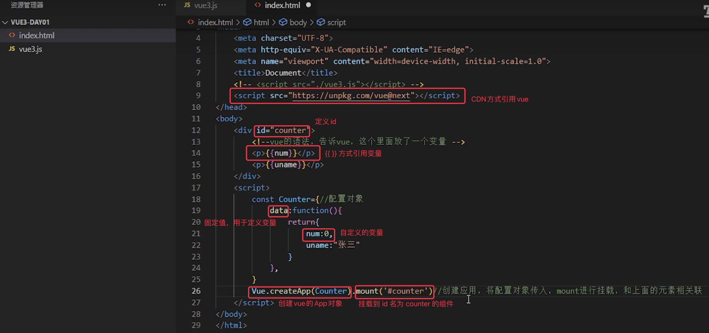
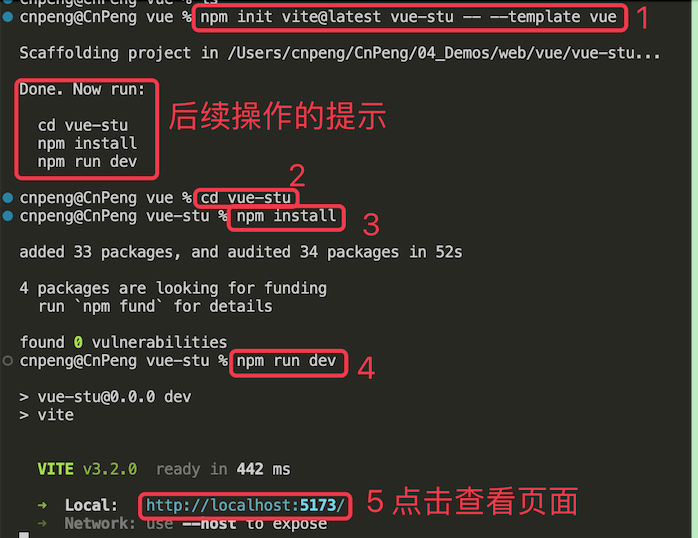
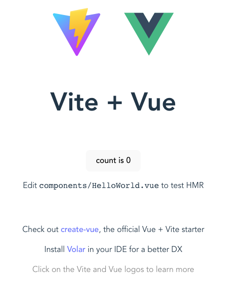
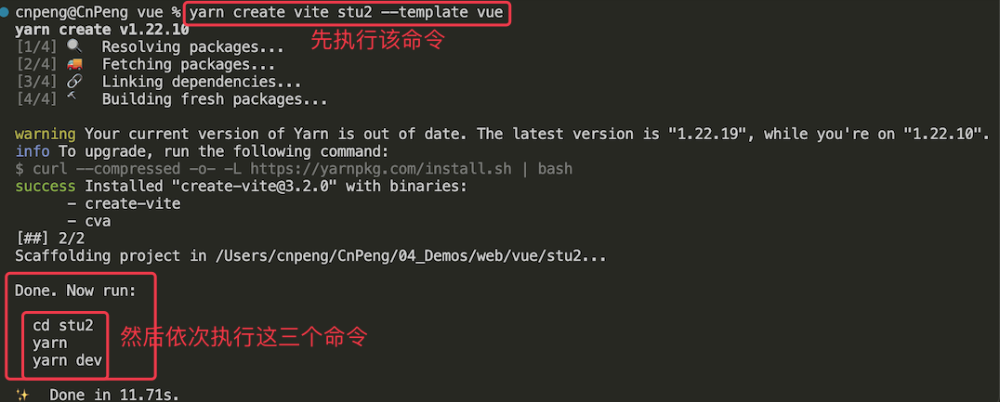
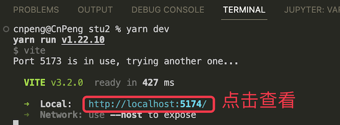
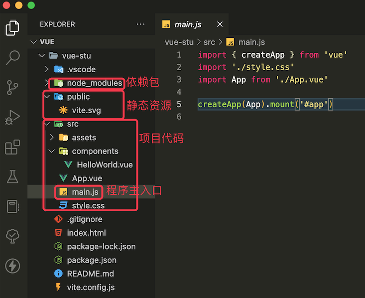
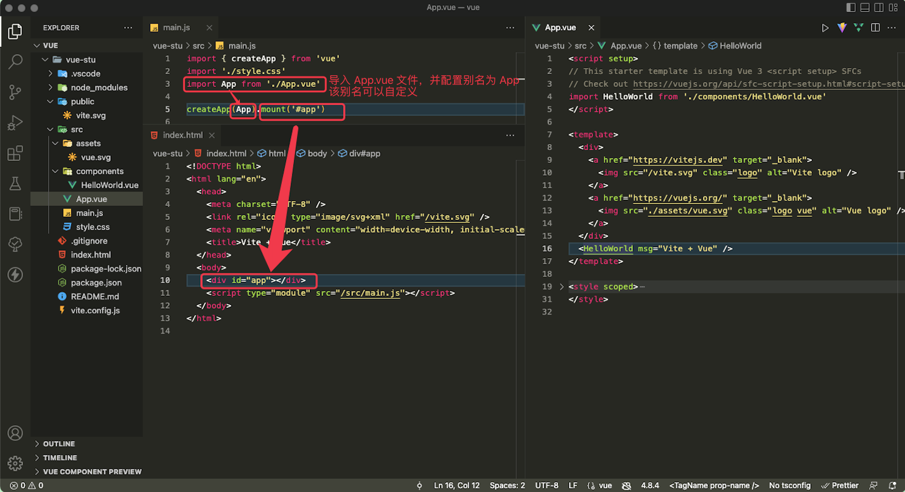
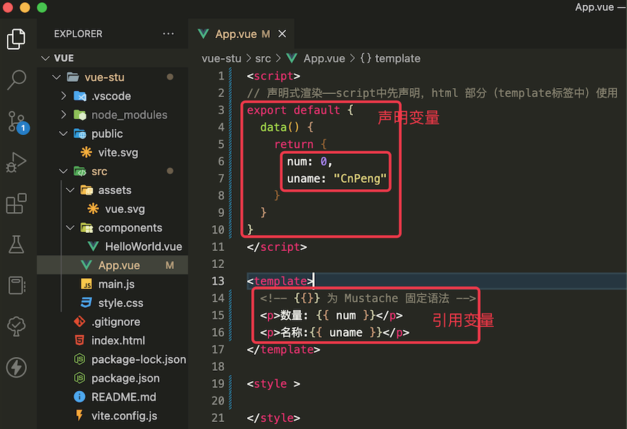
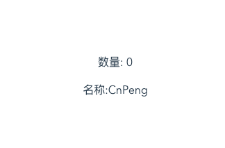

# 1. 1-Vue简介

>2022-10-26
> * 本系列参考 [2022年最新版Vue3全套教程](https://www.bilibili.com/video/BV1QA4y1d7xf) 和 [官方文档](https://cn.vuejs.org/guide/introduction.html) 整理
> * Vue 的 API 分为选项式和组合式，本系列内容基于选项式。两种方式的具体区别可参考官网。


## 1.1. 简介


**Vue** (发音为 `/vjuː/`，类似 view) 是一款`用于构建用户界面的 JavaScript 框架`。

它基于标准 HTML、CSS 和 JavaScript 构建，并提供了一套声明式的、组件化的编程模型，帮助你高效地开发用户界面。无论是简单还是复杂的界面，Vue 都可以胜任。

基本示例：

```vue
import { createApp } from 'vue'

createApp({
  data() {
    return {
      count: 0
    }
  }
}).mount('#app')
```

```vue
<div id="app">
  <button @click="count++">
    Count is: {{ count }}
  </button>
</div>
```

上面的示例展示了 Vue 的两个核心功能：

* **声明式渲染**：Vue 基于标准 HTML 拓展了一套模板语法，使得我们可以声明式地描述最终输出的 HTML 和 JavaScript 状态之间的关系。

* **响应性**：Vue 会自动跟踪 JavaScript 状态变化并在改变发生时响应式地更新 DOM。

## 1.2. 引用Vue的方式

### 1.2.1. CDN 方式



### 1.2.2. vite 方式

Vite 是一个 web 开发的构建工具，可以实现闪电般的冷服务器启动。

#### 1.2.2.1. 基于 npm 使用 vite 构建 vue 项目

使用 npm 需要先安装 node，安装 node 时会自动安装 npm

在终端（即命令行工具）中，先通过 `cd` 命令切换到我们想要的目录，然后 `npm -v` 查看 npm 版本，然后根据 npm 的不同版本执行下面的 `npm init` 命令：

```
# npm 6.x
npm init vite@latest <project-name> --template vue

# npm 7+, 比上一句多了双短横线。<project-name> 替换为你自己的项目名称
npm init vite@latest <project-name> -- --template vue
```



页面内容如下：



#### 1.2.2.2. 基于 yarn 使用 vite 构建 vue 项目

> [在使用 yarn 前需要先安装](https://yarn.bootcss.com/docs/install/#mac-stable)

在终端中执行如下命令：

```
yarn create vite <porject-name> --template vue
```



依次执行完上图中圈出来的命令后，看到如下内容



注意📢  ：

在编码过程中，如果关闭了终端，页面也将无法访问。此时需要重新通过 `npm run dev` 或 `yarn dev` 来运行项目，运行项目时一定要先切换到当前项目的目录下。

## 1.3. Vue项目结构：






`main.js` 是 Vue 项目的入口文件

`App.vue` 为单文件组件（SFC, single file compents）, 即页面中同时包含了 js（`<script>`js 标签）、html（`<template>` 组件模板标签）、css （`<style>` 样式标签）的代码。

`package.json` 和 `package-lock.json` 存储了项目的依赖包信息。


## 1.4. 声明式渲染

先声明，再使用



上述代码中，加了 `export` 之后，相关数据才能被其他页面引用。

`组件`：可以理解为一个 vue 文件，因为其中包含了 `<script>`、`<template>`、`<style>` ，这三者即可以渲染一个完整的页面/视图

组件实例的所有 `property`（属性/变量）无论如何定义，都可以在组件的模板（`<template>` 标签）中访问。

组件实例中，除了我们自定义的 `property` 之外，还有一些内置的以 `$` 为前缀的属性/变量。


完成上述更改后，界面预览效果如下：

