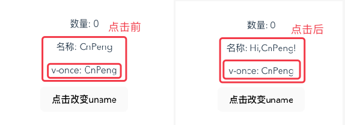

# 1. 2-模板语法

>2022-10-27

## 1.1. 文本插值

### 1.1.1. `{{}}` 语法

最基本的数据绑定形式是文本插值，它使用的是“Mustache”语法 (即双大括号)：

```vue
<span>Message: {{ msg }}</span>
```

双大括号标签会被替换为相应组件实例中 msg 属性的值。同时每次 msg 属性更改时它也会同步更新。

### 1.1.2. v-once

其后引用的变量/属性不会动态更新，仅展示第一次渲染时的数据。


```vue
<script>
// 声明式渲染——script中先声明，html 部分（template标签中）使用
export default {
  data() {
    return {
      num: 0,
      uname: "CnPeng"
    }
  },
  methods: {
    // 定义方法
    changeUname: function () {
      //  this 指向当前的 vue 实例
      this.uname = "Hi,CnPeng!"
    }
  }
}
</script>

<template>
  <!-- {{}} 为 Mustache 固定语法，数据改变时界面会动态更新 -->
  <p>数量: {{ num }}</p>
  <p>名称:{{ uname }}</p>

  <!-- v-once 可以让插值处的数据不再更新，仅展示第一次渲染的数据 -->
  <p v-once>v-once:{{ uname }}</p>
  <!-- 点击时触发 changeUname 方法 -->
  <button @click="changeUname">点击改变uname</button>
</template>

<style >

</style>

```

点击前后的对比效果：




## 1.2. v-html：原始html

即 原始 html 语法。当服务端返回的是 html 页面模板时，可以使用该语法进行渲染和展示。


```vue
<script>
// 声明式渲染——script中先声明，html 部分（template标签中）使用
export default {
  data() {
    return {
      htmlMsg: "<h2>模板语法：原始html</h2>",
    }
  },

}
</script>

<template>
  <p>普通插值：{{ htmlMsg }}</p>
  <!-- v-html值为字符串属性/变量的名称，如果该属性的值为 html，则展示渲染后的 html 内容 -->
  <p v-html="htmlMsg"></p>
</template>

<style >

</style>
```

注意：在站点中动态渲染任意的 html 是非常危险的，很容易会导致 XSS 共计。因此，**我们仅对可信内容使用 `v-html`，坚决不能为用户输入的内容使用 `v-html`**

## 1.3. v-bind：属性绑定

当 html 标签的属性值指向 `<script>` 标签中声明的属性/变量时，如果不使用 `v-bind`，html 标签仅会将 `<script>` 中的属性/变量作为普通字符串来看待；使用之后，则会使用 `<script>` 中属性/变量的值。

> 换句话说，`v-bind` 告诉当前的 html 属性要引用 `<script>` 中的属性/变量的值，而不是 html 属性后面的字面值。

### 1.3.1. 模拟图片请求


```vue
<script>
// 声明式渲染——script中先声明，html 部分（template标签中）使用
export default {
  data() {
    return {
      imgUrl: "https://pic1.zhimg.com/v2-5170a17a81afccd7750c66b4dd5799bc_1440w.jpg?source=32738c0c"
    }
  },

  methods: {
    changeImg: function () {
      this.imgUrl = "https://pica.zhimg.com/v2-313e4e15d9905c2242b156dbd9ca95f4_1440w.jpg?source=d16d100b"
    }
  }
}
</script>

<template>
  <p>attribute绑定：v-bind</p>
  <!-- 如果不使用 v-bind, src 会直接将 imgUrl 作为地址字符串进行解析；使用之后，则会取 imgUrl 属性/变量的值进行解析 -->
  
  <!-- v-bind 可以简写为 : -->
  
  <button @click="changeImg">点击改变图片地址，进而改变图片</button>

</template>

<style >
</style>
```

点击前：


点击后：


### 1.3.2. 模拟动态改变页面效果


```vue
<script>
// 声明式渲染——script中先声明，html 部分（template标签中）使用
export default {
  data() {
    return {
      cusId: "id1"
    }
  },

  methods: {
    changeId: function () {
      this.cusId = "id2"
    }
  }
}
</script>

<template>
  <p :id="cusId">attribute绑定：v-bind</p>
  <button @click="changeId">点击改变 cusId 的取值，进而改变样式</button>

</template>

<style >
#id1 {
  color: red;
  font-size: 18px;
}

#id2 {
  color: black;
  font-size: 36px;
}
</style>

```

点击前：


## 1.4. 使用 JavaScript 表达式

Vue 实际上在所有的数据绑定中都支持完整的 JavaScript 表达式：

```vue
{{ number + 1 }}

{{ ok ? 'YES' : 'NO' }}

{{ message.split('').reverse().join('') }}

<div :id="`list-${id}`"></div>
```

上述表达式都会被作为 JavaScript ，以组件为作用域解析执行。

在 Vue 模板内，JavaScript 表达式可以被使用在如下场景上：

* 在文本插值中 (双大括号)
* 在任何 Vue 指令 (以 `v-` 开头的特殊 attribute) attribute 的值中

### 1.4.1. 在插值中使用


```vue
<script>
export default {
  data() {
    return {
      num: 1,
      uname: "CnPeng"
    }
  }
}
</script>

<template>
  <!-- 插值中使用 js 表达式 -->
  <p>插值中的js运算：num+1 = {{ num + 1 }}</p>
  <!-- 插值中使用 js 表达式 -->
  <p>插值中的js运算：CnPeng 反转：{{ uname.split('').reverse().join('') }}</p>
</template>

<style >

</style>
```

效果如下：


### 1.4.2. 在属性绑定中使用


```vue
<script>
export default {
  data() {
    return {
      cusId: 0
    }
  }
}
</script>

<template>
  <p :id="`id-${cusId}`"> v-bind 中使用 js 表达式</p>
</template>

<style >
#id-0 {
  color: red;
}
</style>
```

运行效果：


### 1.4.3. 在事件中使用


```vue
<script>
// 声明式渲染——script中先声明，html 部分（template标签中）使用
export default {
  data() {
    return {
      cusId: "id1"
    }
  }
}
</script>

<template>
  <p :id="cusId">attribute绑定：v-bind</p>
  <!-- 点击时，直接改变 cusId 的值，不用再声明方法 -->
  <button @click="cusId = 'id2'">点击改变 cusId 的取值，进而改变样式</button>
</template>

<style >
#id1 {
  color: red;
  font-size: 18px;
}

#id2 {
  color: black;
  font-size: 36px;
}
</style>
```

效果如下：


## 1.5. 指令

指令是带有 `v-` 前缀的特殊 attribute。Vue 提供了许多[内置指令](https://cn.vuejs.org/api/built-in-directives.html)，包括前面介绍的 `v-bind` 和 `v-html`。

指令 attribute 的**期望值为一个 JavaScript 表达式** (除了少数几个例外，即之后要讨论到的 `v-for`、`v-on` 和 `v-slot`)。一个指令的任务是在其表达式的值变化时响应式地更新 DOM。

### 1.5.1. 参数 Arguments

某些指令会需要一个“参数”，在指令名后通过一个冒号隔开做标识。例如用 `v-bind` 指令来响应式地更新一个 HTML attribute：

```vue
<a v-bind:href="url"> ... </a>

<!-- 简写 -->
<a :href="url"> ... </a>
```

这里 `href` 就是一个参数，它告诉 `v-bind` 指令将表达式 url 的值绑定到元素的 `href` attribute 上。在简写中，参数前的一切 (例如` v-bind:`) 都会被缩略为一个 `:` 字符。

另一个例子是 `v-on` 指令，它将监听 DOM 事件：

```vue
<a v-on:click="doSomething"> ... </a>

<!-- 简写 -->
<a @click="doSomething"> ... </a>
```

这里的参数是要监听的事件名称：`click`。`v-on` 有一个相应的缩写，即 `@` 字符。

### 1.5.2. 动态参数

#### 1.5.2.1. 语法

同样在指令参数上也可以使用一个 JavaScript 表达式，需要**包含在一对方括号内**：

```vue
<!--注意，参数表达式有一些约束，参见下面“动态参数值的限制”与“动态参数语法的限制”章节的解释-->
<a v-bind:[attributeName]="url"> ... </a>

<!-- 简写 -->
<a :[attributeName]="url"> ... </a>
```

这里的 `attributeName` 会作为一个 JavaScript 表达式被动态执行，计算得到的值会被用作最终的参数。举例来说，如果你的组件实例有一个数据属性 `attributeName` ，其值为 "href"，那么这个绑定就等价于 `v-bind:href`。

相似地，你还可以将一个函数绑定到动态的事件名称上：

```vue
<a v-on:[eventName]="doSomething"> ... </a>

<!-- 简写 -->
<a @[eventName]="doSomething">
```

在此示例中，当 `eventName` 的值是 "focus" 时，`v-on:[eventName]` 就等价于 `v-on:focus`。

#### 1.5.2.2. 示例:动态属性


点击前的效果：


点击后的效果：


```vue
<script>
export default {
  data() {
    return {
      cusid: "id1",
      attr1: "id",

      url: "https://www.zhihu.com/people/CnPeng",
      attr2: "title"
    }
  }
}
</script>

<template>

  <p :[attr1]="cusid">动态属性值，使用 :[attr] 格式。</p>
  <!-- ❌错误写法如下，v-bind 写法中等号后面必须是在 script 中声明的属性/变量 -->
  <!-- <p v-bind:[attr]="id1">动态属性值，使用 :[attr] 格式。即用 [] 包裹属性名称</p> -->
  <button @click="attr1 = 'class'">点击改变上面 p 标签的属性值，进而改变渲染效果</button>

  <!-- a 标签为行内元素，不具备换行效果，此处加一层 div 实现与下面 button 的换行效果 -->
  <div>
    <a :[attr2]="url">这是一个 a 标签，点击前光标悬浮会将 url 值显示为 title，不具备超链接;点击后没有了title,但具备超链接 </a>
  </div>
  <button @click="attr2 = 'href'">点击为 a 标签添加超链接</button>

</template>

<style >
/* id 选择器 */
#id1 {
  color: red;
}

/* class 类选择器 */
.id1 {
  color: #000;
  font-size: 50px;
}
</style>
```

#### 1.5.2.3. 动态参数值的限制

**动态参数中表达式的值应当是一个字符串，或者是 null**。**特殊值 null 意为显式移除该绑定**。其他非字符串的值会触发警告。

#### 1.5.2.4. 动态参数语法的限制

动态参数表达式因为某些字符的缘故有一些语法限制，比如`空格`和`引号`，在 HTML attribute 名称中都是不合法的。例如下面的示例：

```vue
<!-- ❌ 这是错误示例！这会触发一个编译器警告 -->
<a :['foo' + bar]="value"> ... </a>
```

如果你需要传入一个复杂的动态参数，我们推荐使用计算属性替换复杂的表达式，也是 Vue 最基础的概念之一。

当使用 DOM 内嵌模板 (直接写在 HTML 文件里的模板) 时，我们需要**避免在名称中使用大写字母，因为浏览器会强制将其转换为小写**：

```vue
<!-- ❌ 这是错误示例！不要使用大写，会被浏览器强转为小写 -->
<a :[someAttr]="value"> ... </a>
```

上面的例子将会在 DOM 内嵌模板中被转换为 `:[someattr]`。如果你的组件拥有 “someAttr” 属性而非 “someattr”，这段代码将不会工作。**单文件组件内的模板不受此限制。**

### 1.5.3. 动态事件


```vue
<script>
export default {
  data() {
    return {
      cusid: "id1",
      attr1: "id",

      eventname: "click",
    }
  }
}
</script>

<template>

  <p :[attr1]="cusid">动态属性值，使用 :[attr] 格式。</p>
  <!-- 触发 eventname 对应的事件时，改变 attr1 的值，进而改变上面 p 标签的显示效果 -->
  <button @[eventname]="attr1 = 'class'">Button1: 动态事件格式 @[eventname] ，初始时点击可改变上面 p 标签的属性值；通过下面的按钮可将事件改变为悬停。</button>
  <button @click="eventname = 'mouseover'">Button2: 改变上一个按钮的事件类型为 mouseover——鼠标悬停</button>

</template>

<style >
/* id 选择器 */
#id1 {
  color: red;
}

/* class 类选择器 */
.id1 {
  color: #000;
  font-size: 50px;
}

/* 标签选择器，button默认行内元素，此处强制使用块模式进行显示 */
button {
  display: block;
}
</style>
```

界面初始状态：


点击第一个按钮（Button1）后的状态：


刷新页面，使其重新进入初始状态，然后点击第二个按钮（Button2）,此时状态如下：


挪动光标，将其悬浮在 Button1 上，效果如下（p 标签的样式改变了）：


### 1.5.4. 修饰符 Modifiers

修饰符是**以点开头的特殊后缀**，表明指令需要以一些特殊的方式被绑定。例如 `.prevent` 修饰符会告知 `v-on` 指令对触发的事件调用 `event.preventDefault()：`

```vue
<form @submit.prevent="onSubmit">...</form>
```

之后在讲到 `v-on` 和 `v-model` 的功能时，你将会看到其他修饰符的例子。

完整的指令语法图:

