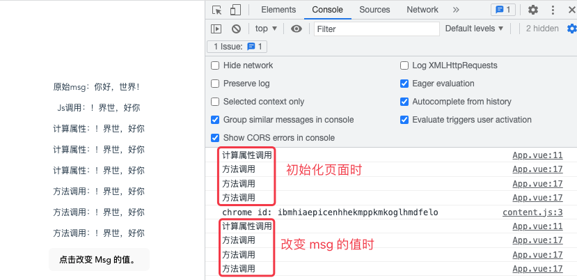

# 1. 4-计算属性

>2022-11-07

## 1.1. 定义方式

定义方式如下：

```js
export default {
  computed: {
    // 计算属性的 getter
    计算属性的名称() {
      return 计算属性的值
    }
  }
}
```

调用方式：


```vue
<!-- 调用方式同普通属性一致，调用时不需要在属性名称后面添加 () -->
<span>{{ 计算属性的名称 }}</span>
```

## 1.2. 基础示例

### 1.2.1. 为什么需要计算属性

模板中的表达式虽然方便，但只能用来做简单的操作。

如果在模板中写太多逻辑，会让模板变得臃肿，难以维护。比如说，我们有这样一个包含嵌套数组的对象：

```js
export default {
  data() {
    return {
      author: {
        name: 'John Doe',
        books: [
          'Vue 2 - Advanced Guide',
          'Vue 3 - Basic Guide',
          'Vue 4 - The Mystery'
        ]
      }
    }
  }
}
```

我们想根据 `author` 是否已有一些书籍来展示不同的信息：

```vue
<p>Has published books:</p>
<span>{{ author.books.length > 0 ? 'Yes' : 'No' }}</span>
```

这里的模板看起来有些复杂。我们必须认真看好一会儿才能明白它的计算依赖于 `author.books`。更重要的是，如果在模板中需要不止一次这样的计算，我们可**不想将这样的代码在模板里重复好多遍。**

因此我们推荐使用`计算属性`来描述依赖响应式状态的复杂逻辑。

### 1.2.2. 计算属性示例


这是重构后的示例：

```js
export default {
  data() {
    return {
      author: {
        name: 'John Doe',
        books: [
          'Vue 2 - Advanced Guide',
          'Vue 3 - Basic Guide',
          'Vue 4 - The Mystery'
        ]
      }
    }
  },
  computed: {
    // 一个计算属性的 getter
    publishedBooksMessage() {
      // `this` 指向当前组件实例
      return this.author.books.length > 0 ? 'Yes' : 'No'
    }
  }
}
```

```vue
<p>Has published books:</p>
<span>{{ publishedBooksMessage }}</span>
```

我们在这里定义了一个计算属性 `publishedBooksMessage`。

更改此应用的 `data` 中 `books` 数组的值后，可以看到 `publishedBooksMessage` 也会随之改变。

在模板中使用计算属性的方式和一般的属性并无二致。**Vue 会检测到 `this.publishedBooksMessage` 依赖于 `this.author.books`，所以当 `this.author.books` 改变时，任何依赖于 `this.publishedBooksMessage` 的绑定都将同时更新。**

——即：**当计算属性所依赖的普通属性发生变化时，计算属性会随之发生变化，并将其值更新到视图中的调用处。**

也可参考：[为计算属性标记类型](https://cn.vuejs.org/guide/typescript/options-api.html#typing-computed)


## 1.3. 计算属性缓存 vs 方法

### 1.3.1. 对比

>CnPeng 总结：
>* 计算属性具有缓存机制，在其依赖的普通属性未发生变化时，直接取出缓存值进行使用，没有再次触发计算。有利于提升性能。
>* 方法调用则不具备缓存机制，每次调用都会触发一次计算过程，对性能有影响。

你可能注意到我们在表达式中像这样调用一个函数也会获得和计算属性相同的结果：

```vue
<p>{{ calculateBooksMessage() }}</p>
```

```js
// 组件中
methods: {
  calculateBooksMessage() {
    return this.author.books.length > 0 ? 'Yes' : 'No'
  }
}
```

若我们将同样的函数定义为一个方法而不是计算属性，两种方式在结果上确实是完全相同的，不同之处在于**计算属性值会基于其响应式依赖被缓存**。

**一个计算属性仅在其响应式依赖更新时才重新计算**。这意味着只要 `author.books` 不改变，无论多少次访问 `publishedBooksMessage` 都**会立即返回先前的计算结果，而不用重复执行 `getter` 函数。**

这也解释了为什么**下面的计算属性永远不会更新**，因为 `Date.now()` 并不是一个响应式依赖：

```js
computed: {
  now() {
    return Date.now()
  }
}
```

相比之下，**方法调用总是会在重渲染发生时再次执行函数**。

为什么需要缓存呢？想象一下我们有一个非常耗性能的计算属性 list ，需要循环一个巨大的数组并做许多计算逻辑，并且可能也有其他计算属性依赖于 list。**没有缓存的话，我们会重复执行非常多次 list 的 getter**，然而这实际上没有必要！如果你确定不需要缓存，那么也可以使用方法调用。

### 1.3.2. 示例1

计算属性在第一次获取到计算结果后，会对结果进行缓存。

多次引用计算属性时，如果计算属性调用的属性未发生变化，则计算属性调用缓存中的值，不会重新触发计算过程。

```vue
<script>
export default {
  data() {
    return {
      msg: "HelloWorld"
    }
  },
  computed: {
    // 声明计算属性，默认为 getter 
    reverseMsg() {
      console.log("计算属性调用")
      return this.msg.split("").reverse().join("")
    }
  },
  methods: {
    reverseMsgFunc() {
      console.log("方法调用")
      return this.msg.split("").reverse().join("")
    }
  }
}
</script>

<template>
  <p>原始msg：{{ msg }}</p>

  <p>Js调用：{{ this.msg.split("").reverse().join("") }}</p>

  <p>计算属性：{{ this.reverseMsg }}</p>
  <p>计算属性：{{ this.reverseMsg }}</p>
  <p>计算属性：{{ this.reverseMsg }}</p>

  <p>方法调用：{{ this.reverseMsgFunc() }}</p>
  <p>方法调用：{{ this.reverseMsgFunc() }}</p>
  <p>方法调用：{{ this.reverseMsgFunc() }}</p>
</template>

<style >
/* id 选择器 */
#id1 {
  color: red;
}

/* class 类选择器 */
.id1 {
  color: #000;
  font-size: 50px;
}

/* 标签选择器，button默认行内元素，此处强制使用块模式进行显示 */
button {
  display: block;
}
</style>
```


### 1.3.3. 示例2

计算属性调用的属性发生变化时，会触发计算属性的计算过程。

```vue
<script>
export default {
  data() {
    return {
      msg: "HelloWorld"
    }
  },
  computed: {
    // 声明计算属性，默认为 getter 
    reverseMsg() {
      console.log("计算属性调用")
      return this.msg.split("").reverse().join("")
    }
  },
  methods: {
    reverseMsgFunc() {
      console.log("方法调用")
      return this.msg.split("").reverse().join("")
    },
    changeMsg() {
      this.msg = "你好，世界！"
    }
  }
}
</script>

<template>
  <p>原始msg：{{ msg }}</p>

  <p>Js调用：{{ this.msg.split("").reverse().join("") }}</p>

  <p>计算属性：{{ this.reverseMsg }}</p>
  <p>计算属性：{{ this.reverseMsg }}</p>
  <p>计算属性：{{ this.reverseMsg }}</p>

  <p>方法调用：{{ this.reverseMsgFunc() }}</p>
  <p>方法调用：{{ this.reverseMsgFunc() }}</p>
  <p>方法调用：{{ this.reverseMsgFunc() }}</p>

  <button @click="changeMsg">点击改变 Msg 的值。</button>
</template>

<style >
/* id 选择器 */
#id1 {
  color: red;
}

/* class 类选择器 */
.id1 {
  color: #000;
  font-size: 50px;
}

/* 标签选择器，button默认行内元素，此处强制使用块模式进行显示 */
button {
  display: block;
}
</style>
```




## 1.4. 可写的计算属性

**计算属性默认是只读的**（在定义计算属性时，默认仅提供 `gettter`）。当我们尝试修改一个计算属性时，会收到一个运行时警告。

在某些特殊场景中我们可能会用到“可写”的计算属性，此时可以通过同时提供 `getter` 和 `setter` 来创建：

```js
export default {
  data() {
    return {
      firstName: 'John',
      lastName: 'Doe'
    }
  },
  computed: {
    fullName: {
      // getter。前面示例中的 计算属性名称(){} 格式是 get 的简写。
      get() {
        return this.firstName + ' ' + this.lastName
      },
      // setter
      set(newValue) {
        // 注意：我们这里使用的是解构赋值语法
        [this.firstName, this.lastName] = newValue.split(' ')
      }
    }
  }
}
```

现在当我们再运行 `this.fullName = 'John Doe'` 时， `setter` 会被调用而 `this.firstName` 和 `this.lastName` 会随之更新。

## 1.5. 最佳实践

### 1.5.1. Getter 不应有副作用

计算属性的 `getter` 应只做计算而没有任何其他的副作用。举例来说，**不要在 `getter` 中做异步请求或者更改 DOM！**一个**计算属性的声明中描述的是如何根据其他值派生一个值**。因此 `getter` 的职责应该**仅为计算和返回该值**。在之后的指引中我们会讨论如何使用监听器根据其他响应式状态的变更来创建副作用。

### 1.5.2. 避免直接修改计算属性值

从计算属性返回的值是派生状态。可以把它看作是一个“临时快照”，每当源状态发生变化时，就会创建一个新的快照。更改快照是没有意义的，因此**计算属性的返回值应该被视为只读的，并且永远不应该被更改——应该更新它所依赖的源状态以触发新的计算。**

