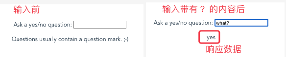
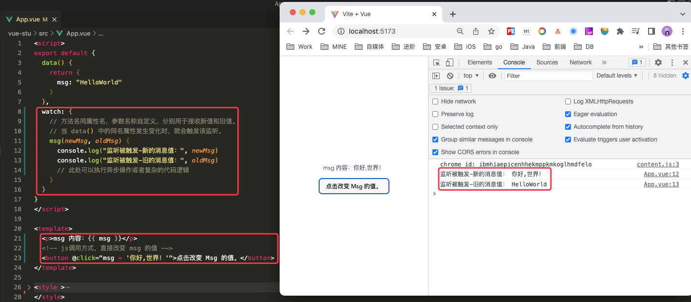
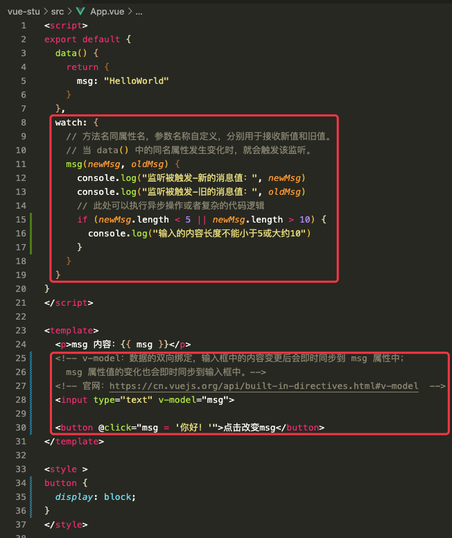
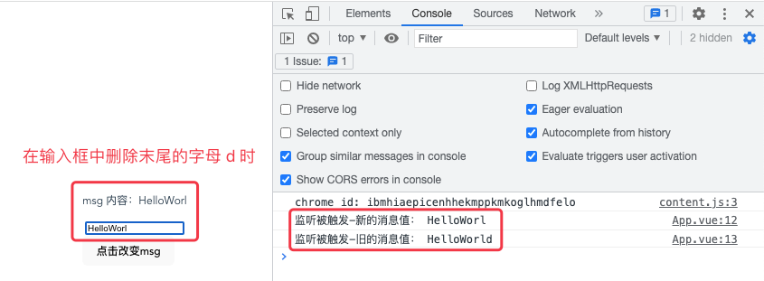
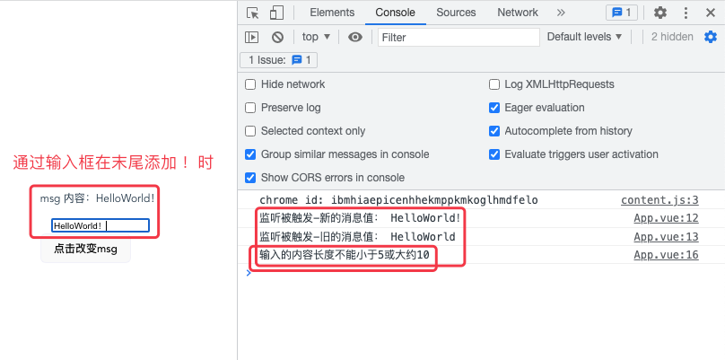
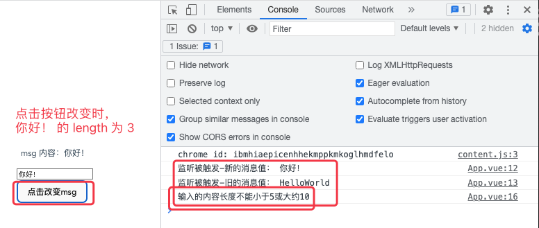
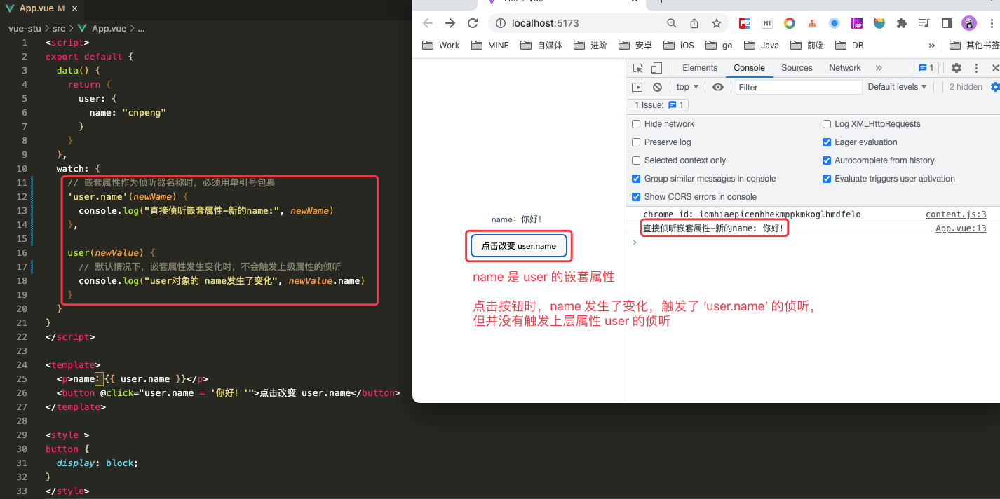
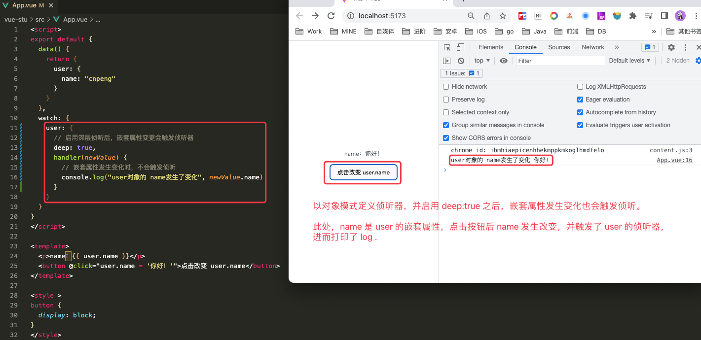
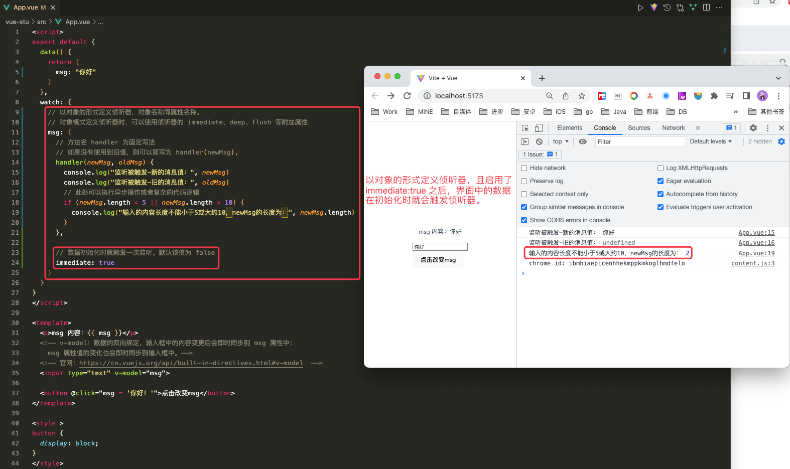

# 1. 5-侦听器

>2022-11-07

## 1.1. 定义

计算属性允许我们声明性地计算衍生值。然而在有些情况下，我们需要在状态变化时执行一些附加操作：例如更改 DOM，或是根据异步操作的结果去修改另一处的状态。

此时，在选项式 API 中，我们可以使用 `watch` 选项在每次响应式属性发生变化时触发一个函数，即侦听器。

侦听器的定义格式如下：

### 1.1.1. 基本格式的侦听器

```js
export default {
  data() {
    return {
      name: "cnpeng"
    }
  },
  watch: {
    // 名称要与属性一直，两个参数分别用于接收新值和旧值，
    // 如果旧值不被使用，可以简化为 name(newName)
    // 参数名称可以自定义
    name(newName, oldName) {

    }
  }
}
```

### 1.1.2. 对象式侦听器

侦听器支持 deep、immediate、post 等属性，使用这些属性时需要以对象的方式来声明侦听器。

该对象中，需要包含一个名称为 `handler` 的方法，方法的参数用于接收变化前和变化后的属性值。

```js
export default {
  data() {
    return {
      name: "cnpeng"
    }
  },
  watch: {
    // 以对象方式声明侦听器。
    // 名称要与属性一致，要包含一个名为 handler 的方法
    name: {
      // 除 deep 属性外，还可以使用 immediate 等属性，具体参见后续章节。
      deep:true,
      handler(newName, oldName) {
        // 执行异步或其他复杂逻辑
      }
    }
  }
}
```

### 1.1.3. 嵌套属性的侦听器

侦听嵌套属性时，需要使用 `'父级属性.嵌套属性'` 的格式来声明侦听器名称，注意需要用单引号或双引号对侦听器名称进行包裹。

下面的示例中，`data()` 中声明了一个对象类型的 `user` 属性，其中包含 `name` 属性，这里的 `name` 就是 `user` 的嵌套属性。

* 方式1

```js
export default {
  data() {
    return {
      user: {
        name: "cnpeng"
      }
    }
  },
  watch: {
    // 嵌套属性的侦听器的格式：’父级属性.嵌套属性‘ ，注意用单引号或双引号包裹
    'user.name'(newName, oldName) {
      //异步操作或复杂业务逻辑
    }
  }
}
```

* 方式2

```js
export default {
  data() {
    return {
      user: {
        name: "cnpeng"
      }
    }
  },
  watch: {
    // 嵌套属性的侦听器的格式：’父级属性.嵌套属性‘ ，注意用单引号或双引号包裹
    'user.name': {
      handler(newName, oldName) {
        //异步操作或复杂业务逻辑
      }
    }
  }
}
```


## 1.2. 基本示例

### 1.2.1. 官方示例

在侦听器中执行异步操作：

```js
export default {
  data() {
    return {
      question: '',
      answer: 'Questions usually contain a question mark. ;-)'
    }
  },
  watch: {
    // 每当 question 改变时，这个函数就会执行
    question(newQuestion, oldQuestion) {
      if (newQuestion.includes('?')) {
        // 异步获取响应
        this.getAnswer()
      }
    }
  },
  methods: {
    async getAnswer() {
      this.answer = 'Thinking...'
      try {
        const res = await fetch('https://yesno.wtf/api')
        this.answer = (await res.json()).answer
      } catch (error) {
        this.answer = 'Error! Could not reach the API. ' + error
      }
    }
  }
}
```

```vue
<p>
  Ask a yes/no question:
  <input v-model="question" />
</p>
<p>{{ answer }}</p>
```




### 1.2.2. 其他示例1



```vue
<script>
export default {
  data() {
    return {
      msg: "HelloWorld"
    }
  },
  watch: {
    // 方法名同属性名，参数名称自定义，分别用于接收新值和旧值。
    // 当 data() 中的同名属性发生变化时，就会触发该监听。
    msg(newMsg, oldMsg) {
      console.log("监听被触发-新的消息值：", newMsg)
      console.log("监听被触发-旧的消息值：", oldMsg)
      // 此处可以执行异步操作或者复杂的代码逻辑
    }
  }
}
</script>

<template>
  <p>msg 内容：{{ msg }}</p>
  <!-- js调用方式，直接改变 msg 的值 -->
  <button @click="msg = '你好,世界！'">点击改变 Msg 的值。</button>
</template>

<style >
button {
  display: block;
}
</style>
```

### 1.2.3. 其他示例2









```vue
<script>
export default {
  data() {
    return {
      msg: "HelloWorld"
    }
  },
  watch: {
    // 方法名同属性名，参数名称自定义，分别用于接收新值和旧值。
    // 当 data() 中的同名属性发生变化时，就会触发该监听。
    msg(newMsg, oldMsg) {
      console.log("监听被触发-新的消息值：", newMsg)
      console.log("监听被触发-旧的消息值：", oldMsg)
      // 此处可以执行异步操作或者复杂的代码逻辑
      if (newMsg.length < 5 || newMsg.length > 10) {
        console.log("输入的内容长度不能小于5或大约10")
      }
    }
  }
}
</script>

<template>
  <p>msg 内容：{{ msg }}</p>
  <!-- v-model：数据的双向绑定，输入框中的内容变更后会即时同步到 msg 属性中；
    msg 属性值的变化也会即时同步到输入框中。-->
  <!-- 官网：https://cn.vuejs.org/api/built-in-directives.html#v-model  -->
  <input type="text" v-model="msg">

  <button @click="msg = '你好！'">点击改变msg</button>
</template>

<style >
button {
  display: block;
}
</style>
```

## 1.3. 深层侦听器

`watch` 默认是浅层的：**被侦听的属性，仅在被赋新值时，才会触发回调函数——而嵌套属性的变化不会触发**。如果想侦听所有嵌套的变更，你需要`深层侦听器`：

```js
export default {
  watch: {
    someObject: {
      handler(newValue, oldValue) {
        // 注意：在嵌套的变更中，
        // 只要没有替换对象本身，
        // 那么这里的 `newValue` 和 `oldValue` 相同
      },
      deep: true
    }
  }
}
```

**注意：**

要谨慎使用深层侦听。深层侦听**需要遍历被侦听对象中的所有嵌套的属性**，当用于大型数据结构时，**开销很大**。因此请只在必要时才使用它，并且要留意性能。

### 1.3.1. 嵌套属性变化不触发监听



```vue
<script>
export default {
  data() {
    return {
      user: {
        name: "cnpeng"
      }
    }
  },
  watch: {
    // 嵌套属性作为侦听器名称时，必须用单引号包裹
    'user.name'(newName) {
      console.log("直接侦听嵌套属性-新的name:", newName)
    },

    user(newValue) {
      // 默认情况下，嵌套属性发生变化时，不会触发上级属性的侦听
      console.log("user对象的 name发生了变化", newValue.name)
    }
  }
}
</script>

<template>
  <p>name：{{ user.name }}</p>
  <button @click="user.name = '你好！'">点击改变 user.name</button>
</template>

<style >
button {
  display: block;
}
</style>


```

### 1.3.2. 深层监听示例

通过 `deep:true` 启用深层监听后，签到属性的变化也会触发侦听器。



```vue
<script>
export default {
  data() {
    return {
      user: {
        name: "cnpeng"
      }
    }
  },
  watch: {
    user: {
      // 启用深层侦听后，嵌套属性变更会触发侦听器
      deep: true,
      handler(newValue) {
        // 嵌套属性发生变化时，不会触发侦听
        console.log("user对象的 name发生了变化", newValue.name)
      }
    }
  }
}
</script>

<template>
  <p>name：{{ user.name }}</p>
  <button @click="user.name = '你好！'">点击改变 user.name</button>
</template>

<style >
button {
  display: block;
}
</style>
```

## 1.4. 即时回调的侦听器

**在数据初始化时就触发一次侦听。**

**`watch` 默认是懒执行的：仅当数据源变化时，才会执行回调。**

但在某些场景中，我们希望在创建侦听器时，立即执行一遍回调。举例来说，我们想请求一些初始数据，然后在相关状态更改时重新请求数据。

我们可以用一个对象来声明侦听器，这个对象有 `handler` 方法和 `immediate: true` 选项，这样便能强制回调函数立即执行：

```js
export default {
  // ...
  watch: {
    question: {
      // 如果逻辑中不需要 oldQuestion, 则可以仅声明 newQuestion 用于接收新的值
      handler(newQuestion) {
        // 在组件实例创建时会立即调用
      },
      // 强制立即执行回调
      immediate: true
    }
  }
  // ...
}
```



```vue
<script>
export default {
  data() {
    return {
      msg: "你好"
    }
  },
  watch: {
    // 以对象的形式定义侦听器，对象名称同属性名称。
    // 对象模式定义侦听器时，可以使用侦听器的 immediate、deep、flush 等附加属性
    msg: {
      // 方法名 handler 为固定写法
      // 如果没有使用到旧值，则可以简写为 handler(newMsg),
      handler(newMsg, oldMsg) {
        console.log("监听被触发-新的消息值：", newMsg)
        console.log("监听被触发-旧的消息值：", oldMsg)
        // 此处可以执行异步操作或者复杂的代码逻辑
        if (newMsg.length < 5 || newMsg.length > 10) {
          console.log("输入的内容长度不能小于5或大约10，newMsg的长度为：", newMsg.length)
        }
      },

      // 数据初始化时就触发一次监听。默认该值为 false
      immediate: true
    }
  }
}
</script>

<template>
  <p>msg 内容：{{ msg }}</p>
  <!-- v-model：数据的双向绑定，输入框中的内容变更后会即时同步到 msg 属性中；
    msg 属性值的变化也会即时同步到输入框中。-->
  <!-- 官网：https://cn.vuejs.org/api/built-in-directives.html#v-model  -->
  <input type="text" v-model="msg">

  <button @click="msg = '你好！'">点击改变msg</button>
</template>

<style >
button {
  display: block;
}
</style>
```
## 1.5. 回调的触发时机

当你更改了响应式状态，它可能会同时触发 Vue 组件更新和侦听器回调。

**默认情况下，用户创建的侦听器回调，都会在 Vue 组件更新之前被调用。**这意味着你在侦听器回调中访问的 DOM 将是被 Vue 更新之前的状态。

**如果想在侦听器回调中能访问被 Vue 更新之后的DOM，你需要指明 `flush:'post'`选项：**

```js
export default {
  // ...
  watch: {
    key: {
      handler() {},
      flush: 'post'
    }
  }
}
```

## 1.6. `this.$watch()`

我们也可以使用组件实例的 `$watch()` 方法来命令式地创建一个侦听器：

```js
export default {
  created() {
    this.$watch('question', (newQuestion) => {
      // ...
    })
  }
}
```

如果要**在特定条件下设置一个侦听器，或者只侦听响应用户交互的内容**，这方法很有用。它**还允许你提前停止该侦听器**。

## 1.7. 停止侦听器

用 `watch` 选项或者 `$watch()` 实例方法声明的侦听器，**会在宿主组件卸载时自动停止**。因此，在大多数场景下，你无需关心怎么停止它。

在少数情况下，你的确需要在组件卸载之前就停止一个侦听器，这时可以调用 `$watch()` API 返回的函数：

```js
const unwatch = this.$watch('foo', callback)

// ...当该侦听器不再需要时
unwatch()
```
