# 1. 7-条件渲染

> 2022-11-9
> [官网-条件渲染](https://cn.vuejs.org/guide/essentials/conditional.html)

## 1.1. v-if

`v-if` 指令用于条件性地渲染一块内容。这块内容只会**在指令的表达式返回真值时才被渲染**。

```vue

<h1 v-if="awesome">Vue is awesome!</h1>
```

## 1.2. v-else

你也可以使用 `v-else` 为 `v-if` 添加一个“else 区块”。

```vue
<button @click="awesome = !awesome">Toggle</button>

<h1 v-if="awesome">Vue is awesome!</h1>
<h1 v-else>Oh no 😢</h1>
```

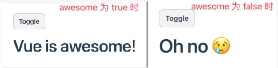

**一个 `v-else` 元素必须跟在一个 `v-if` 或者 `v-else-if` 元素后面，否则它将不会被识别。**

## 1.3. v-else-if

顾名思义，`v-else-if` 提供的是相应于 `v-if` 的“else if 区块”。它可以连续多次重复使用：

```vue
<div v-if="type === 'A'">
  A
</div>
<div v-else-if="type === 'B'">
  B
</div>
<div v-else-if="type === 'C'">
  C
</div>
<div v-else>
  Not A/B/C
</div>
```

和 `v-else` 类似，一个使用 `v-else-if` 的元素必须紧跟在一个 `v-if` 或一个 `v-else-if` 元素后面。

### 1.3.1. 综合示例

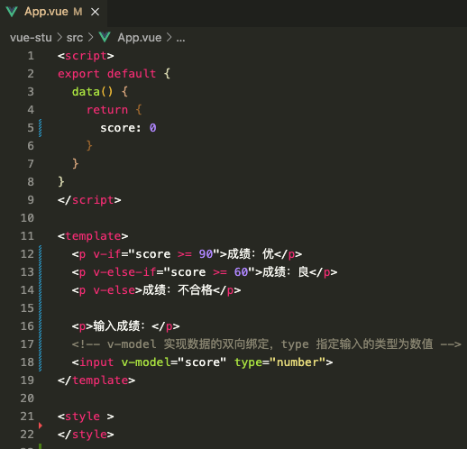

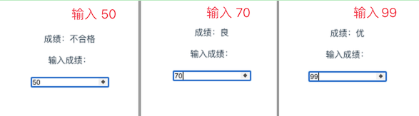

```vue
<script>
export default {
  data() {
    return {
      score: 0
    }
  }
}
</script>

<template>
  <p v-if="score >= 90">成绩：优</p>
  <p v-else-if="score >= 60">成绩：良</p>
  <p v-else>成绩：不合格</p>

  <p>输入成绩：</p>
  <!-- v-model 实现数据的双向绑定，type 指定输入的类型为数值 -->
  <input v-model="score" type="number">
</template>

<style >
</style>
```

## 1.4. `<template>` 上的 v-if

因为 `v-if` 是一个指令，他必须依附于某个元素。但如果我们想要切换不止一个元素呢？

在这种情况下我们可以在一个 `<template>` 元素上使用 `v-if`，这只是一个不可见的包装器（容器）元素，最后渲染的结果并不会包含这个 `<template>` 元素。

```vue
<template v-if="ok">
  <h1>Title</h1>
  <p>Paragraph 1</p>
  <p>Paragraph 2</p>
</template>
```

`v-else` 和 `v-else-if` 也可以在 `<template>` 上使用。

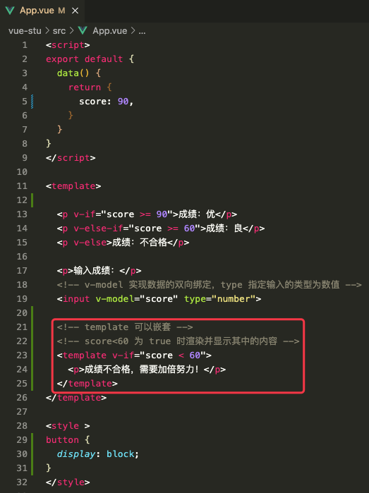

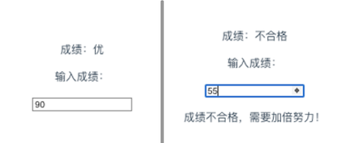

```vue
<script>
export default {
  data() {
    return {
      score: 90,
    }
  }
}
</script>

<template>

  <p v-if="score >= 90">成绩：优</p>
  <p v-else-if="score >= 60">成绩：良</p>
  <p v-else>成绩：不合格</p>

  <p>输入成绩：</p>
  <!-- v-model 实现数据的双向绑定，type 指定输入的类型为数值 -->
  <input v-model="score" type="number">

  <!-- template 可以嵌套 -->
  <!-- score<60 为 true 时渲染并显示其中的内容 -->
  <template v-if="score < 60">
    <p>成绩不合格，需要加倍努力！</p>
  </template>
</template>

<style >
button {
  display: block;
}
</style>
```

## 1.5. v-show

另一个可以用来按条件显示一个元素的指令是 `v-show`。其用法基本一样：

```vue
<h1 v-show="ok">Hello!</h1>
```

不同之处在于 **`v-show` 会在 DOM 渲染中保留该元素；`v-show` 仅切换了该元素上名为 `display` 的 CSS 属性**。

`v-show` 不支持在 `<template>` 元素上使用，也不能和 `v-else` 搭配使用。

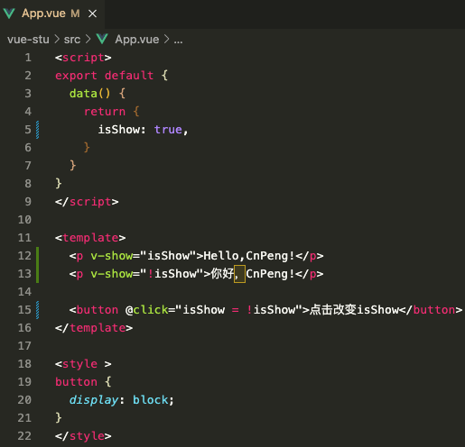

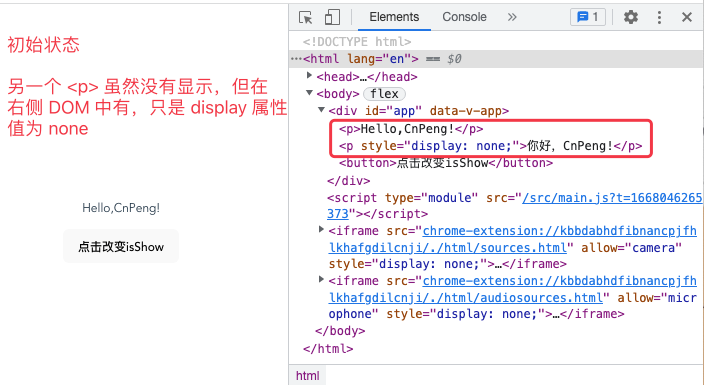

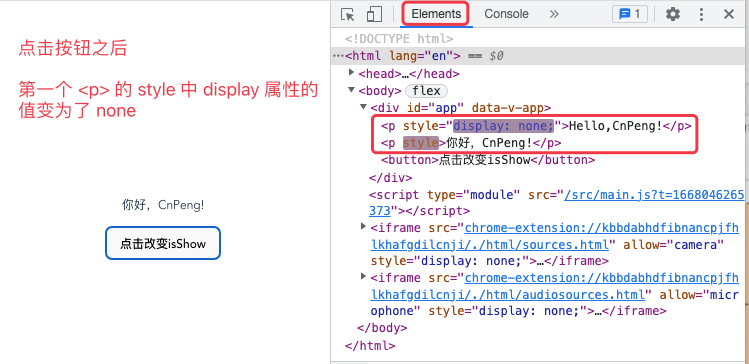

```vue
<script>
export default {
  data() {
    return {
      isShow: true,
    }
  }
}
</script>

<template>
  <p v-show="isShow">Hello,CnPeng!</p>
  <p v-show="!isShow">你好，CnPeng!</p>

  <button @click="isShow = !isShow">点击改变isShow</button>
</template>

<style >
button {
  display: block;
}
</style>
```

## 1.6. v-if vs. v-show

`v-if` 是“真实的”按条件渲染，因为它确保了在切换时，条件区块内的事件监听器和子组件都会被销毁与重建。

`v-if` 也**是惰性的**：如果在初次渲染时条件值为 false，则不会做任何事。条件区块**只有当条件首次变为 true 时才被渲染**。

相比之下，**v-show** 简单许多，元素**无论初始条件如何，始终会被渲染，只有 CSS `display` 属性会被切换**。

总的来说，**`v-if` 有更高的切换开销，而 `v-show` 有更高的初始渲染开销**。因此，

* **如果需要频繁切换，则使用 `v-show` 较好；**
* **如果在运行时绑定条件很少改变，则 `v-if` 会更合适。**

> CnPeng : 两者的对比类似于 java 设计模式中单例模式的懒汉式和饿汉式。
> * `v-if` 类比懒汉式——用的时候才创建；
> * `v-show` 类比饿汉式——先创建出来准备着。

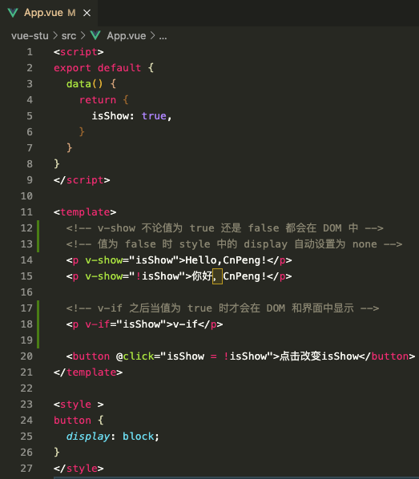

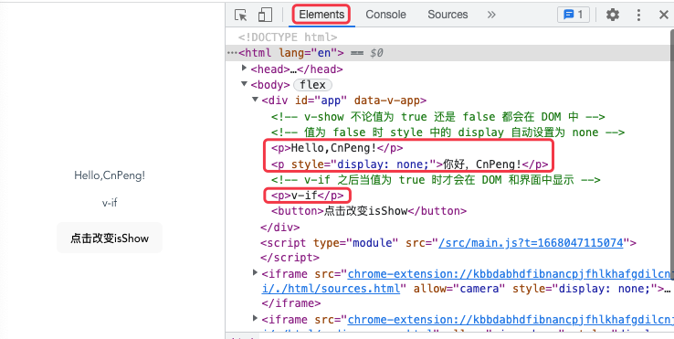

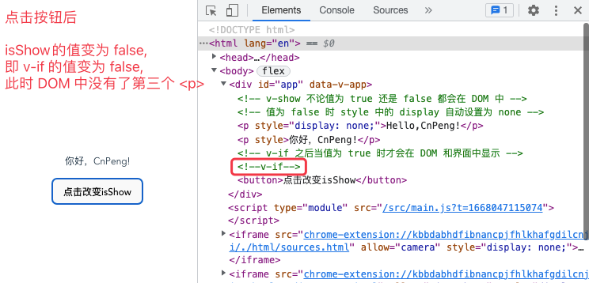

```vue
<script>
export default {
  data() {
    return {
      isShow: true,
    }
  }
}
</script>

<template>
  <!-- v-show 不论值为 true 还是 false 都会在 DOM 中 -->
  <!-- 值为 false 时 style 中的 display 自动设置为 none -->
  <p v-show="isShow">Hello,CnPeng!</p>
  <p v-show="!isShow">你好，CnPeng!</p>

  <!-- v-if 之后当值为 true 时才会在 DOM 和界面中显示 -->
  <p v-if="isShow">v-if</p>

  <button @click="isShow = !isShow">点击改变isShow</button>
</template>

<style >
button {
  display: block;
}
</style>
```

## 1.7. v-if 和 v-for

>警告⚠️：
>不推荐同时使用 `v-if` 和 `v-for` ，因为这样二者的优先级不明显。请查看[风格指南](https://cn.vuejs.org/style-guide/rules-essential.html#avoid-v-if-with-v-for)获得更多信息。

当 `v-if` 和 `v-for` 同时存在于一个元素上的时候，`v-if` 会首先被执行。请查看[列表渲染指南](https://cn.vuejs.org/guide/essentials/list.html#v-for-with-v-if)获取更多细节。

