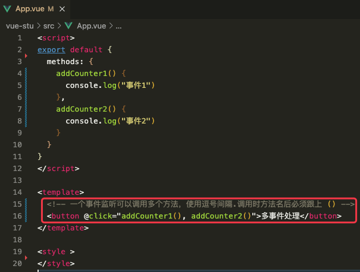

# 1. 9-事件处理

> 2022-11-10
> [官方文档-事件处理](https://cn.vuejs.org/guide/essentials/event-handling.html)

## 1.1. 监听事件

我们可以使用 `v-on` 指令 (简写为 `@`) 来监听 DOM 事件，并在事件触发时执行对应的 JavaScript。

用法：`v-on:click="methodName"` 或 `@click="handler"`。

事件处理器的值可以是：

* **内联事件处理器**：事件被触发时执行的内联 JavaScript 语句 (与 `onclick` 类似)。
* **方法事件处理器**：一个指向组件上定义的方法的属性名或是路径。

## 1.2. 内联事件处理器

内联事件处理器通常用于简单场景，例如：

```js
data() {
  return {
    count: 0
  }
}
```

```template
<button @click="count++">Add 1</button>
<p>Count is: {{ count }}</p>
```

## 1.3. 方法事件处理器

随着事件处理器的逻辑变得愈发复杂，内联代码方式变得不够灵活。因此 `v-on` 也可以接受一个方法名或对某个方法的调用。

### 1.3.1. 方法事件处理器

```js
data() {
  return {
    name: 'Vue.js'
  }
},
methods: {
  greet(event) {
    // 方法中的 `this` 指向当前活跃的组件实例
    alert(`Hello ${this.name}!`)
    // `event` 是 DOM 原生事件
    if (event) {
      alert(event.target.tagName)
    }
  }
}
```

```template
<!-- `greet` 是上面定义过的方法名 -->
<button @click="greet">Greet</button>
```

点击按钮之后的显示效果如下：


**方法事件处理器会自动接收原生 DOM 事件并触发执行**。

在上面的例子中，我们能够通过被触发事件的 `event.target.tagName` 访问到该 DOM 元素。

可以看看[为事件处理器标注类型](https://cn.vuejs.org/guide/typescript/options-api.html#typing-event-handlers)这一章以了解更多。

### 1.3.2. 绑定多个方法

事件处理器中可以一次绑定多个方法，多个方法之间使用逗号间隔。而且，被绑定的方法名后必须跟上 `()`:




```vue
<script>
export default {
  methods: {
    addCounter1() {
      console.log("事件1")
    },
    addCounter2() {
      console.log("事件2")
    }
  }
}
</script>

<template>
  <!-- 一个事件监听可以调用多个方法，使用逗号间隔.调用时方法名后必须跟上 () -->
  <button @click="addCounter1(), addCounter2()">多事件处理</button>
</template>

<style >
button {
  display: block;
}
</style>
```

### 1.3.3. 方法与内联事件判断

模板编译器会通过检查 `v-on` 的值是否是合法的 JavaScript 标识符或属性访问路径来断定是何种形式的事件处理器。

举例来说，`foo` 、`foo.bar` 和 `foo['bar']` 会被视为方法事件处理器，而 `foo()` 和 `count++` 会被视为内联事件处理器。

## 1.4. 在内联处理器中调用方法

除了直接绑定方法名，还可以在内联事件处理器中调用方法。

这允许我们向方法传入自定义参数以代替原生事件：

```js
methods: {
  say(message) {
    alert(message)
  }
}
```

```template
<button @click="say('hello')">Say hello</button>
<button @click="say('bye')">Say bye</button>
```

## 1.5. 在内联事件处理器中访问事件参数

有时我们需要在内联事件处理器中访问原生 DOM 事件。

你可以向该处理器方法传入一个特殊的 `$event` 变量，或者**使用内联箭头函数**：

```js
methods: {
  // 参数名任意定义
  warn(message, event) {
    // 这里可以访问 DOM 原生事件
    if (event) {
      event.preventDefault()
    }
    alert(message)
  }
}
```

```template
<!-- 使用特殊的 $event 变量，固定写法 -->
<button @click="warn('Form cannot be submitted yet.', $event)">
  Submit
</button>

<!-- 使用内联箭头函数，此处括号内的参数 event 用于表示事件对象，可以自定义.即此处的 event 可以换成 ev 或其他 -->
<button @click="(event) => warn('Form cannot be submitted yet.', event)">
  Submit
</button>
```

### 1.5.1. 示例1

```vue
<script>
export default {
  data() {
    return {
      counter: 0,
    }
  },
  methods: {
    addCounter(num, e) {
      this.counter++
      console.log("事件:", e)
    }
  }
}
</script>

<template>
  <!-- 此处 $event 为固定写法 -->
  <button @click="addCounter(5, $event)">调用方法时传参</button>
  <!-- 使用箭头方式时，事件变量的名称可以自定义 -->
  <button @click="(ev) => addCounter(5, ev)">调用方法时传参</button>
</template>

<style >
button {
  display: block;
}
</style>
```


### 1.5.2. 示例2

```vue
<script>
export default {
  data() {
    return {
      counter: 0,
    }
  },
  methods: {
    addCounter(e) {
      this.counter++
      console.log("增加counter:", e)
    }
  }
}
</script>

<template>
  <button @click="addCounter">调用方法时不传参</button>
  <button @click="addCounter(5)">调用方法时传参</button>
</template>

<style >
button {
  display: block;
}
</style>
```


上述示例中，我们在调用有参方法时，如果不传递参数，则默认将当前的事件对象作为参数传入。

所以，当我们点击第一个按钮时，在日志中会打印当前的 `PointerEvent` 事件对象。

而在第二个按钮的事件监听中，我们在调用方法时显示的传入了数字 5 作为参数，所以，点击第二个按钮时，会打印 5 。

## 1.6. 事件修饰符

在处理事件时调用 `event.preventDefault()` 或 `event.stopPropagation()` 是很常见的。

尽管我们可以直接在方法内调用，但如果方法能更专注于数据逻辑而不用去处理 DOM 事件的细节会更好。

为解决这一问题，Vue 为 `v-on` 提供了**事件修饰符**。修饰符是用 `.` 表示的指令后缀，包含以下这些：

* `.stop`
* `.prevent`
* `.self`
* `.capture`
* `.once`
* `.passive`


```template
<!-- 单击事件将停止传递 -->
<a @click.stop="doThis"></a>

<!-- 提交事件将不再重新加载页面 -->
<form @submit.prevent="onSubmit"></form>

<!-- 修饰语可以使用链式书写 -->
<a @click.stop.prevent="doThat"></a>

<!-- 也可以只有修饰符 -->
<form @submit.prevent></form>

<!-- 仅当 event.target 是元素本身时才会触发事件处理器 -->
<!-- 例如：事件处理器不来自子元素 -->
<div @click.self="doThat">...</div>
```

> 提示：
> 使用修饰符时需要注意调用顺序，因为相关代码是以相同的顺序生成的。因此：
>
> * 使用 `@click.prevent.self` 会阻止元素及其子元素的所有点击事件的默认行为，
> * 而 `@click.self.prevent` 则只会阻止对元素本身的点击事件的默认行为。

`.capture`、`.once` 和 `.passive` 修饰符与[原生 `addEventListener` 事件](https://developer.mozilla.org/zh-CN/docs/Web/API/EventTarget/addEventListener#options)相对应：

```template
<!-- 添加事件监听器时，使用 `capture` 捕获模式 -->
<!-- 例如：指向内部元素的事件，在被内部元素处理前，先被外部处理 -->
<div @click.capture="doThis">...</div>

<!-- 点击事件最多被触发一次 -->
<a @click.once="doThis"></a>

<!-- 滚动事件的默认行为 (scrolling) 将立即发生而非等待 `onScroll` 完成 -->
<!-- 以防其中包含 `event.preventDefault()` -->
<div @scroll.passive="onScroll">...</div>
```

**`.passive` 修饰符一般用于触摸事件的监听器，可以用来[改善移动端设备的滚屏性能](https://developer.mozilla.org/zh-CN/docs/Web/API/EventTarget/addEventListener#%E4%BD%BF%E7%94%A8_passive_%E6%94%B9%E5%96%84%E7%9A%84%E6%BB%9A%E5%B1%8F%E6%80%A7%E8%83%BD)。**

>提示：
>请勿同时使用 `.passive` 和 `.prevent`，因为 `.passive` 已经向浏览器表明了你不想阻止事件的默认行为。如果你这么做了，则 `.prevent` 会被忽略，并且浏览器会抛出警告。

## 1.7. 按键修饰符

在监听键盘事件时，我们经常需要检查特定的按键。

Vue 允许在 `v-on` 或 `@` 监听按键事件时添加按键修饰符。

```template
<!-- 仅在 `key` 为 `Enter` 时调用 `submit` -->
<input @keyup.enter="submit" />
```

你可以直接使用 [KeyboardEvent.key](https://developer.mozilla.org/zh-CN/docs/Web/API/UI_Events/Keyboard_event_key_values) 暴露的按键名称作为修饰符，但需要转为 kebab-case 形式。

```template
<input @keyup.page-down="onPageDown" />
```

在上面的例子中，仅会在 `$event.key` 为 `'PageDown'` 时调用事件处理。

### 1.7.1. 按键别名

Vue 为一些常用的按键提供了别名：

* `.enter`
* `.tab`
* `.delete` (捕获“Delete”和“Backspace”两个按键)
* `.esc`
* `.space`
* `.up`
* `.down`
* `.left`
* `.right`

### 1.7.2. 系统按键修饰符

可以使用以下系统按键修饰符来**触发鼠标或键盘事件监听器**，只有当按键被按下时才会触发。

* `.ctrl`
* `.alt`
* `.shift`
* `.meta`

>注意:
>
>* 在 Mac 键盘上， `meta` 是 Command 键 (⌘)。
>* 在 Windows 键盘上， `meta` 键是 Windows 键 (⊞)。
>* 在 Sun 微机系统键盘上， `meta` 是钻石键 (◆)。
>
>此外，在某些键盘上，特别是 MIT 和 Lisp 机器的键盘及其后代版本的键盘，如 Knight 键盘，space-cadet 键盘，meta 都被标记为“META”。在 Symbolics 键盘上，meta 也被标识为“META”或“Meta”。

举例来说：

```template
<!-- Alt + Enter -->
<input @keyup.alt.enter="clear" />

<!-- Ctrl + 点击 -->
<div @click.ctrl="doSomething">Do something</div>
```

>提示：
>
>请注意，系统按键修饰符和常规按键不同。与 `keyup` 事件一起使用时，该按键必须在事件发出时处于按下状态。换句话说，**`keyup.ctrl` 只会在你仍然按住 `ctrl` 但松开了另一个键时被触发。若你单独松开 ctrl 键将不会触发。**

### 1.7.3. `.exact` 修饰符

`.exact` 修饰符允许控制触发一个事件所需的**确定组合的系统按键修饰符**。

```template
<!-- 当按下 Ctrl 时，即使同时按下 Alt 或 Shift 也会触发 -->
<button @click.ctrl="onClick">A</button>

<!-- 仅当按下 Ctrl 且未按任何其他键时才会触发 -->
<button @click.ctrl.exact="onCtrlClick">A</button>

<!-- 仅当没有按下任何系统按键时触发 -->
<button @click.exact="onClick">A</button>
```

## 1.8. 鼠标按键修饰符

* `.left`
* `.right`
* `.middle`

这些修饰符将处理程序限定为由特定鼠标按键触发的事件。

