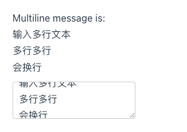

# 1. 010-表单输入绑定

> 2022-11-18 , [文档链接](https://cn.vuejs.org/guide/essentials/forms.html)

在前端处理表单时，我们常常需要将表单输入框的内容同步给 JavaScript 中相应的变量。手动连接值绑定和更改事件监听器可能会很麻烦：

```template
<input
  :value="text"
  @input="event => text = event.target.value">
```

`v-model` 指令帮我们简化了这一步骤：

```template
<input v-model="text">
```

另外，`v-model` 还可以用于各种不同类型的输入，`<textarea>`、`<select>` 元素。它会**根据所使用的元素自动使用对应的 DOM 属性和事件组合**：

* 文本类型的 `<input>` 和 `<textarea>` 元素会绑定 `value` property 并侦听 `input` 事件；
* `<input type="checkbox">` 和 `<input type="radio">` 会绑定 `checked` property 并侦听 `change` 事件；
* `<select>` 会绑定 `value` property 并侦听 `change` 事件。

>注意
>`v-model` 会忽略任何表单元素上初始的 `value`、`checked` 或 `selected` attribute。它将始终将当前绑定的 JavaScript 状态视为数据的正确来源。你应该在 JavaScript 中使用`data` 选项来声明该初始值。


## 1.1. 基本用法

### 1.1.1. 文本

```template
<!--message 是定义在 sctrip-data 中的属性-->
<p>Message is: {{ message }}</p>
<input v-model="message" placeholder="edit me" />
```

>注意
>对于需要使用 [`IME`](https://en.wikipedia.org/wiki/Input_method) 的语言 (中文，日文和韩文等)，你会发现 `v-model` 不会在 IME 输入还在拼字阶段时触发更新。如果你的确想在拼字阶段也触发更新，请直接使用自己的 `input` 事件监听器和 `value` 绑定而不要使用 `v-model`。


#### 1.1.1.1. 示例1


```vue
<script>
export default {
  data() {
    return {
      message: ''
    }
  }ƒ
}
</script>

<template>
    <p>Message is: {{ message }}</p>
    <input v-model="message" placeholder="edit me" />
</template>
```

#### 1.1.1.2. 示例2

`v-model` 本质上等同于两个操作：

* `v-bind` 绑定一个 value 属性
* `v-on` 给当前元素添加一个 input 事件


```vue
<script>
export default {
  data() {
    return {
      msg: "Hello,CnPeng!"
    }
  },
  methods: {
    changeMsg(e) {
      console.log(e)
      this.msg = e.target.value
    }
  }
}
</script>

<template>
  <h2>{{ msg }}</h2>

  <!-- 当输入框内容发生变化时，会即时更新到 h2 中 -->
  <input type="text" v-model="msg">

  <div>
    <!-- 仅做值绑定。当该输入框中的文本发生改变时， 并不会更新到 h2 中-->
    <input type="text" :value="msg">
  </div>

  <div>
    <!-- v-model 等价于此处的 :value 值绑定 + @input 事件监听 -->
    <!-- 当该输入框中的内容发生变化时，会即时更新到 h2 中 -->
    <input type="text" :value="msg" @input="changeMsg">
  </div>
</template>

<style >

</style>
```

### 1.1.2. 多行文本

```template
<span>Multiline message is:</span>
<p style="white-space: pre-line;">{{ message }}</p>
<!--能够监听到换行，输入的内容换行后，上面的 p 标签在展示时也会换行-->
<textarea v-model="message" placeholder="add multiple lines"></textarea>
```

注意**在 `<textarea>` 中是不支持插值表达式的**。请使用 `v-model` 来替代：

```template
<!-- ❌ 错误，注意，这是错误写法，textarea 不支持 {{}} 这种插值表达式 -->
<textarea>{{ text }}</textarea>

<!-- 正确 -->
<textarea v-model="text"></textarea>
```

完整代码：



```vue
<script>
export default {
  data() {
    return {
      message: ''
    }
  }
}
</script>

<template>
	<span>Multiline message is:</span>
	<p style="white-space: pre-line;">{{ message }}</p>
	<textarea v-model="message" placeholder="add multiple lines"></textarea>
</template>
```

### 1.1.3. 复选框

将 `input` 的 `type` 取值指定为 `checkbox`，空实现复选框（含单选和多选）。

#### 1.1.3.1. 单一复选框

单一的复选框，绑定布尔类型值：

```template
<input type="checkbox" v-model="checked" />
<label>{{ checked }}</label>
```

完整代码：


```vue
<script>
export default {
  data() {
    return {
      checked: true
    }
  }
}
</script>

<template>
  <!--checked 为 true 时，显示 true; 为 false 时显示 false-->
  <h2>{{ checked }}</h2>
  <input type="checkbox" v-model="checked">
</template>

<style >

</style>

```

#### 1.1.3.2. 多个复选框

可以将多个复选框绑定到同一个数组或集合。

📢  注意：**必须为标签指定 `value` 属性值**，否则，数组或集合中的数据会有异常。


```vue
<script>
export default {
  data() {
    return {
      fruits: []
    }
  }
}
</script>

<template>
  <!-- 选择项为多选时，绑定到数组，并需要定义 value , 选中时 value 值会放置到数组中 -->
  <h2>选择喜欢吃的水果：{{ fruits }}</h2>
  <input type="checkbox" v-model="fruits" value="桃子">🍑
  <input type="checkbox" v-model="fruits" value="西瓜">🍉
  <input type="checkbox" v-model="fruits" value="香蕉">🍌
  <input type="checkbox" v-model="fruits" value="菠萝">🍍
</template>

<style >

</style>
```

### 1.1.4. 单选按钮

将 `input` 标签的 `type` 取值指定为 `radio`，可实现单选。

必须指定 `value` 属性值，否则无法实现单选效果。 


```vue
<script>
export default {
  data() {
    return {
      sex: "男",
      sex2: "男"
    }
  }
}
</script>

<template>
  <!-- 必须指定 value 才能实现单选 -->
  <h2>指定value-选择性别1：{{ sex }}</h2>
  <input type="radio" v-model="sex" value="男">👦🏻
  <input type="radio" v-model="sex" value="女">👧🏻

  <!-- ❌ 错误示例：未指定 value 时，无法实现单选-->
  <h2>未指定value-选择性别2：{{ sex2 }}</h2>
  <input type="radio" v-model="sex2">👦🏻
  <input type="radio" v-model="sex2">👧🏻
</template>

<style >

</style>

```

### 1.1.5. 选择器

选择器即 `select` 标签中嵌套 `option` 标签。

#### 1.1.5.1. 单一选择

单个选择器的示例如下：


📢  注意：

如果 `v-model` 表达式的初始值不匹配任何一个选择项，`<select>` 元素会渲染成一个“未选择”的状态。在 iOS 上，这将导致用户无法选择第一项，因为 iOS 在这种情况下不会触发一个 `change` 事件。因此，**建议提供一个空值的禁用选项**，具体如下：

```vue
<script>
export default {
  data() {
    return {
      city: ""
    }
  }
}
</script>

<template>
  <h3>所在城市：{{ city }}</h3>
  <select name="" id="" v-model="city">
    <!-- 提供禁用的空置选项，防止 iOS 显示异常 -->
    <option disabled value="">请选择</option>
    <option value="济南">山东省济南市</option>
    <option value="青岛">山东省青岛市</option>
    <option value="临沂">山东省临沂市</option>
  </select>

</template>

<style >
</style>
```


#### 1.1.5.2. 多选

多选 (值绑定到一个数组)：


> 在 Mac 上按住 shift 或者 command 都可以实现多选。鼠标左键按住某一下，然后滑动也可以实现多选。

```vue
<script>
export default {
  data() {
    return {
      cities: []
    }
  }
}
</script>

<template>
  <h3>喜欢的城市：{{ cities }}</h3>
  <!-- 指定 multiple 可以实现多选 -->
  <select name="" id="" v-model="cities" multiple>
    <!-- 提供禁用的空置选项，防止 iOS 显示异常 -->
    <option disabled value="">请选择</option>
    <option value="北京">北京市</option>
    <option value="青岛">青岛市</option>
    <option value="上海">上海市</option>
  </select>

</template>

<style >

</style>
```


#### 1.1.5.3. 使用 `v-for` 动态渲染选项

选择器的选项可以使用 `v-for` 动态渲染：


```js
<script>
export default {
  data() {
    return {
      selected: 'A',
      options: [
        { text: 'One', value: 'A' },
        { text: 'Two', value: 'B' },
        { text: 'Three', value: 'C' }
      ]
    }
  }
}
</script>

<template>
  <select v-model="selected">
    <option v-for="option in options" :value="option.value">
      {{ option.text }}
    </option>
  </select>

  <div>Selected: {{ selected }}</div>
</template>
```

## 1.2. 值绑定

默认情况下，对于单选按钮，复选框和选择器选项，`v-model` 绑定的值通常是静态的字符串 (或者对复选框是布尔值)：

```template
<!-- `picked` 在被选择时是字符串 "a" -->
<input type="radio" v-model="picked" value="a" />

<!-- `toggle` 只会为 true 或 false -->
<input type="checkbox" v-model="toggle" />

<!-- `selected` 在第一项被选中时为字符串 "abc" -->
<select v-model="selected">
  <option value="abc">ABC</option>
</select>
```

但有时我们可能希望将该值**绑定到当前组件实例上的动态数据**。

这可以通过使用 `v-bind` 来实现。

此外，使用 `v-bind` 还使我们**可以将选项值绑定为非字符串的数据类型**。

### 1.2.1. 复选框

```template
<input
  type="checkbox"
  v-model="toggle"
  true-value="yes"
  false-value="no" />
```

**`true-value` 和 `false-value`是 Vue 特有的 attributes，仅支持和 `v-model` 配套使用。** 这里 `toggle` 属性的值会在选中时被设为 `'yes'`，取消选择时设为 `'no'`。

我们也可以通过 `v-bind` 将其绑定为其他动态值：

```template
<input
  type="checkbox"
  v-model="toggle"
  :true-value="dynamicTrueValue"
  :false-value="dynamicFalseValue" />
```

完整示例如下：


```vue
<script>
export default {
  data() {
    return {
      msg1: "",
      msg2: "",
      dynamicCheckedMsg: "这里被选中了",
      dynamicUnCheckedMsg: "没有被选中"
    }
  }
}
</script>

<template>
  <h3>msg1 的值：{{ msg1 }}</h3>
  <!-- true-value 静态指定选中时 msg1 的值 -->
  <input type="checkbox" v-model="msg1" true-value="被选中了" false-value="未被选中" />选择或取消选择

  <!-- :true-value 为动态值绑定，动态绑定选中时 msg2 的值 -->
  <h3>msg2 的值：{{ msg2 }}</h3>
  <input type="checkbox" v-model="msg2" :true-value="dynamicCheckedMsg" :false-value="dynamicUnCheckedMsg" />选择或取消选择

</template>

<style >
</style>
```


提示：

`true-value` 和 `false-value` attributes 不会影响 `value` attribute，因为浏览器在表单提交时，并不会包含未选择的复选框。为了保证这两个值 (例如：“yes”和“no”) 的其中之一被表单提交，请使用单选按钮作为替代。

>CnPeng 上面这段提示摘自官网，没理解什么意思。


### 1.2.2. 单选按钮


```vue
<script>
export default {
  data() {
    return {
      pick: "",
      first: "第一名",
      second: "第二名"
    }
  }
}
</script>

<template>
  <h3>pick 的值：{{ pick }}</h3>
  <input type="radio" v-model="pick" :value="first" />1
  <input type="radio" v-model="pick" :value="second" />2
</template>

<style >

</style>
```

`pick` 会在第一个按钮选中时被设为 `first` 对应的值，在第二个按钮选中时被设为 `second` 对应的值 。

### 1.2.3. 选择器选项

`v-model` 也支持非字符串类型的值绑定！下面的例子中，选项被选中时 `selected` 会被设为对象。


```vue
<script>
export default {
  data() {
    return {
      // 注意：这里的 selected 可以定义成 ""，也可以定义成 {}.
      selected: "",
      obj2: { number: 2 }
    }
  }
}
</script>

<template>
  <h3>number 值：{{ selected.number }}</h3>
  <select v-model="selected">
    <option disabled value="">请选择</option>
    <!-- 内联对象字面量 -->
    <option :value="{ number: 1 }">选项1</option>
    <!-- data 中的对象属性 -->
    <option :value="obj2">选项2</option>
  </select>
</template>

<style >
</style>
```

## 1.3. 修饰符

### 1.3.1. `.lazy`

默认情况下，`v-model` 会在每次 `input` 事件后立即更新数据 ([IME 拼字阶段的状态](https://cn.vuejs.org/guide/essentials/forms.html#vmodel-ime-tip)例外)。

如果我们界面中渲染的内容依赖于上述数据，那么每变更一个字符就会触发一次渲染，这样对性能损耗过大。因此，我们想要在数据变更完成之后，才去重新渲染界面。

通过 `v-model` 的 `lazy` 修饰符可以实现在每次 `change` 事件完成之后再去更新数据：

```template
<!-- 在 "change" 事件后同步更新而不是 "input" -->
<input v-model.lazy="msg" />
```

完整示例：


```vue
<script>
export default {
  data() {
    return {
      msg: "",
      msg2: ""
    }
  }
}
</script>

<template>
  <h3>msg-无lazy : {{ msg }}</h3>
  <!-- 即时更新 msg 的内容 -->
  <input type="text" v-model="msg" />

  <h3>msg2-有lazy : {{ msg2 }}</h3>
  <!--添加 lazy 修饰符后，当 input 失去焦点时才会更新 msg2 的内容 -->
  <input type="text" v-model.lazy="msg2" />
</template>

<style >
</style>
```

### 1.3.2. `.number`

如果想让用户输入自动转换为数字类型，你可以在 `v-model` 后添加 `.number` 修饰符来管理输入：

```template
<input v-model.number="age" />
```

如果该值无法被 `parseFloat()` 处理，那么将返回原始值。

`number` 修饰符会在输入框有 `type="number"` 时自动启用。

完整示例：


```vue
<script>
export default {
  data() {
    return {
      counter: ""
    }
  }
}
</script>

<template>
  <!-- typeof xx 用于获取 xx 的数据类型 -->
  <h3>{{ counter }} 的类型为：{{ typeof counter }}</h3>
  <!--添加 number 修饰符后, 如果内容为数字会被自动转为 number 类型-->
  <input type="text" v-model.number="counter" />
</template>

<style >
</style>
```

### 1.3.3. `.trim`

如果你想要默认自动去除用户输入内容中两端的空格，你可以在 `v-model` 后添加 `.trim` 修饰符：

```template
<input v-model.trim="msg" />
```

完整示例：


我们在输入框中输入前后均带有空格的 `  abc  ` 时，会发现展示在 `【】` 中的内容并没有空格——被自动 `trim` 了

```vue
<script>
export default {
  data() {
    return {
      msg: ""
    }
  }
}
</script>

<template>
  <h3>msg:【{{ msg }}】</h3>
  <!-- trim 修饰符hi自动去除输入内容两端的空格符 -->
  <input type="text" v-model.trim="msg" />
</template>

<style >
</style>
```


## 1.4. 组件上的 `v-model`

>如果你还不熟悉 Vue 的组件，那么现在可以跳过这个部分。

HTML 的内置表单输入类型并不总能满足所有需求。幸运的是，我们可以使用 Vue 构建具有自定义行为的可复用输入组件，并且这些输入组件也支持 `v-model`！要了解更多关于此的内容，请在组件指引中阅读[配合 v-model 使用](https://cn.vuejs.org/guide/components/events.html#usage-with-v-model)。

