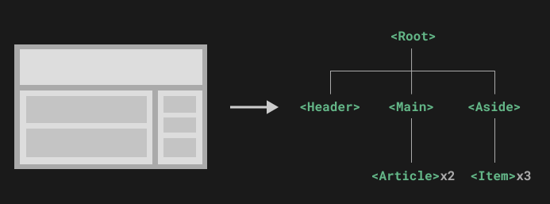

# 1. 011-组件的定义和使用

> 2022-11-19 周六 
> [组件基础](https://cn.vuejs.org/guide/essentials/component-basics.html) 、 [深入组件-组件注册](https://cn.vuejs.org/guide/components/registration.html)

组件允许我们将 UI 划分为独立的、可重用的部分，并且可以对每个部分进行单独的思考。在实际应用中，组件常常被组织成层层嵌套的树状结构：



这和我们嵌套 HTML 元素的方式类似，Vue 实现了自己的组件模型，使我们可以在每个组件内封装自定义内容与逻辑。Vue 同样也能很好地配合原生 Web Component。[点击查看 Vue 组件与原生 Web Components 之间的关系。](https://cn.vuejs.org/guide/extras/web-components.html)


## 1.1. 定义组件

### 1.1.1. 定义组件

自定义组件通常定义在 `src`-`components` 目录下，组件名称首字母大写，文件后缀名为 `.vue`.

当使用构建步骤时，我们一般会将 Vue 组件定义在一个单独的 `.vue` 文件中，这被叫做[单文件组件 (简称 SFC)](https://cn.vuejs.org/guide/scaling-up/sfc.html)：

```vue
<script>
export default {
  data() {
    return {
      count: 0
    }
  }
}
</script>

<template>
  <button @click="count++">You clicked me {{ count }} times.</button>
</template>
```

当不使用构建步骤时，一个 Vue 组件以一个包含 Vue 特定选项的 JavaScript 对象来定义：

```js
export default {
  data() {
    return {
      count: 0
    }
  },
  template: `
    <button @click="count++">
      You clicked me {{ count }} times.
    </button>`
}
```

这里的模板是一个内联的 JavaScript 字符串，Vue 将会在运行时编译它。你也可以使用 ID 选择器来指向一个元素 (通常是原生的 `<template>` 元素)，Vue 将会使用其内容作为模板来源。

上面的例子中定义了一个组件，并在一个 `.js` 文件里默认导出了它自己，但你也可以通过具名导出在一个文件中导出多个组件。

### 1.1.2. 组件名格式

上一节中，我们定义组件时使用 `PascalCase` 作为组件名的注册格式，这是因为：

* PascalCase 是合法的 JavaScript 标识符。这使得在 JavaScript 中导入和注册组件都很容易，同时 IDE 也能提供较好的自动补全。
* `<PascalCase />` 在模板中更明显地表明了这是一个 Vue 组件，而不是原生 HTML 元素。同时也能够将 Vue 组件和自定义元素 (web components) 区分开来。

在单文件组件和内联字符串模板中，我们都推荐这样做。但是， `PascalCase` 的标签名在 DOM 模板中是不可用的，详情参见下一小节： [DOM 模板解析注意事项](https://cn.vuejs.org/guide/essentials/component-basics.html#dom-template-parsing-caveats)。

为了方便，Vue 支持将模板中使用 `kebab-case` 的标签解析为使用 `PascalCase` 注册的组件。这意味着**一个以 `MyComponent` 为名注册的组件，在模板中可以通过 `<MyComponent>` 或 `<my-component>` 引用**。这让我们能够使用同样的 JavaScript 组件注册代码来配合不同来源的模板。


## 1.2. 使用组件

在使用 Vue 组件前需要先进行“注册”（即引入和导出），这样 Vue 才能在渲染模板时找到其对应的实现。组件注册有两种方式：全局注册和局部注册。

### 1.2.1. 局部注册

>TIP
>
>我们会在接下来的指引中使用 SFC 语法，无论你是否使用构建步骤，组件相关的概念都是相同的。[示例](https://cn.vuejs.org/examples/)一节中展示了两种场景中的组件使用情况。

假设我们在 `src/components` 目录下定义了 `ButtonCounter.vue` 组件，那么在 `App.vue` 中使用该组件的示例如下：

```vue
<script>
// 引入组件。import 后面的 名字可以和 from 中的文件名不一致。
import ButtonCounter from './components/ButtonCounter.vue'

export default {
  // 导出组件
  components: {
    // 必须与上面 import 后紧跟的名字一致。
    ButtonCounter
  }
}
</script>

<template>
  <h1>Here is a child component!</h1>
  <!--使用组件-->
  <ButtonCounter />
</template>
```

上述示例中，我们先通过 `import` 将组件导入，并通过 `export default` 的 `components` 将该组件暴露给当前文件中的 `template`，这样 `template` 节点中就可以使用该组件了。通过这种方式注册的组件仅在当前文件（或组件）中可用，所以称为 **局部注册**。

需要注意的是，`components` 中暴露的组件名称必须和紧跟在 `import` 后面的名称一致，且该名称将作为标签名在 `template` 中进行使用。如下：

```template
<h1>Here is a child component!</h1>
<!--组件可以被重用任意多次-->
<ButtonCounter />
<ButtonCounter />
<ButtonCounter />
```

当我们当点击这些按钮时，每一个组件都维护着自己的状态，是不同的 `count` 。这是因为**每当使用一个组件，就创建了一个新的实例**。

在单文件组件（SFC）中，推荐为子组件使用 `PascalCase` 的标签名，以此来和原生的 HTML 元素作区分。虽然**原生 HTML 标签名是不区分大小写的**，**但 Vue 单文件组件是可以在编译中区分大小写的**。我们也可以使用 `/>` 来关闭一个标签。

如果你是直接在 DOM 中书写模板 (例如原生 `<template>` 元素的内容)，模板的编译需要遵从浏览器中 HTML 的解析行为。在这种情况下，应该需要使用 `kebab-case` 形式并显式地关闭这些组件的标签。

```template
<!-- 如果是在 DOM 中书写该模板 -->
<button-counter></button-counter>
<button-counter></button-counter>
<button-counter></button-counter>
```

请看 [DOM 模板解析注意事项](https://cn.vuejs.org/guide/essentials/component-basics.html#dom-template-parsing-caveats) 了解更多细节。


#### 1.2.1.1. 其他示例-基本使用

在 `src`-`components` 目录下新建 `CusComponent.vue` 组件文件，并编辑内容：

```vue
<!--1、template 和 script 这两个节点的顺序无要求。-->
<!--2、如果不需要 js 内容，可以不声明 script 节点。-->
<template>
    <div>
        <h2>这是一个自定义组件</h2>
    </div>
</template>
```

在根组件（即 `App.vue` 文件，这是程序入口）中引入并使用 `CusComponent.vue` 组件，如下：

```vue
<script>
// 引入组件. import 后面的名称为组件别名，可以和组件的文件名不一致。
import CusComp from "./components/CusComponent.vue"
export default {
  components: {
    // 导出组件。此处需与上方 import 后紧跟的名称一致。
    CusComp
  }
}
</script>

<template>
  <!-- 使用组件 -->
  <CusComp />
</template>

<style >
</style>
```

运行效果：


注意：因为电脑开启了暗黑主题，且启用了浏览器主题随系统变更，因此看到的是黑色背景白色字体。默认情况下，应该是白色背景，黑色字体。


#### 1.2.1.2. 其他示例-组件中使用组件

在 `src`-`components` 目录下新建 `Hello.vue` 组件文件，并编辑内容：

```vue
<template>
    <div>
        Hello，
    </div>
</template>
```

修改上一示例中的 `CusComponent.vue` ， 在其中引入并使用 `Hello` 组件，如下：

```vue
<script>
// 同级目录下直接使用 ./文件名 引入即可
import Hello from "./Hello.vue"
export default {
    components: {
        Hello
    }
}
</script>

<template>
    <div>
        <!-- 组件是带有名称的可复用实例 -->
        <Hello></Hello>
        <h2>这是一个自定义组件</h2>
        <Hello></Hello>
    </div>
</template>
```

`App.vue` 中的内容不需要做修改，运行效果如下：


> 补充：[点击查看 `export default` 中的 `data` 为什么必须是返回对象的函数](https://www.bilibili.com/video/BV1QA4y1d7xf?p=30)——组件中使用 `data` 时，每个组件都返回一个新的对象，防止造成多个组件间的数据污染。

在上述示例中，

* `CusComponent.vue` 中使用了 `Hello.vue` 组件，所以前者是后者的父组件，后者是前者的子组件，二者具备的父子关系。
* `App.vue` 又使用了 `CusComponent.vue` 组件，所以，前者也是后者的父组件，后者是前者的子组件。


**局部注册的组件需要在使用它的父组件中显式导入，并且只能在该父组件中使用。**

### 1.2.2. 全局注册


我们可以使用 [Vue 应用实例](https://cn.vuejs.org/guide/essentials/application.html)的 `app.component()` 方法，让组件在当前 Vue 应用中全局可用。

```js
// CnPeng : 这种方式暂不确定怎么使用
import { createApp } from 'vue'

const app = createApp({})

app.component(
  // 注册的名字
  'MyComponent',
  // 组件的实现
  {
    /* ... */
  }
)
```

如果使用单文件组件，你可以注册被导入的 `.vue` 文件：

```js
import MyComponent from './App.vue'

app.component('MyComponent', MyComponent)
```

`app.component()` 方法可以被链式调用：

```js
app
  .component('ComponentA', ComponentA)
  .component('ComponentB', ComponentB)
  .component('ComponentC', ComponentC)
```

**全局注册的组件可以在此应用的任意组件的模板中使用：**

```template
<!-- 这在当前应用的任意组件中都可用 -->
<ComponentA/>
<ComponentB/>
<ComponentC/>
```

所有的子组件也可以使用全局注册的组件，这意味着这三个组件也都可以在彼此内部使用。

#### 1.2.2.1. 完整示例1


运行效果：


* src/components/Hello.vue

```vue
<template>
    <div>
        Hello，
    </div>
</template>
```

* main.js 中全局导入

```vue
import { createApp } from 'vue'
import './style.css'
import App from './App.vue'
// 导入组件
import Hello from './components/Hello.vue'

const app = createApp(App)

// 暴露组件
app.component('Hello', Hello)

app.mount('#app')
```

* src/components/CusComponents.vue

```vue
<template>
    <div>
        <!-- 组件是带有名称的可复用实例 -->
        <Hello></Hello>
        <h2>这是一个自定义组件</h2>
        <Hello></Hello>
    </div>
</template>
```

* App.vue

```vue
<script>
// 引入组件. import 后面的名称为组件别名，可以和组件的文件名不一致。
import CusComp from "./components/CusComponent.vue"
export default {
  components: {
    // 导出组件。此处需与上方 import 后紧跟的名称一致。
    CusComp
  }
}
</script>

<template>
  <!-- 使用组件 -->
  <CusComp />
  <Hello></Hello>
</template>

<style >

</style>
```

## 1.3. DOM 模板解析注意事项

如果你想在 DOM 中直接书写 Vue 模板，Vue 则必须从 DOM 中获取模板字符串。由于浏览器的原生 HTML 解析行为限制，有一些需要注意的事项。

>TIP
>请注意下面讨论只适用于直接在 DOM 中编写模板的情况。如果你使用来自以下来源的字符串模板，就不需要顾虑这些限制了：
>
>* 单文件组件
>* 内联模板字符串 (例如 template: '...')
>* `<script type="text/x-template">`

### 1.3.1. 大小写区分

**HTML 标签和属性名称是不分大小写的**，所以浏览器**会把任何大写的字符解释为小写**。这意味着当你使用 DOM 内的模板时，无论是 `PascalCase` 形式的组件名称、 `camelCase` 形式的 prop 名称还是 `v-on` 的事件名称，都需要转换为相应等价的 `kebab-case (短横线连字符)` 形式：

```js
// JavaScript 中的 camelCase
const BlogPost = {
  props: ['postTitle'],
  emits: ['updatePost'],
  template: `
    <h3>{{ postTitle }}</h3>
  `
}
```

```template
<!-- HTML 中的 kebab-case -->
<blog-post post-title="hello!" @update-post="onUpdatePost"></blog-post>
```

### 1.3.2. 闭合标签

我们在上面的例子中已经使用过了`闭合标签 (self-closing tag)`：

```template
<MyComponent />
```

这是因为 **Vue 的模板解析器支持任意标签使用 `/>` 作为标签关闭的标志**。

然而**在 DOM 模板中，我们必须显式地写出关闭标签**：

```template
<my-component></my-component>
```

这是由于 HTML 只允许[一小部分特殊的元素](https://html.spec.whatwg.org/multipage/syntax.html#void-elements)省略其关闭标签，最常见的就是 `<input>` 和 ``。**对于其他的元素来说，如果你省略了关闭标签，原生的 HTML 解析器会认为开启的标签永远没有结束**，用下面这个代码片段举例来说：

```template
<my-component /> <!-- 我们想要在这里关闭标签... -->
<span>hello</span>
```

将被解析为：

```template
<my-component>
  <span>hello</span>
</my-component> <!-- 但浏览器会在这里关闭标签 -->
```

### 1.3.3. 元素位置限制

某些 HTML 元素对于放在其中的元素类型有限制，例如 `<ul>`，`<ol>`，`<table>` 和 `<select>`，相应的，某些元素仅在放置于特定元素中时才会显示，例如 `<li>`，`<tr>` 和 `<option>`。

这将导致在使用带有此类限制元素的组件时出现问题。例如：

```template
<table>
  <blog-post-row></blog-post-row>
</table>
```

自定义的组件 `<blog-post-row>` 将作为无效的内容被忽略，因而在最终呈现的输出中造成错误。我们可以使用特殊的 [`is` attribute](https://cn.vuejs.org/api/built-in-special-attributes.html#is) 作为一种解决方案：

```template
<table>
  <tr is="vue:blog-post-row"></tr>
</table>
```

>TIP
>**当使用在原生 HTML 元素上时，`is` 的值必须加上前缀 `vue:` 才可以被解析为一个 Vue 组件**。这一点是必要的，为了避免和[原生的自定义内置元素](https://html.spec.whatwg.org/multipage/custom-elements.html#custom-elements-customized-builtin-example)相混淆。

以上就是你需要了解的关于 DOM 模板解析的所有注意事项，同时也是 Vue 基础部分的所有内容。祝贺你！虽然还有很多需要学习的，但你可以先暂停一下，去用 Vue 做一些有趣的东西，或者研究一些[示例。](https://cn.vuejs.org/examples/)

