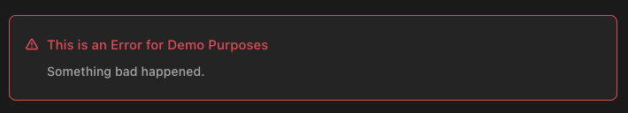

# 1. 011-组件基础

> 2022-11-19 周六  [文档](https://cn.vuejs.org/guide/essentials/component-basics.html)

组件允许我们将 UI 划分为独立的、可重用的部分，并且可以对每个部分进行单独的思考。在实际应用中，组件常常被组织成层层嵌套的树状结构：


这和我们嵌套 HTML 元素的方式类似，Vue 实现了自己的组件模型，使我们可以在每个组件内封装自定义内容与逻辑。Vue 同样也能很好地配合原生 Web Component。[点击查看 Vue 组件与原生 Web Components 之间的关系。](https://cn.vuejs.org/guide/extras/web-components.html)

## 1.1. 定义一个组件

当使用构建步骤时，我们一般会将 Vue 组件定义在一个单独的 `.vue` 文件中，这被叫做[单文件组件 (简称 SFC)](https://cn.vuejs.org/guide/scaling-up/sfc.html)：

```vue
<script>
export default {
  data() {
    return {
      count: 0
    }
  }
}
</script>

<template>
  <button @click="count++">You clicked me {{ count }} times.</button>
</template>
```

当不使用构建步骤时，一个 Vue 组件以一个包含 Vue 特定选项的 JavaScript 对象来定义：

```js
export default {
  data() {
    return {
      count: 0
    }
  },
  template: `
    <button @click="count++">
      You clicked me {{ count }} times.
    </button>`
}
```

这里的模板是一个内联的 JavaScript 字符串，Vue 将会在运行时编译它。你也可以使用 ID 选择器来指向一个元素 (通常是原生的 `<template>` 元素)，Vue 将会使用其内容作为模板来源。

上面的例子中定义了一个组件，并在一个 `.js` 文件里默认导出了它自己，但你也可以通过具名导出在一个文件中导出多个组件。

## 1.2. 使用组件

>TIP

>我们会在接下来的指引中使用 SFC 语法，无论你是否使用构建步骤，组件相关的概念都是相同的。[示例](https://cn.vuejs.org/examples/)一节中展示了两种场景中的组件使用情况。

**要使用一个子组件，我们需要在父组件中导入它。** 假设我们把计数器组件放在了一个叫做 `ButtonCounter.vue` 的文件中，这个组件将会以默认导出的形式被暴露给外部。

```vue
<script>
import ButtonCounter from './ButtonCounter.vue'

export default {
  components: {
    ButtonCounter
  }
}
</script>

<template>
  <h1>Here is a child component!</h1>
  <ButtonCounter />
</template>
```

若要将导入的组件暴露给模板，我们需要在 `components` 选项上[注册](https://cn.vuejs.org/guide/components/registration.html)它。这个组件将会以**其注册时的名字作为模板中的标签名。**

当然，你也可以全局地注册一个组件，使得它在当前应用中的任何组件上都可以使用，而不需要额外再导入。关于组件的全局注册和局部注册两种方式的利弊，在后续的 [组件注册](https://cn.vuejs.org/guide/components/registration.html)这一章节中专门讨论。

组件可以被重用任意多次：

```template
<h1>Here is a child component!</h1>
<ButtonCounter />
<ButtonCounter />
<ButtonCounter />
```

你会注意到，每当点击这些按钮时，每一个组件都维护着自己的状态，是不同的 `count` 。这是因为**每当你使用一个组件，就创建了一个新的实例**。

在单文件组件中，推荐为子组件使用 `PascalCase` 的标签名，以此来和原生的 HTML 元素作区分。虽然**原生 HTML 标签名是不区分大小写的**，**但 Vue 单文件组件是可以在编译中区分大小写的**。我们也可以使用 `/>` 来关闭一个标签。

如果你是直接在 DOM 中书写模板 (例如原生 `<template>` 元素的内容)，模板的编译需要遵从浏览器中 HTML 的解析行为。在这种情况下，你应该需要使用 `kebab-case` 形式并显式地关闭这些组件的标签。

```template
<!-- 如果是在 DOM 中书写该模板 -->
<button-counter></button-counter>
<button-counter></button-counter>
<button-counter></button-counter>
```

请看 [DOM 模板解析注意事项](https://cn.vuejs.org/guide/essentials/component-basics.html#dom-template-parsing-caveats) 了解更多细节。

## 1.3. 传递 props

如果我们正在构建一个博客，我们可能需要一个表示博客文章的组件。我们希望所有的博客文章分享相同的视觉布局，但有不同的内容。要实现这样的效果自然必须向组件中传递数据，例如每篇文章标题和内容，这就会使用到 `props` 。

`Props` 是一种特别的 attributes，你可以在组件上声明注册。要传递给博客文章组件一个标题，我们必须在组件的 `props` 列表上声明它。这里要用到 props 选项：

```vue
<!-- BlogPost.vue -->
<script>
export default {
  props: ['title']
}
</script>

<template>
  <h4>{{ title }}</h4>
</template>
```

当一个值被传递给 `prop` 时，它将成为该组件实例上的一个属性。该属性的值可以像其他组件属性一样，在模板和组件的 `this` 上下文中访问。

一个组件可以有任意多的 `props` ，默认情况下，所有 prop 都接受任意类型的值。

当一个 prop 被注册后，可以像这样以自定义 attribute 的形式传递数据给它：

```template
<BlogPost title="My journey with Vue" />
<BlogPost title="Blogging with Vue" />
<BlogPost title="Why Vue is so fun" />
```

在实际应用中，我们可能在父组件中会有如下的一个博客文章数组：

```js
export default {
  // ...
  data() {
    return {
      posts: [
        { id: 1, title: 'My journey with Vue' },
        { id: 2, title: 'Blogging with Vue' },
        { id: 3, title: 'Why Vue is so fun' }
      ]
    }
  }
}
```

这种情况下，我们可以使用 `v-for` 来渲染它们：

```template
<BlogPost
  v-for="post in posts"
  :key="post.id"
  :title="post.title"
 />
```

留意我们是如何使用 `v-bind` 来传递动态 prop 值的。当事先不知道要渲染的确切内容时，这一点特别有用。

以上就是目前你需要了解的关于 props 的全部了。如果你看完本章节后还想知道更多细节，我们推荐你深入阅读关于 `props 的完整指引`。

## 1.4. 监听事件

让我们继续关注我们的 `<BlogPost>` 组件。我们会发现有时候它需要与父组件进行交互。例如，要在此处实现 A11y 的需求，将博客文章的文字能够放大，而页面的其余部分仍使用默认字号。

在父组件中，我们可以添加一个 `postFontSize` 数据属性来实现这个效果：

```js
data() {
  return {
    posts: [
      /* ... */
    ],
    postFontSize: 1
  }
}
```

在模板中用它来控制所有博客文章的字体大小：

```template
<div :style="{ fontSize: postFontSize + 'em' }">
  <BlogPost
    v-for="post in posts"
    :key="post.id"
    :title="post.title"
   />
</div>
```

然后，给 `<BlogPost>` 组件添加一个按钮：

```vue
<!-- BlogPost.vue, 省略了 <script> -->
<template>
  <div class="blog-post">
    <h4>{{ title }}</h4>
    <button>Enlarge text</button>
  </div>
</template>
```

这个按钮目前还没有做任何事情，我们想要点击这个按钮来告诉父组件它应该放大所有博客文章的文字。要解决这个问题，组件实例提供了一个自定义事件系统。父组件可以通过 `v-on `或 `@` 来选择性地监听子组件上抛的事件，就像监听原生 DOM 事件那样：

```template
<BlogPost
  ...
  @enlarge-text="postFontSize += 0.1"
 />
```

子组件可以通过**调用内置的 `$emit` 方法，通过传入事件名称来抛出一个事件**：

```vue
<!-- BlogPost.vue, 省略了 <script> -->
<template>
  <div class="blog-post">
    <h4>{{ title }}</h4>
    <button @click="$emit('enlarge-text')">Enlarge text</button>
  </div>
</template>
```

因为有了 `@enlarge-text="postFontSize += 0.1"` 的监听，父组件会接收这一事件，从而更新 `postFontSize` 的值。


我们可以通过 `emits` 选项来声明需要抛出的事件：

```vue
<!-- BlogPost.vue -->
<script>
export default {
  props: ['title'],
  emits: ['enlarge-text']
}
</script>
```

这声明了一个组件可能触发的所有事件，还可以[对事件的参数进行验证](https://cn.vuejs.org/guide/components/events.html#validate-emitted-events)。同时，这还可以让 Vue 避免将它们作为原生事件监听器隐式地应用于子组件的根元素。

以上就是目前你需要了解的关于组件自定义事件的所有知识了。如果你看完本章节后还想知道更多细节，请深入阅读[组件事件](https://cn.vuejs.org/guide/components/events.html)章节。

## 1.5. 通过插槽来分配内容

一些情况下我们会希望能和 HTML 元素一样向组件中传递内容：

```template
<AlertBox>
  Something bad happened.
</AlertBox>
```

我们期望能渲染成这样：



这可以通过 Vue 的自定义 `<slot>` 元素来实现：

```vue
<template>
  <div class="alert-box">
    <strong>This is an Error for Demo Purposes</strong>
    <slot />
  </div>
</template>

<style scoped>
.alert-box {
  /* ... */
}
</style>
```

如上所示，我们使用 `<slot>` 作为一个占位符，父组件传递进来的内容就会渲染在这里。

以上就是目前你需要了解的关于插槽的所有知识了。如果你看完本章节后还想知道更多细节，请深入阅读[组件插槽](https://cn.vuejs.org/guide/components/slots.html)章节。

## 1.6. 动态组件

有些场景会需要在两个组件间来回切换，比如 Tab 界面：

[在演练场中查看示例](https://sfc.vuejs.org/#eyJBcHAudnVlIjoiPHNjcmlwdD5cbmltcG9ydCBIb21lIGZyb20gJy4vSG9tZS52dWUnXG5pbXBvcnQgUG9zdHMgZnJvbSAnLi9Qb3N0cy52dWUnXG5pbXBvcnQgQXJjaGl2ZSBmcm9tICcuL0FyY2hpdmUudnVlJ1xuICBcbmV4cG9ydCBkZWZhdWx0IHtcbiAgY29tcG9uZW50czoge1xuICAgIEhvbWUsXG4gICAgUG9zdHMsXG4gICAgQXJjaGl2ZVxuICB9LFxuICBkYXRhKCkge1xuICAgIHJldHVybiB7XG4gICAgICBjdXJyZW50VGFiOiAnSG9tZScsXG4gICAgICB0YWJzOiBbJ0hvbWUnLCAnUG9zdHMnLCAnQXJjaGl2ZSddXG4gICAgfVxuICB9XG59XG48L3NjcmlwdD5cblxuPHRlbXBsYXRlPlxuICA8ZGl2IGNsYXNzPVwiZGVtb1wiPlxuICAgIDxidXR0b25cbiAgICAgICB2LWZvcj1cInRhYiBpbiB0YWJzXCJcbiAgICAgICA6a2V5PVwidGFiXCJcbiAgICAgICA6Y2xhc3M9XCJbJ3RhYi1idXR0b24nLCB7IGFjdGl2ZTogY3VycmVudFRhYiA9PT0gdGFiIH1dXCJcbiAgICAgICBAY2xpY2s9XCJjdXJyZW50VGFiID0gdGFiXCJcbiAgICAgPlxuICAgICAge3sgdGFiIH19XG4gICAgPC9idXR0b24+XG5cdCAgPGNvbXBvbmVudCA6aXM9XCJjdXJyZW50VGFiXCIgY2xhc3M9XCJ0YWJcIj48L2NvbXBvbmVudD5cbiAgPC9kaXY+XG48L3RlbXBsYXRlPlxuXG48c3R5bGU+XG4uZGVtbyB7XG4gIGZvbnQtZmFtaWx5OiBzYW5zLXNlcmlmO1xuICBib3JkZXI6IDFweCBzb2xpZCAjZWVlO1xuICBib3JkZXItcmFkaXVzOiAycHg7XG4gIHBhZGRpbmc6IDIwcHggMzBweDtcbiAgbWFyZ2luLXRvcDogMWVtO1xuICBtYXJnaW4tYm90dG9tOiA0MHB4O1xuICB1c2VyLXNlbGVjdDogbm9uZTtcbiAgb3ZlcmZsb3cteDogYXV0bztcbn1cblxuLnRhYi1idXR0b24ge1xuICBwYWRkaW5nOiA2cHggMTBweDtcbiAgYm9yZGVyLXRvcC1sZWZ0LXJhZGl1czogM3B4O1xuICBib3JkZXItdG9wLXJpZ2h0LXJhZGl1czogM3B4O1xuICBib3JkZXI6IDFweCBzb2xpZCAjY2NjO1xuICBjdXJzb3I6IHBvaW50ZXI7XG4gIGJhY2tncm91bmQ6ICNmMGYwZjA7XG4gIG1hcmdpbi1ib3R0b206IC0xcHg7XG4gIG1hcmdpbi1yaWdodDogLTFweDtcbn1cbi50YWItYnV0dG9uOmhvdmVyIHtcbiAgYmFja2dyb3VuZDogI2UwZTBlMDtcbn1cbi50YWItYnV0dG9uLmFjdGl2ZSB7XG4gIGJhY2tncm91bmQ6ICNlMGUwZTA7XG59XG4udGFiIHtcbiAgYm9yZGVyOiAxcHggc29saWQgI2NjYztcbiAgcGFkZGluZzogMTBweDtcbn1cbjwvc3R5bGU+IiwiaW1wb3J0LW1hcC5qc29uIjoie1xuICBcImltcG9ydHNcIjoge1xuICAgIFwidnVlXCI6IFwiaHR0cHM6Ly9zZmMudnVlanMub3JnL3Z1ZS5ydW50aW1lLmVzbS1icm93c2VyLmpzXCJcbiAgfVxufSIsIkhvbWUudnVlIjoiPHRlbXBsYXRlPlxuICA8ZGl2IGNsYXNzPVwidGFiXCI+XG4gICAgSG9tZSBjb21wb25lbnRcbiAgPC9kaXY+XG48L3RlbXBsYXRlPiIsIlBvc3RzLnZ1ZSI6Ijx0ZW1wbGF0ZT5cbiAgPGRpdiBjbGFzcz1cInRhYlwiPlxuICAgIFBvc3RzIGNvbXBvbmVudFxuICA8L2Rpdj5cbjwvdGVtcGxhdGU+IiwiQXJjaGl2ZS52dWUiOiI8dGVtcGxhdGU+XG4gIDxkaXYgY2xhc3M9XCJ0YWJcIj5cbiAgICBBcmNoaXZlIGNvbXBvbmVudFxuICA8L2Rpdj5cbjwvdGVtcGxhdGU+In0=)

上面的例子是通过 Vue 的 `<component> `元素和特殊的 `is` attribute 实现的：

```template
<!-- currentTab 改变时组件也改变 -->
<component :is="currentTab"></component>
```

在上面的例子中，被传给 `:is` 的值可以是以下几种：

* 被注册的组件名
* 导入的组件对象

你也可以使用 `is` attribute 来创建一般的 HTML 元素。

当使用 `<component :is="...">` 来在多个组件间作切换时，**被切换掉的组件会被卸载**。我们可以**通过 [`<KeepAlive>` 组件](https://cn.vuejs.org/guide/built-ins/keep-alive.html)强制被切换掉的组件仍然保持“存活”的状态**。

## 1.7. DOM 模板解析注意事项

如果你想在 DOM 中直接书写 Vue 模板，Vue 则必须从 DOM 中获取模板字符串。由于浏览器的原生 HTML 解析行为限制，有一些需要注意的事项。

>TIP
>请注意下面讨论只适用于直接在 DOM 中编写模板的情况。如果你使用来自以下来源的字符串模板，就不需要顾虑这些限制了：
>* 单文件组件
>* 内联模板字符串 (例如 template: '...')
>* `<script type="text/x-template">`

### 1.7.1. 大小写区分

**HTML 标签和属性名称是不分大小写的**，所以浏览器会把任何大写的字符解释为小写。这意味着当你使用 DOM 内的模板时，无论是 `PascalCase` 形式的组件名称、 `camelCase` 形式的 prop 名称还是 `v-on` 的事件名称，都需要转换为相应等价的 `kebab-case (短横线连字符)` 形式：

```js
// JavaScript 中的 camelCase
const BlogPost = {
  props: ['postTitle'],
  emits: ['updatePost'],
  template: `
    <h3>{{ postTitle }}</h3>
  `
}
```

```template
<!-- HTML 中的 kebab-case -->
<blog-post post-title="hello!" @update-post="onUpdatePost"></blog-post>
```

### 1.7.2. 闭合标签

我们在上面的例子中已经使用过了`闭合标签 (self-closing tag)`：

```template
<MyComponent />
```

这是因为 **Vue 的模板解析器支持任意标签使用 `/>` 作为标签关闭的标志**。

然而**在 DOM 模板中，我们必须显式地写出关闭标签**：

```template
<my-component></my-component>
```

这是由于 HTML 只允许[一小部分特殊的元素](https://html.spec.whatwg.org/multipage/syntax.html#void-elements)省略其关闭标签，最常见的就是 `<input>` 和 ``。**对于其他的元素来说，如果你省略了关闭标签，原生的 HTML 解析器会认为开启的标签永远没有结束**，用下面这个代码片段举例来说：

```template
<my-component /> <!-- 我们想要在这里关闭标签... -->
<span>hello</span>
```

将被解析为：

```template
<my-component>
  <span>hello</span>
</my-component> <!-- 但浏览器会在这里关闭标签 -->
```

### 1.7.3. 元素位置限制

某些 HTML 元素对于放在其中的元素类型有限制，例如 `<ul>`，`<ol>`，`<table>` 和 `<select>`，相应的，某些元素仅在放置于特定元素中时才会显示，例如 `<li>`，`<tr>` 和 `<option>`。

这将导致在使用带有此类限制元素的组件时出现问题。例如：

```template
<table>
  <blog-post-row></blog-post-row>
</table>
```

自定义的组件 `<blog-post-row>` 将作为无效的内容被忽略，因而在最终呈现的输出中造成错误。我们可以使用特殊的 [`is` attribute](https://cn.vuejs.org/api/built-in-special-attributes.html#is) 作为一种解决方案：

```template
<table>
  <tr is="vue:blog-post-row"></tr>
</table>
```

>TIP
>**当使用在原生 HTML 元素上时，`is` 的值必须加上前缀 `vue:` 才可以被解析为一个 Vue 组件**。这一点是必要的，为了避免和[原生的自定义内置元素](https://html.spec.whatwg.org/multipage/custom-elements.html#custom-elements-customized-builtin-example)相混淆。

以上就是你需要了解的关于 DOM 模板解析的所有注意事项，同时也是 Vue 基础部分的所有内容。祝贺你！虽然还有很多需要学习的，但你可以先暂停一下，去用 Vue 做一些有趣的东西，或者研究一些[示例。](https://cn.vuejs.org/examples/)

完成了本页的阅读后，回顾一下你刚才所学到的知识，如果还想知道更多细节，我们推荐你继续阅读关于组件的完整指引。

