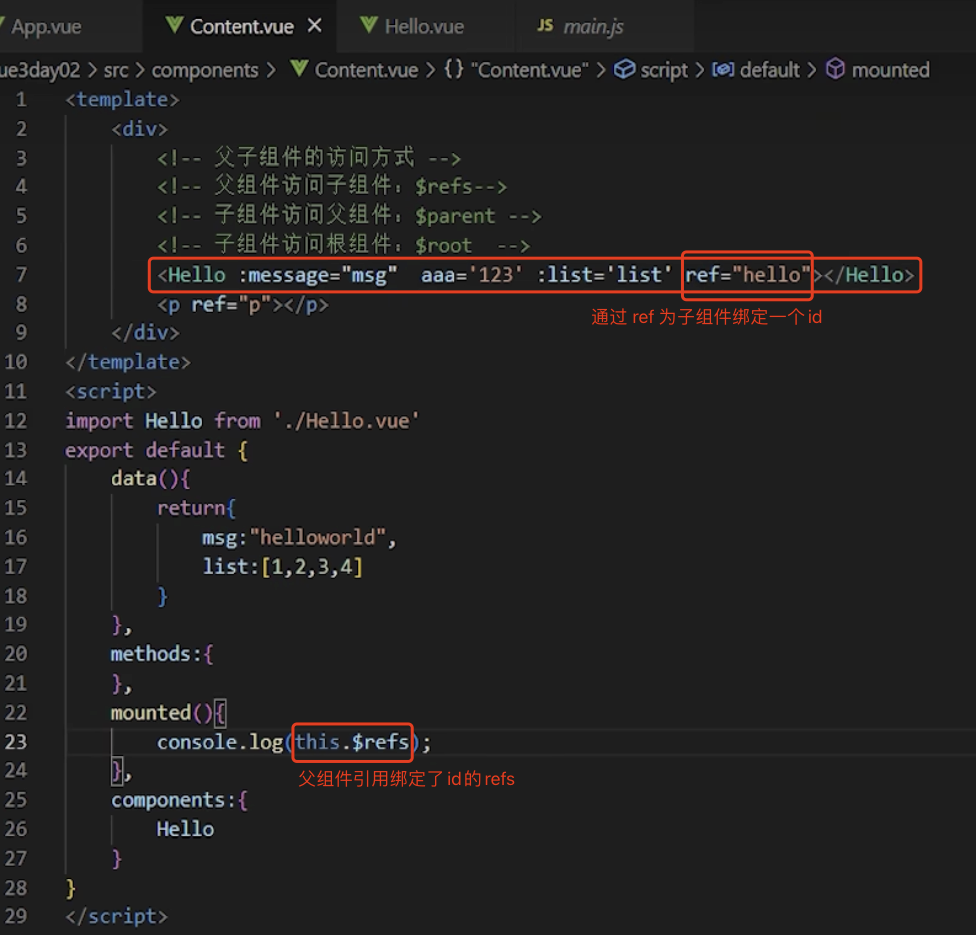
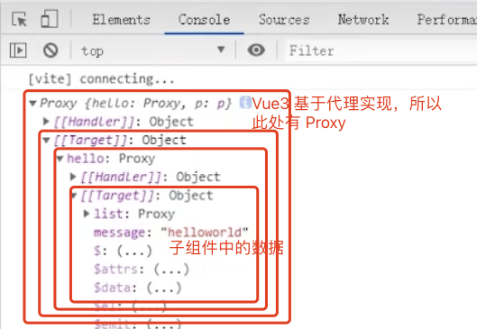
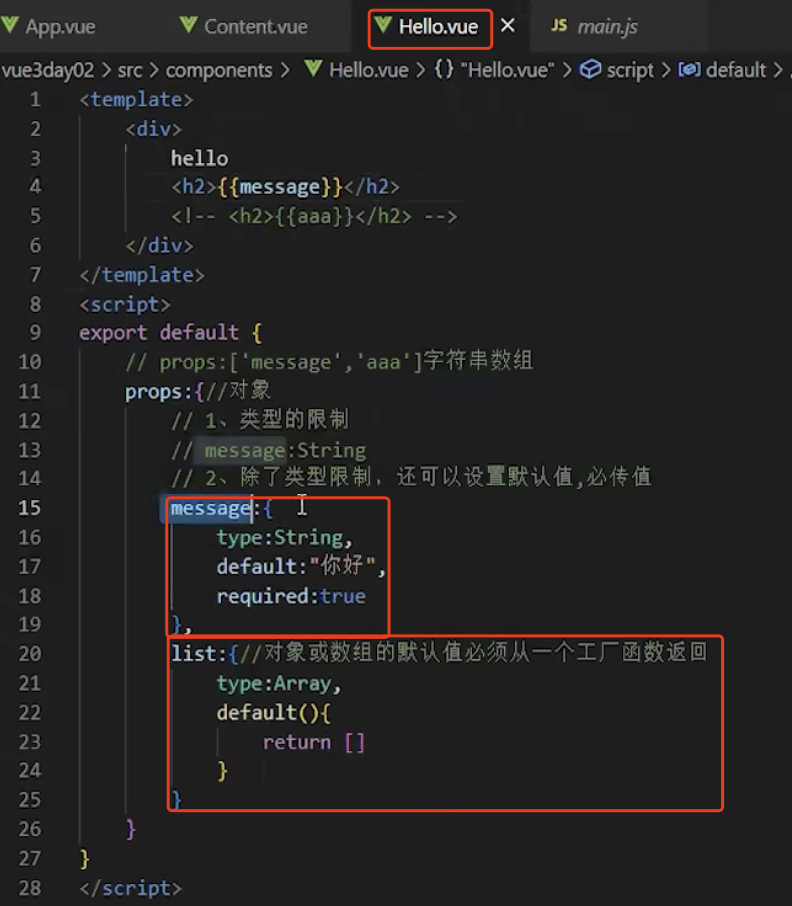
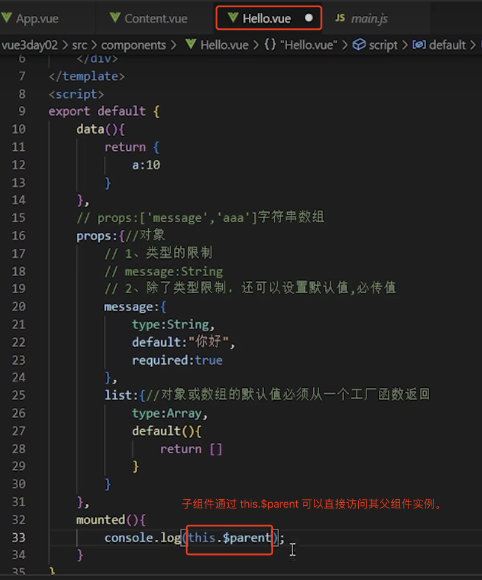
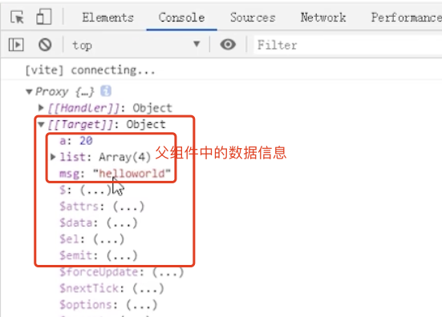
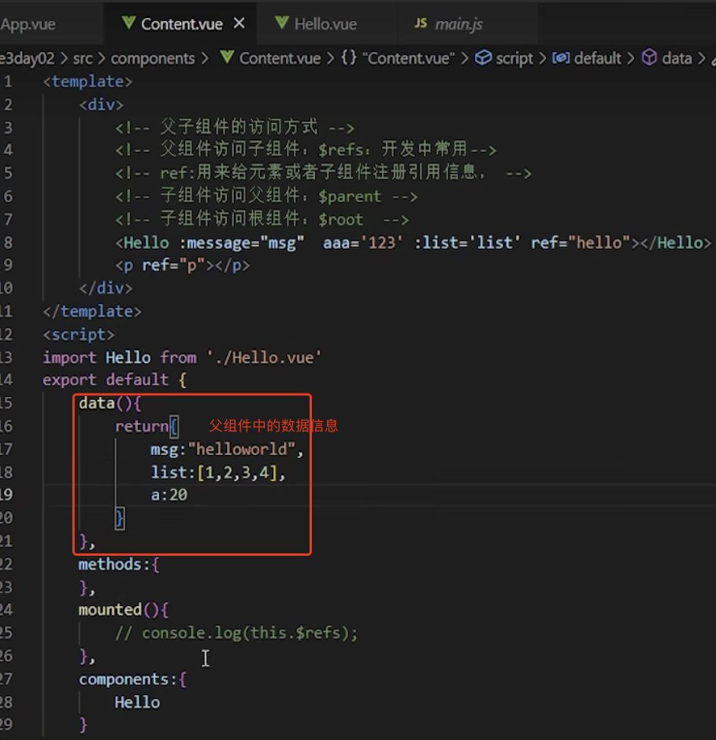
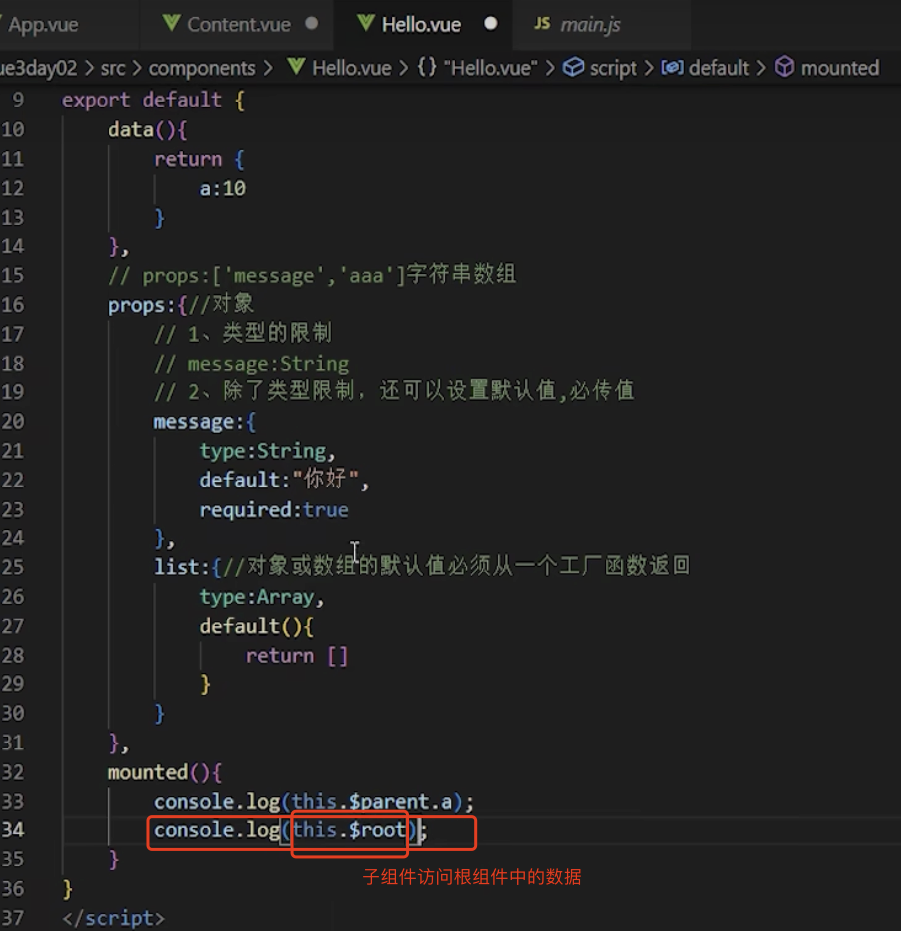

# 1. 013-组件的事件

> 2022-11-21 周一 
>[组件事件](https://cn.vuejs.org/guide/components/events.html)

自定义组件的事件可以将子组件中的事件上抛给父组件，由父组件对事件进行消费。
也可以将子组件中的数据作为自定义事件的参数上抛给父组件，由父组件进行使用，实现子组件向父组件传递数据。

>自定义事件本质上是一种从子组件向父组件传递数据的方式。

## 1.1. 事件监听基础

我们在实现的 `<BlogPost>` 组件时，某些功能可能需要与父组件进行交互。例如，我们可能会引入一个辅助功能将博客文章的文字放大，同时页面的其余部分仍使用默认字号。

在父组件中，我们可以添加一个 `postFontSize` 数据属性来实现这个效果：

```js
data() {
  return {
    posts: [
      /* ... */
    ],
    postFontSize: 1
  }
}
```

在模板中用它来控制所有博客文章的字体大小：

```template
<div :style="{ fontSize: postFontSize + 'em' }">
  <BlogPost
    v-for="post in posts"
    :key="post.id"
    :title="post.title"
   />
</div>
```

然后，给 `<BlogPost>` 组件添加一个按钮：

```vue
<!-- BlogPost.vue, 省略了 <script> -->
<template>
  <div class="blog-post">
    <h4>{{ title }}</h4>
    <button>Enlarge text</button>
  </div>
</template>
```

这个按钮目前还没有做任何事情，我们想要点击这个按钮来告诉父组件它应该放大所有博客文章的文字。

要解决这个问题，组件实例提供了一个自定义事件系统。**父组件可以通过 `v-on `或 `@` 来选择性地监听子组件上抛的事件**，就像监听原生 DOM 事件那样：

```template
// 父组件中使用子组件时监听和响应子组件抛出的 enlarge-text 事件
<BlogPost
  ...
  @enlarge-text="postFontSize += 0.1"
 />
```

子组件可以通过**调用内置的 `$emit` 方法，通过传入事件名称来抛出一个事件**：

```vue
<!-- BlogPost.vue, 省略了 <script> -->
<template>
  <div class="blog-post">
    <h4>{{ title }}</h4>
    <button @click="$emit('enlarge-text')">Enlarge text</button>
  </div>
</template>
```

因为有了 `@enlarge-text="postFontSize += 0.1"` 的监听，父组件会接收这一事件，从而更新 `postFontSize` 的值。


在子组件中可以通过 `emits` 选项来声明需要抛出的事件：

```vue
<!-- BlogPost.vue -->
<script>
export default {
  props: ['title'],
  emits: ['enlarge-text']
}
</script>
```

这声明了一个组件可能触发的所有事件，还可以[对事件的参数进行验证](https://cn.vuejs.org/guide/components/events.html#validate-emitted-events)。同时，这还可以让 Vue 避免将它们作为原生事件监听器隐式地应用于子组件的根元素。


> 自定义事件核心内容：
> 
> * 子组件的标签监听原生事件，并通过 `$emit('自定义抛出的事件名')` 抛出事件。如：`<button @click="$emit('enlarge-text')">Enlarge text</button>`
> * 子组件在 `script`-`export default` 中通过 `emits` 属性声明要抛出的时间名称。如： `emits: ['enlarge-text']`。声明是可选的，但建议声明。
> * 父组件使用子组件并监听和消费子组件的自定义事件。如：`@enlarge-text="postFontSize += 0.1"`
> * 如果父组件需要使用子组件中的数据，可以将子组件中的数据作为自定义事件的参数传递出去。


## 1.2. 触发与监听事件

### 1.2.1. 触发事件

在组件的模板表达式中，使用 `$emit` 方法触发自定义事件。可以直接触发，也可以在子组件实例的 `methods` 中触发。

#### 1.2.1.1. 直接触发

：在 `v-on` 的处理函数中直接触发。

```template
<!-- MyComponent，直接触发，抛出的自定义事件名称为：someEvent -->
<button @click="$emit('someEvent')">click me</button>
```

#### 1.2.1.2. 在 methods 中触发

`$emit()` 方法在组件实例上的 `methods` 中也可以用 `this.$emit()` 的形式触发：

```js
export default {
  methods: {
    submit() {
      this.$emit('someEvent')
    }
  }
}

<button @click="submit">click me</button>
```

### 1.2.2. 父组件监听

父组件可以通过 `v-on` (缩写为 `@`) 来监听事件：

```template
<MyComponent @some-event="callback" />
```

同样，组件的事件监听器也支持 `.once` 修饰符：

```template
<MyComponent @some-event.once="callback" />
```

像组件与 prop 一样，事件的名字也提供了自动的格式转换。注意这里我们触发了一个以 `camelCase` 形式命名的事件，但在父组件中可以使用 `kebab-case` 形式来监听。与 [prop 大小写格式](https://cn.vuejs.org/guide/components/props.html#prop-name-casing)一样，在模板中我们也推荐使用 `kebab-case` 形式来编写监听器。

>TIP
>
>和原生 DOM 事件不一样，**组件触发的事件没有冒泡机制**。你只能监听直接子组件触发的事件。平级组件或是跨越多层嵌套的组件间通信，应使用一个外部的事件总线，或是使用一个[全局状态管理方案。](https://cn.vuejs.org/guide/scaling-up/state-management.html)

## 1.3. 事件参数

有时候我们会需要在触发事件时附带一个特定的值。举例来说，我们想要 `<BlogPost>` 组件来管理文本会缩放得多大。

在这个场景下，我们可以给 `$emit` 提供一个额外的参数：

```template
<!--子组件中抛出事件及参数-->
<button @click="$emit('increaseBy', 1)">
  Increase by 1
</button>
```

然后我们在父组件中监听事件，我们可以先简单写一个内联的箭头函数作为监听器，此函数会接收到事件附带的参数：

```template
<!--父组件使用子组件、监听子组件的自定义事件、使用自定义事件的参数-->
<MyButton @increase-by="(n) => count += n" />
```

或者，也可以用一个组件方法来作为事件处理函数：

```template
<!--父组件使用子组件、监听子组件的自定义事件、使用自定义事件的参数-->
<MyButton @increase-by="increaseCount" />
```

该方法也会接收到事件所传递的参数：

```js
methods: {
  increaseCount(n) {
    // 这里的 n 就是子组件自定义事件中抛出的参数。
    // count 是父组件在 data 中声明的属性
    this.count += n
  }
}
```

>TIP
>所有传入 `$emit()` 的额外参数都会被直接传向监听器。举例来说，`$emit('foo', 1, 2, 3)` 触发后，监听器函数将会收到这三个参数值。

## 1.4. 声明触发的事件

组件要触发的事件可以显式地通过 [emits](https://cn.vuejs.org/api/options-state.html#emits) 选项来声明：

```js
export default {
  emits: ['inFocus', 'submit']
}
```

这个 `emits` 选项还支持对象语法，它允许我们对触发事件的参数进行验证：

```js
export default {
  emits: {
    submit(payload) {
      // 通过返回值为 `true` 还是为 `false` 来判断
      // 验证是否通过
    }
  }
}
```

TypeScript 用户请参考：[如何为组件所抛出的事件标注类型。](https://cn.vuejs.org/guide/typescript/options-api.html#typing-component-emits)

尽管事件声明是可选的，我们还是推荐你完整地声明所有要触发的事件，以此在代码中作为文档记录组件的用法。同时，事件声明能让 Vue 更好地将事件和[透传 attribute](https://cn.vuejs.org/guide/components/attrs.html#v-on-listener-inheritance) 作出区分，从而避免一些由第三方代码触发的自定义 DOM 事件所导致的边界情况。

>TIP
>如果一个原生事件的名字 (例如 `click`) 被定义在 `emits` 选项中，则监听器只会监听组件触发的 `click` 事件而不会再响应原生的 `click` 事件。
>即组件中的事件与原生事件重名时，组件事件会覆盖原生事件。

## 1.5. 事件校验

和对 props 添加类型校验的方式类似，所有触发的事件也**可以使用对象形式来描述**。

**要为事件添加校验，那么事件可以被赋值为一个函数，该函数接受的参数就是抛出事件时传入 `this.$emit` 的内容，返回一个布尔值来表明事件是否合法**。

```js
export default {
  emits: {
    // 没有校验
    click: null,

    // 校验 submit 事件——对外暴露的事件、参数及参数校验
    submit: ({ email, password }) => {
      if (email && password) {
        return true
      } else {
        console.warn('Invalid submit event payload!')
        return false
      }
    }
  },
  methods: {
    submitForm(email, password) {
      // 将函数赋值给抛出的事件
      this.$emit('submit', { email, password })
    }
  }
}
```

## 1.6. 配合 `v-model` 使用

自定义事件**可以用于开发支持 `v-model` 的自定义表单组件**。

### 1.6.1. 自定义表单组件中的 `v-model`

回忆一下 `v-model` 在原生元素上的用法：

```template
<input v-model="searchText" />
```

上面的代码其实等价于下面这段 (编译器会对 `v-model` 进行展开)：

```template
<input
  :value="searchText"
  @input="searchText = $event.target.value"
/>
```

而当使用在一个组件上时，`v-model` 会被展开为如下的形式：

```template
<CustomInput
  :modelValue="searchText"
  @update:modelValue="newValue => searchText = newValue"
/>
```

要让这个例子实际工作起来，有如下两种方式：

#### 1.6.1.1. 方式1：基础实现

`<CustomInput>` 组件内部需要做两件事：

* 将内部原生 `input` 元素的 `value` attribute 绑定到 `modelValue` prop（接收原生值）
* 输入新的值时在 `input` 元素上触发 `update:modelValue` 事件（通过事件将原生值暴露给父组件）

这里是相应的代码：

```vue
<!-- CustomInput.vue -->
<script>
export default {
  props: ['modelValue'],
  emits: ['update:modelValue']
}
</script>

<template>
  <input
    :value="modelValue"
    @input="$emit('update:modelValue', $event.target.value)"
  />
</template>
```

现在 `v-model` 也可以在这个组件上正常工作了：

```template
<CustomInput v-model="searchText" />
```

[在演练场中的示例](https://sfc.vuejs.org/#eyJBcHAudnVlIjoiPHNjcmlwdD5cbmltcG9ydCBDdXN0b21JbnB1dCBmcm9tICcuL0N1c3RvbUlucHV0LnZ1ZSdcblxuZXhwb3J0IGRlZmF1bHQge1xuICBjb21wb25lbnRzOiB7IEN1c3RvbUlucHV0IH0sXG4gIGRhdGEoKSB7XG4gICAgcmV0dXJuIHtcbiAgICAgIG1lc3NhZ2U6ICdoZWxsbydcbiAgICB9XG4gIH1cbn1cbjwvc2NyaXB0PlxuXG48dGVtcGxhdGU+XG4gIDxDdXN0b21JbnB1dCB2LW1vZGVsPVwibWVzc2FnZVwiIC8+IHt7IG1lc3NhZ2UgfX1cbjwvdGVtcGxhdGU+IiwiaW1wb3J0LW1hcC5qc29uIjoie1xuICBcImltcG9ydHNcIjoge1xuICAgIFwidnVlXCI6IFwiaHR0cHM6Ly9zZmMudnVlanMub3JnL3Z1ZS5ydW50aW1lLmVzbS1icm93c2VyLmpzXCJcbiAgfVxufSIsIkN1c3RvbUlucHV0LnZ1ZSI6IjxzY3JpcHQ+XG5leHBvcnQgZGVmYXVsdCB7XG4gIHByb3BzOiBbJ21vZGVsVmFsdWUnXSxcbiAgZW1pdHM6IFsndXBkYXRlOm1vZGVsVmFsdWUnXVxufVxuPC9zY3JpcHQ+XG5cbjx0ZW1wbGF0ZT5cbiAgPGlucHV0XG4gICAgOnZhbHVlPVwibW9kZWxWYWx1ZVwiXG4gICAgQGlucHV0PVwiJGVtaXQoJ3VwZGF0ZTptb2RlbFZhbHVlJywgJGV2ZW50LnRhcmdldC52YWx1ZSlcIlxuICAvPlxuPC90ZW1wbGF0ZT4ifQ==)

#### 1.6.1.2. 方式2：计算属性实现

另一种在组件内实现 `v-model` 的方式是使用一个可写的，同时具有 `getter` 和 `setter` 的计算属性。

`get` 方法需返回 `modelValue` prop，而 `set` 方法需触发相应的事件：

```vue
<!-- CustomInput.vue -->
<script>
export default {
  props: ['modelValue'],
  emits: ['update:modelValue'],
  computed: {
    value: {
      get() {
        return this.modelValue
      },
      set(value) {
        this.$emit('update:modelValue', value)
      }
    }
  }
}
</script>

<template>
  <input v-model="value" />
</template>
```

### 1.6.2. `v-model` 的参数

默认情况下，`v-model` 在组件上都是使用 `modelValue` 作为 prop，并以 `update:modelValue` 作为对应的事件。我们可以通过给 `v-model` 指定一个参数来更改这些名字：

```template
<MyComponent v-model:title="bookTitle" />
```

在这个例子中，子组件应声明一个 `title` prop，并通过触发 `update:title` 事件更新父组件值：

```vue
<!-- MyComponent.vue -->
<script>
export default {
  props: ['title'],
  emits: ['update:title']
}
</script>

<template>
  <input
    type="text"
    :value="title"
    @input="$emit('update:title', $event.target.value)"
  />
</template>
```

[在演练场中尝试一下](https://sfc.vuejs.org/#eyJBcHAudnVlIjoiPHNjcmlwdD5cbmltcG9ydCBNeUNvbXBvbmVudCBmcm9tICcuL015Q29tcG9uZW50LnZ1ZSdcblxuZXhwb3J0IGRlZmF1bHQge1xuICBjb21wb25lbnRzOiB7IE15Q29tcG9uZW50IH0sXG4gIGRhdGEoKSB7XG4gICAgcmV0dXJuIHtcbiAgICAgIHRpdGxlOiAndi1tb2RlbCBhcmd1bWVudCBleGFtcGxlJ1xuICAgIH1cbiAgfVxufVxuPC9zY3JpcHQ+XG5cbjx0ZW1wbGF0ZT5cbiAgPGgxPnt7IHRpdGxlIH19PC9oMT5cbiAgPE15Q29tcG9uZW50IHYtbW9kZWw6dGl0bGU9XCJ0aXRsZVwiIC8+XG48L3RlbXBsYXRlPiIsImltcG9ydC1tYXAuanNvbiI6IntcbiAgXCJpbXBvcnRzXCI6IHtcbiAgICBcInZ1ZVwiOiBcImh0dHBzOi8vc2ZjLnZ1ZWpzLm9yZy92dWUucnVudGltZS5lc20tYnJvd3Nlci5qc1wiXG4gIH1cbn0iLCJNeUNvbXBvbmVudC52dWUiOiI8c2NyaXB0PlxuZXhwb3J0IGRlZmF1bHQge1xuICBwcm9wczogWyd0aXRsZSddLFxuICBlbWl0czogWyd1cGRhdGU6dGl0bGUnXVxufVxuPC9zY3JpcHQ+XG5cbjx0ZW1wbGF0ZT5cbiAgPGlucHV0XG4gICAgdHlwZT1cInRleHRcIlxuICAgIDp2YWx1ZT1cInRpdGxlXCJcbiAgICBAaW5wdXQ9XCIkZW1pdCgndXBkYXRlOnRpdGxlJywgJGV2ZW50LnRhcmdldC52YWx1ZSlcIlxuICAvPlxuPC90ZW1wbGF0ZT4ifQ==)

### 1.6.3. 多个 `v-model` 绑定

利用刚才在 [`v-model` 参数](https://cn.vuejs.org/guide/components/events.html#v-model-arguments)小节中学到的技巧，我们可以在一个组件上创建多个 `v-model `双向绑定，每一个 `v-model` 都会同步不同的 prop：

```vue
<script>
export default {
  props: {
    firstName: String,
    lastName: String
  },
  emits: ['update:firstName', 'update:lastName']
}
</script>

<template>
  <input
    type="text"
    :value="firstName"
    @input="$emit('update:firstName', $event.target.value)"
  />
  <input
    type="text"
    :value="lastName"
    @input="$emit('update:lastName', $event.target.value)"
  />
</template>
```

```template
<UserName
  v-model:first-name="first"
  v-model:last-name="last"
/>
```

[在演练场中尝试一下](https://sfc.vuejs.org/#eyJBcHAudnVlIjoiPHNjcmlwdD5cbmltcG9ydCBVc2VyTmFtZSBmcm9tICcuL1VzZXJOYW1lLnZ1ZSdcblxuZXhwb3J0IGRlZmF1bHQge1xuICBjb21wb25lbnRzOiB7IFVzZXJOYW1lIH0sXG4gIGRhdGEoKSB7XG4gICAgcmV0dXJuIHtcbiAgICAgIGZpcnN0OiAnSm9obicsXG4gICAgICBsYXN0OiAnRG9lJ1xuICAgIH1cbiAgfVxufVxuPC9zY3JpcHQ+XG5cbjx0ZW1wbGF0ZT5cbiAgPGgxPnt7IGZpcnN0IH19IHt7IGxhc3QgfX08L2gxPlxuICA8VXNlck5hbWVcbiAgICB2LW1vZGVsOmZpcnN0LW5hbWU9XCJmaXJzdFwiXG4gICAgdi1tb2RlbDpsYXN0LW5hbWU9XCJsYXN0XCJcbiAgLz5cbjwvdGVtcGxhdGU+IiwiaW1wb3J0LW1hcC5qc29uIjoie1xuICBcImltcG9ydHNcIjoge1xuICAgIFwidnVlXCI6IFwiaHR0cHM6Ly9zZmMudnVlanMub3JnL3Z1ZS5ydW50aW1lLmVzbS1icm93c2VyLmpzXCIsXG4gICAgXCJ2dWUvc2VydmVyLXJlbmRlcmVyXCI6IFwiaHR0cHM6Ly9zZmMudnVlanMub3JnL3NlcnZlci1yZW5kZXJlci5lc20tYnJvd3Nlci5qc1wiXG4gIH1cbn0iLCJVc2VyTmFtZS52dWUiOiI8c2NyaXB0PlxuZXhwb3J0IGRlZmF1bHQge1xuICBwcm9wczoge1xuXHQgIGZpcnN0TmFtZTogU3RyaW5nLFxuICBcdGxhc3ROYW1lOiBTdHJpbmdcblx0fSxcbiAgZW1pdHM6IFsndXBkYXRlOmZpcnN0TmFtZScsICd1cGRhdGU6bGFzdE5hbWUnXVxufVxuPC9zY3JpcHQ+XG5cbjx0ZW1wbGF0ZT5cbiAgPGlucHV0XG4gICAgdHlwZT1cInRleHRcIlxuICAgIDp2YWx1ZT1cImZpcnN0TmFtZVwiXG4gICAgQGlucHV0PVwiJGVtaXQoJ3VwZGF0ZTpmaXJzdE5hbWUnLCAkZXZlbnQudGFyZ2V0LnZhbHVlKVwiXG4gIC8+XG4gIDxpbnB1dFxuICAgIHR5cGU9XCJ0ZXh0XCJcbiAgICA6dmFsdWU9XCJsYXN0TmFtZVwiXG4gICAgQGlucHV0PVwiJGVtaXQoJ3VwZGF0ZTpsYXN0TmFtZScsICRldmVudC50YXJnZXQudmFsdWUpXCJcbiAgLz5cbjwvdGVtcGxhdGU+In0=)

### 1.6.4. 处理 `v-model` 修饰符

在学习输入绑定时，我们知道了 `v-model` 有一些[内置的修饰符](https://cn.vuejs.org/guide/essentials/forms.html#modifiers)，例如 `.trim`，`.number` 和 `.lazy`。在某些场景下，你可能想要一个**自定义组件的 `v-model` 支持自定义的修饰符**。

我们来创建一个自定义的修饰符 `capitalize` ，它会自动将 `v-model` 绑定输入的字符串值第一个字母转为大写：

```template
<MyComponent v-model.capitalize="myText" />
```

组件的 `v-model` 上所添加的修饰符，可以通过 `modelModifiers` prop 在组件内访问到。在下面的组件中，我们声明了 `modelModifiers` 这个 prop，它的默认值是一个空对象：

```vue
<script>
export default {
  props: {
    modelValue: String,
    modelModifiers: {
      default: () => ({})
    }
  },
  emits: ['update:modelValue'],
  created() {
    console.log(this.modelModifiers) // { capitalize: true }
  }
}
</script>

<template>
  <input
    type="text"
    :value="modelValue"
    @input="$emit('update:modelValue', $event.target.value)"
  />
</template>
```

注意这里组件的 `modelModifiers` prop 包含了 `capitalize` 且其值为 true，因为它在模板中的 `v-model` 绑定上被使用了。

有了 `modelModifiers` 这个 prop，我们就可以在原生事件侦听函数中检查它的值，然后决定触发的自定义事件中要向父组件传递什么值。在下面的代码里，我们就是在每次` <input>` 元素触发 `input` 事件时将值的首字母大写：

```vue
<script>
export default {
  props: {
    modelValue: String,
    modelModifiers: {
      default: () => ({})
    }
  },
  emits: ['update:modelValue'],
  methods: {
    emitValue(e) {
      let value = e.target.value
      if (this.modelModifiers.capitalize) {
        value = value.charAt(0).toUpperCase() + value.slice(1)
      }
      this.$emit('update:modelValue', value)
    }
  }
}
</script>

<template>
  <input type="text" :value="modelValue" @input="emitValue" />
</template>
```

[在演练场中尝试一下](https://sfc.vuejs.org/#eyJBcHAudnVlIjoiPHNjcmlwdD5cbmltcG9ydCBNeUNvbXBvbmVudCBmcm9tICcuL015Q29tcG9uZW50LnZ1ZSdcbiAgXG5leHBvcnQgZGVmYXVsdCB7XG4gIGNvbXBvbmVudHM6IHsgTXlDb21wb25lbnQgfSxcbiAgZGF0YSgpIHtcbiAgICByZXR1cm4ge1xuICAgICAgbXlUZXh0OiAnJ1xuICAgIH1cbiAgfVxufVxuPC9zY3JpcHQ+XG5cbjx0ZW1wbGF0ZT5cbiAgVGhpcyBpbnB1dCBjYXBpdGFsaXplcyBldmVyeXRoaW5nIHlvdSBlbnRlcjpcbiAgPE15Q29tcG9uZW50IHYtbW9kZWwuY2FwaXRhbGl6ZT1cIm15VGV4dFwiIC8+XG48L3RlbXBsYXRlPiIsImltcG9ydC1tYXAuanNvbiI6IntcbiAgXCJpbXBvcnRzXCI6IHtcbiAgICBcInZ1ZVwiOiBcImh0dHBzOi8vc2ZjLnZ1ZWpzLm9yZy92dWUucnVudGltZS5lc20tYnJvd3Nlci5qc1wiXG4gIH1cbn0iLCJNeUNvbXBvbmVudC52dWUiOiI8c2NyaXB0PlxuZXhwb3J0IGRlZmF1bHQge1xuICBwcm9wczoge1xuICAgIG1vZGVsVmFsdWU6IFN0cmluZyxcbiAgICBtb2RlbE1vZGlmaWVyczoge1xuICAgICAgZGVmYXVsdDogKCkgPT4gKHt9KVxuICAgIH1cbiAgfSxcbiAgZW1pdHM6IFsndXBkYXRlOm1vZGVsVmFsdWUnXSxcbiAgbWV0aG9kczoge1xuICAgIGVtaXRWYWx1ZShlKSB7XG4gICAgICBsZXQgdmFsdWUgPSBlLnRhcmdldC52YWx1ZVxuICAgICAgaWYgKHRoaXMubW9kZWxNb2RpZmllcnMuY2FwaXRhbGl6ZSkge1xuICAgICAgICB2YWx1ZSA9IHZhbHVlLmNoYXJBdCgwKS50b1VwcGVyQ2FzZSgpICsgdmFsdWUuc2xpY2UoMSlcbiAgICAgIH1cbiAgICAgIHRoaXMuJGVtaXQoJ3VwZGF0ZTptb2RlbFZhbHVlJywgdmFsdWUpXG4gICAgfVxuICB9XG59XG48L3NjcmlwdD5cblxuPHRlbXBsYXRlPlxuICA8aW5wdXQgdHlwZT1cInRleHRcIiA6dmFsdWU9XCJtb2RlbFZhbHVlXCIgQGlucHV0PVwiZW1pdFZhbHVlXCIgLz5cbjwvdGVtcGxhdGU+In0=)

对于又有参数又有修饰符的 `v-model` 绑定，生成的 prop 名将是 `arg + "Modifiers"`。举例来说：

```template
<MyComponent v-model:title.capitalize="myText">
```

相应的声明应该是：

```js
export default {
  props: ['title', 'titleModifiers'],
  emits: ['update:title'],
  created() {
    console.log(this.titleModifiers) // { capitalize: true }
  }
}
```

## 1.7. 补充：父子组件通信的其他方式

**props 用于将父组件中的数据传递给子组件。**

**组件的自定义事件用于将子组件中的数据传递给父组件。**

除上述两种方式外，父子组件之间通信还可以通过[组件实例](https://cn.vuejs.org/api/component-instance.html)的方式来实现，如下：

* 父组件访问子组件：`$refs`，具体实现参考 [视频p34](https://www.bilibili.com/video/BV1QA4y1d7xf?p=34)
* 子组件访问父组件：`$parent`
* 子组件访问根组件：`$root`

### 1.7.1. `$refs`

`ref`  用于给元素或子组件注册引用信息，注册之后，父组件可以通过 `$refs` 获取子组件的实例，进而获取其内部数据。

下图中分别为子组件 Hello 和 p 标签定义了 `ref`，并在父组件的声明周期函数 `mounted` 中通过 `$refs` 获取了子组件/元素的实例信息:



查看日志信息：



上图日志中最终指向的是 Hello 组件中的属性值：list、message

Hello.vue 的内部实现如下：



综上，通过 `$refs` 可以实现父组件方位子组件中的数据。

### 1.7.2. `$parent`

子组件通过 `$parent` 可以访问父组件实例，并获取其数据。



父组件中的数据信息：



父组件定义：



不推荐这么使用，因为组件具有复用性质，父组件中的属性字段并不能确保完全一致，所以可能会出现引用的父组件属性不存在的情况。

比如，子组件中使用了 `this.$parent.a` , 获取 parent 组件中的 a 属性，但并非每一个父组件中都含有 a 属性。

还是推荐使用 `props` 传值。

### 1.7.3. `$root`

子组件访问根组件。




