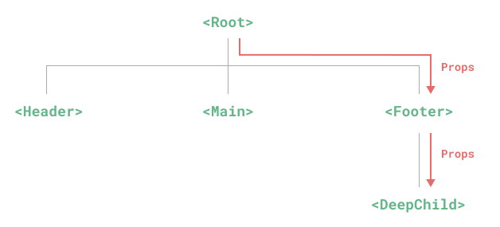
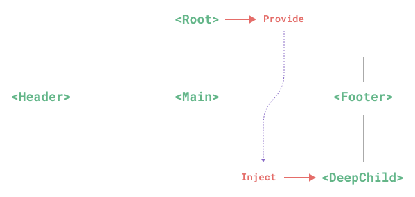
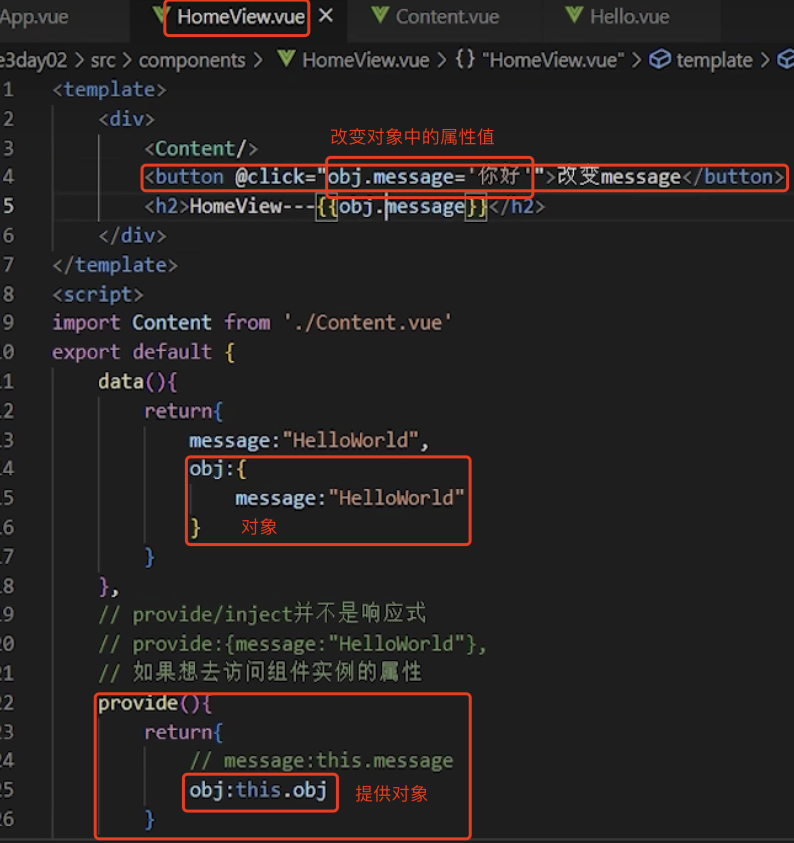
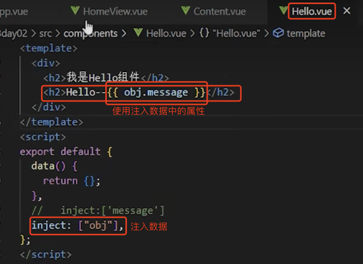
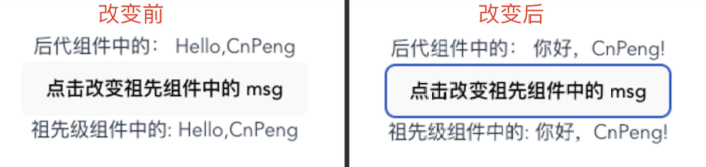
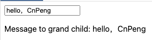

# 1. 016-组件的依赖注入

>2022-11-22 周二
> [文档：依赖注入](https://cn.vuejs.org/guide/components/provide-inject.html)

通常情况下，当我们**需要从父组件向子组件传递数据时，会使用 props**。

而通过**爷爷组件向孙子组件传递数据时（深度嵌套时的跨级通信），就需要使用这里的依赖注入（Provide 和 Inject）**。

## 1.1. Prop 逐级透传问题

想象一下这样的结构：**有一些多层级嵌套的组件，形成了一颗巨大的组件树，而某个深层的子组件需要一个较远的祖先组件中的部分数据**。

在这种情况下，如果仅使用 props 则必须将其沿着组件链逐级传递下去，这会非常麻烦：



注意，虽然这里的 `<Footer>` 组件可能根本不关心这些 props，但为了使 `<DeepChild>` 能访问到它们，仍然需要定义并向下传递。

如果组件链路非常长，可能会影响到更多这条路上的组件。

这一问题被称为“**prop 逐级透传**”，显然是我们希望尽量避免的情况。

`provide` 和 `inject` 可以帮助我们解决这一问题。  **一个父组件相对于其所有的后代组件，会作为依赖提供者。任何后代的组件树，无论层级有多深，都可以注入由父组件提供给整条链路的依赖。**

> 在本章及后续章节中，如无特殊说明，“提供”均指 `Provide`。

Provide/inject 模式示意图：



## 1.2. Provide (提供)

### 1.2.1. 组件内的 Provide

#### 1.2.1.1. 对象形式的 provide

**要为组件后代提供数据**，需要使用到 `provide` 选项：

```js
export default {
  provide: {
    // 对象形式的 provide 传递静态值。
    message: 'hello!'
  }
}
```

对于 `provide` 对象上的每一个属性，**后代组件会用其 key 为注入名查找期望注入的值，属性的值就是要提供的数据**。

下面这种方式是错误的，页面会报错：

```js
export default {
  data() {
    return {
      message: 'hello!'
    }
  },
  provide:{
      // ❌ 这是错误写法，页面会报错--找不到未定义的 message 属性 ❌
      // 组件实例中的属性必须通过 provide() 函数进行提供，参考下一节。
      message: this.message
  }
}
```

#### 1.2.1.2. 函数形式的 provide

如果我们需要提供依赖当前组件实例的状态 (比如那些由 `data()` 定义的数据属性)，那么可以以函数形式使用 `provide` ：

```js
export default {
  data() {
    return {
      message: 'hello!'
    }
  },
  provide() {
    // 使用函数的形式，可以访问到 `this`，进而传递动态属性值
    return {
      message: this.message
    }
  }
}
```

然而，请注意这不会使注入保持响应性。——祖先组件中 provide 的属性值发生变化时，后代组件中注入的数据不会发生变化。

上面的代码中，假设 provide 的 message 属性值发生了变化，并不会更新到后代组件中 inject 的地方。

如果想实现响应式更新，可以查看后面的 《和响应式数据配合使用》一节。

### 1.2.2. 应用层 Provide

除了在一个组件中提供依赖，我们还可以在整个应用层面提供依赖：

```js
import { createApp } from 'vue'

const app = createApp({})

app.provide(/* 注入名 */ 'message', /* 值 */ 'hello!')

// 后面要记得写上 app.mount(). 可以参考 《组件-定义和使用》 中的《全局注册》一节。
```

**在应用级别提供的数据在该应用内的所有组件中都可以注入。**

这在你编写[插件](https://cn.vuejs.org/guide/reusability/plugins.html)时会特别有用，因为插件一般都不会使用组件形式来提供值。

## 1.3. Inject (注入)

### 1.3.1. Inject 注入

要注入(获取)上层组件提供的数据，需使用 `inject` 选项来声明：

```js
export default {
  inject: ['message'],
  created() {
    console.log(this.message) // injected value
  }
}
```

**注入会在组件自身的状态之前被解析，因此你可以在 `data()` 中访问到注入的属性**：

```js
export default {
  inject: ['message'],
  data() {
    return {
      // 基于注入值的初始数据
      fullMessage: this.message
    }
  }
}
```

[完整的 provide + inject 示例](https://sfc.vuejs.org/#eyJBcHAudnVlIjoiPHNjcmlwdD5cbmltcG9ydCBDaGlsZCBmcm9tICcuL0NoaWxkLnZ1ZSdcblxuZXhwb3J0IGRlZmF1bHQge1xuICBjb21wb25lbnRzOiB7IENoaWxkIH0sXG4gIHByb3ZpZGUoKSB7XG4gICAgcmV0dXJuIHtcbiAgICAgIG1lc3NhZ2U6ICdoZWxsbydcbiAgICB9XG4gIH1cbn1cbjwvc2NyaXB0PlxuXG48dGVtcGxhdGU+XG4gIDxDaGlsZCAvPlxuPC90ZW1wbGF0ZT4iLCJpbXBvcnQtbWFwLmpzb24iOiJ7XG4gIFwiaW1wb3J0c1wiOiB7XG4gICAgXCJ2dWVcIjogXCJodHRwczovL3NmYy52dWVqcy5vcmcvdnVlLnJ1bnRpbWUuZXNtLWJyb3dzZXIuanNcIlxuICB9XG59IiwiQ2hpbGQudnVlIjoiPHNjcmlwdD5cbmltcG9ydCBHcmFuZENoaWxkIGZyb20gJy4vR3JhbmRDaGlsZC52dWUnXG5cbmV4cG9ydCBkZWZhdWx0IHtcbiAgY29tcG9uZW50czoge1xuICAgIEdyYW5kQ2hpbGRcbiAgfVxufVxuPC9zY3JpcHQ+XG5cbjx0ZW1wbGF0ZT5cbiAgPEdyYW5kQ2hpbGQgLz5cbjwvdGVtcGxhdGU+IiwiR3JhbmRDaGlsZC52dWUiOiI8c2NyaXB0PlxuZXhwb3J0IGRlZmF1bHQge1xuICBpbmplY3Q6IFsnbWVzc2FnZSddXG59XG48L3NjcmlwdD5cblxuPHRlbXBsYXRlPlxuICA8cD5cbiAgICBNZXNzYWdlIHRvIGdyYW5kIGNoaWxkOiB7eyBtZXNzYWdlIH19XG4gIDwvcD5cbjwvdGVtcGxhdGU+In0=)，如下：

* App.vue

```vue
<script>
// 导入组件
import Child from './Child.vue'

export default {
  // 暴露组件
  components: { Child },
  provide() {
    return {
      // 提供数据
      message: 'hello'
    }
  }
}
</script>

<template>
  <!--使用组件-->
  <Child />
</template>
```

* Child.vue

```vue
<script>
// 导入组件
import GrandChild from './GrandChild.vue'

export default {
  // 暴露组件
  components: {
    GrandChild
  }
}
</script>

<template>
  <!--使用组件-->
  <GrandChild />
</template>
```

* GrandChild.vue

```vue
<script>
export default {
  // 注入数据
  inject: ['message']
}
</script>

<template>
  <p>
    <!--使用注入的数据-->
    Message to grand child: {{ message }}
  </p>
</template>
```

### 1.3.2. 注入别名

当**以数组形式使用 `inject` ，注入的属性会以同名的 key 暴露到组件实例上**。

在上面的例子中，提供的属性名为 `"message"`，注入后以 `this.message` 的形式暴露。

**访问的本地属性名和注入名是相同的。**

**如果我们想要用一个不同的本地属性名注入该属性，我们需要在 `inject` 选项的属性上使用对象的形式：**

```js
export default {
  inject: {
    /* 本地属性名 */
    localMessage: {
       /* from : 注入来源名 */
      from: 'message'
    }
  }
}
```

这里，组件本地化了原注入名 `"message"` 所提供的属性，并将其暴露为 `this.localMessage`。

### 1.3.3. 注入默认值

默认情况下，`inject` 假设传入的注入名会被某个祖先链上的组件提供。如果该注入名的确没有任何组件提供，则会抛出一个运行时警告。

**如果在注入一个值时不要求必须有提供者，那么我们应该声明一个默认值**，和 props 类似：

```js
export default {
  // 当声明注入的默认值时
  // 必须使用对象形式
  inject: {
    message: {
      from: 'message', // 当与原注入名同名时，这个属性是可选的
      default: 'default value'
    },
    user: {
      // 对于非基础类型数据，如果创建开销比较大，或是需要确保每个组件实例
      // 需要独立数据的，请使用工厂函数
      default: () => ({ name: 'John' })
    }
  }
}
```

## 1.4. 和响应式数据配合使用

在 《函数形式的 Provide》 一节中，我们了解到直接将 `data` 中的基础类型的属性 provide 出来时，不具备响应性。即 provide 的属性值发生变化时，inject 的属性值不会同步变更。

如果我们想实现 provide 和 inject 的属性值同步更新，有两种实现方式：

* provide 一个对象，inject 该对象
* provide 一个计算属性，inject 该计算属性。


### 1.4.1. 使用对象实现响应式数据

如下：






### 1.4.2. 使用函数实现响应式数据

#### 1.4.2.1. 普通函数实现

> 虽然这种方式可以实现响应式数据，但不推荐。推荐使用计算属性的方式来实现。计算属性和普通函数的优缺点对比可以参考前面的 《计算属性》




* Hello.vue (后代组件)

```vue
<script>
export default {
    // 注入数据--因为 provide 提供的是函数，所以，这里的 msg 也是函数
    inject: ["msg"]
}
</script>

<template>
    <div>
        <!-- 使用注入数据，msg 是函数，所以要以函数的方式调用 -->
        后代组件中的： {{ msg() }}
    </div>
</template>
```

* CusComponent.vue （祖先组件）

```vue
<script>
// 导入组件
import Hello from "./Hello.vue"

export default {
    data() {
        return {
            msg: "Hello,CnPeng"
        }
    }
    ,
    provide() {
        return {
            // 提供函数，实现响应式数据
            msg: () => this.msg
        }
    },
    components: {
        // 注册组件
        Hello
    }
}
</script>
<template>
    <!-- 组件是带有名称的可复用实例 -->
    <Hello></Hello>
    <button @click="msg = '你好，CnPeng!'">点击改变祖先组件中的 msg</button>
    <div>祖先级组件中的: {{ msg }}</div>
</template>
```

* App.vue （根组件）

```vue
<script>
// 引入组件. import 后面的名称为组件别名，可以和组件的文件名不一致。
import CusComp from "./components/CusComponent.vue"
export default {
  components: {
    // 导出组件。此处需与上方 import 后紧跟的名称一致。
    CusComp
  }
}
</script>

<template>
  <!-- 使用组件 -->
  <CusComp />
</template>

<style >
</style>
```

#### 1.4.2.2. 计算属性实现响应式数据

> 这种方式是官方文档中的示例。

**为保证注入方和供给方之间的响应性链接**，我们可以使用 `computed()` 函数提供一个计算属性：

```js
import { computed } from 'vue'

export default {
  data() {
    return {
      message: 'hello!'
    }
  },
  provide() {
    return {
      // 显式提供一个计算属性
      message: computed(() => this.message)
    }
  }
}
```

`computed()` 函数常用于组合式 API 风格的组件中，但它同样还可以用于补充选项式 API 风格的某些用例。你可以通过阅读[响应式系统基础](https://cn.vuejs.org/guide/essentials/reactivity-fundamentals.html)和[计算属性](https://cn.vuejs.org/guide/essentials/computed.html)两个章节了解更多组合式的 API 风格。

>临时配置要求
>
>上面的用例需要设置 `app.config.unwrapInjectedRef = true` 以保证注入会自动解包这个计算属性。这将会在 Vue 3.3 后成为一个默认行为，而我们暂时在此告知此项配置以避免后续升级对代码的破坏性。在 3.3 后就不需要这样做了。

[带有响应性的 provide + inject 完整示例](https://sfc.vuejs.org/#eyJBcHAudnVlIjoiPHNjcmlwdD5cbmltcG9ydCBDaGlsZCBmcm9tICcuL0NoaWxkLnZ1ZSdcbmltcG9ydCB7IGNvbXB1dGVkIH0gZnJvbSAndnVlJ1xuXG5leHBvcnQgZGVmYXVsdCB7XG4gIGNvbXBvbmVudHM6IHsgQ2hpbGQgfSxcbiAgZGF0YSgpIHtcbiAgICByZXR1cm4ge1xuICAgICAgbWVzc2FnZTogJ2hlbGxvJ1xuICAgIH1cbiAgfSxcbiAgcHJvdmlkZSgpIHtcbiAgICByZXR1cm4ge1xuICAgICAgbWVzc2FnZTogY29tcHV0ZWQoKCkgPT4gdGhpcy5tZXNzYWdlKVxuICAgIH1cbiAgfVxufVxuPC9zY3JpcHQ+XG5cbjx0ZW1wbGF0ZT5cbiAgPGlucHV0IHYtbW9kZWw9XCJtZXNzYWdlXCI+XG4gIDxDaGlsZCAvPlxuPC90ZW1wbGF0ZT4iLCJpbXBvcnQtbWFwLmpzb24iOiJ7XG4gIFwiaW1wb3J0c1wiOiB7XG4gICAgXCJ2dWVcIjogXCJodHRwczovL3NmYy52dWVqcy5vcmcvdnVlLnJ1bnRpbWUuZXNtLWJyb3dzZXIuanNcIlxuICB9XG59IiwiQ2hpbGQudnVlIjoiPHNjcmlwdD5cbmltcG9ydCBHcmFuZENoaWxkIGZyb20gJy4vR3JhbmRDaGlsZC52dWUnXG5cbmV4cG9ydCBkZWZhdWx0IHtcbiAgY29tcG9uZW50czoge1xuICAgIEdyYW5kQ2hpbGRcbiAgfVxufVxuPC9zY3JpcHQ+XG5cbjx0ZW1wbGF0ZT5cbiAgPEdyYW5kQ2hpbGQgLz5cbjwvdGVtcGxhdGU+IiwiR3JhbmRDaGlsZC52dWUiOiI8c2NyaXB0PlxuZXhwb3J0IGRlZmF1bHQge1xuICBpbmplY3Q6IFsnbWVzc2FnZSddXG59XG48L3NjcmlwdD5cblxuPHRlbXBsYXRlPlxuICA8cD5cbiAgICBNZXNzYWdlIHRvIGdyYW5kIGNoaWxkOiB7eyBtZXNzYWdlIH19XG4gIDwvcD5cbjwvdGVtcGxhdGU+In0=)，如下：


* App.vue

```vue
<script>
// 导入组件
import Child from './Child.vue'
// 导入 computed 
import { computed } from 'vue'

export default {
  // 暴露(注册)组件
  components: { Child },
  data() {
    return {
      message: 'hello'
    }
  },
  provide() {
    return {
      // 以计算属性的形式提供数据
      message: computed(() => this.message)
    }
  }
}
</script>

<template>
  <!--实现数据的双向绑定-->
  <input v-model="message">
  <!--使用组件-->
  <Child />
</template>
```

* Child.vue

```vue
<script>
import GrandChild from './GrandChild.vue'

export default {
  components: {
    GrandChild
  }
}
</script>

<template>
  <GrandChild />
</template>
```

* GrandChild.vue

```vue
<script>
export default {
  inject: ['message']
}
</script>

<template>
  <p>
    Message to grand child: {{ message }}
  </p>
</template>
```

运行效果：



上述示例中，`App.vue` 将输入框中输入的内容提供给子组件使用。


## 1.5. 使用 Symbol 作注入名

至此，我们已经了解了如何使用字符串作为注入名。

但如果你正在构建大型的应用，包含非常多的依赖提供，或者你正在编写提供给其他开发者使用的组件库，建议最好使用 Symbol 来作为注入名以避免潜在的冲突。

我们通常推荐在一个**单独的文件中导出这些注入名 Symbo**l：

```js
// keys.js 中导出注入名。
export const myInjectionKey = Symbol()
```

```js
// 在供给方组件中。注意这里使用了大括号 {} 进行包裹。
import { myInjectionKey } from './keys.js'

export default {
  provide() {
    return {
      // 注意这里用方括号进行了包裹。
      [myInjectionKey]: {
        /* 要提供的数据 */
      }
    }
  }
}
```

```js
// 注入方组件。注意这里使用了大括号 {} 进行包裹。
import { myInjectionKey } from './keys.js'

export default {
  inject: {
    // 本地名称:{from:提供者中的变量名称}
    injected: { from: myInjectionKey }
  }
}
```
