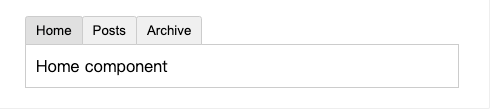

# 1. 018-动态组件

## 1.1. 动态组件

有些场景会需要在两个组件间来回切换，比如 Tab 界面：



[在演练场中查看示例](https://sfc.vuejs.org/#eyJBcHAudnVlIjoiPHNjcmlwdD5cbmltcG9ydCBIb21lIGZyb20gJy4vSG9tZS52dWUnXG5pbXBvcnQgUG9zdHMgZnJvbSAnLi9Qb3N0cy52dWUnXG5pbXBvcnQgQXJjaGl2ZSBmcm9tICcuL0FyY2hpdmUudnVlJ1xuICBcbmV4cG9ydCBkZWZhdWx0IHtcbiAgY29tcG9uZW50czoge1xuICAgIEhvbWUsXG4gICAgUG9zdHMsXG4gICAgQXJjaGl2ZVxuICB9LFxuICBkYXRhKCkge1xuICAgIHJldHVybiB7XG4gICAgICBjdXJyZW50VGFiOiAnSG9tZScsXG4gICAgICB0YWJzOiBbJ0hvbWUnLCAnUG9zdHMnLCAnQXJjaGl2ZSddXG4gICAgfVxuICB9XG59XG48L3NjcmlwdD5cblxuPHRlbXBsYXRlPlxuICA8ZGl2IGNsYXNzPVwiZGVtb1wiPlxuICAgIDxidXR0b25cbiAgICAgICB2LWZvcj1cInRhYiBpbiB0YWJzXCJcbiAgICAgICA6a2V5PVwidGFiXCJcbiAgICAgICA6Y2xhc3M9XCJbJ3RhYi1idXR0b24nLCB7IGFjdGl2ZTogY3VycmVudFRhYiA9PT0gdGFiIH1dXCJcbiAgICAgICBAY2xpY2s9XCJjdXJyZW50VGFiID0gdGFiXCJcbiAgICAgPlxuICAgICAge3sgdGFiIH19XG4gICAgPC9idXR0b24+XG5cdCAgPGNvbXBvbmVudCA6aXM9XCJjdXJyZW50VGFiXCIgY2xhc3M9XCJ0YWJcIj48L2NvbXBvbmVudD5cbiAgPC9kaXY+XG48L3RlbXBsYXRlPlxuXG48c3R5bGU+XG4uZGVtbyB7XG4gIGZvbnQtZmFtaWx5OiBzYW5zLXNlcmlmO1xuICBib3JkZXI6IDFweCBzb2xpZCAjZWVlO1xuICBib3JkZXItcmFkaXVzOiAycHg7XG4gIHBhZGRpbmc6IDIwcHggMzBweDtcbiAgbWFyZ2luLXRvcDogMWVtO1xuICBtYXJnaW4tYm90dG9tOiA0MHB4O1xuICB1c2VyLXNlbGVjdDogbm9uZTtcbiAgb3ZlcmZsb3cteDogYXV0bztcbn1cblxuLnRhYi1idXR0b24ge1xuICBwYWRkaW5nOiA2cHggMTBweDtcbiAgYm9yZGVyLXRvcC1sZWZ0LXJhZGl1czogM3B4O1xuICBib3JkZXItdG9wLXJpZ2h0LXJhZGl1czogM3B4O1xuICBib3JkZXI6IDFweCBzb2xpZCAjY2NjO1xuICBjdXJzb3I6IHBvaW50ZXI7XG4gIGJhY2tncm91bmQ6ICNmMGYwZjA7XG4gIG1hcmdpbi1ib3R0b206IC0xcHg7XG4gIG1hcmdpbi1yaWdodDogLTFweDtcbn1cbi50YWItYnV0dG9uOmhvdmVyIHtcbiAgYmFja2dyb3VuZDogI2UwZTBlMDtcbn1cbi50YWItYnV0dG9uLmFjdGl2ZSB7XG4gIGJhY2tncm91bmQ6ICNlMGUwZTA7XG59XG4udGFiIHtcbiAgYm9yZGVyOiAxcHggc29saWQgI2NjYztcbiAgcGFkZGluZzogMTBweDtcbn1cbjwvc3R5bGU+IiwiaW1wb3J0LW1hcC5qc29uIjoie1xuICBcImltcG9ydHNcIjoge1xuICAgIFwidnVlXCI6IFwiaHR0cHM6Ly9zZmMudnVlanMub3JnL3Z1ZS5ydW50aW1lLmVzbS1icm93c2VyLmpzXCJcbiAgfVxufSIsIkhvbWUudnVlIjoiPHRlbXBsYXRlPlxuICA8ZGl2IGNsYXNzPVwidGFiXCI+XG4gICAgSG9tZSBjb21wb25lbnRcbiAgPC9kaXY+XG48L3RlbXBsYXRlPiIsIlBvc3RzLnZ1ZSI6Ijx0ZW1wbGF0ZT5cbiAgPGRpdiBjbGFzcz1cInRhYlwiPlxuICAgIFBvc3RzIGNvbXBvbmVudFxuICA8L2Rpdj5cbjwvdGVtcGxhdGU+IiwiQXJjaGl2ZS52dWUiOiI8dGVtcGxhdGU+XG4gIDxkaXYgY2xhc3M9XCJ0YWJcIj5cbiAgICBBcmNoaXZlIGNvbXBvbmVudFxuICA8L2Rpdj5cbjwvdGVtcGxhdGU+In0=)

上面的例子是通过 Vue 的 `<component>` 元素和特殊的 `is` attribute 实现的：

```template
<!-- currentTab 改变时组件也改变 -->
<component :is="currentTab"></component>
```

在上面的例子中，被传给 `:is` 的值可以是以下几种：

* 被注册的组件名
* 导入的组件对象

也可以使用 `is` attribute 来创建一般的 HTML 元素。

当使用 `<component :is="...">` 在多个组件间作切换时，**被切换掉的组件会被卸载**。我们可以**通过 [`<KeepAlive>` 组件](https://cn.vuejs.org/guide/built-ins/keep-alive.html)强制被切换掉的组件仍然保持“存活”的状态**。

## 1.2. 动态组件示例

该示例即上一节中的页签切换示例。

* Home.vue

```vue
<template>
  <div class="tab">
    Home component
  </div>
</template>
```

* Posts.vue

```vue
<template>
  <div class="tab">
    Posts component
  </div>
</template>
```

* Archive.vue

```vue
<template>
  <div class="tab">
    Archive component
  </div>
</template>
```

* App.vue

```vue
<script>
// 导入组件
import Home from './Home.vue'
import Posts from './Posts.vue'
import Archive from './Archive.vue'

export default {
  // 注册组件
  components: {
    Home,
    Posts,
    Archive
  },
  data() {
    return {
      currentTab: 'Home',
      tabs: ['Home', 'Posts', 'Archive']
    }
  }
}
</script>

<template>
  <div class="demo">
    <button
       v-for="tab in tabs"
       :key="tab"
       :class="['tab-button', { active: currentTab === tab }]"
       @click="currentTab = tab"
     >
      {{ tab }}
    </button>
	<component :is="currentTab" class="tab"></component>
  </div>
</template>

<style>
.demo {
  font-family: sans-serif;
  border: 1px solid #eee;
  border-radius: 2px;
  padding: 20px 30px;
  margin-top: 1em;
  margin-bottom: 40px;
  user-select: none;
  overflow-x: auto;
}

.tab-button {
  padding: 6px 10px;
  border-top-left-radius: 3px;
  border-top-right-radius: 3px;
  border: 1px solid #ccc;
  cursor: pointer;
  background: #f0f0f0;
  margin-bottom: -1px;
  margin-right: -1px;
}
.tab-button:hover {
  background: #e0e0e0;
}
.tab-button.active {
  background: #e0e0e0;
}
.tab {
  border: 1px solid #ccc;
  padding: 10px;
}
</style>
```