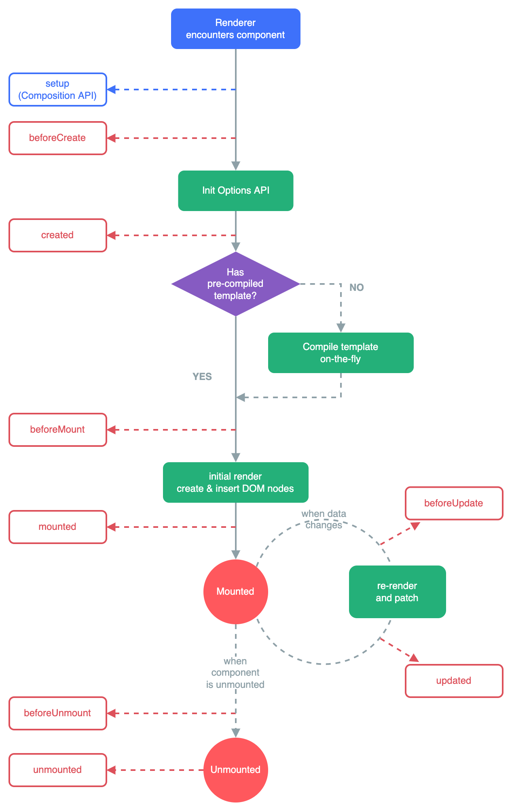
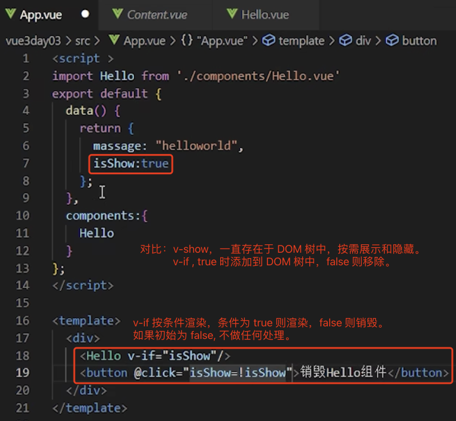
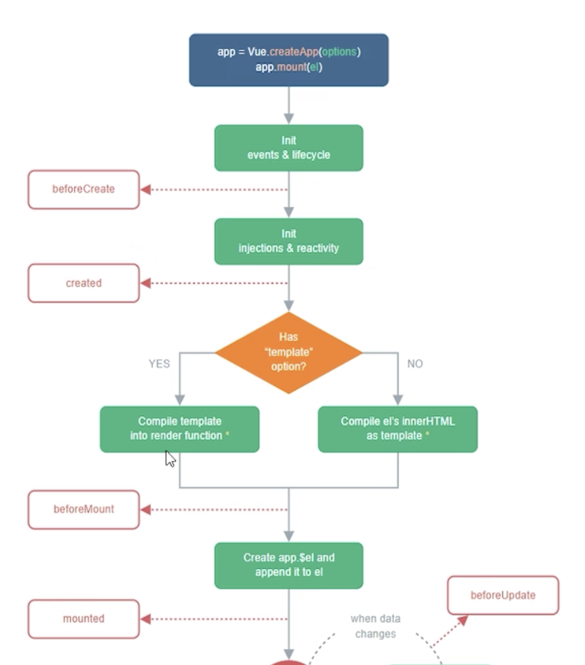
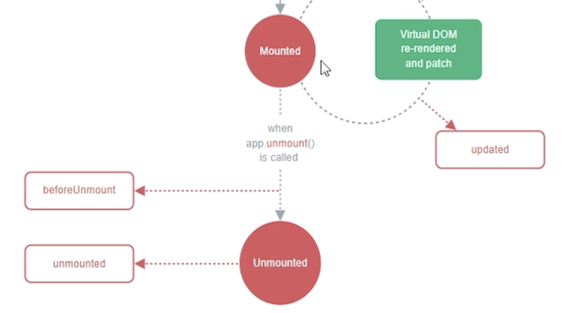

# 1. 019-生命周期

>2022-11-23 周三
>[文档：生命周期](https://cn.vuejs.org/guide/essentials/lifecycle.html#lifecycle-diagram)
>[文档：生命周期选项](https://cn.vuejs.org/api/options-lifecycle.html#beforecreate)
>[视频-p40](https://www.bilibili.com/video/BV1QA4y1d7xf?p=40)

每个 Vue 组件实例在创建时都需要经历一系列的初始化步骤，比如设置好数据侦听，编译模板，挂载实例到 DOM，以及在数据改变时更新 DOM。

在此过程中，它也会运行被称为生命周期钩子的函数，让开发者有机会在特定阶段运行自己的代码。

## 1.1. 注册周期钩子

举例来说， `mounted` 钩子可以用来在**组件完成初始渲染并创建 DOM 节点后**运行代码：

```js
export default {
  mounted() {
    console.log(`the component is now mounted.`)
  }
}
```

还有其他一些钩子，会在实例生命周期的不同阶段被调用，最常用的是 [mounted](https://cn.vuejs.org/api/options-lifecycle.html#mounted) 、 [updated](https://cn.vuejs.org/api/options-lifecycle.html#updated) 和 [unmounted](https://cn.vuejs.org/api/options-lifecycle.html#unmounted) 。

所有生命周期钩子函数的 `this` 上下文都会自动指向当前调用它的组件实例。

注意：避免用箭头函数来定义生命周期钩子，因为如果这样的话你将无法在函数中通过 `this` 获取组件实例。

## 1.2. 生命周期图示

### 1.2.1. 生命周期图示

下面是实例生命周期的图表。

你现在并不需要完全理解图中的所有内容，但以后它将是一个有用的参考。

组件生命周期图示：



有关所有生命周期钩子及其各自用例的详细信息，参考[生命周期钩子 API 索引](https://cn.vuejs.org/api/options-lifecycle.html)。


* 页面从创建到展示依次执行：`beforeCreate`、`created`、`beforemount`、`mounted`
* 当页面数据发生变化，且需要刷新页面时执行：`beforeupdate`、`updated`
* 组件/标签从页面中移除时触发：`beforeunmount`、`mounted`




在上述示例中，

* `v-if` 从  true 变为 false 时，会触发 `beforeunmount`、`unmounted`;
* `v-if` 从 false 变为 true 时，会触发 `beforeCreate`、`created`、`beforemount`、`mounted`。


### 1.2.2. Vue3 旧版的生命周期图示


