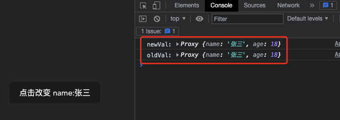
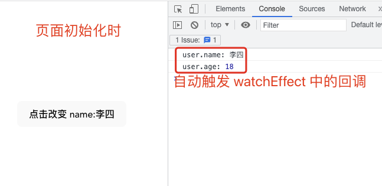

# 1. 020-组合式API

> 2022-11-23 周三
> * [《文档：组合式API-setup》](https://cn.vuejs.org/api/composition-api-setup.html)
> * [《文档：组合式API-响应式核心》](https://cn.vuejs.org/api/reactivity-core.html)
> * [《文档：组合式API-响应式工具函数》](https://cn.vuejs.org/api/reactivity-utilities.html)
> * [《文档：组合式API-响应式进阶》](https://cn.vuejs.org/api/reactivity-advanced.html)
> * [《文档：组合式 API-生命周期钩子》](https://cn.vuejs.org/api/composition-api-lifecycle.html)
> * [《文档：组合式API-依赖注入》](https://cn.vuejs.org/api/composition-api-dependency-injection.html)
> * [《文档：组合式API常见问题》](https://cn.vuejs.org/guide/extras/composition-api-faq.html#relationship-with-options-api)
> 
> * [视频-42-组合式API初体验](https://www.bilibili.com/video/BV1QA4y1d7xf/?p=42)
> * 重点查看 [视频49-setup中的context](https://www.bilibili.com/video/BV1QA4y1d7xf/?p=49)


Vue 的组件有两种书写风格：选项式 API 和组合式 API。

前面章节的内容都是基于选项式 API 。

## 1.1. 概念

### 1.1.1. 什么是组合式 API？

组合式 API (Composition API) 是一系列 API 的集合，使我们可以使用函数而不是声明选项的方式书写 Vue 组件。它是一个概括性的术语，涵盖了以下方面的 API：

* [响应式 API](https://cn.vuejs.org/api/reactivity-core.html)：例如 `ref()` 和 `reactive()`，使我们可以直接创建响应式状态、计算属性和侦听器。
* [生命周期钩子](https://cn.vuejs.org/api/composition-api-lifecycle.html)：例如 `onMounted()` 和 `onUnmounted()`，使我们可以在组件各个生命周期阶段添加逻辑。
* [依赖注入](https://cn.vuejs.org/api/composition-api-dependency-injection.html) ：例如 `provide()` 和 `inject()`，使我们可以在使用响应式 API 时，利用 Vue 的依赖注入系统。

组合式 API 是 Vue 3 及 [Vue 2.7](https://blog.vuejs.org/posts/vue-2-7-naruto.html) 的内置功能。对于更老的 Vue 2 版本，可以使用官方维护的插件 [@vue/composition-api](https://github.com/vuejs/composition-api)。

在 Vue 3 中，组合式 API 基本上都会配合 [`<script setup>` 语法](https://cn.vuejs.org/api/sfc-script-setup.html) 在单文件组件中使用。

下面是一个使用组合式 API 的组件示例：

```vue
<script setup>
import { ref, onMounted } from 'vue'

// 响应式状态
const count = ref(0)

// 更改状态、触发更新的函数
function increment() {
  count.value++
}

// 生命周期钩子
onMounted(() => {
  console.log(`计数器初始值为 ${count.value}。`)
})
</script>

<template>
  <button @click="increment">点击了：{{ count }} 次</button>
</template>
```

虽然这套 API 的风格是基于函数的组合，但组合式 API 并不是函数式编程。

组合式 API 是以 Vue 中数据可变的、细粒度的响应性系统为基础的，而函数式编程通常强调数据不可变。

在 [Vue 文档](https://cn.vuejs.org/guide/extras/composition-api-faq.html#what-is-composition-api) 中，通过页面左上角的开关可以切换文档中示例的 API 风格，如下图： 


> 组合式 API 能够将同一个逻辑关注点相关的代码放在一起。

### 1.1.2. 为什么要有组合式 API？

#### 1.1.2.1. 更好的逻辑复用

组合式 API 最基本的优势是**它使我们能够通过[组合函数](https://cn.vuejs.org/guide/reusability/composables.html)来实现更加简洁高效的逻辑复用**。在选项式 API 中我们主要的逻辑复用机制是 mixins，而组合式 API 解决了[mixins 的所有缺陷](https://cn.vuejs.org/guide/reusability/composables.html#vs-mixins)。

组合式 API 提供的逻辑复用能力孵化了一些非常棒的社区项目，比如 [VueUse](https://vueuse.org/) ，一个不断成长的工具型组合式函数集合。组合式 API 还为其他第三方状态管理库与 Vue 的响应式系统之间的集成提供了一套简洁清晰的机制，例如 [RxJS](https://vueuse.org/rxjs/readme.html#vueuse-rxjs)。

#### 1.1.2.2. 更灵活的代码组织

许多用户喜欢选项式 API 的原因是**它在默认情况下就能够让人写出有组织的代码：大部分代码都自然地被放进了对应的选项里**。

然而，选项式 API 在**单个组件的逻辑复杂到一定程度时**，会面临一些无法忽视的限制。这些限制主要体现在**需要处理多个逻辑关注点**的组件中，这是我们在许多 Vue 2 的实际案例中所观察到的。

我们以 Vue CLI GUI 中的文件浏览器组件为例：这个组件承担了以下几个逻辑关注点：

* 追踪当前文件夹的状态，展示其内容
* 处理文件夹的相关操作 (打开、关闭和刷新)
* 支持创建新文件夹
* 可以切换到只展示收藏的文件夹
* 可以开启对隐藏文件夹的展示
* 处理当前工作目录中的变更

这个组件[最原始的版本](https://github.com/vuejs/vue-cli/blob/a09407dd5b9f18ace7501ddb603b95e31d6d93c0/packages/@vue/cli-ui/src/components/folder/FolderExplorer.vue#L198-L404)是由选项式 API 写成的。如果我们为相同的逻辑关注点标上一种颜色，那将会是这样：


可以看到，处理相同逻辑关注点的代码被强制拆分在了不同的选项中，位于文件的不同部分。

在一个几百行的大组件中，要读懂代码中的一个逻辑关注点，需要在文件中反复上下滚动，这并不理想。

另外，如果我们想要将一个逻辑关注点抽取重构到一个可复用的工具函数中，需要从文件的多个不同部分找到所需的正确片段。

而如果[用组合式 API 重构](https://gist.github.com/yyx990803/8854f8f6a97631576c14b63c8acd8f2e)这个组件，将会变成下面右边这样：


现在与同一个逻辑关注点相关的代码被归为了一组：我们无需再为了一个逻辑关注点在不同的选项块间来回滚动切换。

此外，我们现在可以很轻松地将这一组代码移动到一个外部文件中，不再需要为了抽象而重新组织代码，大大**降低了重构成本**，这在长期维护的大型项目中非常关键。

#### 1.1.2.3. 更好的类型推导

组合式 API 主要利用基本的变量和函数，它们本身就是类型友好的。**用组合式 API 重写的代码可以享受到完整的类型推导，不需要书写太多类型标注**。大多数时候，用  [TypeScript](https://www.typescriptlang.org/)  书写的组合式 API 代码和用 JavaScript 写都差不太多！

#### 1.1.2.4. 更小的生产包体积

搭配 `<script setup>` 使用组合式 API 比等价情况下的选项式 API **更高效，对代码压缩也更友好**。

这是由于**`<script setup>` 形式书写的组件模板被编译为了一个内联函数，和 `<script setup>` 中的代码位于同一作用域**。不像选项式 API 需要依赖 `this` 上下文对象访问属性，被编译的模板可以直接访问 `<script setup>` 中定义的变量，无需一个代码实例从中代理。这对代码压缩更友好，因为本地变量的名字可以被压缩，但对象的属性名则不能。

## 1.2. 基础

[组合式API-setup](https://cn.vuejs.org/api/composition-api-setup.html)

**`setup()` 钩子是在组件中使用组合式 API 的入口**，通常只在以下情况下使用：

* 需要在非单文件组件中使用组合式 API 时。
* 需要在基于选项式 API 的组件中集成基于组合式 API 的代码时。

其他情况下，都应优先使用 [`<script setup>`](https://cn.vuejs.org/api/sfc-script-setup.html)语法。

### 1.2.1. 基本使用

为了使用组合式 API , 我们首先需要一个可以实际使用它的地方，在 Vue 组件中，我们将此位置称为 `setup`

新的 `setup` 选项在组件被创建之前执行，一旦 `props` 被解析完成，它就将被作为组合式 API 的入口。


> 📢  注意：
> 在 `setup` 中避免使用 `this`, 因为它找不到组件实例。`setup` 的调用发生在 `data` property 、`computed` property 或 `methods` 被解析之前，所以它们无法在 `setup` 中被获取。

`setup` 选项是一个接收 `props` 和 `context` 的函数。`setup` 返回的所有内容都暴露给组件的其余部分（计算属性、方法、生命周期狗子等）以及组件的模板。

```vue
<script>
import { ref } from 'vue'

export default {
  setup() {
    // 注意这里的 count 使用 ref() 包装实现了响应式--即双向数据绑定
    const count = ref(0)

    // 返回值会暴露给模板和其他的选项式 API 钩子
    return {
      count
    }
  },

  mounted() {
    console.log(this.count) // 0
  }
}
</script>

<template>
  <!-- 使用并改变 setup 中暴露的属性 -->
  <!--在模板中访问从 setup 返回的 ref 时，它会自动浅层解包，因此无须再在模板中为它写 .value-->
  <button @click="count++">{{ count }}</button>
</template>
```


### 1.2.2. setup() 的参数

#### 1.2.2.1. 参数：props

##### 1.2.2.1.1. props 介绍

> `props` 用于父组件向子组件传递数据。更多内容参考前面的《组件-props》 一节。

`setup()` 函数中的第一个参数是 `props` , 这个 `props` 是响应式的，当传入新的 prop 时，它将被更新。

```js
export default {
  props: {
    title: String
  },
  setup(props) {
    console.log(props.title)
  }
}
```

因为 `props` 是响应式的，所以不能使用解构，解构之后就会消除 prop 的响应性。所以，上述代码中通过 `props.xxx` 的形式来使用其中的 `props` 。

如果确实需要解构，或者需要将某个 prop 传到一个外部函数中并保持响应性，可以在 `setup()` 函数内部使用 [`toRefs()`](https://cn.vuejs.org/api/reactivity-utilities.html#torefs) 工具函数来实现。具体参考后面的 `toRefs()` 一节。

```js
import { toRefs, toRef } from 'vue'

export default {
  setup(props) {
    // 将 `props` 转为一个其中全是 ref 的对象，然后解构
    const { title } = toRefs(props)
    // `title` 是一个追踪着 `props.title` 的 ref
    console.log(title.value)

    // 或者，将 `props` 的单个属性转为一个 ref
    const title = toRef(props, 'title')
  }
}
```

##### 1.2.2.1.2. 补充示例

示例：

* Content.vue

```vue

<script>
import { onUpdated, toRefs, } from 'vue'
export default {
    props: {
        message: {
            type: String,
            default: "msg默认值"
        }
    },
    setup(props) {
        console.log("1-:", props.message)

        const { message } = toRefs(props)
        console.log("2-:", message.value)

        onUpdated(() => {
            console.log("3-:", message.value)
        })
    },
}
</script>
<template>
    <h2>{{ message }}</h2>
    <h2>Content 组件中的内容</h2>
</template>
```

* App.vue

```vue
<script>
import Content from "./components/Content.vue";

export default {
  data() {
    return {
      message: "helloworld"
    }
  },
  components: { Content }
}
</script>

<template>
  <Content :message='message' />
  <button @click="message = '你好'">点击改变message</button>
</template>
```

运行效果如下：


#### 1.2.2.2. 参数：context

> context 即上下文。

[B站视频-](https://www.bilibili.com/video/BV1QA4y1d7xf/?p=49) 

##### 1.2.2.2.1. context 介绍

`setup()` 函数中的第二个参数是 `context`。`context` 是一个普通的 JavaScript 对象，暴露了其他可能在 `setup` 中有用的值。

这些有用的值有四种，具体如下：

```vue
// MyBook.vue

export default{
    setup(props,context){
        // Attribute(非响应式对象，等同于 $attrs)
        console.log(context.attrs)

        // 插槽（非响应式数据，等同于 $slots）
        console.log(context.slots)

        // 触发事件（方法，等同于 $emit）
        console.log(context.emit)

        // 暴露公共 property (函数)
        console.log(context.expose)
    }
}
```

`context` 是一个普通的 JavaScript 对象，也就是说它不是响应式的，所以，我们对 `context` 进行解构时不需要担心响应式的丢失。

```vue
export default{
    setup(props,{attrs,slots,emit,epose}){
        ...
    }
}
```

`attrs` 和 `slots` 是有状态的对象，它们总是会随组件本身的更新而更新。这意味着我们应该避免对他们进行解构，并使用以 `attrs.xx` 或 `slots.xx` 的方式引用其 property。

需要注意，`attrs` 和 `slots` 的 property 是非响应式的。如果你想要基于 `attrs` 或 `slots` 的改变来执行副作用，那么你应该在 `onBeforeUpdate` 生命周期钩子中编写相关逻辑。

##### 1.2.2.2.2. expose:暴露公共属性

`expose` 函数用于显式地限制该组件暴露出的属性，当父组件通过[模板引用](https://cn.vuejs.org/guide/essentials/template-refs.html#ref-on-component)访问该组件的实例时，将仅能访问 `expose` 函数暴露出的内容：

```js
export default {
  setup(props, { expose }) {
    // 让组件实例处于 “关闭状态”
    // 即不向父组件暴露任何东西
    expose()

    const publicCount = ref(0)
    const privateCount = ref(0)
    // 有选择地暴露局部状态
    expose({ count: publicCount })
  }
}

```


### 1.2.3. 与渲染函数一起使用

`setup` 还可以返回一个[渲染函数](https://cn.vuejs.org/guide/extras/render-function.html)，该函数可以直接使用在同一作用域中声明的响应式状态：

返回一个渲染函数将会阻止我们返回其他东西。对于组件内部来说，这样没有问题，但如果我们想通过模板引用将这个组件的方法暴露给父组件，那就有问题了。

```vue
import { h, ref } from 'vue'

export default {
  setup() {
    const count = ref(0)
    return () => h('div', count.value)
  }
}
```

我们可以通过调用 [expose()](https://cn.vuejs.org/api/composition-api-setup.html#exposing-public-properties) 解决这个问题：

```vue
import { h, ref } from 'vue'

export default {
  setup(props, { expose }) {
    const count = ref(0)
    const increment = () => ++count.value

    expose({
      increment
    })

    return () => h('div', count.value)
  }
}
```

此时父组件可以通过模板引用来访问这个 `increment` 方法。


## 1.3. 响应式-核心

[组合式API-响应式核心](https://cn.vuejs.org/api/reactivity-core.html)

### 1.3.1. 带 ref 的响应式变量

[ref](https://cn.vuejs.org/api/reactivity-core.html#ref)

在 vue3.0 中，我们可以通过一个新的 `ref` 函数使任何响应式变量在任何地方起作用。如下：

```vue
import { ref } from 'vue'

const count = ref(0)
```

`ref` 接收参数并将其包裹在一个带有 `value` property 的对象中返回，然后可以使用该 property 访问或更改响应应式变量的值：

```vue
<script>
import { ref } from 'vue'

export default {
  setup() {
    // 注意这里的 count 使用 ref() 包装实现了响应式--即双向数据绑定
    const count = ref(0)

    function changeCount() {
      // count 是被 ref() 包装后的一个对象，直接 ++ 并不会改变 count 内的 value 值
      // count++

      // 此处需要通过 .value 修改对象内的值
      count.value++
    }

    // 返回值会暴露给模板和其他的选项式 API 钩子
    return {
      count,
      // 对外暴露函数时，也仅是暴露函数名
      changeCount,
    }
  },

  mounted() {
    console.log(this.count) // 0
  }
}
</script>

<template>
  <!-- 使用并改变 setup 中暴露的属性 -->
  <button @click="count++">直接改变：{{ count }}</button>
  <!-- 此处引用了 setup 中暴露的 count , 虽然它是对象，但模板可以自动解析，直接展示其 value -->
  <button @click="changeCount">函数改变：{{ count }}</button>
</template>
```


将值包装在一个对象中，看似没有必要，但为了保持 JavaScript 中不同数据类型的行为统一，这是必须的。因为在 JavaScript 中 ，`Number` 或 `String` 等基本类型是通过值而非引用传递的。


在任何值周围都有一个封装对象，这样我们就可以在整个应用中安全的传递它，而不必担心在某个地方失去它的响应性。

换句话说，`ref` 为我们的值创建了一个**响应式引用**。在整个组合式 API 中会经常使用 `引用` 的概念。

### 1.3.2. watch 响应式更改

#### 1.3.2.1. watch

就像在组件中使用 `watch` 选项并在 `user` property 上设置侦听器一样，也可以使用从 Vue 导入的 `watch` 函数执行相同的操作。

`watch(,,)` 接收三个参数：

* 一个需要侦听的响应式引用或 getter 函数
* 一个回调
* 可选的配置选项

```vue
<script>
import { ref, watch } from 'vue'

export default {
  setup() {
    const counter = ref(0)
    function changeCounter() {
      counter.value++
    }
    // 使用watch侦听，
    // 第一个参数为要监听的响应式属性
    // 第二个为监听函数
    watch(counter, (newVal, oldVal) => {
      console.log("newVal:", newVal)
      console.log("oldVal:", oldVal)
    })
    return {
      counter,
      changeCounter
    }
  },
}
</script>

<template>
  <button @click="changeCounter">点击改变 counter：{{ counter }}</button>
</template>
```

点击按钮时，会触发 `changeCounter()`, 该函数会改变 `counter` 的值。`counter` 值的改变会触发 `watch` 监听中的第二个参数，也就是箭头函数， 这时就会在页面的控制台中打印 `newVal` 和 `oldVal` 的值。

我们在看下面的例子：

```vue
<script>
import { reactive, watch } from 'vue'

export default {
  setup() {
    const user = reactive({
      name: "李四",
      age: 18
    })
    function changeName() {
      user.name = "张三"
    }

    // ❌ 错误写法：如果直接监听对象，对象中的属性发生变化时，oldVal 和 newVal 的值一样
    watch(user, (newVal, oldVal) => {
      console.log("newVal:", newVal)
      console.log("oldVal:", oldVal)
    })
    return {
      user,
      changeName,
    }
  },
}
</script>

<template>
  <button @click="changeName">点击改变 name:{{ user.name }}</button>
</template>
```



在上面的例子中，当我们点击按钮后，会发现 `user` 的 `name` 属性发生了变化。在 `watch` 监听函数中，我们直接把 `user` 作为第一个参数，在第二个参数的箭头函数中打印的 `newVal` 和 `oldVal` 却是一致的，这显然是有问题的。要想解决该问题，就需要使用下一小节中的 `watchEffect`。


#### 1.3.2.2. watchEffect

`watchEffect` 不需要指定监听的属性，在页面中的组件初始化时就会先执行一次 `watchEffect` 中的回调函数，并自动收集相关依赖。

```vue
<script>
import { reactive, watchEffect } from 'vue'

export default {
  setup() {
    const user = reactive({
      name: "李四",
      age: 18
    })
    function changeName() {
      user.name = "张三"
    }

    // watchEffect 在组件初始化时就会执行一次。它仅接收一个无参回调函数作为参数。
    // 当回调函数中使用的属性发生变化时，还会触发一次整个回调函数。
    watchEffect(() => {
      console.log("user.name:", user.name)
      console.log("user.age:", user.age)
    })
    return {
      user,
      changeName,
    }
  },
}
</script>

<template>
  <button @click="changeName">点击改变 name:{{ user.name }}</button>
</template>
```




#### 1.3.2.3. watch 和 watchEffect 的对比

* `watchEffect` 不需要指定被监听的属性，只需要在回调函数中直接调用被监听的响应式属性即可。当属性发生改变时，回调会自动触发。
* `watch` 只能监听在参数中指定的属性。
* `watchEffect` 只能监听到新值；`watch` 可以监听到新值和旧值。
* `watchEffect` 在组件初始化时就会自动触发一次，用来收集依赖（收集需要监听的内容）；`watch` 仅在被监听的属性发生变化时才会触发。


### 1.3.3. 独立的 computed 属性

与`ref` 和 `watch` 类似，也可以使用从 Vue 导入的 `computed` 函数在 Vue 组件外部创建计算属性，该函数返回一个带有 `value` 属性的对象。

#### 1.3.3.1. 基本使用

```vue
<script>
import { ref, computed } from 'vue'

export default {
  setup() {
    const msg = ref("helloworld")
    // computed 接收一个回调函数，返回一个带有 value 属性的对象
    const reverseMsg = computed(() => {
      return msg.value.split('').reverse().join('')
    })

    console.log("翻转消息:", reverseMsg.value)

    return {
      msg
    }
  },
}
</script>

<template>
</template>
```

页面日志中呈现如下内容:


#### 1.3.3.2. 对象中的计算属性

```vue
<script>
import { ref, reactive, computed } from 'vue'

export default {
  setup() {
    const msg = ref("HelloWorld")
    const user = reactive({
      name: "张三",
      age: 18,
      // 对象中的属性为计算属性
      reverseMsg: computed(() => {
        return msg.value.split('').reverse().join('')
      })
    })

    console.log("翻转消息:", user.reverseMsg)
    return {
      user
    }
  },
}
</script>

<template>
</template>
```


### 1.3.4. reactive 创建对象的响应式代理

[reactive()](https://cn.vuejs.org/api/reactivity-core.html#reactive) 用于创建响应式对象：

```vue
<script>
import { reactive } from 'vue'

export default {
  setup() {
    // 通过 reactive 定义引用类型的数据（带有响应性的对象数据）
    const obj = reactive({
      name: "CnPeng",
      age: 18

    })
    // 改变对象中的数据
    function changeObjName() {
      obj.name = "CNPENG"
    }
    // 返回值会暴露给模板和其他的选项式 API 钩子
    return {
      obj,
      // 导出函数名
      changeObjName
    }
  },
}
</script>

<template>
  <button @click="changeObjName">点击改变：{{ obj.name }}</button>
</template>
```

点击前：


我们还可以对 `reactive()` 包装的对象就行结构（注意：解构之后各字段不再具备相应性。）：

```vue
<script>
import { reactive } from 'vue'

export default {
  setup() {
    // 通过 reactive 定义引用类型的数据（带有响应性的对象数据）
    const obj = reactive({
      name: "李四",
      child: {
        name: "李小四"
      }
    })
    // 改变对象中的数据
    function changeObjName() {
      console.log(obj.name)
      obj.name = "李老四"
      console.log(obj.name)
    }
    return {
      // 对 obj 解构，解构后外部可直接访问其属性
      ...obj,
      changeObjName
    }
  },
}
</script>

<template>
  <!-- 对 obj 进行结构之后，可以直接使用其属性和子属性 -->
  <!-- 解构后的属性不具备响应性！所以，点击之后，虽然 log 中 name 会有变化，但此处不会变 -->
  <button @click="changeObjName">点击改变：{{ name }}</button>
  <!-- 结构之后可以直接访问其子属性 -->
  <p>{{ child.name }}</p>
</template>
```

上述代码结构之后，各属性不再具有响应性，所以，点击按钮后 `button` 中的 `name` 并不会随着改变。

上述代码中，对 `obj` 进行结构的 `...obj` 等同于导出了其各个属性，即 ：

```vue
return {
    name:obj.name,
    child:obj.child
}
```

所以，`name` 和 `child` 不再具备响应性。


## 1.4. 响应式-工具函数

[组合式API-响应式工具函数](https://cn.vuejs.org/api/reactivity-utilities.html)

### 1.4.1. toRefs 让解构的对象具有响应性

[toRefs](https://cn.vuejs.org/api/reactivity-utilities.html#torefs) 可以让解构后的对象属性具备响应性。

在前面 `reactive` 小节中，我们通过 `...obj` 对 `obj` 进行解构之后，虽然可以直接引用其属性和子集对象中的属性，但它们已经失去了响应性。而通过 `toRefs` 我们则可以在使用解构的同时还具备响应性。

`toRefs()` 方法接收一个对象。

```vue
<script>
import { reactive, toRefs } from 'vue'

export default {
  setup() {
    // 通过 reactive 定义引用类型的数据（带有响应性的对象数据）
    const obj = reactive({
      name: "李四",
      child: {
        name: "李小四"
      }
    })
    // 改变对象中的数据
    function changeObjName() {
      console.log(obj.name)
      obj.name = "李老四"
      console.log(obj.name)
    }
    return {
      // 使用 toRefs(obj) 对 obj 进行解构，且解构后的属性具备响应性。
      ...toRefs(obj),
      changeObjName
    }
  },
}
</script>

<template>
  <!-- 对 obj 进行结构之后，可以直接使用其属性和子属性 -->
  <button @click="changeObjName">点击改变：{{ name }}</button>
  <!-- 结构之后可以直接访问其子属性 -->
  <p>{{ child.name }}</p>
</template>
```


也可以写成下面的样子：

```vue
<script>
import { reactive, toRefs } from 'vue'

export default {
  setup() {
    // 通过 reactive 定义引用类型的数据（带有响应性的对象数据）
    const obj = reactive({
      name: "李四",
      child: {
        name: "李小四"
      }
    })
    // 改变对象中的数据
    function changeObjName() {
      console.log(obj.name)
      obj.name = "李老四"
      console.log(obj.name)
    }

    // 使用左侧的 name,child 用于接收解构的 obj 属性，
    // name 和 child 具备响应性
    let { name, child } = toRefs(obj)
    return {
      // 将解构的属性暴露给组件
      name, child,
      changeObjName
    }
  },
}
</script>

<template>
  <!-- 对 obj 进行结构之后，可以直接使用其属性和子属性 -->
  <button @click="changeObjName">点击改变：{{ name }}</button>
  <!-- 结构之后可以直接访问其子属性 -->
  <p>{{ child.name }}</p>
</template>
```

## 1.5. 响应式-进阶

[文档：响应式进阶](https://cn.vuejs.org/api/reactivity-advanced.html)


## 1.6. 生命周期钩子

[《组合式 API：生命周期钩子》](https://cn.vuejs.org/api/composition-api-lifecycle.html)

可以通过在生命周期钩子前面加上 `on` 来访问组件的生命周期钩子。

下表包含如何在 `setup()` 内部调用生命周期钩子。

选项式API | Hook inside `setup`
---|---
beforeCreate | Not needed *
created | Not Needed *
beforeMount | onBeforeMount
mounted | onMounted
beforeUpdate | onBeforeUpdate
updated | onUpdated
beforeUnmount | onBeforeUnmount
unmounted | onUnmounted
errorCaptured | onErrorCaptured
renderTracked  | onRenderTracked
renderTriggered | onRenderTriggered
activated | onActivated
deactivated | onDeactivated

> 因为 `setup` 是围绕 `beforeCreate` 和 `created` 生命周期钩子运行的，所以不需要显示的定义它们。换句话说，在这些钩子中编写的任何代码都应该直接在 `setup` 函数中编写。

这些钩子函数接收一个回调函数作为参数，当钩子被组件调用时将会被执行：

```vue
<script>
// 引入生命周期钩子函数
import { onBeforeMount, onMounted } from 'vue'

export default {
  setup() {
    // 生命周期钩子函数可以多次调用
    onBeforeMount(() => {
      console.log("onBeforeMount-1")
    })
    // 生命周期钩子函数可以多次调用
    onBeforeMount(() => {
      console.log("onBeforeMount-2")
    })
    onMounted(() => {
      console.log("onMounted")
    })

  },
}
</script>

<template>
</template>
```

日志信息如下：


## 1.7. 依赖注入

[文档：组合式API-依赖注入](https://cn.vuejs.org/api/composition-api-dependency-injection.html)

依赖注入主要用于组件间的跨级通信（数据传输）。

### 1.7.1. provide()

提供一个值，可以被后代组件注入。

* 类型

```ts
function provide<T>(key: InjectionKey<T> | string, value: T): void
```

* 详细信息

`provide()` 接受两个参数：第一个参数是要注入的 key，可以是一个字符串或者一个 symbol；第二个参数是要注入的值。

当使用 TypeScript 时，key 可以是一个被类型断言为 `InjectionKey` 的 symbol。 `InjectionKey` 是一个 Vue 提供的工具类型，继承自 `Symbol` ，可以用来同步 `provide()` 和 `inject()` 之间值的类型。

与注册生命周期钩子的 API 类似，`provide()` 必须在组件的 `setup()` 阶段同步调用。

示例

```vue
<script setup>
import { ref, provide } from 'vue'
import { fooSymbol } from './injectionSymbols'

// 提供静态值
provide('foo', 'bar')

// 提供响应式的值。为了保证子组件中能够接收到响应式的 count ,此处不要传递 count.value, value 是非响应式的。
const count = ref(0)
provide('count', count)

// 提供时将 Symbol 作为 key
provide(fooSymbol, count)
</script>
```

上述示例中 `provide` 提供的属性就可以被子组件通过 `inject` 注入并使用。

* 参考：

    * [指南 - 依赖注入](https://cn.vuejs.org/guide/components/provide-inject.html)
    * [指南 - 为 provide/inject 标注类型](https://cn.vuejs.org/guide/typescript/composition-api.html#typing-provide-inject)

### 1.7.2. inject()

注入一个由祖先组件或整个应用 (通过 `app.provide()`) 提供的值。

* 类型

```ts
// 没有默认值
function inject<T>(key: InjectionKey<T> | string): T | undefined

// 带有默认值
function inject<T>(key: InjectionKey<T> | string, defaultValue: T): T

// 使用工厂函数
function inject<T>(
  key: InjectionKey<T> | string,
  defaultValue: () => T,
  treatDefaultAsFactory: true
): T
```

* 详细信息

第一个参数是注入的 key。Vue 会遍历父组件链，通过匹配 key 来确定所提供的值。如果父组件链上多个组件对同一个 key 提供了值，那么**离得更近的组件将会“覆盖”链上更远的组件所提供的值**。如果没有能通过 key 匹配到值，`inject()` 将返回 `undefined`，除非提供了一个默认值。

第二个参数是可选的，即在**没有匹配到 key 时使用的默认值**。它**也可以是一个工厂函数**，用来返回某些创建起来比较复杂的值。**如果默认值本身就是一个函数，那么你必须将 `false` 作为第三个参数传入，表明这个函数就是默认值，而不是一个工厂函数**。

与注册生命周期钩子的 API 类似，`inject()` 必须在组件的 `setup()` 阶段同步调用。

当使用 TypeScript 时，key 可以是一个类型为 `InjectionKey` 的 symbol。 `InjectionKey` 是一个 Vue 提供的工具类型，继承自 `Symbol` ，可以用来同步 `provide()` 和 `inject()` 之间值的类型。

* 示例

假设有一个父组件已经提供了一些值，如前面 `provide()` 的例子中所示：

```vue
<script setup>
import { inject } from 'vue'
import { fooSymbol } from './injectionSymbols'

// 注入值的默认方式
const foo = inject('foo')

// 注入响应式的值
const count = inject('count')

// 通过 Symbol 类型的 key 注入
const foo2 = inject(fooSymbol)

// 注入一个值，若为空则使用提供的默认值
const bar = inject('foo', 'default value')

// 注入一个值，若为空则使用提供的工厂函数
const baz = inject('foo', () => new Map())

// 注入时为了表明提供的默认值是个函数，需要传入第三个参数
const fn = inject('function', () => {}, false)
</script>
```

上述代码中， `inject` 注入后的属性就可以在该组件内的 `template` 节点中使用。

* 参考：

    * [指南 - 依赖注入](https://cn.vuejs.org/guide/components/provide-inject.html)
    * [指南 - 为 provide/inject 标注类型](https://cn.vuejs.org/guide/typescript/composition-api.html#typing-provide-inject)


## 1.8. 补充


### 1.8.1. 访问组件的 property

执行 `setup` 时，我们只能访问以下 property:

* `props`
* `attrs`
* `slots`
* `emit`

换句话说，我们将无法访问如下组件选项：

* `data`
* `computed`
* `methods`
* `refs`(模板 ref)

### 1.8.2. 结合模板使用

如果 `setup` 返回一个对象，那么该对象的 property 以及传递给 `setup` 的 `props` 参数中的 property 就可以在模板中访问到：


注意：从 `setup` 返回的 `refs` 在模板中访问时是被自动浅解包的，因此不应该在模板中使用 `.value`。具体参考 《带 ref 的响应式变量》一节

### 1.8.3. 使用 this

**在 `setup` 内部，`this` 不是该活跃实例的引用，**因为 `setup` 是在解析其他组件选项之前被调用的，所以 `setup()` 内部的 `this` 的行为与其他选项中的 `this` 完全不同。这使得 `setup()` 在和其他选项式 API 一起使用时可能会导致崩溃。

