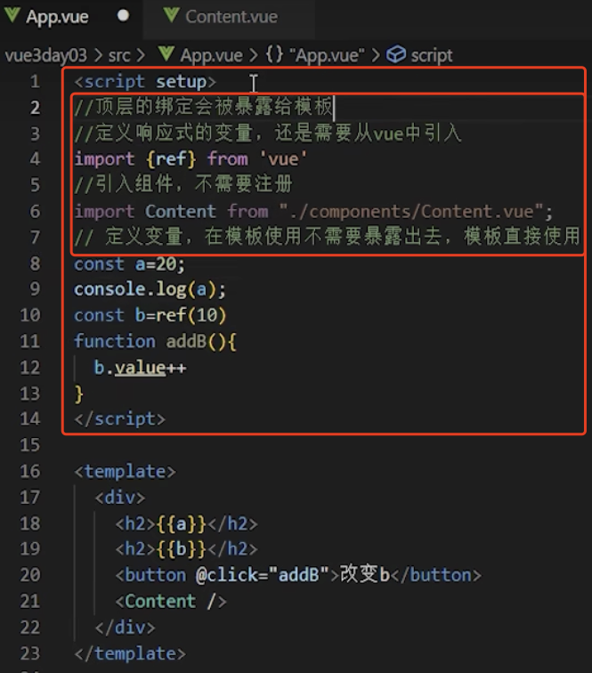

# 1. 021-单文件组件 SFC

> 2022-12-13 周二
> 
> 本篇仅是对文档的抄录，暂未归纳和补充内容。
>
>* [文档：SFC 语法定义](https://cn.vuejs.org/api/sfc-spec.html)
>* [文档：`<script setup>`](https://cn.vuejs.org/api/sfc-script-setup.html)
>* [文档：Css 功能](https://cn.vuejs.org/api/sfc-css-features.html)
>* [B站视频-在单文件组件中使用组合式API](https://www.bilibili.com/video/BV1QA4y1d7xf/?p=51)

## 1.1. SFC 语法定义


### 1.1.1. 总览

一个 Vue 单文件组件 (SFC)，通常使用 `*.vue` 作为文件扩展名，它是一种使用了类似 HTML 语法的自定义文件格式，用于定义 Vue 组件。一个 Vue 单文件组件在语法上是兼容 HTML 的。

每一个 `*.vue` 文件都由三种顶层语言块构成：`<template>`、`<script>` 和 `<style>`，以及一些其他的自定义块：

```vue
<template>
  <div class="example">{{ msg }}</div>
</template>

<script>
export default {
  data() {
    return {
      msg: 'Hello world!'
    }
  }
}
</script>

<style>
.example {
  color: red;
}
</style>

<custom1>
  This could be e.g. documentation for the component.
</custom1>
```

### 1.1.2. 相应语言块

#### 1.1.2.1. `<template>`

* 每个 `*.vue` 文件最多可以包含一个顶层 `<template>` 块。

* 语块包裹的内容将会被提取、传递给 `@vue/compiler-dom`，预编译为 JavaScript 渲染函数，并附在导出的组件上作为其 `render` 选项。

#### 1.1.2.2. `<script>`

* 每个 `*.vue` 文件最多可以包含一个 `<script>` 块。(使用 [`<script setup>`](https://cn.vuejs.org/api/sfc-script-setup.html) 的情况除外)

* 这个脚本代码块将作为 ES 模块执行。

* 默认导出应该是 Vue 的组件选项对象，可以是一个对象字面量或是 [defineComponent](https://cn.vuejs.org/api/general.html#definecomponent) 函数的返回值。

#### 1.1.2.3. `<script setup>`

* 每个 `*.vue` 文件最多可以包含一个 `<script setup>`。(不包括一般的 `<script>`)

* 这个脚本块将被预处理为组件的 `setup()` 函数，这意味着它将为每一个组件实例都执行。`<script setup>` 中的顶层绑定都将自动暴露给模板。要了解更多细节，请看 [`<script setup>` 的专门文档](https://cn.vuejs.org/api/sfc-script-setup.html)。

#### 1.1.2.4. `<style>`

* 每个 `*.vue` 文件可以包含多个 `<style>` 标签。

* 一个 `<style>` 标签可以使用 `scoped` 或 `module` attribute (查看 [SFC 样式功能](https://cn.vuejs.org/api/sfc-css-features.html)了解更多细节) 来帮助封装当前组件的样式。使用了不同封装模式的多个 `<style>` 标签可以被混合入同一个组件。

#### 1.1.2.5. 自定义块

在一个 `*.vue` 文件中可以为任何项目特定需求使用额外的自定义块。

举例来说，一个用作写文档的 `<docs>` 块。下面是一些自定义块的真实用例：

* [Gridsome：`<page-query>`](https://gridsome.org/docs/querying-data/)
* [vite-plugin-vue-gql：`<gql>`](https://github.com/wheatjs/vite-plugin-vue-gql)
* [vue-i18n：`<i18n>`](https://github.com/intlify/bundle-tools/tree/main/packages/vite-plugin-vue-i18n#i18n-custom-block)

自定义块的处理需要依赖工具链。如果你想要在构建中集成你的自定义语块，请参见相关[工具链指南](https://cn.vuejs.org/guide/scaling-up/tooling.html#sfc-custom-block-integrations)获取更多细节。

### 1.1.3. 自动名称推导

SFC 在以下场景中会根据文件名自动推导其组件名：

* 开发警告信息中需要格式化组件名时；
* DevTools 中观察组件时；
* 递归组件自引用时。例如一个名为 `FooBar.vue` 的组件可以在模板中通过 `<FooBar/>` 引用自己。(同名情况下) 这比明确注册/导入的组件优先级低。

### 1.1.4. 预处理器

代码块可以使用 `lang` 这个 attribute 来声明预处理器语言，最常见的用例就是在 `<script>` 中使用 TypeScript：

```template
<script lang="ts">
  // use TypeScript
</script>
```

`lang` 在任意块上都能使用，比如我们可以在 `<style>` 标签中使用 [`SASS`](https://sass-lang.com/) 或是 `<template>` 中使用 [Pug](https://pugjs.org/api/getting-started.html)：

```template
<template lang="pug">
p {{ msg }}
</template>

<style lang="scss">
  $primary-color: #333;
  body {
    color: $primary-color;
  }
</style>
```

注意对不同预处理器的集成会根据你所使用的工具链而有所不同，具体细节请查看相应的工具链文档来确认：

* [Vite](https://cn.vitejs.dev/guide/features.html#css-pre-processors)
* [Vue CLI](https://cli.vuejs.org/zh/guide/css.html#%E9%A2%84%E5%A4%84%E7%90%86%E5%99%A8)
* [webpack + vue-loader](https://vue-loader.vuejs.org/zh/guide/pre-processors.html#%E4%BD%BF%E7%94%A8%E9%A2%84%E5%A4%84%E7%90%86%E5%99%A8)

### 1.1.5. Src 导入

如果你更喜欢将 `*.vue` 组件分散到多个文件中，可以为一个语块使用 `src` 这个 attribute 来导入一个外部文件：

```vue
<template src="./template.html"></template>
<style src="./style.css"></style>
<script src="./script.js"></script>
```

请注意 `src` 导入和 JS 模块导入遵循相同的路径解析规则，这意味着：

* 相对路径需要以 `./` 开头
* 你也可以从 npm 依赖中导入资源

```vue
<!-- 从所安装的 "todomvc-app-css" npm 包中导入一个文件 -->
<style src="todomvc-app-css/index.css" />
```

src 导入对自定义语块也同样适用：

```vue
<unit-test src="./unit-test.js">
</unit-test>
```

### 1.1.6. 注释

在每一个语块中你都可以按照相应语言 (HTML、CSS、JavaScript 和 Pug 等等) 的语法书写注释。

对于顶层注释，请使用 HTML 的注释语法 `<!-- comment contents here -->`


## 1.2. `<script setup>`

`<script setup>` 是在单文件组件 (SFC) 中使用组合式 API 的编译时语法糖。当同时使用 SFC 与组合式 API 时该语法是默认推荐。相比于普通的 `<script>` 语法，它具有更多优势：

* 更少的样板内容，更简洁的代码。
* 能够使用纯 TypeScript 声明 props 和自定义事件。
* 更好的运行时性能 (**其模板会被编译成同一作用域内的渲染函数，避免了渲染上下文代理对象**)。
* 更好的 IDE 类型推导性能 (减少了语言服务器从代码中抽取类型的工作)。

### 1.2.1. 基本语法

要启用该语法，需要在 `<script>` 代码块上添加 `setup` attribute：

```vue
<script setup>
console.log('hello script setup')
</script>
```

**里面的代码会被编译成组件 `setup()` 函数的内容**。这意味着**与普通的 `<script>` 只在组件被首次引入的时候执行一次不同，`<script setup>` 中的代码会在每次组件实例被创建的时候执行。**

#### 1.2.1.1. 顶层的绑定会被暴露给模板

当使用 `<script setup>` 的时候，任何在 `<script setup>` 声明的顶层的绑定 (包括变量，函数声明，以及 import 导入的内容) 都能在模板中直接使用：

```vue
<script setup>
// 变量
const msg = 'Hello!'

// 函数
function log() {
  console.log(msg)
}
</script>

<template>
  <button @click="log">{{ msg }}</button>
</template>
```

import 导入的内容也会以同样的方式暴露。这意味着我们可以在模板表达式中直接使用导入的 helper 函数，而不需要通过 `methods` 选项来暴露它：

```vue
<script setup>
import { capitalize } from './helpers'
</script>

<template>
  <div>{{ capitalize('hello') }}</div>
</template>
```

### 1.2.2. 响应式

响应式状态需要明确使用 [响应式 API](https://cn.vuejs.org/api/reactivity-core.html) 来创建。和 `setup()` 函数的返回值一样，ref 在模板中使用的时候会自动解包：

```vue
<script setup>
import { ref } from 'vue'

const count = ref(0)
</script>

<template>
  <button @click="count++">{{ count }}</button>
</template>
```

### 1.2.3. 使用组件

`<script setup>` 范围里的值也能被直接作为自定义组件的标签名使用：

```vue
<script setup>
import MyComponent from './MyComponent.vue'
</script>

<template>
  <MyComponent />
</template>
```

这里 `MyComponent` 应当被理解为像是在引用一个变量。如果你使用过 JSX，此处的心智模型是类似的。其 kebab-case 格式的 `<my-component>` 同样能在模板中使用——不过，我们强烈建议使用 PascalCase 格式以保持一致性。同时这也有助于区分原生的自定义元素。

#### 1.2.3.1. 动态组件

由于组件是通过变量引用而不是基于字符串组件名注册的，在 `<script setup>` 中要使用动态组件的时候，应该使用动态的 `:is` 来绑定：

```vue
<script setup>
import Foo from './Foo.vue'
import Bar from './Bar.vue'
</script>

<template>
  <component :is="Foo" />
  <component :is="someCondition ? Foo : Bar" />
</template>
```

请注意组件是如何在三元表达式中被当做变量使用的。

#### 1.2.3.2. 递归组件

一个单文件组件可以通过它的文件名被其自己所引用。例如：名为 `FooBar.vue` 的组件可以在其模板中用 `<FooBar/>` 引用它自己。

请注意**这种方式相比于导入的组件优先级更低**。如果**有具名的导入和组件自身推导的名字冲突了，可以为导入的组件添加别名**：

```js
import { FooBar as FooBarChild } from './components'
```

#### 1.2.3.3. 命名空间组件

可以使用带 `.` 的组件标签，例如 `<Foo.Bar>` 来引用嵌套在对象属性中的组件。这在需要从单个文件中导入多个组件的时候非常有用：

```vue
<script setup>
import * as Form from './form-components'
</script>

<template>
  <Form.Input>
    <Form.Label>label</Form.Label>
  </Form.Input>
</template>
```

### 1.2.4. 使用自定义指令

全局注册的自定义指令将正常工作。本地的自定义指令在 `<script setup>` 中不需要显式注册，但他们必须遵循 `vNameOfDirective` 这样的命名规范：

```vue
<script setup>
const vMyDirective = {
  beforeMount: (el) => {
    // 在元素上做些操作
  }
}
</script>

<template>
  <h1 v-my-directive>This is a Heading</h1>
</template>
```

如果指令是从别处导入的，可以通过重命名来使其符合命名规范：

```vue
<script setup>
import { myDirective as vMyDirective } from './MyDirective.js'
</script>
```

### 1.2.5. defineProps() 和 defineEmits()

为了在声明 `props` 和 `emits` 选项时获得完整的类型推导支持，我们可以使用 `defineProps` 和 `defineEmits` API，它们将自动地在 `<script setup>` 中可用：

```vue
<script setup>
const props = defineProps({
  foo: String
})

const emit = defineEmits(['change', 'delete'])
// setup 代码
</script>
```

* `defineProps` 和 `defineEmits` 都是只能在 `<script setup>` 中使用的编译器宏。他们不需要导入，且会随着 `<script setup>` 的处理过程一同被编译掉。

* `defineProps` 接收与 `props` `选项相同的值，defineEmits` 接收与 `emits` 选项相同的值（props 用来接受路由参数，emits 用来定义事件）。

* `defineProps` 和 `defineEmits` 在选项传入后，会提供恰当的类型推导。

* 传入到 `defineProps` 和 `defineEmits` 的选项会从 setup 中提升到模块的作用域。因此，传入的选项不能引用在 setup 作用域中声明的局部变量。这样做会引起编译错误。但是，它可以引用导入的绑定，因为它们也在模块作用域内。

如果使用了 TypeScript，[使用纯类型声明来声明 prop 和 emit](https://cn.vuejs.org/api/sfc-script-setup.html#typescript-only-features) 也是可以的。

### 1.2.6. defineExpose()

使用 `<script setup>` 的组件是默认关闭的——即通过模板引用或者 `$parent` 链获取到的组件的公开实例，不会暴露任何在 `<script setup>` 中声明的绑定。

可以通过 `defineExpose` 编译器宏来显式指定在 `<script setup>` 组件中要暴露出去的属性：

```vue
<script setup>
import { ref } from 'vue'

const a = 1
const b = ref(2)

defineExpose({
  a,
  b
})
</script>
```

当父组件通过模板引用的方式获取到当前组件的实例，获取到的实例会像这样 `{ a: number, b: number }` (ref 会和在普通实例中一样被自动解包)

### 1.2.7. useSlots() 和 useAttrs()

在 `<script setup>` 使用 `slots` 和 `attrs` 的情况应该是相对来说较为罕见的，因为可以在模板中直接通过 `$slots` 和 `$attrs` 来访问它们。在你的确需要使用它们的罕见场景中，可以分别用 `useSlots` 和 `useAttrs` 两个辅助函数：

```vue
<script setup>
import { useSlots, useAttrs } from 'vue'

const slots = useSlots()
const attrs = useAttrs()
</script>
```

`useSlots` 和 `useAttrs` 是真实的运行时函数，它的返回与 `setupContext.slots` 和 `setupContext.attrs` 等价。它们同样也能在普通的组合式 API 中使用。

### 1.2.8. 与普通的 `<script>` 一起使用

`<script setup>` 可以和普通的 `<script>` 一起使用。普通的 `<script>` 在有这些需要的情况下或许会被使用到：

* 声明无法在 `<script setup>` 中声明的选项，例如 `inheritAttrs` 或插件的自定义选项。
* 声明模块的具名导出 (named exports)。
* 运行只需要在模块作用域执行一次的副作用，或是创建单例对象。

```vue
<script>
// 普通 <script>, 在模块作用域下执行 (仅一次)
runSideEffectOnce()

// 声明额外的选项
export default {
  inheritAttrs: false,
  customOptions: {}
}
</script>

<script setup>
// 在 setup() 作用域中执行 (对每个实例皆如此)
</script>
```

### 1.2.9. 顶层 await

`<script setup>` 中可以使用顶层 `await`。结果代码会被编译成 `async setup()`：


```vue
<script setup>
const post = await fetch(`/api/post/1`).then((r) => r.json())
</script>
```

另外，await 的表达式会自动编译成在 `await` 之后保留当前组件实例上下文的格式。

>注意

>`async setup()` 必须与 [Suspense 内置组件](https://cn.vuejs.org/guide/built-ins/suspense.html) 组合使用，`Suspense` 目前还是处于实验阶段的特性，会在将来的版本中稳定。

### 1.2.10. 针对 TypeScript 的功能

#### 1.2.10.1. 针对类型的 props/emit 声明

props 和 emit 都可以通过给 `defineProps` 和 `defineEmits` 传递纯类型参数的方式来声明：

```ts
const props = defineProps<{
  foo: string
  bar?: number
}>()

const emit = defineEmits<{
  (e: 'change', id: number): void
  (e: 'update', value: string): void
}>()
```

* `defineProps` 或 `defineEmits` 要么使用运行时声明，要么使用类型声明。同时使用两种声明方式会导致编译报错。

* 使用类型声明的时候，静态分析会自动生成等效的运行时声明，从而在避免双重声明的前提下确保正确的运行时行为。

    * 在开发模式下，编译器会试着从类型来推导对应的运行时验证。例如这里从 `foo: string` 类型中推断出 `foo: String`。如果类型是对导入类型的引用，这里的推导结果会是 `foo: null` (与 `any` 类型相等)，因为编译器没有外部文件的信息。

    * 在生产模式下，编译器会生成数组格式的声明来减少打包体积 (这里的 `props` 会被编译成 `['foo', 'bar']`)。

    * 生成的代码仍然是有着合法类型的 TypeScript 代码，它可以在后续的流程中被其他工具处理。

* 截至目前，类型声明参数必须是以下内容之一，以确保正确的静态分析：

    * 类型字面量
    * 在同一文件中的接口或类型字面量的引用

现在还不支持复杂的类型和从其他文件进行类型导入。

#### 1.2.10.2. 使用类型声明时的默认 props 值

针对类型的 `defineProps` 声明的不足之处在于，它没有可以给 props 提供默认值的方式。为了解决这个问题，我们还提供了 `withDefaults` 编译器宏：

```ts
export interface Props {
  msg?: string
  labels?: string[]
}

const props = withDefaults(defineProps<Props>(), {
  msg: 'hello',
  labels: () => ['one', 'two']
})
```

上面代码会被编译为等价的运行时 props 的 `default` 选项。此外，`withDefaults` 辅助函数提供了对默认值的类型检查，并确保返回的 `props` 的类型删除了已声明默认值的属性的可选标志。

### 1.2.11. 限制

由于模块执行语义的差异，`<script setup>` 中的代码依赖单文件组件的上下文。当将其移动到外部的 `.js `或者 `.ts` 文件中的时候，对于开发者和工具来说都会感到混乱。因此，`<script setup>` 不能和 `src` attribute 一起使用。


## 1.3. Css 功能

### 1.3.1. 组件作用域 CSS

当 `<style>` 标签带有 `scoped` attribute 的时候，它的 CSS 只会影响当前组件的元素，和 Shadow DOM 中的样式封装类似。使用时有一些注意事项，不过好处是不需要任何的 polyfill。它的实现方式是通过 PostCSS 将以下内容：

```vue
<style scoped>
.example {
  color: red;
}
</style>

<template>
  <div class="example">hi</div>
</template>
```

转换为：

```vue
<style>
.example[data-v-f3f3eg9] {
  color: red;
}
</style>

<template>
  <div class="example" data-v-f3f3eg9>hi</div>
</template>
```

#### 1.3.1.1. 子组件的根元素

使用 `scoped` 后，父组件的样式将不会渗透到子组件中。不过，子组件的根节点会同时被父组件的作用域样式和子组件的作用域样式影响。这样设计是为了让父组件可以从布局的角度出发，调整其子组件根元素的样式。

#### 1.3.1.2. 深度选择器

处于 `scoped` 样式中的选择器如果想要做更“深度”的选择，也即：影响到子组件，可以使用 `:deep()` 这个伪类：

```vue
<style scoped>
.a :deep(.b) {
  /* ... */
}
</style>
```

上面的代码会被编译成：

```css
.a[data-v-f3f3eg9] .b {
  /* ... */
}
```

>TIP

>通过 `v-html` 创建的 DOM 内容不会被作用域样式影响，但你仍然可以使用深度选择器来设置其样式。

#### 1.3.1.3. 插槽选择器

默认情况下，作用域样式不会影响到 `<slot/>` 渲染出来的内容，因为它们被认为是父组件所持有并传递进来的。使用 `:slotted` 伪类以明确地将插槽内容作为选择器的目标：

```vue
<style scoped>
:slotted(div) {
  color: red;
}
</style>
```

#### 1.3.1.4. 全局选择器

如果想让其中一个样式规则应用到全局，比起另外创建一个 `<style>`，可以使用 `:global` 伪类来实现 (看下面的代码)：

```vue
<style scoped>
:global(.red) {
  color: red;
}
</style>
```

#### 1.3.1.5. 混合使用局部与全局样式

你也可以在同一个组件中同时包含作用域样式和非作用域样式：

```vue
<style>
/* 全局样式 */
</style>

<style scoped>
/* 局部样式 */
</style>
```

#### 1.3.1.6. 作用域样式须知

* 作用域样式并没有消除对 `class` 的需求。由于浏览器渲染各种各样 CSS 选择器的方式，`p { color: red }` 结合作用域样式使用时 (即当与 attribute 选择器组合的时候) 会慢很多倍。如果你**使用 `class` 或者 `id` 来替代，例如 `.example { color: red }`，那你几乎就可以避免性能的损失**。

* 小心递归组件中的后代选择器！对于一个使用了 `.a .b` 选择器的样式规则来说，如果匹配到 `.a` 的元素包含了一个递归的子组件，那么所有的在那个子组件中的 `.b` 都会匹配到这条样式规则。

### 1.3.2. CSS Modules

一个 `<style module>` 标签会被编译为 [CSS Modules](https://github.com/css-modules/css-modules) 并且将生成的 CSS class 作为 `$style` 对象暴露给组件：

```vue
<template>
  <p :class="$style.red">This should be red</p>
</template>

<style module>
.red {
  color: red;
}
</style>
```

得出的 class 将被哈希化以避免冲突，实现了同样的将 CSS 仅作用于当前组件的效果。

参考 [CSS Modules spec](https://github.com/css-modules/css-modules) 以查看更多详情，例如 [global exceptions](https://github.com/css-modules/css-modules#exceptions) 和 `composition` 。

#### 1.3.2.1. 自定义注入名称

你可以通过给 `module` attribute 一个值来自定义注入 class 对象的属性名：

```vue
<template>
  <p :class="classes.red">red</p>
</template>

<style module="classes">
.red {
  color: red;
}
</style>
```

#### 1.3.2.2. 与组合式 API 一同使用

可以通过 `useCssModule` API 在 `setup()` 和 `<script setup>` 中访问注入的 class。对于使用了自定义注入名称的 `<style module>` 块，`useCssModule` 接收一个匹配的 `module` attribute 值作为第一个参数：

```js
import { useCssModule } from 'vue'

// 在 setup() 作用域中...
// 默认情况下, 返回 <style module> 的 class
useCssModule()

// 具名情况下, 返回 <style module="classes"> 的 class
useCssModule('classes')
```

### 1.3.3. CSS 中的 v-bind()

单文件组件的 `<style>` 标签支持使用 `v-bind` CSS 函数将 CSS 的值链接到动态的组件状态：

```vue
<template>
  <div class="text">hello</div>
</template>

<script>
export default {
  data() {
    return {
      color: 'red'
    }
  }
}
</script>

<style>
.text {
  color: v-bind(color);
}
</style>
```

这个语法同样也适用于 [`<script setup>`](https://cn.vuejs.org/api/sfc-script-setup.html)，且支持 JavaScript 表达式 (需要用引号包裹起来)：

```vue
<script setup>
const theme = {
  color: 'red'
}
</script>

<template>
  <p>hello</p>
</template>

<style scoped>
p {
  color: v-bind('theme.color');
}
</style>
```

实际的值会被编译成哈希化的 CSS 自定义属性，因此 CSS 本身仍然是静态的。自定义属性会通过内联样式的方式应用到组件的根元素上，并且在源值变更的时候响应式地更新。

## 1.4. 补充



