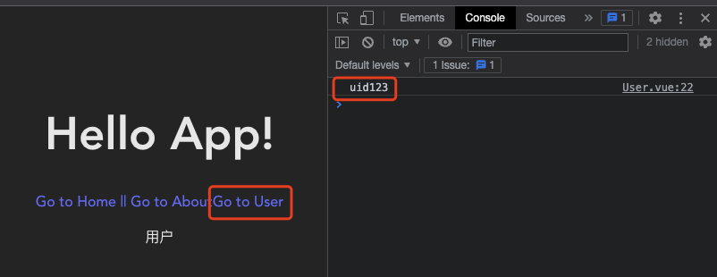

# 1. 022-VueRouter

>2022-12-14 周三
>
>* [文档：Vue Router 入门](https://router.vuejs.org/zh/introduction.html)
>* [B 站视频-52](https://www.bilibili.com/video/BV1QA4y1d7xf/?p=52)

## 1.1. 介绍

Vue Router 是 Vue.js 的官方路由。它与 Vue.js 核心深度集成，让用 Vue.js 构建单页应用变得轻而易举。功能包括：

* 嵌套路由映射
* 动态路由选择
* 模块化、基于组件的路由配置
* 路由参数、查询、通配符
* 展示由 Vue.js 的过渡系统提供的过渡效果
* 细致的导航控制
* 自动激活 CSS 类的链接
* HTML5 history 模式或 hash 模式
* 可定制的滚动行为
* URL 的正确编码

> 补充：
> 
> * Vue Router 是基于路由和组件的，路由用来设定访问路径，将路由和组件映射起来。
> * 一个路由就代表一对映射关系（key:value，其中 key 表示路由，value 表示函数或组件）；多个路由组成路由表。
> * 路由的核心是：改变 URL 时仅刷新页面中的局部内容，而不进行整体刷新。

## 1.2. 安装

* 方式1：使用 npm 安装

```bash
npm install vue-router@4
```

* 方式2：使用 yarn 安装

```bash
yarn add vue-router@4
```

使用 `npm run dev` 或 `yarn dev` 可以运行项目。


## 1.3. 基础

> 基于 vue-router 实现第一个带有路由的页面。

* 在 `src` 目录下创建 `views` 目录，然后在其中编写路由组件（通常情况下都会把路由组件放在 `src`/`views` 目录），如下图：


* 在 `src` 目录下创建 `router` 目录，并在其中创建 `index.js` 文件，该文件用于管理路由和组件的映射关系，如下：


```vue
<!-- src/router/index.js -->

import {createRouter,createWebHashHistory} from 'vue-router'

// 1. 定义路由组件.
// 可以从其他文件导入，也可以直接写，如：const Home = { template: '<div>Home</div>' }
import Home from "../views/Home.vue"
import About from "../views/About.vue"  

// 2. 定义一些路由
// 每个路由都需要映射到一个组件。此处暂不考虑嵌套路由
const routes = [
  { path: '/', component: Home },
  { path: '/about', component: About },
]

// 3. 创建路由实例并传递 `routes` 配置
// 使用 vue router 中的 createRouter 方法创建实例。也可以在这里输入更多的配置
const router = createRouter({
  // 4. createWebHashHistory() 内部提供了 history 模式和 hash 模式。此处使用简单的 hash 模式
  history: createWebHashHistory(), // createWebHashHistory() 是 vue router 中的方法
  routes, // `routes: routes` 的缩写
})

// 5 导出 router 实例，然后才能在 main.js 中挂载
export default router
```

* 修改 `main.js`，在  App 实例挂载时使用上一步中导出的 `router` 实例：


```vue
<!--src/main.js-->

import { createApp } from 'vue'
import './style.css'
import App from './App.vue'
// 如果 router 目录中存在 index.js 文件，导入时可以省略，系统会自动查找
import router from './router'

const app = createApp(App)
// 要写在 mount 之前。否则无法识别 router-link 和 router-view
app.use(router)

app.mount('#app')
```

* 在 `App.vue` 中通过 `router-link` 和 `router-view` 使用路由：


```vue
<!-- src/App.vue -->

<script setup>
</script>

<template>
  <div>
    <!-- vue router 是基于路由和组件的，路由是用来设定访问路径，将路径和组件映射起来 -->
    <h1>Hello App!</h1>
    <p>
      <!--使用 router-link 组件进行导航.`<router-link>` 将呈现一个带有正确 `href` 属性的 `<a>` 标签 -->
      <!--`to` 用来指定链接，即我们在 index.js 中定义的 path -->
      <router-link to="/">Go to Home || </router-link>
      <router-link to="/about">Go to About</router-link>
    </p>
    <!-- 路由出口，可以理解为一个占位容器 -->
    <!-- 路由匹配到的组件将渲染在这里 -->
    <router-view></router-view>
  </div>
</template>
```

在终端中执行 `yarn dev` 运行项目，将会看到如下界面：


点击时的切换效果如下：


## 1.4. 带参数的动态路由匹配

>2023-01-04 周三

[文档：带参数的动态路由匹配](https://router.vuejs.org/zh/guide/essentials/dynamic-matching.html)

### 1.4.1. 路径参数

很多时候，我们需要将给定匹配模式的路由映射到同一个组件。例如，我们可能有一个 `User` 组件，它应该对所有用户进行渲染，但用户 ID 不同。在 Vue Router 中，我们可以在路径中使用一个动态字段来实现，我们称之为 **路径参数** ：

```vue
const User = {
  template: '<div>User</div>',
}

// 这些都会传递给 `createRouter`
const routes = [
  // 动态字段以冒号开始
  { path: '/users/:id', component: User },
]
```

现在像 `/users/johnny` 和 `/users/jolyne` 这样的 URL 都会映射到同一个路由。

路径参数 用冒号 `:` 表示。当一个路由被匹配时，它的 params 的值将在每个组件中以 `this.$route.params` 的形式暴露出来。因此，我们可以通过更新 `User` 的模板来呈现当前的用户 ID：

```vue
# 这是官方文档中的示例，没有实际测试。
const User = {
  template: '<div>User {{ $route.params.id }}</div>',
}
```

你可以在同一个路由中设置有多个 路径参数，它们会映射到 `$route.params` 上的相应字段。例如：

匹配模式 | 匹配路径	| `$route.params`
---|---|---
`/users/:username` | 	`/users/eduardo`	| `{ username: 'eduardo' }`
`/users/:username/posts/:postId` |	`/users/eduardo/posts/123` | `	{ username: 'eduardo', postId: '123' }`

除了 `$route.params` 之外，`$route` 对象还公开了其他有用的信息，如 `$route.query`（如果 URL 中存在参数）、`$route.hash` 等。你可以在[API 参考](https://router.vuejs.org/zh/api/#routelocationnormalized)中查看完整的细节。

这个例子的 [demo 可以在这里找到](https://codesandbox.io/s/route-params-vue-router-examples-mlb14?from-embed&initialpath=%2Fusers%2Feduardo%2Fposts%2F1)。

#### 1.4.1.1. 补充示例

基于 `基础` 一节中的示例。

在 src/views 目录下新建 User.vue 组件，并编辑其内容（含组件内容和获取 route 中参数数据的方法）：


* src/views/User.vue

```vue
<template>
    <div>
        用户
    </div>
</template>

<!-- 获取 route 中数据的方式1 -->
<!-- <script>
export default {
    mounted() {
        // $route 表示当前活跃的路由对象
        console.log(this.$route.params.id)
        console.log(this.$route)
    }
}
</script> -->

<!-- 获取 route 中数据的方式2 -->
<script setup>
import { useRoute } from 'vue-router'
// 这里的 useRoute 是一个方法，所以需要在后面加上括号，表示执行方法。
console.log(useRoute().params.id)
</script>
```

在 src/router/index.js 中注册 User 组件对应的路由：


* src/router/index.js 

```vue
import { createRouter, createWebHashHistory } from 'vue-router'

// 1. 定义路由组件.
// 可以从其他文件导入，也可以直接写，如：const Home = { template: '<div>Home</div>' }
import Home from "../views/Home.vue"
import About from "../views/About.vue"
import User from "../views/User.vue"

// 2. 定义一些路由
// 每个路由都需要映射到一个组件。此处暂不考虑嵌套路由
const routes = [
  { path: '/', component: Home },
  { path: '/about', component: About },
  { path: '/user/:id', component: User }
]

// 3. 创建路由实例并传递 `routes` 配置
// 使用 vue router 中的 createRouter 方法创建实例。也可以在这里输入更多的配置
const router = createRouter({
  // 4. createWebHashHistory() 内部提供了 history 模式和 hash 模式。此处使用简单的 hash 模式
  history: createWebHashHistory(), // createWebHashHistory() 是 vue router 中的方法
  routes, // `routes: routes` 的缩写
})

// 5 导出 router 实例，然后才能在 main.js 中挂载
export default router
```

使用路由并传递参数：


### 1.4.2. 响应路由参数的变化

使用带有参数的路由时需要注意的是，当用户从 `/users/johnny` 导航到 `/users/jolyne` 时，**相同的组件实例将被重复使用**。因为两个路由都渲染同个组件，比起销毁再创建，复用则显得更加高效。不过，**这也意味着组件的生命周期钩子不会被调用**。

要对同一个组件中参数的变化做出响应的话，你可以简单地 watch `$route` 对象上的任意属性，在这个场景中，就是 `$route.params` ：

```vue
const User = {
  template: '...',
  created() {
    this.$watch(
      () => this.$route.params,
      (toParams, previousParams) => {
        // 对路由变化做出响应...
      }
    )
  },
}
```

或者，使用 `beforeRouteUpdate` [导航守卫](https://router.vuejs.org/zh/guide/advanced/navigation-guards.html)，它也可以取消导航：

```vue
const User = {
  template: '...',
  async beforeRouteUpdate(to, from) {
    // 对路由变化做出响应...
    this.userData = await fetchUser(to.params.id)
  },
}
```



### 1.4.3. 捕获所有路由或 404 Not found 路由

常规参数只匹配 url 片段之间的字符，用 `/` 分隔。如果我们**想匹配任意路径，可以在 路径参数 后面的括号中加入 正则表达式** :

```vue
const routes = [
  // 匹配所有内容并将其放在 `$route.params.pathMatch` 下
  { path: '/:pathMatch(.*)*', name: 'NotFound', component: NotFound },

  // 匹配以 `/user-` 开头的所有内容，并将其放在 `$route.params.afterUser` 下
  { path: '/user-:afterUser(.*)', component: UserGeneric },
]
```

在这个特定的场景中，我们在括号之间使用了[自定义正则表达式](https://router.vuejs.org/zh/guide/essentials/route-matching-syntax.html#%E5%9C%A8%E5%8F%82%E6%95%B0%E4%B8%AD%E8%87%AA%E5%AE%9A%E4%B9%89%E6%AD%A3%E5%88%99)，并将 `pathMatch` 参数标记为[可选可重复](https://router.vuejs.org/zh/guide/essentials/route-matching-syntax.html#%E5%8F%AF%E9%80%89%E5%8F%82%E6%95%B0)。这样做是为了让我们在需要的时候，可以通过将 `path` 拆分成一个数组，直接导航到路由：

```vue
this.$router.push({
  name: 'NotFound',
  // 保留当前路径并删除第一个字符，以避免目标 URL 以 `//` 开头。
  params: { pathMatch: this.$route.path.substring(1).split('/') },
  // 保留现有的查询和 hash 值，如果有的话
  query: this.$route.query,
  hash: this.$route.hash,
})
```

更多内容请参见[重复参数](https://router.vuejs.org/zh/guide/essentials/route-matching-syntax.html#%E5%8F%AF%E9%87%8D%E5%A4%8D%E7%9A%84%E5%8F%82%E6%95%B0)部分。

如果你正在使用[历史模式](https://router.vuejs.org/zh/guide/essentials/history-mode.html)，请务必按照说明正确配置你的服务器。

#### 1.4.3.1. 补充示例

> 基于 《路径参数-补充示例》实现：

在 views 目录下新增 `NotFound.vue` 组件：


在 router/index.js 中注册路由：


> 在 routers 中 404 路由可以放置在任意位置，但通常我们会放置在末尾。

在初始状态的地址栏中追加任意内容（一个没有在 `router/index.js` 中注册的路由）：


### 1.4.4. 高级匹配模式

Vue Router 使用自己的路径匹配语法，其灵感来自于 `express` ，因此它支持许多高级匹配模式，如可选的参数，零或多个及一个或多个，甚至自定义的正则匹配规则。请查看[高级匹配](https://router.vuejs.org/zh/guide/essentials/route-matching-syntax.html)文档来探索它们。


## 1.5. 路由的匹配语法

>2023-01-05 周四

[文档](https://router.vuejs.org/zh/guide/essentials/route-matching-syntax.html)

大多数应用都会使用 `/about` 这样的静态路由和 `/users/:userId` 这样的动态路由，就像我们刚才在[动态路由匹配](https://router.vuejs.org/zh/guide/essentials/dynamic-matching.html)中看到的那样，但是 Vue Router 可以提供更多的方式！

>TIP
>为了简单起见，该章节所有的路由都省略了 `component` 属性，只关注 `path` 值。

### 1.5.1. 在参数中自定义正则

> 可以用于限定参数类型。

当定义像 `:userId` 这样的参数时，我们内部使用以下的正则 `([^/]+)` (至少有一个字符不是斜杠 `/` )来从 URL 中提取参数。这很好用，除非你需要根据参数的内容来区分两个路由。想象一下，两个路由 `/:orderId` 和 `/:productName`，两者会匹配完全相同的 URL，所以我们需要一种方法来区分它们。最简单的方法就是在路径中添加一个静态部分来区分它们：

```vue
const routes = [
  // 匹配 /o/3549
  { path: '/o/:orderId' },
  // 匹配 /p/books
  { path: '/p/:productName' },
]
```

但在某些情况下，我们并不想添加静态的 `/o` `/p` 部分。由于，`orderId` 总是一个数字，而 `productName` 可以是任何东西，所以我们可以在括号中为参数指定一个自定义的正则：

```vue
const routes = [
  // /:orderId -> 仅匹配数字
  { path: '/:orderId(\\d+)' },
  // /:productName -> 匹配其他任何内容
  { path: '/:productName' },
]
```

现在，转到 `/25` 将匹配 `/:orderId`，其他情况将会匹配 `/:productName`。`routes` 数组的顺序并不重要!

>TIP
>确保转义反斜杠(` \` )，就像我们对 `\d` (变成`\\d`)所做的那样，在 JavaScript 中实际传递字符串中的反斜杠字符。

#### 1.5.1.1. 补充示例

>基于前面《捕获所有路由或404页面》一节的示例。

在 `src/views` 目录中新建 `News.vue` ，并编辑其内容：


在 `src/routers` 中注册路由：


使用路由，并传递数字参数：


 


### 1.5.2. 可重复的参数

如果你需要匹配具有多个部分的路由，如 `/first/second/third`，你应该用 `*`（0 个或多个）和 `+`（1 个或多个）将参数标记为可重复：

```vue
const routes = [
  // /:chapters ->  匹配 /one, /one/two, /one/two/three, 等
  { path: '/:chapters+' },
  // /:chapters -> 匹配 /, /one, /one/two, /one/two/three, 等
  { path: '/:chapters*' },
]
```

这将为你提供一个参数数组，而不是一个字符串，并且在使用命名路由时也需要你传递一个数组：

```vue
// 给定 { path: '/:chapters*', name: 'chapters' },
router.resolve({ name: 'chapters', params: { chapters: [] } }).href
// 产生 /
router.resolve({ name: 'chapters', params: { chapters: ['a', 'b'] } }).href
// 产生 /a/b

// 给定 { path: '/:chapters+', name: 'chapters' },
router.resolve({ name: 'chapters', params: { chapters: [] } }).href
// 抛出错误，因为 `chapters` 为空 
```

这些也可以通过在**右括号后**添加它们与自定义正则结合使用：

```vue
const routes = [
  // 仅匹配数字
  // 匹配 /1, /1/2, 等
  { path: '/:chapters(\\d+)+' },
  // 匹配 /, /1, /1/2, 等
  { path: '/:chapters(\\d+)*' },
]
```

### 1.5.3. Sensitive 与 strict 路由配置

默认情况下，所有路由是不区分大小写的，并且能匹配带有或不带有尾部斜线的路由。例如，路由 `/users` 将匹配 `/users`、`/users/`、甚至 `/Users/`。这种行为可以通过 `strict` 和 `sensitive` 选项来修改，它们既可以应用在整个全局路由上，又可以应用于当前路由上：

```vue
const router = createRouter({
  history: createWebHistory(),
  routes: [
    // 将匹配 /users/posva 而非：
    // - /users/posva/ 当 strict: true
    // - /Users/posva 当 sensitive: true
    { path: '/users/:id', sensitive: true },

    // 将匹配 /users, /Users, 以及 /users/42 而非 /users/ 或 /users/42/
    { path: '/users/:id?' },
  ]
  strict: true, // applies to all routes
})
```

### 1.5.4. 可选参数

你也可以通过使用 `?` 修饰符(**0 个或 1 个**)将一个参数标记为可选：

```vue
const routes = [
  // 匹配 /users 和 /users/posva
  { path: '/users/:userId?' },
  // 匹配 /users 和 /users/42
  { path: '/users/:userId(\\d+)?' },
]
```

请注意，`*` 在技术上也标志着一个参数是可选的，但 `?` 参数不能重复。

### 1.5.5. 调试

如果你需要探究你的路由是如何转化为正则的，以了解为什么一个路由没有被匹配，或者，报告一个 bug，你可以使用[路径排名工具](https://paths.esm.dev/?p=AAMeJSyAwR4UbFDAFxAcAGAIJXMAAA..#)。它支持通过 URL 分享你的路由。


## 1.6. 嵌套路由

> 2023-01-11 周三

[文档](https://router.vuejs.org/zh/guide/essentials/nested-routes.html)

### 1.6.1. 嵌套路由

一些应用程序的 UI 由多层嵌套的组件组成。在这种情况下，URL 的片段通常对应于特定的嵌套组件结构，例如：

```
/user/johnny/profile                     /user/johnny/posts
+------------------+                  +-----------------+
| User             |                  | User            |
| +--------------+ |                  | +-------------+ |
| | Profile      | |  +------------>  | | Posts       | |
| |              | |                  | |             | |
| +--------------+ |                  | +-------------+ |
+------------------+                  +-----------------+
```

通过 Vue Router，你可以使用嵌套路由配置来表达这种关系。

接着上节创建的 app ：

```vue
<div id="app">
  <router-view></router-view>
</div>
```

```vue
const User = {
  template: '<div>User {{ $route.params.id }}</div>',
}

// 这些都会传递给 `createRouter`
const routes = [{ path: '/user/:id', component: User }]
```

这里的 `<router-view>` 是一个顶层的 `router-view`。它渲染顶层路由匹配的组件。同样地，一个被渲染的组件也可以包含自己嵌套的 `<router-view>`。例如，如果我们在 `User` 组件的模板内添加一个 `<router-view>`：

```vue
const User = {
  template: `
    <div class="user">
      <h2>User {{ $route.params.id }}</h2>
      <router-view></router-view>
    </div>
  `,
}
```

要将组件渲染到这个嵌套的 `router-view` 中，我们需要在路由中配置 `children`：

```vue
const routes = [
  {
    path: '/user/:id',
    component: User,
    children: [
      {
        // 当 /user/:id/profile 匹配成功
        // UserProfile 将被渲染到 User 的 <router-view> 内部
        path: 'profile',
        component: UserProfile,
      },
      {
        // 当 /user/:id/posts 匹配成功
        // UserPosts 将被渲染到 User 的 <router-view> 内部
        path: 'posts',
        component: UserPosts,
      },
    ],
  },
]
```

注意，**以 `/` 开头的嵌套路径将被视为根路径。这允许你利用组件嵌套，而不必使用嵌套的 URL**。

如你所见，`children` 配置只是另一个路由数组，就像 `routes` 本身一样。因此，你可以根据自己的需要，不断地嵌套视图。

此时，按照上面的配置，当你访问 `/user/eduardo` 时，在 User 的 `router-view` 里面什么都不会呈现，因为没有匹配到嵌套路由。也许你确实想在那里渲染一些东西。在这种情况下，你可以提供一个空的嵌套路径：

```vue
const routes = [
  {
    path: '/user/:id',
    component: User,
    children: [
      // 当 /user/:id 匹配成功
      // UserHome 将被渲染到 User 的 <router-view> 内部
      { path: '', component: UserHome },

      // ...其他子路由
    ],
  },
]
```

这个例子的 [demo 可以在这里找到](https://codesandbox.io/s/nested-views-vue-router-4-examples-hl326?initialpath=%2Fusers%2Feduardo)。

#### 1.6.1.1. 补充示例

* 在 `src`-`views` 目录下新增两个 Child.vue 组件，如下：


* 在 `src`-`views` 目录下新增 `Parent.vue` 组件，编辑内容并应用子组件的路由：


* 在 `src`-`routers`-`index.js` 文件中定义父组件和子组件的路由：


* 在 `src`-`App.vue` 文件中使用父组件的路由：


运行后的效果如下：


### 1.6.2. 嵌套的命名路由

在处理[命名路由](https://router.vuejs.org/zh/guide/essentials/named-routes.html)时，你通常会给子路由命名：

```vue
const routes = [
  {
    path: '/user/:id',
    component: User,
    // 请注意，只有子路由具有名称
    children: [{ path: '', name: 'user', component: UserHome }],
  },
]
```

这将确保导航到 `/user/:id` 时始终显示嵌套路由。

在一些场景中，你可能希望导航到命名路由而不导航到嵌套路由。例如，你想导航 `/user/:id` 而不显示嵌套路由。那样的话，你还可以**命名父路由，但请注意重新加载页面将始终显示嵌套的子路由，因为它被视为指向路径`/users/:id` 的导航，而不是命名路由**：

```vue
const routes = [
  {
    path: '/user/:id',
    name: 'user-parent'
    component: User,
    children: [{ path: '', name: 'user', component: UserHome }],
  },
]
```

## 1.7. 编程式导航

[官方文档](https://router.vuejs.org/zh/guide/essentials/navigation.html)

>2023年01月12日 周四

除了使用 `<router-link>` 创建 a 标签来定义导航链接，我们还可以借助 router 的实例方法，通过编写代码来实现（即**通过 js 实现页面的跳转**）。

### 1.7.1. 导航到不同的位置

注意：**在 Vue 实例中，你可以通过 `$router` 访问路由实例。因此你可以调用 `this.$router.push`。**（`$router` 是一个全局的路由实例。`$route` 表示当前活跃的路由对象。）

想要导航到不同的 URL，可以使用 `router.push` 方法。这个方法会向 history 栈添加一个新的记录，所以，当用户点击浏览器后退按钮时，会回到之前的 URL。

当你点击 `<router-link>` 时，内部会调用这个方法，所以点击 `<router-link :to="...">` 相当于调用 `router.push(...) `：

声明式  |	编程式
---|---
`<router-link :to="...">` | `router.push(...)`
 
该方法的参数可以是一个字符串路径，或者一个描述地址的对象。例如：

```vue
// 字符串路径
router.push('/users/eduardo')

// 带有路径的对象
router.push({ path: '/users/eduardo' })

// 命名的路由，并加上参数，让路由建立 url
// 在 index.js 中定义路由时指定了 name 的组件才可以在此处使用 name.
router.push({ name: 'user', params: { username: 'eduardo' } })

// 带查询参数，结果是 /register?plan=private
router.push({ path: '/register', query: { plan: 'private' } })

// 带 hash，结果是 /about#team
router.push({ path: '/about', hash: '#team' })
```

注意：**如果提供了 `path`，`params` 会被忽略**，上述例子中的 `query` 并不属于这种情况。取而代之的是下面例子的做法，你需要提供路由的 `name` 或手写完整的带有参数的 `path` ：

```vue
const username = 'eduardo'
// 我们可以手动建立 url，但我们必须自己处理编码
router.push(`/user/${username}`) // -> /user/eduardo
// 同样
router.push({ path: `/user/${username}` }) // -> /user/eduardo
// 如果可能的话，使用 `name` 和 `params` 从自动 URL 编码中获益
router.push({ name: 'user', params: { username } }) // -> /user/eduardo
// ❌ 错误示例：`params` 不能与 `path` 一起使用
router.push({ path: '/user', params: { username } }) // -> /user
```

当指定 `params` 时，可提供 `string` 或 `number` 参数（或者对于[可重复的参数](https://router.vuejs.org/zh/guide/essentials/route-matching-syntax.html#repeatable-params)可提供一个数组）。**任何其他类型（如 `undefined`、`false` 等）都将被自动字符串化**。对于可选参数，你可以提供一个空字符串（`""`）来跳过它。

> CnPeng :
> 
> * 如果在 `push` 方法中使用对象，该对象同时拥有 `path` 和 `params` 时，`params` 会被忽略。
> * 需要传递参数时，要么在 `path` 中拼接参数，要么使用 `name` 和 `params` 的组合方式。
> * `params` 中字段的值必须是 `string` 或 `number`
> * 对象中的 `query` 字段无上述相关限制。
> * 在 index.js 中定义路由时指定了 `name` 的组件才可以在此处使用 `name` 。

由于属性 `to` 与 `router.push` 接受的对象种类相同，所以两者的规则完全相同。

`router.push` 和所有其他导航方法都会返回一个 `Promise`，让我们可以等到导航完成后才知道是成功还是失败。我们将在 [Navigation Handling](https://router.vuejs.org/zh/guide/advanced/navigation-failures.html) 中详细介绍。

#### 1.7.1.1. 补充-字符串路径

* 在 `src`-`views` 目录下新增 `ChangePage.vue` 组件，并编辑其内容：


* 在 `router`-`index.js` 文件中声明 `ChangePage.vue` 对应的组件：


* 在 `App.vue` 中使用 `ChangePage` 组件对应的路由：


运行效果如下：


* 附：`ChangePage.vue` 组件内容：

```vue
<template>
    <div>
        <h2>点击下方按钮实现编程式导航</h2>
        <button @click="goPage">跳转到 home 页面</button>
    </div>
</template>
<script>
export default {
    methods: {
        // 跳转到指定页面
        goPage: function () {
            console.log("全局路由对象：", this.$router)
            // 跳转到 home 页面，在 router/index.js 中指定了 home 页面的路由为 /
            this.$router.push("/")
        }
    }
}
</script>
```

在上述代码中，我们也可以指定在满足某种条件时才出发跳转，核心代码如下：

```vue
goPage: function () {
     console.log("全局路由对象：", this.$router)
     if (flag) {
          // 跳转到 home 页面，在 router/index.js 中指定了 home 页面的路由为 /
          this.$router.push("/")
     }
}
```

#### 1.7.1.2. 补充-包含name的对象跳转

基于前一小节的内容进行修改。

* 在 `router`-`index.js` 文件中为 `Home` 组件指定 `name`:


* 修改 `ChangePage.vue` 组件，基于 `name` 实现跳转：


#### 1.7.1.3. 补充-携带params

基于上一小节中的示例修改。

* 在 `router`-`index.js` 文件中为 `User` 组件声明 `name`


* 修改 `views`-`ChangePage.vue` 组件中的跳转方法：


附：`ChangePage.vue` 的内容如下：

```vue
<template>
    <div>
        <h2>点击下方按钮实现编程式导航</h2>
        <button @click="goPage">跳转到 User 页面</button>
    </div>
</template>
<script>
export default {
    methods: {
        // 跳转到指定页面
        goPage: function () {
            console.log("全局路由对象：", this.$router)
            // 跳转到 user 页面，并携带参数 123，在 index.js 中指定了携带的参数名为 id
            // 方式1: 路径中直接携带参数
            // this.$router.push("/user/123")

            // 方式2：name + params 的方式，params 中的字段必须是string或number
            this.$router.push({ name: "user", params: { id: "abc" } })
            // this.$router.push({ name: "user", params: { id: 123 }})
        }
    }
}
</script>
```

#### 1.7.1.4. 补充-携带query参数

基于上一小节的内容进行修改：

* 修改 `views`-`ChangePage.vue` 组件中的跳转方法：


* 修改 `views`-`About.vue` 组件，在其中打印路由对象和查询参数：


跳转后的页面效果如下：


### 1.7.2. 替换当前位置

> CnPeng：默认情况下，我们在 A 页面中点击按钮进入 B 页面时，会把 A 添加到 `history` 堆栈中，这样我们在 B 页面点击返回键时就会返回到 A 页面。但是，如果我们设置了 `replase:true`，从 A 跳转到 B 时，B 会直接替换 A （`history` 堆栈中将没有 A），此时在 B 页面点击返回键时就会返回到 A 的前一个页面。

它的作用类似于 `router.push`，唯一不同的是，它**在导航时不会向 history 添加新记录，正如它的名字所暗示的那样——它取代了当前的条目**。

声明式 | 编程式
---|---
`<router-link :to="..." replace>` | 	`router.replace(...)`

也可以直接在传递给 `router.push` 的 `routeLocation` 中增加一个属性 `replace: true` ：

```vue
router.push({ path: '/home', replace: true })
// 相当于
router.replace({ path: '/home' })
```

#### 1.7.2.1. 补充示例：

基于前一小节的示例进行修改：

* 修改 `views`-`ChangePage.vue` 组件中的内容：


基于上述代码：

我们从 Home 页面点击 `Go to ChangePage`  后会进入到 ChangePage 页面。点击 ChangePage 页面中的按钮后会进入到 About 页面。在 About 页面中点击返回键时，会直接返回到 Home 页面。——因为 About 页面直接替换了 ChangePage 页面在 `history` 堆栈中的位置。

如果没有启用 `replace` , 默认情况下将是从哪来回哪去。

### 1.7.3. 横跨历史

该方法采用一个整数作为参数，表示在历史堆栈中前进或后退多少步，类似于 `window.history.go(n)`。

例子:

```vue
// 向前移动一条记录，与 router.forward() 相同
router.go(1)

// 返回一条记录，与 router.back() 相同
router.go(-1)

// 前进 3 条记录
router.go(3)

// 如果没有那么多记录，静默失败
router.go(-100)
router.go(100)
```

#### 1.7.3.1. 补充示例

基于前一小节的示例进行修改。

* 修改 `src`-`views`-`ChangePage.vue` 中的跳转代码：


*  修改 `src`-`views`-`About.vue` 组件，增加按钮及其事件：


基于上述代码，

从 Home 页面点击 `Go to ChangePage` 进入 ChangePage 页面后，点击其中的 `跳转到 About 页面` 按钮会进入 About 页面，再点击其中的 `后退` 按钮，则会直接回到 Home 页面。

### 1.7.4. 篡改历史

你可能已经注意到，`router.push`、`router.replace` 和 `router.go` 是 `window.history.pushState`、`window.history.replaceState` 和 `window.history.go` 的翻版，它们确实模仿了 [`window.history` 的 API](https://developer.mozilla.org/en-US/docs/Web/API/History)。

因此，如果你已经熟悉 [Browser History APIs](https://developer.mozilla.org/en-US/docs/Web/API/History_API)，在使用 Vue Router 时，操作历史记录就会觉得很熟悉。

值得一提的是，无论在创建路由器实例时传递什么样的 [history 配置](https://router.vuejs.org/zh/api/#history)，Vue Router 的导航方法( `push`、`replace`、`go` )都能始终正常工作。


## 1.8. 命名路由

>2023-01-12 周四

[文档：命名路由](https://router.vuejs.org/zh/guide/essentials/named-routes.html)

在声明组件对应的路由时，除了指定 `path` 之外，还可以指定 `name`。这有以下优点：

* 没有硬编码的 URL
* params 的自动编码/解码。
* 防止在 url 中出现打字错误。
* 绕过路径排序（如显示一个）

```vue
const routes = [
  {
    path: '/user/:username',
    name: 'user',
    component: User,
  },
]
```

要链接到一个命名的路由，可以向 `router-link` 组件的 `to` 属性传递一个对象：

```vue
<!--注意：这里的 to 前面有一个冒号，这是动态绑定的模式。只有这样才能识别后面用引号包裹的对象-->
<!--如果不加冒号，to 后面的内容都会被识别为普通字符串。-->
<router-link :to="{ name: 'user', params: { username: 'erina' }}">
  User
</router-link>
```

这跟代码调用 `router.push()` 是一样的：

```vue
router.push({ name: 'user', params: { username: 'erina' } })
```

在这两种情况下，路由将导航到路径 `/user/erina`。

[完整的例子在这里](https://github.com/vuejs/vue-router/blob/dev/examples/named-routes/app.js).


## 1.9. 命名视图

>2023-01-12 周四

[文档：命名视图](https://router.vuejs.org/zh/guide/essentials/named-views.html)

### 1.9.1. 命名视图

> CnPeng：即给 `router-view` 标签设置 `name` 属性值。

有时候想同时 (同级) 展示多个视图，而不是嵌套展示，例如创建一个布局，有 `sidebar` (侧导航) 和 `main` (主内容) 两个视图，这个时候命名视图就派上用场了。你可以在界面中拥有多个单独命名的视图，而不是只有一个单独的出口。如果 `router-view` 没有设置名字，那么默认为 `default`。

```vue
<!--这里的 name 必须对应 compomemts 中的声明-->
<router-view class="view left-sidebar" name="LeftSidebar"></router-view>
<!--默认的 name 为 default-->
<router-view class="view main-content"></router-view>
<router-view class="view right-sidebar" name="RightSidebar"></router-view>
```

一个视图使用一个组件渲染，因此对于同个路由，多个视图就需要多个组件。确保正确使用 `components` 配置 (带上 s)：

```vue
const router = createRouter({
  history: createWebHashHistory(),
  routes: [
    {
      path: '/',
      // 注意这里是有 s 的，因为该路由需要呈现多个组件
      components: {
        // 呈现在名称为 default 的 router-view 中。router-view 的默认 name 为 defalut,
        default: Home,
        // LeftSidebar: LeftSidebar 的缩写
        LeftSidebar,
        // 它们与 `<router-view>` 上的 `name` 属性匹配
        RightSidebar,
      },
    },
  ],
})
```

[以上案例相关的可运行代码请移步这里](https://codesandbox.io/s/named-views-vue-router-4-examples-rd20l).

#### 1.9.1.1. 补充示例

基于 `横跨历史` 中的示例修改，

* 在 `src`-`views` 目录新建 `shop` 目录，并新建三个组件：


* 在 `src`-`router`-`index.js` 中声明路由及其对应的多个组件（注意这里的 components 带 s）：


* 修改 `src`-`App.vue`，在其中使用路由并为 `router-view` 指定 name :


运行效果：


### 1.9.2. 嵌套命名视图

我们也有可能使用命名视图创建嵌套视图的复杂布局。这时你也需要命名用到的嵌套 `router-view` 组件。我们以一个设置面板为例：

```
/settings/emails                                       /settings/profile
+-----------------------------------+                  +------------------------------+
| UserSettings                      |                  | UserSettings                 |
| +-----+-------------------------+ |                  | +-----+--------------------+ |
| | Nav | UserEmailsSubscriptions | |  +------------>  | | Nav | UserProfile        | |
| |     +-------------------------+ |                  | |     +--------------------+ |
| |     |                         | |                  | |     | UserProfilePreview | |
| +-----+-------------------------+ |                  | +-----+--------------------+ |
+-----------------------------------+                  +------------------------------+
```

* `Nav` 只是一个常规组件。
* `UserSettings` 是一个视图组件。
* `UserEmailsSubscriptions`、`UserProfile`、`UserProfilePreview` 是嵌套的视图组件。

注意：我们先忘记 HTML/CSS 具体的布局的样子，只专注在用到的组件上。

`UserSettings` 组件的 `<template>` 部分应该是类似下面的这段代码:

```vue
<!-- UserSettings.vue -->
<div>
  <h1>User Settings</h1>
  <NavBar />
  <router-view />
  <router-view name="helper" />
</div>
```

那么你就可以通过这个路由配置来实现上面的布局：

```vue
{
  path: '/settings',
  // 你也可以在顶级路由就配置命名视图
  component: UserSettings,
  children: [
    {
        path: 'emails',
        component: UserEmailsSubscriptions
    },
    {
        path: 'profile',
        components: {
           default: UserProfile,
           helper: UserProfilePreview
        }
    }
  ]
}
```

[以上案例相关的可运行代码请移步这里.](https://codesandbox.io/s/nested-named-views-vue-router-4-examples-re9yl?&initialpath=%2Fsettings%2Femails)

## 1.10. 重定向和别名

>2023-01-12 周四

[文档：重定向和别名](https://router.vuejs.org/zh/guide/essentials/redirect-and-alias.html)

### 1.10.1. 重定向

重定向也是通过 `routes` 配置来完成，下面例子是从 `/home` 重定向到 `/`：

```vue
const routes = [{ path: '/home', redirect: '/' }]
```

重定向的目标也可以是一个命名的路由：

```vue
const routes = [{ path: '/home', redirect: { name: 'homepage' } }]
```

甚至是一个方法，动态返回重定向目标：

```vue
const routes = [
  {
    // /search/screens -> /search?q=screens
    path: '/search/:searchText',
    redirect: to => {
      // 方法接收目标路由作为参数
      // return 重定向的字符串路径/路径对象
      return { path: '/search', query: { q: to.params.searchText } }
    },
  },
  {
    path: '/search',
    // ...
  },
]
```

请注意，**[导航守卫](https://router.vuejs.org/zh/guide/advanced/navigation-guards.html)并没有应用在跳转路由上，而仅仅应用在其目标上**。在上面的例子中，在 `/home` 路由中添加 `beforeEnter` 守卫不会有任何效果。

**在写 `redirect` 的时候，可以省略 `component` 配置，因为它从来没有被直接访问过，所以没有组件要渲染**。唯一的例外是[嵌套路由](https://router.vuejs.org/zh/guide/essentials/nested-routes.html)：**如果一个路由记录有 `children` 和 `redirect` 属性，它也应该有 `component` 属性**。

#### 1.10.1.1. 补充示例

基于 `命名视图` 中的补充示例进行修改。

* 在 `src`-`router`-`index.js` 中修改 Home 组件对应的路由为 `/home`，然后声明路由 `/`，并让其重定向到 `/home`


运行效果如下：


### 1.10.2. 相对重定向

也可以重定向到相对位置：

```vue
const routes = [
  {
    // 将总是把/users/123/posts重定向到/users/123/profile。
    path: '/users/:id/posts',
    redirect: to => {
      // 该函数接收目标路由作为参数
      // 相对位置不以`/`开头
      // 或 { path: 'profile'}
      return 'profile'
    },
  },
]
```

### 1.10.3. 别名

重定向是指当用户访问 `/home` 时，URL 会被 `/` 替换，然后匹配成 `/`。

那么什么是别名呢？

将 `/` 别名为 `/home`，意味着当用户访问 `/home` 时，URL 仍然是 `/home`，但会被匹配为用户正在访问 `/`。

上面对应的路由配置为：

```vue
const routes = [{ path: '/', component: Homepage, alias: '/home' }]
```

通过别名，你可以自由地将 UI 结构映射到一个任意的 URL，而不受配置的嵌套结构的限制。**使别名以 `/` 开头，以使嵌套路径中的路径成为绝对路径**（以 `/` 开头的别名可以直接替代原始路由，没有以 `/` 开头的别名会追加到原始路由后面。）。你甚至可以将两者结合起来，**用一个数组提供多个别名**：

```vue
const routes = [
  {
    path: '/users',
    component: UsersLayout,
    children: [
      // 为这 3 个 URL 呈现 UserList
      // - /users
      // - /users/list
      // - /people
      { path: '', component: UserList, alias: ['/people', 'list'] },
    ],
  },
]
```

如果你的路由有参数，请确保在任何绝对别名中包含它们：

```vue
const routes = [
  {
    path: '/users/:id',
    component: UsersByIdLayout,
    children: [
      // 为这 3 个 URL 呈现 UserDetails
      // - /users/24
      // - /users/24/profile
      // - /24
      { path: 'profile', component: UserDetails, alias: ['/:id', ''] },
    ],
  },
]
```

关于 SEO 的注意事项: **使用别名时，一定要[定义规范链接](https://support.google.com/webmasters/answer/139066?hl=en).**

## 1.11. 路由组件传参

> 2023-01-12 周四

[文档：路由组件传参](https://router.vuejs.org/zh/guide/essentials/passing-props.html)

在你的组件中使用 `$route` 会与路由紧密耦合，这限制了组件的灵活性，因为它只能用于特定的 URL。虽然这不一定是件坏事，但我们可以通过 `props` 配置来解除这种行为：

我们可以将下面的代码

```vue
const User = {
  template: '<div>User {{ $route.params.id }}</div>'
}
const routes = [{ path: '/user/:id', component: User }]
```

替换成

```vue
const User = {
  // 请确保添加一个与路由参数完全相同的 prop 名
  props: ['id'],
  template: '<div>User {{ id }}</div>'
}
const routes = [{ path: '/user/:id', component: User, props: true }]
```

这允许你在任何地方使用该组件，使得该组件更容易重用和测试。

### 1.11.1. 布尔模式

当 `props` 设置为 `true` 时，`route.params` 将被设置为组件的 `props`。

这样，我们在组件中获取路由传递的参数时，就不需要使用 `this.$route.params.xxx` 的形式了。

#### 1.11.1.1. 补充示例

基于前述小节的补充示例修改。

* 修改 `src`-`router`-`index.js` 中 User 组件的路由声明，将其 `props` 设置为 true:


* 修改 `src`-`views`-`User.vue` 组件中读取路由参数 id 的方法：


运行效果：


附：核心代码内容：

```vue
<!--`User.vue`，省略 this.$route.params.id 方式和组合式API方式，这两种方式可参考上面的截图-->
<template>
    <div>
        用户
    </div>
</template>

<!-- 获取 route 中数据的方式1-选项式API -->
<script>
export default {
    // 数组中的元素为定义路由时设定的参数名
    props: ["id"],
    mounted() {
        console.log("props.id:", this.id)
    }
}
</script>
```

```vue
// 节选 src-router-index.js 中的核心内容
import { createRouter, createWebHashHistory } from 'vue-router'

// 1. 定义路由组件.
// 可以从其他文件导入，也可以直接写，如：const Home = { template: '<div>Home</div>' }
import User from "../views/User.vue"

// 2. 定义一些路由
// 每个路由都需要映射到一个组件。此处暂不考虑嵌套路由
const routes = [
  // 启用 props
  { name: "user", path: '/user/:id', component: User, props: true },
  // 其他内容省略
]

// 3. 创建路由实例并传递 `routes` 配置
// 使用 vue router 中的 createRouter 方法创建实例。也可以在这里输入更多的配置
const router = createRouter({
  // 4. createWebHashHistory() 内部提供了 history 模式和 hash 模式。此处使用简单的 hash 模式
  history: createWebHashHistory(), // createWebHashHistory() 是 vue router 中的方法
  routes, // `routes: routes` 的缩写
})

// 5 导出 router 实例，然后才能在 main.js 中挂载
export default router
```


### 1.11.2. 命名视图

对于有命名视图的路由，你必须为每个命名视图定义 `props` 配置：

```vue
const routes = [
  {
    path: '/user/:id',
    components: {
        // 视图名:视图组件
        default: User,
        sidebar: Sidebar
    },
    props: {
        // 视图名:是否启用props
        default: true,
        sidebar: false
    }
  }
]
```

### 1.11.3. 对象模式

当 `props` 是一个对象时，它将原样设置为组件 `props`。当 `props` 是静态的时候很有用。

```vue
const routes = [
  {
    path: '/promotion/from-newsletter',
    component: Promotion,
    props: { newsletterPopup: false }
  }
]
```

### 1.11.4. 函数模式

你可以创建一个返回 `props` 的函数。这允许你将参数转换为其他类型，将静态值与基于路由的值相结合等等。

```vue
const routes = [
  {
    path: '/search',
    component: SearchUser,
    props: route => ({ query: route.query.q })
  }
]
```

URL `/search?q=vue` 将传递 `{query: 'vue'}` 作为 `props` 传给 `SearchUser` 组件。

请尽可能保持 `props` 函数为无状态的，因为它只会在路由发生变化时起作用。如果你需要状态来定义 props，请使用包装组件，这样 vue 才可以对状态变化做出反应。

## 1.12. 不同的历史记录模式

>2023-01-13 周五

[文档：不同的历史记录模式](https://router.vuejs.org/zh/guide/essentials/history-mode.html)

在创建路由器实例时，`history` 配置允许我们在不同的历史模式中进行选择。

### 1.12.1. Hash 模式

hash 模式是用 `createWebHashHistory()` 创建的：

```vue
import { createRouter, createWebHashHistory } from 'vue-router'

const router = createRouter({
  history: createWebHashHistory(),
  routes: [
    //...
  ],
})
```

它在内部传递实际 URL 之前使用了一个哈希字符（`#`）。由于这部分 **URL 从未被发送到服务器，所以它不需要在服务器层面上进行任何特殊处理**。不过，**它在 SEO 中确实有不好的影响**。如果你担心这个问题，可以使用 HTML5 模式。

> CnPeng ： 截至目前，前面的相关示例都是使用了 hash 模式，我们通过浏览器地址栏中的地址可以看到，完整的路由中包含一个 `#`，其后才是我们定义的组件路由。

### 1.12.2. HTML5 模式

用 `createWebHistory()` 创建 HTML5 模式，**推荐使用这个模式**：

```vue
import { createRouter, createWebHistory } from 'vue-router'

const router = createRouter({
  history: createWebHistory(),
  routes: [
    //...
  ],
})
```

当使用这种历史模式时，URL 会看起来很 "正常"，例如 `https://example.com/user/id`（CnPeng : 与 hash 模式相比，最明显的区别就是 url 中不包含 `#`）。漂亮!

不过，问题来了。由于我们的应用是一个单页的客户端应用，如果没有适当的服务器配置，用户在浏览器中直接访问 `https://example.com/user/id`，就会得到一个 404 错误。这就尴尬了。

不用担心：要解决这个问题，你需要做的就是在你的服务器上添加一个简单的回退路由。**如果 URL 不匹配任何静态资源，它应提供与你的应用程序中的 `index.html` 相同的页面**。漂亮依旧!

### 1.12.3. 服务器配置示例

注意：**以下示例假定你正在从根目录提供服务**。如果你部署到子目录，你应该使用[Vue CLI 的 publicPath 配置](https://cli.vuejs.org/config/#publicpath)和相关的[路由器的 base 属性](https://router.vuejs.org/zh/api/#createwebhistory)。你还需要调整下面的例子，以使用子目录而不是根目录（例如，将`RewriteBase/` 替换为 `RewriteBase/name-of-your-subfolder/`）。

#### 1.12.3.1. Apache

```vue
<IfModule mod_negotiation.c>
  Options -MultiViews
</IfModule>

<IfModule mod_rewrite.c>
  RewriteEngine On
  RewriteBase /
  RewriteRule ^index\.html$ - [L]
  RewriteCond %{REQUEST_FILENAME} !-f
  RewriteCond %{REQUEST_FILENAME} !-d
  RewriteRule . /index.html [L]
</IfModule>
```
也可以使用 `FallbackResource` 代替 `mod_rewrite`。

#### 1.12.3.2. nginx

```vue
location / {
  try_files $uri $uri/ /index.html;
}
```

#### 1.12.3.3. 原生 Node.js

```vue
const http = require('http')
const fs = require('fs')
const httpPort = 80

http
  .createServer((req, res) => {
    fs.readFile('index.html', 'utf-8', (err, content) => {
      if (err) {
        console.log('We cannot open "index.html" file.')
      }

      res.writeHead(200, {
        'Content-Type': 'text/html; charset=utf-8',
      })

      res.end(content)
    })
  })
  .listen(httpPort, () => {
    console.log('Server listening on: http://localhost:%s', httpPort)
  })
```
  
#### 1.12.3.4. Express + Node.js

对于 Node.js/Express，可以考虑使用 [connect-history-api-fallback 中间件](https://github.com/bripkens/connect-history-api-fallback)。

#### 1.12.3.5. Internet Information Services (IIS)

* [安装 IIS UrlRewrite](https://www.iis.net/downloads/microsoft/url-rewrite)
* 在网站的根目录下创建一个 `web.config` 文件，内容如下：

```vue
<?xml version="1.0" encoding="UTF-8"?>
<configuration>
  <system.webServer>
    <rewrite>
      <rules>
        <rule name="Handle History Mode and custom 404/500" stopProcessing="true">
          <match url="(.*)" />
          <conditions logicalGrouping="MatchAll">
            <add input="{REQUEST_FILENAME}" matchType="IsFile" negate="true" />
            <add input="{REQUEST_FILENAME}" matchType="IsDirectory" negate="true" />
          </conditions>
          <action type="Rewrite" url="/" />
        </rule>
      </rules>
    </rewrite>
  </system.webServer>
</configuration>
```

#### 1.12.3.6. Caddy v2

```vue
try_files {path} /
```

#### 1.12.3.7. Caddy v1

```vue
rewrite {
    regexp .*
    to {path} /
}
```

#### 1.12.3.8. Firebase hosting

将此添加到你的 `firebase.json` 中：

```vue
{
  "hosting": {
    "public": "dist",
    "rewrites": [
      {
        "source": "**",
        "destination": "/index.html"
      }
    ]
  }
}
```

#### 1.12.3.9. Netlify

创建一个 `_redirects` 文件，包含在你的部署文件中：

```vue
/* /index.html 200
```

在 vue-cli、nuxt 和 vite 项目中，这个文件通常放在名为 `static` 或 `public` 的目录下。

你可以在 [Netlify 文档](https://docs.netlify.com/routing/redirects/rewrites-proxies/#history-pushstate-and-single-page-apps)中找到更多关于语法的信息。你也可以[创建一个 netlify.toml](https://docs.netlify.com/configure-builds/file-based-configuration/) 来结合其他 Netlify 功能的重定向。

#### 1.12.3.10. Vercel

在项目根目录创建一个`vercel.json`文件，内容如下：

```vue
{
  "rewrites": [{ "source": "/:path*", "destination": "/index.html" }]
}
```

### 1.12.4. Caveat

这有一个注意事项。你的服务器将不再报告 404 错误，因为现在所有未找到的路径都会显示你的 `index.html` 文件。为了解决这个问题，你应该在你的 Vue 应用程序中实现一个万能的路由来显示 404 页面。

```vue
const router = createRouter({
  history: createWebHistory(),
  routes: [{ path: '/:pathMatch(.*)', component: NotFoundComponent }],
})
```

另外，如果你使用的是 Node.js 服务器，你可以通过在服务器端使用路由器来匹配传入的 URL，如果没有匹配到路由，则用 404 来响应，从而实现回退。查看 [Vue 服务器端渲染文档](https://v3.cn.vuejs.org/guide/ssr/introduction.html#what-is-server-side-rendering-ssr)了解更多信息。

